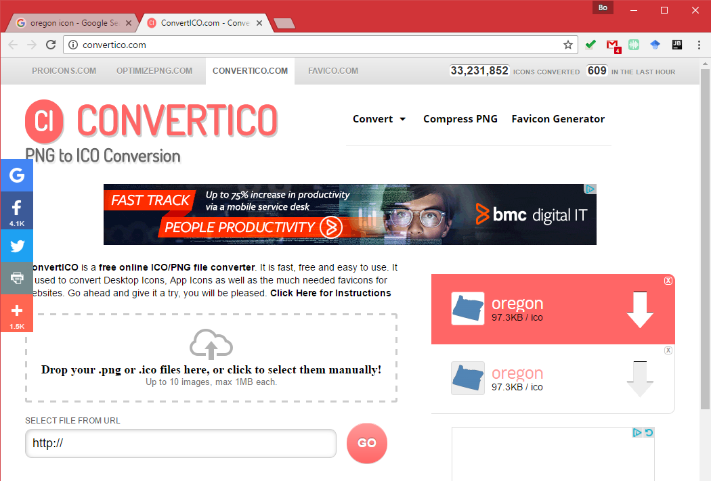
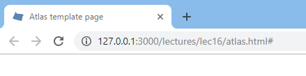

# Favicon


A favicon (short for favorite icon), also known as a shortcut icon, website icon, tab icon, URL icon, or bookmark icon, is a file containing one or more small icons,associated with a particular website or web page. A web designer can create such an icon and upload it to a website (or web page) by several means, and graphical web browsers will then make use of it. Browsers that provide favicon support typically display a page's favicon in the browser's address bar (sometimes in the history as well) and next to the page's name in a list of bookmarks. Browsers that support a tabbed document interface typically show a page's favicon next to the page's title on the tab, and site-specific browsers use the favicon as a desktop icon.

To add a favicon, you need to creat one using an image editor, such as illustrator or photoshop. Or, you can find an open source one from google image search. Regarding the images found from the Internet, please refer to or credit the author's efforts in your web map application.

For example, I search "oregon icon" on [Google Images](https://images.google.com/)


I find an png image, and then convert the image to ico from http://convertico.com/.



I downloaded the converted file, named it as **favicon.ico**, and then put it in the `img` folder.

To properly show the favicon, I added one line in the `head` tag of the `index.html` file.

```html
<!--add favicon for the web page-->
<link rel="shortcut icon" href="img/favicon.ico" type="image/x-icon">
```

Regarding the code, I declare that I added the favicon for the web page, and include from the right place. If everything works correctly, you will see an icon showing on the web page tab on your Google Chrome browser.


