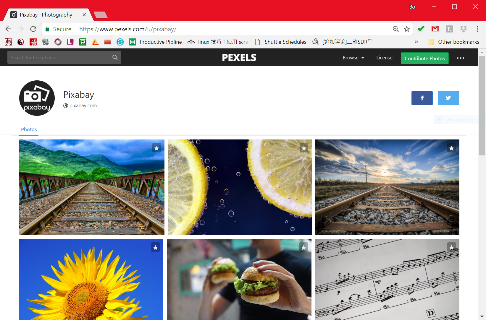
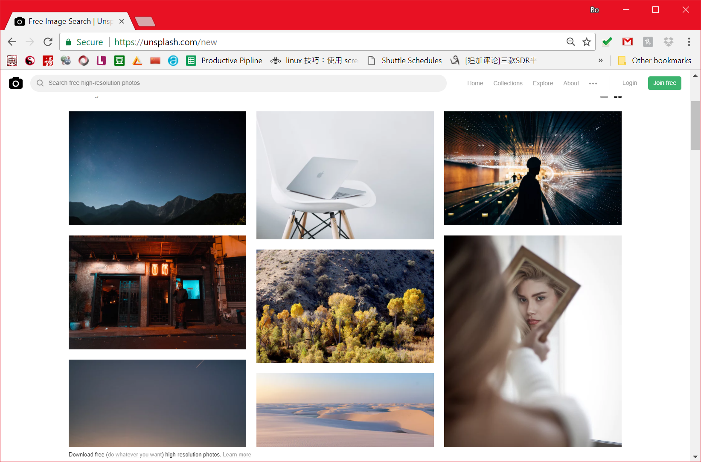

# Work with Images

Sometimes, a photo is more than thousands of words. For your web mapping project, I encourage you to embed some photos if possible. You can search High resolution photos on Google Image or Flickr. But you need to pay attention to their copyrights. Finding a high quality stock photo for free used to be quite the chore. there were very few options available, and the inventory that was available was marginal quality at best. In this tutorial, I would like to recommand two free image stocks.

1\. [**Pixabay**](https://www.pexels.com/u/pixabay/)

Currently, Pixabay is the first website I visit when I need a free stock photo. With more than 420,000 images to select from, there is a good chance this inventory will satisfy your needs.

There are no confusing image licenses to worry about. You can use any Pixabay image without attribution in digital and printed form -- and this includes for both personal and commercial use.



2\. [**Unsplash**](https://unsplash.com/)
Unsplash is a great source of very artsy images to use for your blogs and digital projects. You can search the inventory on the website as well as subscribe to receive 10 new images every 10 days, delivered straight to your inbox.



All of the images that are submitted and published on Unsplash fall under under the Creative Commons Zero (CC0) license, which means you can use the image for any personal or commercial use. You are allowed to alter, copy and distribute the images without any credit to Unsplash or the photographer -- although it’s always a nice gesture to give credit where credit is due.

## Image Bunch Process

[XnConvert](https://www.xnview.com/en/xnconvert/) is a powerful and free cross-platform batch image processor, allowing you to combine over 80 actions. Compatible with 500 formats. For example, if you want to convert the images in the same dimension (like 800*600), in the same image format, or just decrease the file size, XnConvert may be the best tool to use.


## embed an image in a storymap.js

Now embed an image in a storymap instance is quite straightforward. In the `div` of a scene, please add a `data-background` attribute, and its value is the url path of the image.

Here is a code snippet.

```html
<section data-scene="overview" data-background="../../assets/end.png">
    ... ...
    ... ...
</section>
```


## Credit

If you have downloaded an image made by other youtube users, please make sure to MENTION their contribution or copyrights in your web map application.