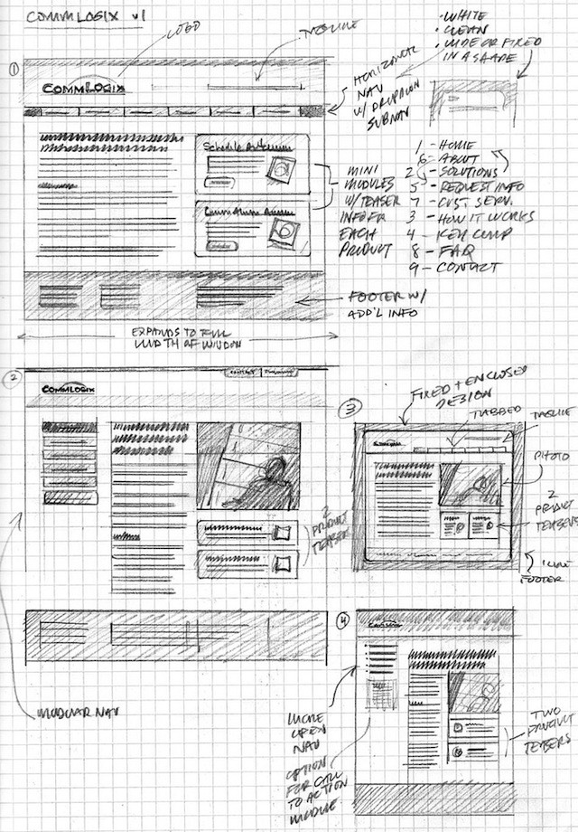
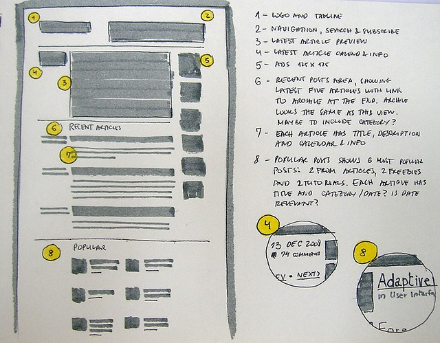
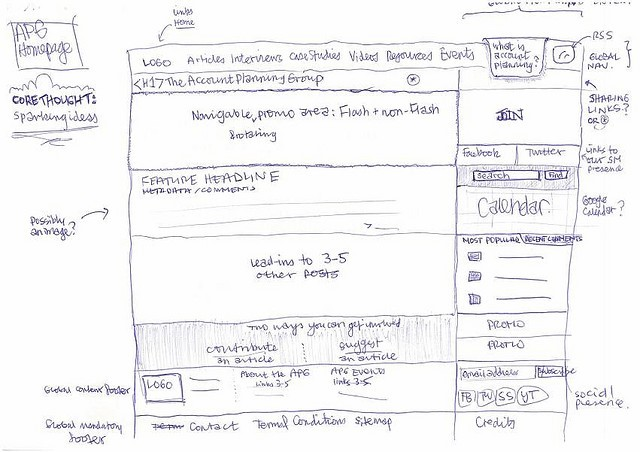
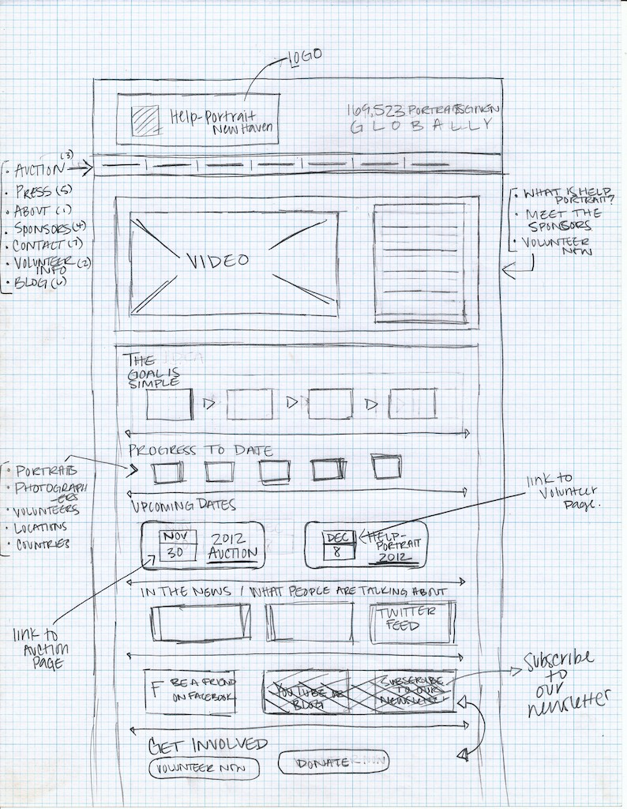
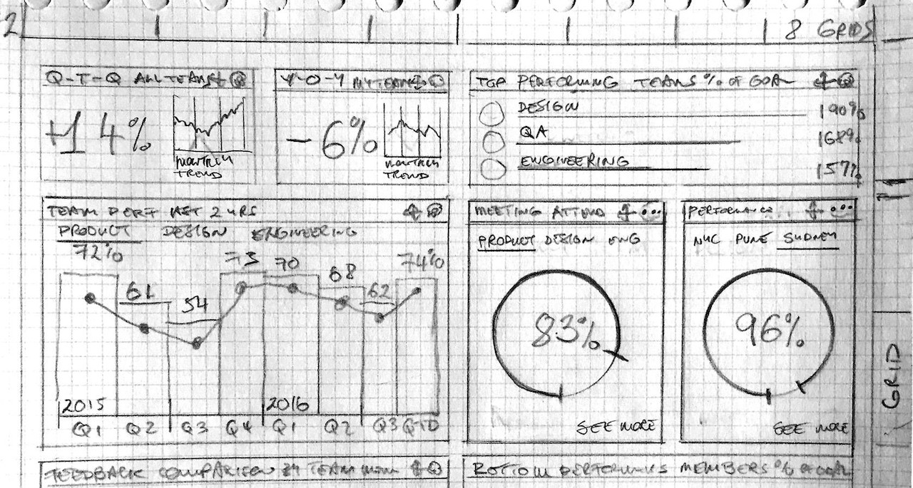

# Interface Sketch

In this week, you are expected to sketch the GUI (Graphic User Interface) of your final project.

On the sketching paper, please draw each web interface of your web map application, pop-up windows, or the drop-down menus. For each interface, you will need to draw the major components and/or web controls, and associated with a short description.

- This sketch should be drawn on a white or grid paper, and then you will need to scan and upload this sketch to your final project repository.
- This sketch should be uploaded to a folder named after `img` or `assets`.
- You can scan your sketch with a scanner or a scanning app (e.g., CamScanner, Adobe Scan).
- This sketch should be inserted to the `readme.md` file under a new section named after **"Interface Sketch"**.
- In the **"Interface Sketch"** Section, You will also need to add 2 or 3 sentences to describe the sketch you drew.

### Sketch Examples:

sketch 1

sketch 2

sketch 3

sketch 5

sketch 4

### References:

[1] https://speckyboy.com/web-mobile-wireframe-sketch-examples/
