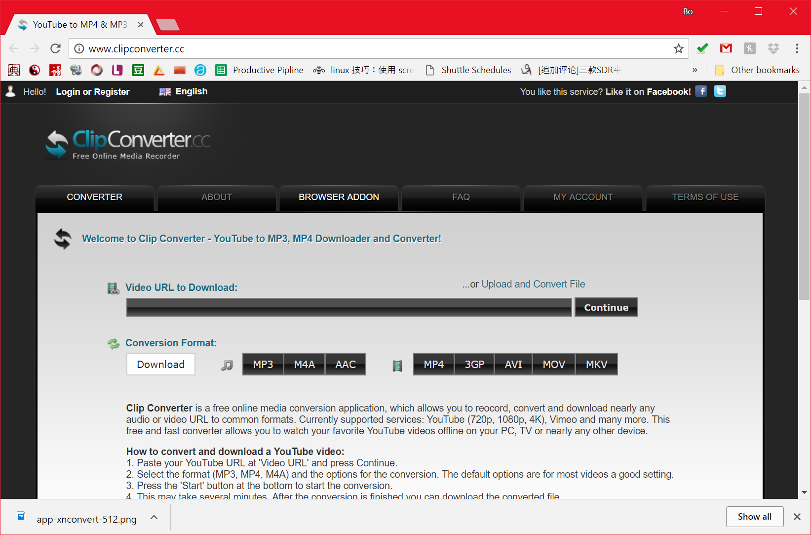
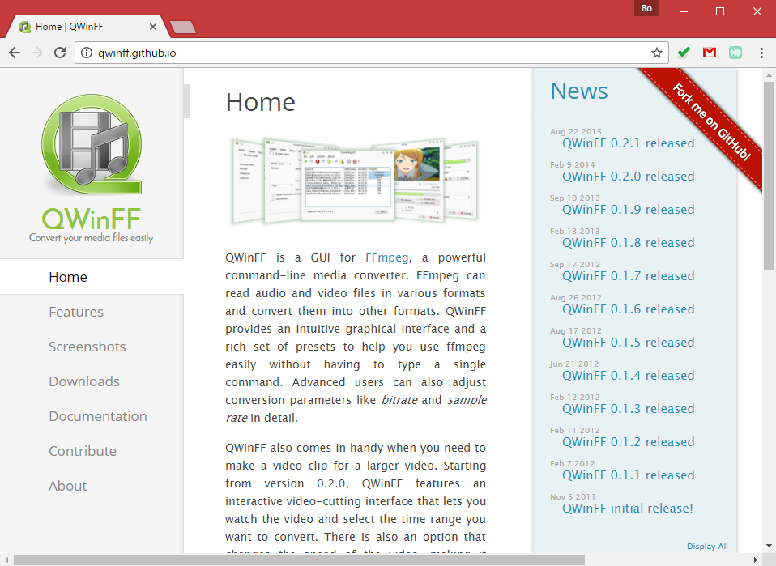

# Work with Youtube Videos

You can embed a video clip into your web mapping application. To do that, you will need to download a video from Youtube or other video resources, or, you can simply shoot one.

There are multiple tools available for downloading youtube videos, such as [ClipConverter.cc](http://www.clipconverter.cc/). By copying and pasting the url of the youtube video, you can directly download the video.



- Please download the video in MP4 format, because this format is supported by most web browsers.
- Also please make sure the dimensions of the map as large as possible.On Youtube, most of the high resolution video clip is around 1920*1080.

## post-process video clip

You can use a freeware [qwinff]((http://qwinff.github.io/)) to post-process video clips. You can use this software to conver the video format, clip the video etc. Video clipping is extremely useful, because you might not want to show the full length of a video.



> **Note:** Though qwinff supports a variety of video formats (windows, linux, etc.), it does not currently support Mac OX.


## embed a video in a storymap.js

Now embed a video in a storymap instance is quite straightforward. In the `div` of a scene, please add a `data-background` attribute, and its value is the url path of the video.

Here is a code snippet.

```html
<section data-scene="overview" data-background="../../assets/portland.mp4">
    ... ...
    ... ...
</section>
```

>**Note:** Please make sure the video format is `mp4`.

## Credit

If you have downloaded a youtube video made by other youtube users, please make sure MENTION their contribution/property right in your web map application.