# Lab 1: Project management using GitHub

**Instructor:** Bo Zhao, 206.685.3846 or zhaobo@uw.edu; **Points Available** = 50

In this lab, we will briefly introduce how to set up the project environment, how to synchronize the course material, and more importantly to help you get familiar with the major operations on project management using GitHub. You will need to install the required software on your own PC or Mac, register a GitHub account, and then learn how to use git, visual studio code and github. To test the learning outcomes, you will be asked to create a GitHub repository to publish your resume page on the web. Okay, let us get started!

## 1. Preparations

### 1.1 Environment setup
For this practical exercise, you will use chrome, git and visual studio code.

**Chrome:** is a freeware web browser developed by Google. It was first released on September 2, 2008 for Microsoft Windows, and was later ported to Linux, macOS, iOS and Android. Google Chrome is also the main component of Chrome OS, where it serves as a platform for running web apps. **Click [here](install-chrome.md) to see a demo on how to install Google Chrome**;

**Git:** is a version control system (VCS) for tracking changes in computer files and coordinating work on those files among multiple people ([Click here to download](https://git-scm.com/downloads)). It is primarily used for source-code management in software development, but it can be used to keep track of changes in any set of files.  Git was created by **Linus Torvalds** in 2005 for development of the Linux kernel, with other kernel developers contributing to its initial development. **Click [here](install-git.md) to see how to install git**. **Note that if you are using macOS, you do not need to install git seperately - it is already integrated in the OS!**

If **Git** is successfully installed, type `git` in command prompt (if you are a Windows user) or terminal (if you are a Mac or Linux user), the following screen will be shown up. Using `git`, you can synchronize the course materials and also publish your own GitHub repository.  We will talk about that later in this lab.

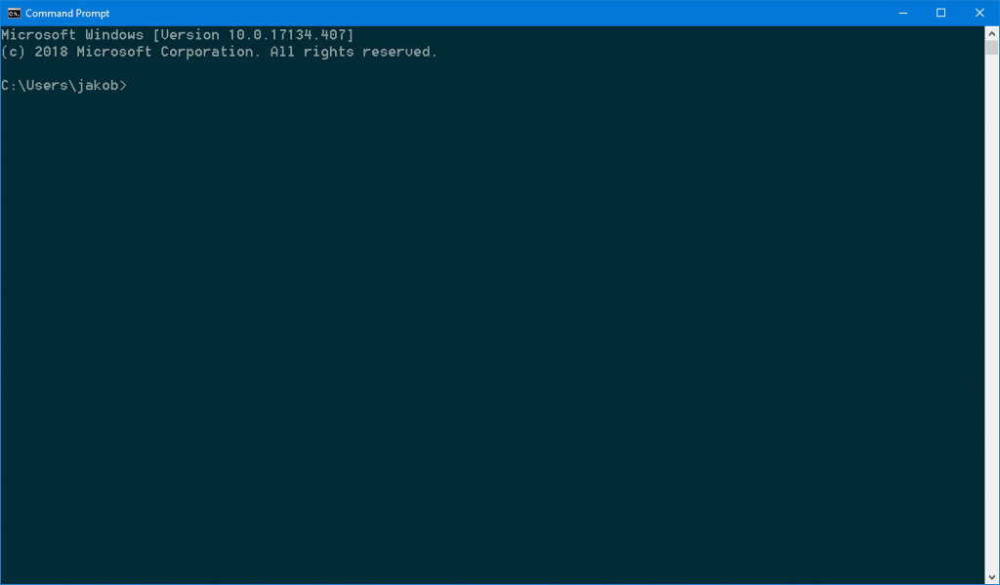

**Visual Studio Code:** is a streamlined code editor with support for development operations like debugging, task running, and version control. It aims to provide just the tools a developer needs for a quick code-build-debug cycle and leaves more complex workflows to fuller featured IDEs, such as [Visual Studio IDE](https://visualstudio.microsoft.com/).  **Click [here](https://code.visualstudio.com/) to download and install Visual Studio Code on your computer.** If you want to work on a lab computer for your future labs, please **follow [this instruction](https://code.visualstudio.com/docs/editor/portable#:~:text=Portable%20Mode%201%20Enable%20Portable%20mode%20%23.%20%7C-,your%20platform.%20...%204%20TMP%20directory%20%23.%20) to see how to use VSCode in Portable Mode**.

> **What is an IDE?** IDE (Integrated Development Environment) is a software application that provides comprehensive facilities to computer programmers for software development. An IDE normally consists of a source code editor, build automation tools, and a debugger. Most modern IDEs have intelligent code completion. The boundary between an integrated development environment and other parts of the broader software development environment is not well-defined. Sometimes a version control system, or various tools to simplify the construction of a graphical user interface (GUI), are integrated. Many modern IDEs also have a class browser, an object browser, and a class hierarchy diagram, for use in object-oriented software development.

Visual Studio Code is a customizable IDE, so to fully prepare it for web programming, you will need to install additional packages. To do that, press `ctrl+shift+x`, or click on the "Extensions" button on the left tool bar. In this interface, please search and install the following recommended packages:

- Markdown Preview Enhanced
- Live Server
- Beautify (Recently this extension has been marked as "deprecated" as it is no longer being maintained. You may choose to install it or not. But we think this is still a very handy tool for quickly formatting and styling the code.)

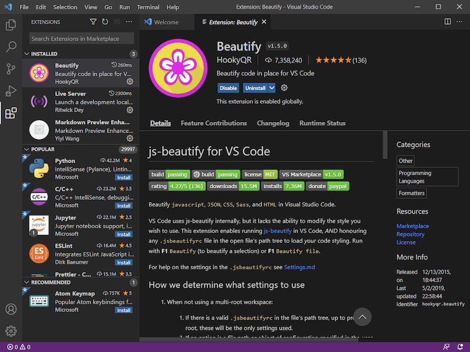

### 1.2 GitHub registration

A GitHub account is needed for managing and synchronizing your cloud based project. If you do not have a GitHub account yet, please sign up at [https://www.github.com](https://www.github.com). Notably, you will need to choose a username. It is worth noting that, **this username will be used as a part of the domain name of your home github ['username'.github.io](). So, make sure this username is succinct, simple and English-character only. Apparently, an easily-recognized domain name is more popular.**

**What is the differences between Git and GitHub?**

**Git** is a version control system for tracking changes in computer files and coordinating work on those files among multiple people. It is primarily used for software development, but it can be used to keep track of changes in any files. Git was created by **Linus Torvalds** in 2005 for development of the Linux kernel, with other kernel developers contributing to its initial development.

**GitHub** is a web-based Git or version control repository and Internet hosting service. GitHub offers both plans for private and free repositories on the same account which are commonly used to host open-source software projects. As of April 2016, GitHub reports having more than 14 million users and more than 35 million repositories, making it the largest host of source code in the world.


> A step-by-step tutorial on GitHub registration

## 2\. Download the course material

I decide to host all course material on GitHub instead of Canvas system. By doing so, my goal is not to create extra trouble or sharp the learn curve. Instead, hosting on github will help you save a lot of time in downloading or migrating course materials, testing lab or lecture applications. Also, more practically, a lot of companies in the geospatial industries have already used github for their project management, such as [ESRI](https://github.com/Esri), [CartoBD](https://github.com/CartoDB), [MapBox](https://github.com/mapbox), and etc. To prepare you with the capabilities of using github, you will be familiar with an industry-level project management approach. In this lab, let us go through the procedure of downloading the course material as below.

1\. On GitHub, each project is stored as a project repository. The repository for this course is located at [https://github.com/jakobzhao/geog458](https://github.com/jakobzhao/geog458). Please navigate to this url on a browser such as `Chrome`. As indicated by the course website url, this repository is created by me; my GitHub account name is `jakobzhao`, while the repository name is `geog458`.

2\. On the front page of this repository, please click the green button named after `Clone or download` . To download the course material, you can click the `Download ZIP` button, as a result, a compressed file of the course material will be downloaded.

3\. However, **we recommend you to clone this project repository**. You can get the **git url** of this repository on the same information window. The git url is [https://github.com/jakobzhao/geog458.git](https://github.com/jakobzhao/geog458.git).

4\. Next, open your working space on your local computer through command prompt if you are on Windows or through terminal if you are on a Mac. Here, the working space is just a centralized folder on your local computer where you can store your working materials. For me, I created a working folder to locally store my github repositories. For example, the working space of my computer is located as `C:\Workspace`. But it is up to you under which folder or path to put the workspace folder.

```powershell
C:\Users\[windows_or_macosx_username]>cd C:\Workspace
C:\Workspace>
```

5\. Once acquiring the **git url** -  https://github.com/jakobzhao/geog458.git, we use the command `git clone` to clone the GitHub repository to your local computer.

 ```powershell
C:\Workspace\>git clone https://github.com/jakobzhao/geog458.git
Cloning into 'geog458'...
remote: Counting objects: 962, done.
remote: Compressing objects: 100% (750/750), done.
remote: Total 962 (delta 214), reused 917 (delta 177), pack-reused 0Receiving objects:  99% (953/962), 158.77 MiB | 1.60 MiB/s
Receiving objects: 100% (962/962), 158.88 MiB | 1.60 MiB/s, done.
Resolving deltas: 100% (214/214), done.
Checking out files: 100% (650/650), done.
 ```

6\. To review the files and folders in the downloaded/cloned repository, you need to `cd` into the root directory of this repository. If you are on a Mac or Linux, type `ls` to check the file list of this repository, or try `dir` if you are on a Windows. Take windows for example.

```powershell
C:\Workspace>cd geog458

C:\Workspace\geog458>dir
Volume in drive C has no label.
Volume Serial Number is 3E8C-9A9E

Directory of C:\Workspace\geog458

09/20/2021  09:46 AM    <DIR>          .
09/20/2021  09:46 AM    <DIR>          ..
09/20/2021  09:42 AM    <DIR>          assets
09/20/2021  09:42 AM               128 index.html
09/20/2021  09:46 AM    <DIR>          labs
09/20/2021  09:42 AM            27,030 LICENSE
09/20/2021  09:42 AM             2,267 project.md
09/20/2021  09:42 AM            21,596 README.md
               4 File(s)         51,021 bytes
               4 Dir(s)  898,906,136,576 bytes free
```

In the root directory of geog458, there are folders like assets, labs, and files like readme.md and LICENSE.

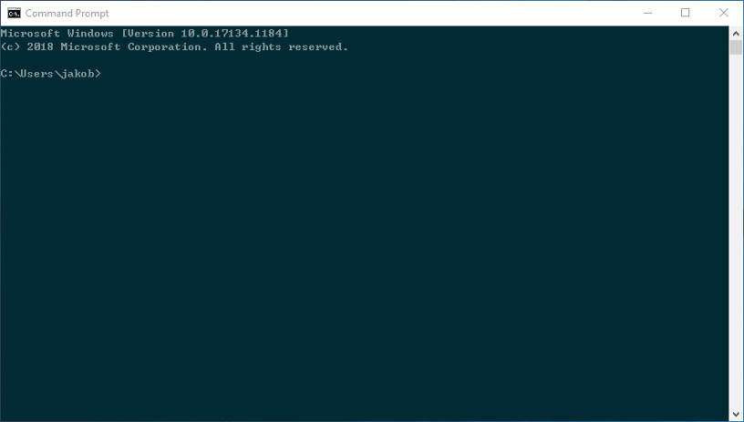

7\. Next, we open the `readme.md` file using `Visual Studio Code`. To do that, make sure you have installed the program `Visual Studio Code` and the recommended packages, such as `Markdown Preview Enhanced`.

Once `Visual Studio Code` is opened, press `ctrl+k` and then `ctrl+o` to open the open folder window, navigate to `geog458` folder from your workspace and press `select folder`. Then the `geog458` repo will be opened, and a file tree will be shown in the project list panel on the left of the vscode window.

**Note:** Your folder name should be geog458. The below screenshot is only to give you an idea of what window you will see.

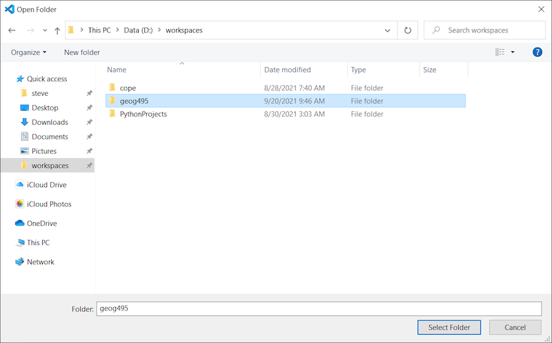

In the project list panel, navigate to the `README.md` in the project tree panel. Double-click on the `README.md` file, you will see the source code. Then, right-click this file and then click on `Open Preview`, The rendered page of `README.md` will be shown in a new panel. If you want to view the source code and the rendered markdown at the same time, press `ctrl+\` (or click on the `Split Editor Right` button at the upper right corner of the vscode window), and then drag the "Previewed README.md" window to the new panel on the right.

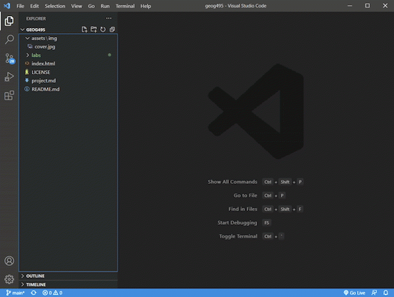

8\. Once the course material is hosted on GitHub, it can be easily shared with a larger community. To synchronize the course material on remote GitHub repository to your local computer, you need to implement two sequential command lines `git checkout --force` and `git pull` in the root directory of the repository. Once the two commands are executed. An update notice will be shown as below.

```powershell
C:\Workspace\geog458>git checkout --force
Your branch is up-to-date with 'origin/main'.

C:\Workspace\geog458>git pull
remote: Counting objects: 3, done.
remote: Compressing objects: 100% (3/3), done.
remote: Total 3 (delta 2), reused 0 (delta 0), pack-reused 0
Unpacking objects: 100% (3/3), done.
From https://github.com/jakobzhao/geog458
   13b2cab..baf74b1  main     -> origin/main
Updating 13b2cab..baf74b1
Fast-forward
 readme.md | 3 ++-
```


Now, the course material on your local computer is updated.

If you implement the above two commands in a Mac or Linux system, you might need to add `sudo` before `git` to solve the lack-of-privilege issue. For example, `sudo git pull`, `sudo git checkout --force`. In general, the command `sudo` will assign the superuser privilege to the command line.

**Note:** To ensure you are reading the latest version of the lecture or lab handouts, **you need to regularly synchronize the course material, especially so before the beginning of each class.** To do that, please just repeat this step to run the command combination `git checkout --force` and `git pull` again.

9\. Before we jump to the next section, please:

- Star the course repository [https://github.com/jakobzhao/geog458](https://github.com/jakobzhao/geog458) by pressing the `star` button on the top right, and;

- Navigate to Dr. Zhao's front page at [https://github.com/jakobzhao](https://github.com/jakobzhao), and click the `Follow` button to be a follower.

## 3\. Project management

In this section, we will introduce a series of operations related to project management, such as create a project repository, compile a markdown file, and upload files to GitHub, and at last, publish a repository. As a practice, we will build a GitHub repository for your online resume.

### 3.1 Create a repository for your project

1\. Navigate to [https://github.com/new](https://github.com/new), and input your repository name in the blank text box of the `Repository name`. Here, please name your repository in the format of **[github_username].github.io**. For example, if your github_username is `geovizlabtest`, the repository name will be **geovizlabtest.github.io**.

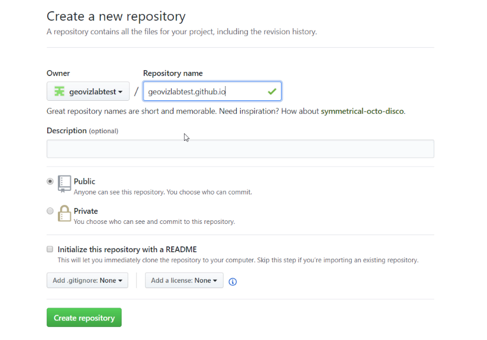

2\. Besides, make sure you **check** the box `Initialize this repository with a README`. You can leave other options by default.

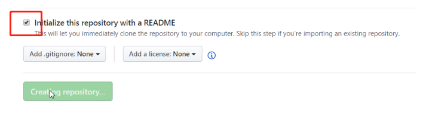

3\. Next, click the `Create repository` button. As a result, a new repository `[github_username].github.io` is created. You can access this repository through the link `https://github.com/[github_username]/[github_username].github.io`. For example,  you can access the repository geovizlabtest.github.io through the link [https://github.com/geovizlabtest/geovizlabtest.github.io](https://github.com/geovizlabtest/geovizlabtest.github.io).

### 3.2 Compose a Markdown file

1\. On your local computer, create a text file, and name it `resume.md`.

2\. Open this file `resume.md` with `Visual Studio Code`. Then, you can work on your resume. If you are not familiar with Markdown, please refer to a tutorial at [here](https://guides.github.com/features/mastering-markdown/). Or you can start with copying and pasting the template below. Notably, this template is only for your reference. You probably do not want to share too much about your personal information such as phone number, address and etc. You can also provide made-up information if you feel uncomfortable sharing your personal information online. This is just a practice for your to get familiar with markdown.

```markdown
# Your Name

your.name@example.com

http://www.example.com

http://www.linkedin.com/in/yourname

# Summary

Quick Summary (not objective) specifically highlighting why you qualify for the job.

# Work Experience (only last 10 years)

## University Name 1 (City, State)

* [University 1][] description, particularly if not well-known.*

** Position Title (include alternate titles in parentheses)** (Start Date - End Date)

Summary of your role

- Accomplishment that contains **bold text**.
- Accomplishment
- Accomplishment
- Accomplishment

## University Name 2 (City, State)
*[University 2][] description, particularly if not well-known.*

** Position Title (include alternate titles in parentheses)** (Start Date - End Date)

Summary of your role

- Accomplishment that contains **bold text**.
- Accomplishment
- Accomplishment
- Accomplishment

## University Name 3 (City, State)
* [University 3][] description, particularly if not well-known.*

** Position Title (include alternate titles in parentheses)** (Start Date - End Date)

Summary of your role

- Accomplishment
- Accomplishment
- Accomplishment
- Accomplishment


[University 1]: http://www.univ1.edu
[University 2]: http://www.univ2.edu
[University 3]: http://www.univ3.edu
```
**Note:** This resume template is from [http://www.jasonfilley.com/resumeinmarkdown.html](http://www.jasonfilley.com/resumeinmarkdown.html).


3\. In fact, you can use any text editor to generate Markdown files. If you do not have `Visual Studio Code` at hand, you can use `Notepad` on Windows or `TextEdit` on MacOS as well.  Please let the instructor know if you meet any difficulty in installing this plugin.

### 3.3 Upload files to GitHub

Once you have drafted out your resume page in the `resume.md` file. You will upload this file to the **root** of the project repository `https://github.com/[github_username]/[github_username].github.io` . In general, there are three options to complete this task, we will introduce them one by one.

#### 3.3.1 Drag & drop

1\. Open a web browser such as `Chrome`, navigate to the front page of the repository you have just created.

2\. Next, use your mouse to drag the `resume.md` file to the front page. Once you see a notice saying **Drop to upload your files**, you can then release your mouse. A new interface will appear as below.

**Note:** Certainly, you can drag and drop multiple files and/or folders. In this lab, we just upload one single file.

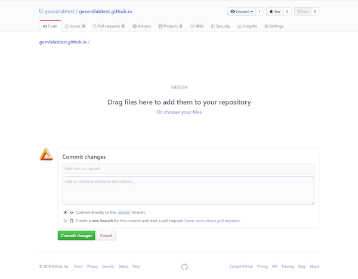

3\. Before pressing the green button `Commit Changes`, you might want to add a title and/or some descriptions for this commit. It will help you organize your commits.

#### 3.3.2 Git push

You can also upload the `resume.md` through `git push` command on either command prompt or terminal.

1\. Since GitHub no longer accepts account passwords when authenticating Git operations when you are using command line tools since August 2021, we will need to use **a personal access token** as the password for pushing to the repository. Click **[here](https://docs.github.com/en/free-pro-team@latest/github/authenticating-to-github/creating-a-personal-access-token)** to see how to create one for yourself.

2\. Download the repository  `https://github.com/[github_username]/[github_username].github.io`  following the instruction in Section 2 **"Download the course material"**.

3\. In the root directory of the downloaded repository, please copy the edited `resume.md` to the root.

4\. Next, you can push this change to the remote repository by implementing two command lines `git commit` and  `git push`. Since you have add new `untracked` files to this repository, you need to also implement another command line `git add` prior to the `git push`. As listed below.

```powershell
c:\Workspace\[github_username].github.io>git add -A
c:\Workspace\[github_username].github.io>git commit -a -m "update the resume.md"
c:\Workspace\[github_username].github.io>git push
Username for 'https://github.com': `type the username`
Password for 'https://geovizlabtest@github.com':`type your personal access token`
```

**Note:** 

1. If it is your first time using git, you may see the following prompt after you entered `git commit -a -m "update the resume.md"`. Because `git` targets at supporting collaborative work, it will ask users for identification information like name and email address. As prompted by `git`, you can use the command s to add your identification information.

   ```
   git config --global user.email "you@example.com"
   git config --global user.name "Your Name"
   ```

    `--global` means that git will automatically use the same information for all the other repositories in the future. If you remove it from the command, you will need to go through the same process again when you want to push to another repository.

2. If you use a Mac or Linux, you might need to add `sudo` in front of the command line to avoid the privilege deny issue. Besides, the command prompt or terminal may ask you for GitHub username and password, please be prepared with such information.


In a nutshell, to push a change from your local computer to GitHub, you will need to (1) `git clone` a repository from GitHub, (2) `git add` the untracked file to the repository, (3) `git commit` that you have made a change, and at last, (4) `git push` your changes to the GitHub repository.

#### 3.3.3 Visual Studio Code based commit and push

We can also use `Visual Studio Code` to upload files to GitHub repository or more generally, commit changes. Compared with the first two solutions, I recommend you use vscode if you prefer graphic user interfaces.

1\. Download the repository  `https://github.com/[github_username]/[github_username].github.io`  following the instruction in Section 2 *"Download the course material"*. Note here you need to **download the repo you created** earlier, not the class repository

2\. In the root directory of the downloaded repository, please copy the edited `resume.md` to the root.

3\. Open Visual Studio Code, and open the downloaded repository folder following the instruction in Section 2 *"Download the course material"*.

4\. Once you open this repository, you can edit the `resume.md` in Visual Studio Code. Remember to save (`ctrl+s`) your files after editing

5\. To update any edit changes, click on the "Source Control" button on the left toolbar. Then click on the "Stage All Changes" button (plus sign, be sure to click on the button  on the right side of "Changes"), input your commit message in the textbox above, click on the "Commit" button (check sign), and then click on the "Views and More Action..." button (three dots) and choose "Push".

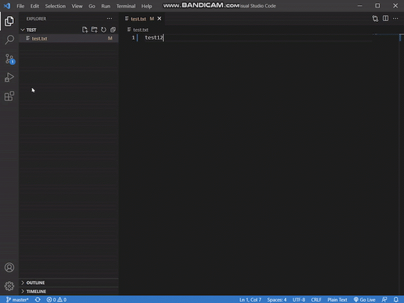

You may be prompted to enter your authentication information during the process, you can either choose to sign in with your browser or use the personal access token that we just acquired earlier.

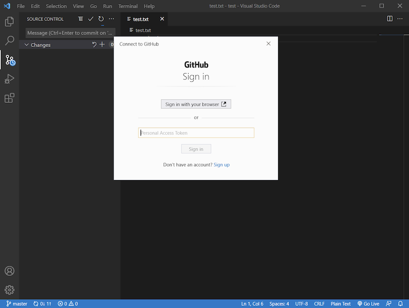

> **Note:** As you might already aware of, the logics of approach 2 and 3 are very similar. The difference is, approach 2 works on a terminal/command prompt environment (a command-line user interface), while approach 3 works in Visual Studio Code(a graphic user interface).
>
> Using either of the three approaches (3.3.1 to 3.3.3), you can upload your resume page or any other files to GitHub. Then, log on to this repository on GitHub to see whether the uploaded content is applied. However, the third one - `Visual Studio Code based commit and push`.** (3.3.3) is recommended.

Now you have already known how to commit a change. In practice, you will use this operation very frequently. Other than committing changes, you may also need to synchronize, both fetch and push, the latest version of your GitHub repository.

### 3.4 Publish your repository

Once the `resume.md` is uploaded to the root of the GitHub Repository, you can see this file listed in the root. Moreover, GitHub provide a new function named **GitHub Page** that converts a markdown file as a web page. Because your resume page is located at the root of the repository, you can directly access your resume page by visiting `http://[github_username].github.io/resume` if you implement the following steps.

> Note: it takes some time for GitHub server to refresh the cache and visualize a github page. So if you cannot see correct information on `http://[github_username].github.io/resume`, please try another browser or wait for a few minutes.

1\. please click the `Settings`tab on the top bar of the repository front page.

2\. On the `Pages` Section, make sure `main branch` is chosen in the `Source`  dropdown list.  Next, press the `Save` button.

3\. It usually takes several seconds to 1~2 minutes to apply this setting. If this setting is activated, you can read your resume page from `http://[github_username].github.io/resume`.

**Note：** Similar to the step 8 in section 2, You can also update a local repository from a remote github repository using Visual Studio Code. To do that, right click the github operation status on the bottom bar, and select the option `Pull`. The github operation status can be either `Fetch`, `Pull`, `Push`, `Force Push`.

## 4. Website host using GitHub Pages

Github allows its user to convert a repository as a website automatically. In this section, you will need to download a website template and modify it according to your needs, and upload it to the repository `https://github.com/[github_username]/[github_username].github.io` you have just created. After you finish this sesction, you can visit this webiste at `https://[github_username].github.io`.


[Start Bootstrap](https://startbootstrap.com/) hosts a few website Boostrap-based templates. Bootstrap is a free and open-source CSS framework directed at responsive, mobile-first front-end web development. It contains CSS- and (optionally) JavaScript-based design templates for typography, forms, buttons, navigation and other interface components.

1\. Visit url [https://startbootstrap.com/template/the-big-picture/](https://startbootstrap.com/template/the-big-picture/) and download this template.

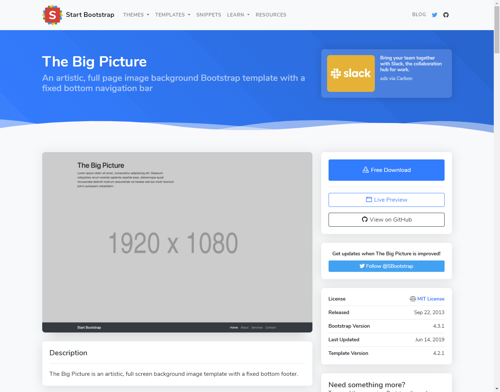

2\. Unzip/Extract the files from the zipped file and move to the local folder of the github repository `[github_username].github.io` in your workspace.

**Note:** If your local PC or MacOSX does not support the unzip function, please install [7zip](https://www.7-zip.org/download.html) if you are a windows user or [Keka](https://www.keka.io/en/) if you are a MacOSX user.

3\. Upload all the extracted files except the `readme.me` to the root of `https://github.com/[github_username]/[github_username].github.io`. To do so, please use the github synchronization function provided by VS Code **(refer to Section 3.3.3)**.


4\. After you successfully push the local repository to github. You can visit the website at `https://[github_username].github.io`. For example, I can vist the website at `https://geovizlabtest.github.io`. Usually, the URL will automaticaly navigate to the default page under the root of the repo. Usually, the name of the default page is `index.html`.

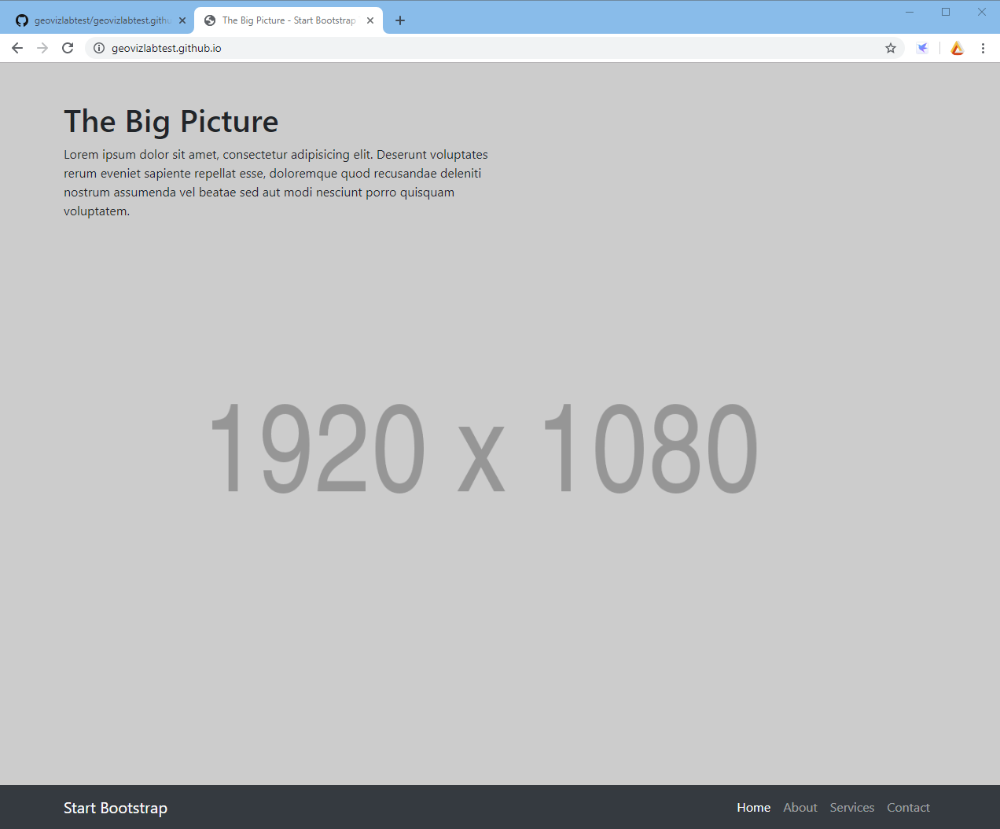

5\. Please modify the web page codes at the local repoistory. Once you push the changes to the github, please visit the url `https://geovizlabtest.github.io` to see whether the web pages have updated or not. If you want to get more familiar with web development, we encourage you walk through [w3school online web tutorials](https://www.w3schools.com/), especially the following items.

- [HTML](https://www.w3schools.com/html/default.asp)
- [JavaScript](https://www.w3schools.com/js/default.asp)
- [CSS](https://www.w3schools.com/css/default.asp)
- [Boostrap 5](https://www.w3schools.com/bootstrap5/default.asp)


## 5. Deliverable

Before submitting the deliverable, please make sure the **GitHub Pages** work properly. You are expected to submit the url of the GitHub repository to the **Canvas Dropbox** of this course. This url should be in the format of `https://www.github.com/[github_username]/[github_username].github.io`. To submit, check the item of this lab on the assignment tab, and then press the `Submit Assignment` button. Please contact the instructor if you have any difficulty in submitting the url link. Here are the grading criteria:

1\. A GitHub account is registered, You have followed the instructor's GitHub account and `star-ed` the course GitHub repository. (10 POINTS)

2\. The repository should be named after `[github_username].github.io`. (5 POINTS)

3\. The `GitHub pages` function of the repository should work properly. That said, your resume can be visited from `https://[github_username].github.io/resume` (5 POINTS);

4\. To hone your skills in Markdown syntax, the resume could be built upon the template that was shown in `Section 3.2`, but we still encourage you customize your resume. In terms of the format, your online resume should contain (15 POINTS):

* Different levels of headers;
* A block quote;
* Several url links;
* One or several images; and
* A list;

5\. Create a website under this newly created repository. This website can be [an online resume](https://startbootstrap.com/themes/resume/), [a project gallary](https://startbootstrap.com/template/shop-homepage), [a project webiste](https://startbootstrap.com/themes/creative/), [an administrator dashboard](https://startbootstrap.com/themes/sb-admin-2/) and so on. I encourage you use any bootstrap5 template on [Start Bootstrap](https://startbootstrap.com/), and further modify the webpage if needed. You are not expected to make a complicated websites of several pages, but at least, a website represents some idea you planned to work on.(15 POINTS)


**Note:** Lab assignments are required to be submitted electronically to Canvas unless stated otherwise. Efforts will be made to have them graded and returned within one week after they are submitted.Lab assignments are expected to be completed by the due date. ***A late penalty of at least 10 percentage units will be taken off each day after the due date.*** If you have a genuine reason(known medical condition, a pile-up of due assignments on other courses, ROTC,athletics teams, job interview, religious obligations etc.) for being unable to complete work on time, then some flexibility is possible. However, if in my judgment you could reasonably have let me know beforehand that there would likely be a delay, and then a late penalty will still be imposed if I don't hear from you until after the deadline has passed. For unforeseeable problems,I can be more flexible. If there are ongoing medical, personal, or other issues that are likely to affect your work all semester, then please arrange to see me to discuss the situation. There will be NO make-up exams except for circumstances like those above.
