# Lab 2: Geo-tagged tweet collection and visualization

**Instructor:** Bo Zhao, 206.685.3846 or zhaobo@uw.edu; **Points Available** = 50

In this practical exercise, we will introduce how to collect Geo-tagged Twitter data using an API-based crawler and visualize them on a map using a mapping tool `QGIS`. A web crawler is a purposely designed bot for online data collection. In most cases, online data can be acquired through a dedicated API maintained by the data provider. This lab exercise focuses on visualizing the spatial distribution of twitter data, which reflects the public perception of a specific topic. As you go through this lab, think about how you can apply this technique to your final project. Below, we will go over in detail the process of developing an API-based crawler and using QGIS to visualize collected data onto a map. Okay, let us get started!

## 1. Setup the execution environment on the cloud

In this lab, we will use Google Colab to compile the script in Python. If you have used python for scientific research before, you must already experience the complexity of configuring the execution environment. So, in order not to simplify the process of environment configuration, we decide to execute the crawlers on Google Colab. Google Colab allows its user to compose and execute arbitrary python code directly through the browser, and is especially well suited to machine learning, data analysis and education. There is an embedded Jupyter notebook that requires no setup and has an excellent free version, which gives free access to Google computing resources such as GPUs and TPUs.

**Python:** is an interpreted, high-level, general-purpose programming language. Its language constructs and object-oriented approach aim to help programmers write clear, logical code for small and large-scale projects. While there are many python IDE (Integrated development environment) for python, we will use `Jupyter Notebook` to avoid any inconvenience upon environment setup.

**Jupyter Notebook:** is an open-source web application that allows you to create and share documents that contain live code, equations, visualizations, and narrative text. Uses include data cleaning and transformation, numerical simulation, statistical modeling, data visualization, machine learning, and much more. Jupyter Notebook files have a file extension of `.ipynb`.

## 2. Apply for a Twitter developer account

In order to use Twitter API, you need to have a Twitter developer account from this [link](https://developer.twitter.com/en/apply-for-access). Please try **using your UW email for registration**.

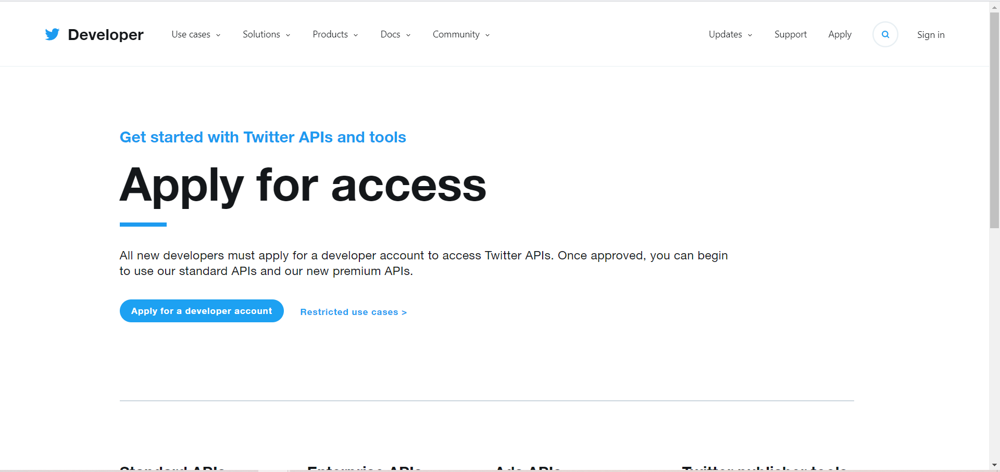

In order to register your account, you will be prompted to answer a series of questions. Please answer those that are required to fill in and you can ignore optional questions.

There has been a recent update on the twitter developer account permissions. This requires us to apply for the **Elevated** permissions for our developer account in order to use the filter functions in our python code. To do this, after we have our developer account and log into the developer portal, click on "Products" on the left side, and then "Twitter API v2", then click on the "Elevated" tab on the right, and then "Apply for Elevated".

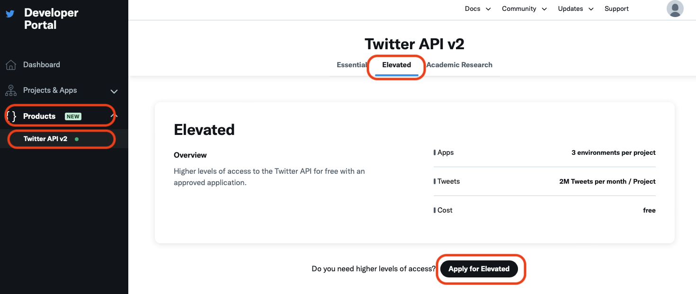

You will need to provide some information about yourself, as well as why you need the Elevated permission. For the second section "Intended use," your can summarize and rephrase the lab description and also add your plan for the lab deliverable to answer the questions. You can choose "no" for the optional questions. Below is a screenshot of what I submitted for the application. **Please do not directly copy the answers in the screenshot for your own application.** I was instantly approved for the Elevated permission after submitting the application.

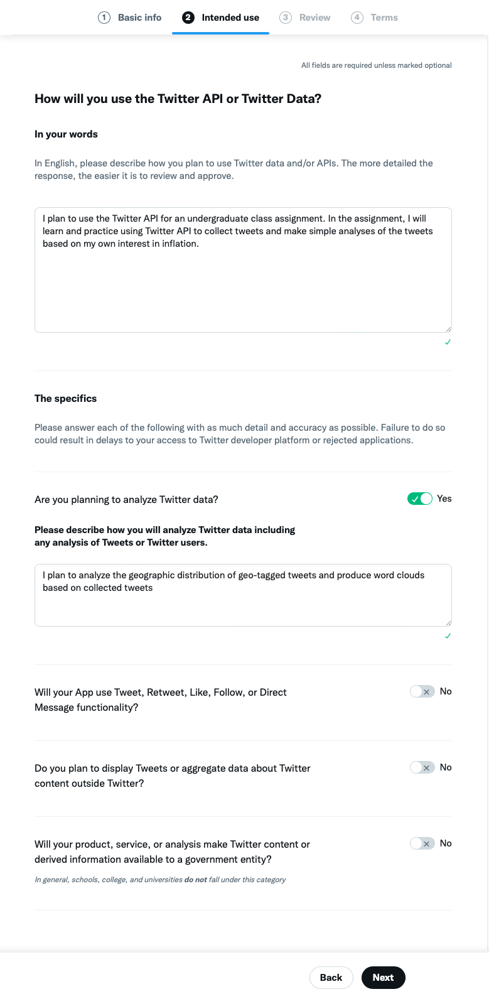


Once you finish registering your account, you can apply for a Twitter app. First of all, you will need to click on `Developer Portal` which is located on the top right corner of the page.

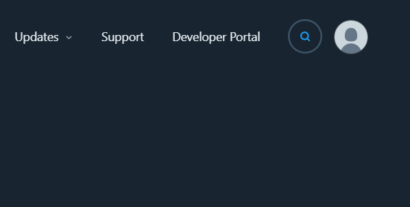

Then, you will enter developer portal. On the left bar, you can click on `Projects &  Apps` for checking the list of apps that you've created for getting Twitter API, but for now, the list should be empty. In order to register for Twitter API, click on `+ Create App` which is under the `Standalone Apps`.

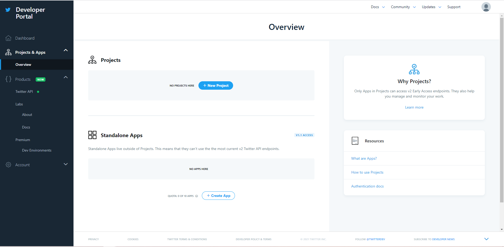

You will be prompted to fill in the app details. Here, you are required to fill in: `App name`.

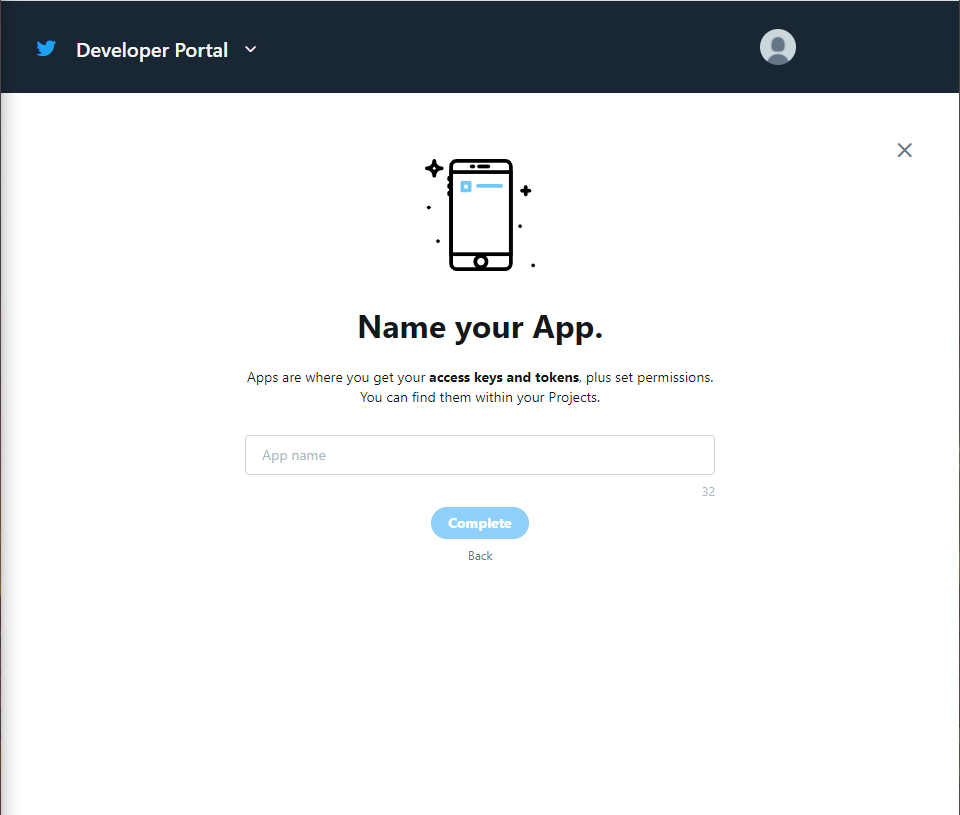

After you fill in all the required fields, you may click on `Create`. Twitter takes some time to process your information to validate your access to the Twitter API. Then you will be able to see your keys and tokens.

Once you are registered, you could check your own keys and tokens again by click on your app-name which is under your app list. Go to the `App Detail` of the app you just created. Click on the tab `Keys and tokens`, and you should be able to see all the keys and tokens required to use the Twitter API.

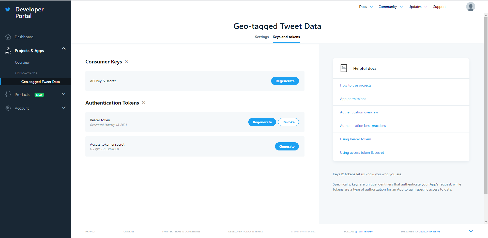

Copy and paste the keys and tokens you received into corresponding parameters in the code below:

```Python
consumer_key = "your_consumer_key"
consumer_secret = "your_consumer_secret"
access_token = "your_access_token"
access_token_secret = "your_access_token_secret"
```

## 3. Harvest geo-tagged tweets using a API-based crawler

In this section, we will create a Twitter crawler to collect geotagged tweets. Most of the codes are already written for you in `geosearch.ipynb` except for some parameters to change. Your essential task here is to understand what each piece of code is doing and be able to utilize it later in this assignment.

Please launch the crawler by clicking this button [](https://colab.research.google.com/github/jakobzhao/geog458/blob/master/labs/lab02/geosearch.ipynb). This button will enable you to open the file [`labs/lab02/geosearch.ipynb`](./geosearch.ipynb) on Google Colab. You can also open this ipynb script through the url `https://colab.research.google.com/github/jakobzhao/geog458/blob/master/labs/lab02/geosearch.ipynb`. 

As shown, `https://colab.research.google.com/` indicates the google colab root url, the subpath `github/jakobzhao/geog458/blob/master/labs/lab02/geosearch.ipynb` indicate the location where the ipynb script `labs/lab02/geosearch.ipynb` on github. You can open any `ipynb` script on Google Colab through the similar url structure.


### 3.1 Metadata and required libraries

For any python script, metadata are usually stated at the very beginning.

```python
# created on Dec 24, 2020
# modified on Jan 2, 2021
# @author:          Bo Zhao
# @email:           zhaobo@uw.edu
# @website:         https://hgis.uw.edu
# @organization:    Department of Geography, University of Washington, Seattle
# @description:     Search geo-tagged tweets within the U.S. This script is modified from https://github.com/shawn-terryah/Twitter_Geolocation
```

Next, the required python libraries for this crawler will be imported. To execute the crawling task, we will use pandas, tweepy and google.colab. Since Google Colab has already pre-installed pandas and tweepy, you do not need to install again. `Tweepy` is a python based library which wraps the Twitter API. Tweepy provides a series of data crawling strategies - Harvesting geotagged tweets is just one of them. If you are interested in composing a more complicated data collection strategy, please refer to its documentation at <https://tweepy.readthedocs.io/en/latest/index.html>.

```python
import tweepy, json, time
import pandas as pd
from google.colab import files
# Create data on to Google Drive
from google.colab import drive
# Mount your Drive to the Colab VM.
drive.mount('/gdrive')
```

### 3.2 Code structure

This script `geosearch.ipynb` was programmed using a `class` structure instead of a run-down script structure. A `StreamListener` is defined for later use, the main procedure will be executed after the line `if __name__ == "__main__":`. This piece of code was programmed with reference to <https://github.com/shawn-terryah/Twitter_Geolocation>. So, let us start with the main procedure and then switch to the stream listener.

```Python
class StreamListener(tweepy.StreamListener):
    """tweepy.StreamListener is a class provided by tweepy used to access
    the Twitter Streaming API to collect tweets in real-time.
    """

    def __init__(self, time_limit=60, file=""):
        """class initialization"""

    def on_data(self, data):
        """This is called when data are streamed in."""


if __name__ == "__main__":
    ....
```

### 3.3 Main procedure

In the main procedure, once we acquire the consumer key and access token, we can create a variable to handle the twitter authentication.

Determine where on the google drive you want to store the output csv data. A CSV file is a delimited text file that uses a comma to separate values. Each line of the file is a data record. Each record consists of one or more fields, separated by commas.

```python
output_file = '/gdrive/My Drive/geotweets.csv'
```

Copy and paste the keys and tokens you received into corresponding parameters in the code below:

```python
consumer_key = "your_consumer_key"
consumer_secret = "your_consumer_secret"
access_token = "your_access_token"
access_token_secret = "your_access_token_secret"
```

Initiate a tweepy API object

```python
myauth = tweepy.OAuthHandler(consumer_key, consumer_secret)
myauth.set_access_token(access_token, access_token_secret)
```

To retrieve geo-tagged tweets, three bounding boxes are defined. After initializing the stream listener, a stream object is created out of `tweepy.Stream object`. Then, the LOCATION array is passed to the stream filter method. By doing so, the geo-tagged are filtered and collected.

```python
    # LOCATIONS are the longitude, latitude coordinate corners for a box that restricts the
    # geographic area from which you will stream tweets. The first two define the southwest
    # corner of the box and the second two define the northeast corner of the box.
    LOCATIONS = [-124.7771694, 24.520833, -66.947028, 49.384472,  # Contiguous US
                 -164.639405, 58.806859, -144.152365, 71.76871,  # Alaska
                 -160.161542, 18.776344, -154.641396, 22.878623]  # Hawaii

    stream_listener = StreamListener(time_limit=60, file=output_file)
    stream = tweepy.Stream(auth=myauth, listener=stream_listener)
    stream.filter(locations=LOCATIONS)
```

Notably, the filter not only acquires geotagged tweets but also other kinds of tweets according to the input filter strategy.

tweepy allows you to filter tweets through a keyword. By choosing a keyword related to the timely topic like "coronavirus", you can obtain data that gives you an insight into the public perception of the topic.

```python
stream.filter(track=['coronavirus'])
```

Additionally, to use filters to stream tweets by a specific user. The following parameter is an array of IDs. For example, the Twitter ID for the white house is `822215673812119553`, and you can collect tweets from this specific account. We will not be changing this parameter in this lab exercise, but consider how you can utilize this function if this is something that you would like to link to your final project.

```python
stream.filter(follow=["2211149702"])
```

However, these different filtering parameter returns different data structures, and they store different information about the tweets. For this reason, keyword filtering does not return plenty of geotagged tweets. If you are changing the keyword parameter, you should run this crawler for a longer duration. To do so, simply change the `time_limit` parameter. For example, if you want to run this crawler for 5 minutes, set it to 300. If you are trying to use a less common keyword, the chance is you will not have a sufficient amount of data. In that case, consider running this crawler for even longer.

```python
stream_listener = StreamListener(time_limit=60, file=output_file)
```
### 3.4 Stream listener

The `on_data` function will handle data processing and output. In general, this function terminated after `self.limit` second. To process each record `data`, the captured `data` is converted to a JSON variable `datajson`. We will mainly output six variables, in terms of id, username, created_at, lng, lat, and text. Notably, If the geotag is a single point, the lat and lng will be captured directly from the `coordinates`. If the geotag is a place, the lat and lng will capture the centroid of the bounding box.

```python
def on_data(self, data):
    """This is called when data are streamed in."""
    if (time.time() - self.start_time) < self.limit:
        datajson = json.loads(data)
        print(datajson, "\n")
        if 'id' not in datajson.keys():
            time.sleep(10)
        else:
            id = datajson['id']
            username = datajson['user']['screen_name']
            created_at = datajson['created_at']
            text = datajson['text'].strip().replace("\n", "")

            # process the geo-tags
            if datajson['coordinates'] == None:
                try:
                    bbox = datajson['place']['bounding_box']['coordinates'][0]
                    lng = (bbox[0][0] + bbox[2][0]) / 2.0
                    lat = (bbox[0][1] + bbox[1][1]) / 2.0
                except:
                    lat = 0
                    lng = 0
            else:
                lng = datajson['coordinates']['coordinates'][0]
                lat = datajson['coordinates']['coordinates'][1]

            if lat != 0:
                row = {
                    'id': id,
                    'username': username,
                    'created_at': created_at,
                    'lng': lng,
                    'lat': lat,
                    'text': text
                }
                print(row)
                self.result.append(row)
            else:
                pass
    else:
        df = pd.DataFrame(self.result)
        df.to_csv(self.f, index=False)
        # download the csv to your local computer
        files.download(self.f)
        print("the csv has been downloaded to your local computer. The program has been completed successfully.")
        return False
```

Now, you should have a general idea of what the script does and how to change the parameters based on your geographical area of interest. In this section, there are **3 main tasks** here for you to complete:

1. Register your own Twitter developer account to claim API keys and access tokens. Copy and paste them onto the corresponding parameter in `geosearch.ipynb` located under this lab.

2. Change the location parameter to filter specific tweets based on your interest. The location could be anywhere on this earth, but try to choose locations that are large enough to collect a sufficient amount of data. (If you are interested in Twitter data that are geo-tagged in the US, you do not need to change this parameter).

3. Run each block of code in `geosearch.ipynb`. Your collected data will be stored in `geotweets.csv` on your google drive.

## 4. Visualizing geo-tagged data using QGIS

In the previous section, we developed a crawler for geotagged tweets. In this section, we will visualize the collected geotagged tweets data in the previous section using a GIS application `QGIS`. QGIS is a free and open-source cross-platform desktop geographic information system application that supports viewing, editing, and analysis of geospatial data. If you have not downloaded QGIS yet, please download the latest version [here](https://qgis.org/en/site/forusers/download.html).

Under `lab02/assets` repository, you should have a CSV file named `tweets.csv`. Download this file and Store it somewhere that you can find and access easily.

Now, let's open up your QGIS Desktop. When you first open QGIS, it should look like below. To create a new project, either click on the blank paper icon on the top left or press the shortcut key (Ctrl+N).

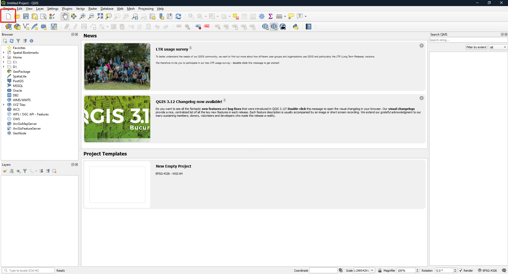

The first step of mapping our data is to add a base map. A base map is a layer with geographic information that serves as a background. A base map provides context for additional layers that are overlaid on top of the base map. We first need to download a plugin that provides different base maps. After you open a new project in QGIS, navigate yourself to `Plugins > Manage and Install Plugins`. It will open a window like this:

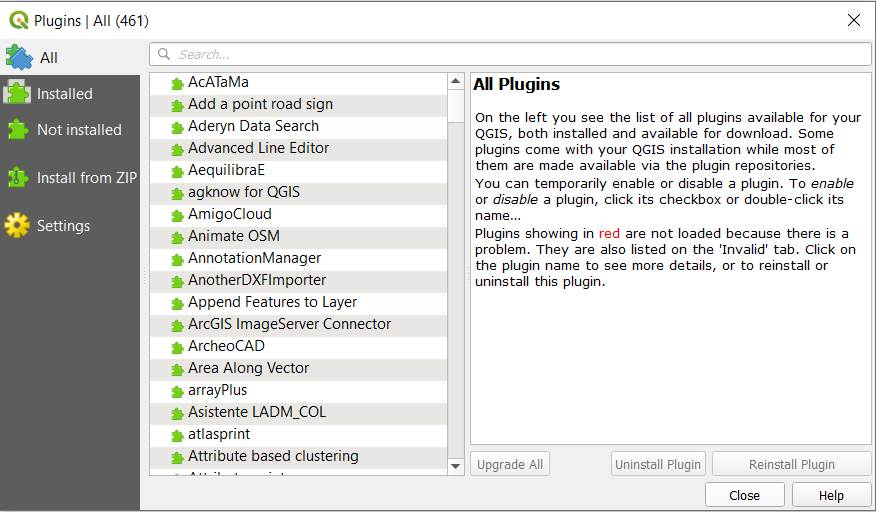

In the search bar, type in `QuickMapServices` and install the plugin. After installing it, close the plugins window. Navigate yourself to `Web > QuickMapServices > Settings`. You should see a page like this:

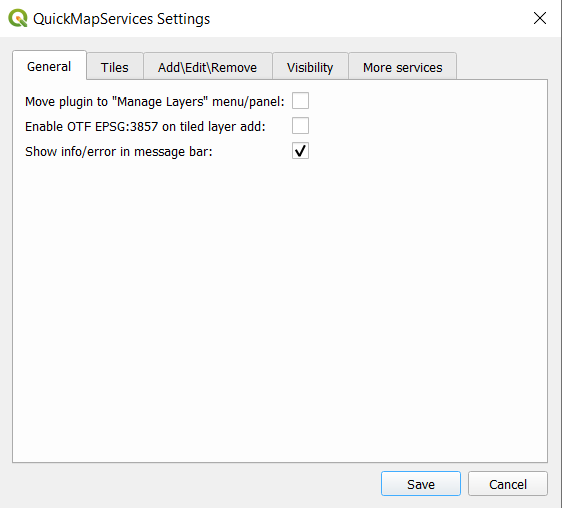

Click on the `More Services` tab and click on `Get contributed pack`. This will download all the base maps that are provided by different plugin authors. Then, close the page and navigate yourself again to `Web > QuickMapServices`. This time, you will see a list of contributors and base maps that they provide. Feel free to try adding different base maps, but for our exercise, let's use a base map called `Positron (retina)` under `CartoDB`.

After adding the base map, it should look like this:

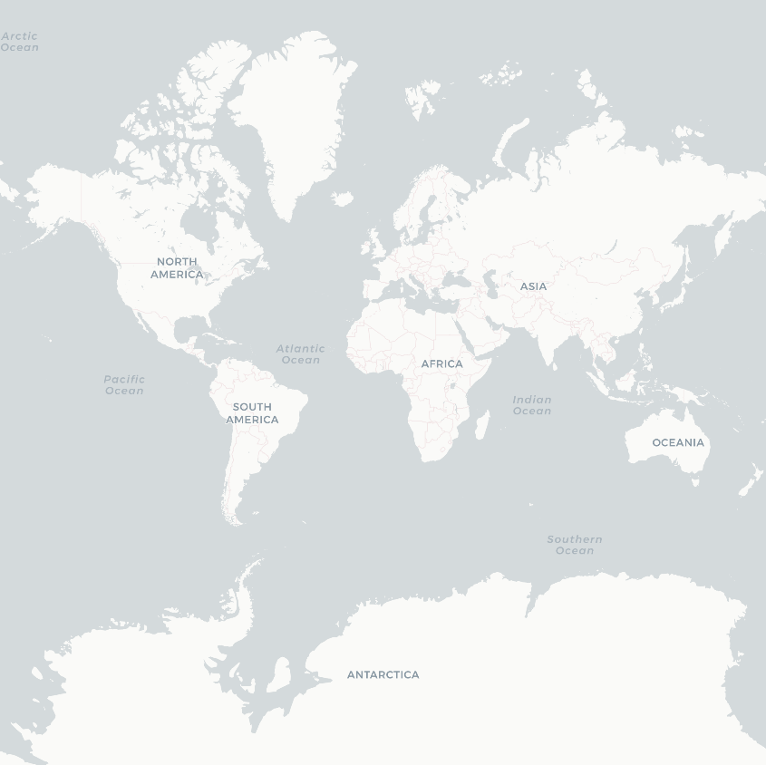

Now let us project the data we collected to this base map. Click on `Layer > Add Layer`. You will see different ways of adding a layer. In our case, we would like to add data stored in a CSV file, which is a delimited text file. Therefore, choose  `Add Delimited Text Layer`. In the file name section, choose the file we just downloaded from Jupyter Notebook named. Choose CSV as the file format. Expand `Geometry Definition` tab, set the X field as `lng`, and set the Y field as `lat`. Additionally, set Geometry CRS as `Default CRS: EPSG:4326 - WGS 84` and leave everything else as default. Now, go ahead and `add` this layer. All the layers you add to a map can be edited and managed in the `layer` section on bottom-left corner of QGIS interface.

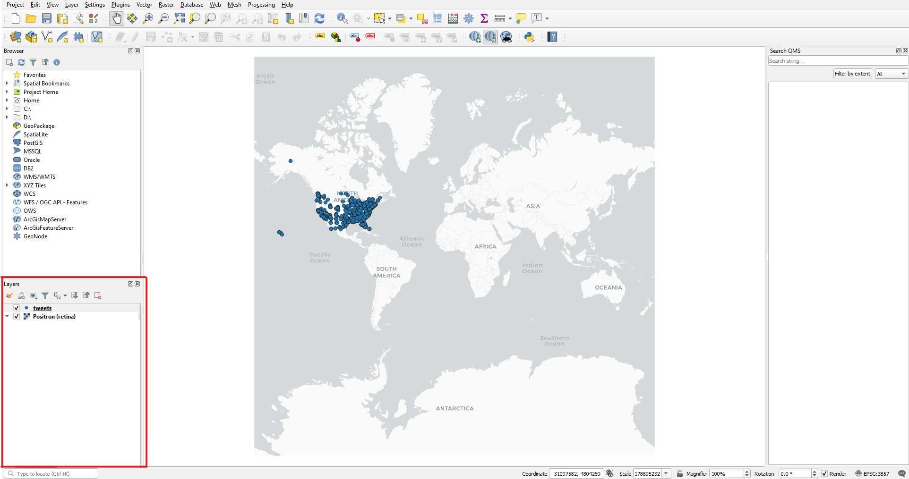

After adding the layer, close your data source manager. Zoom in to wherever you chose your target geographical area. Your map should look something similar to this:

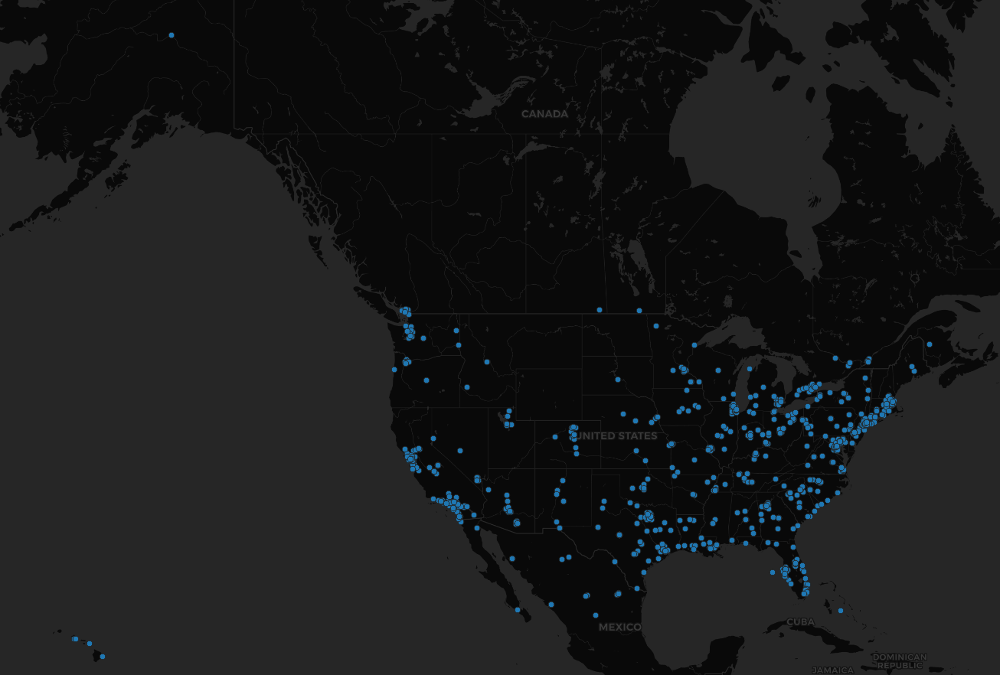

You can also change the symbology (size, color, etc.) of data points. Left-click on the `tweets` layer and click on `Properties -> Symbology`. Here, not only can you choose the color and size of each data point, you can also edit what shape/symbol to represent each data point. Feel free to change the color/size/symbol here appropriately so that it looks aesthetically pleasing to your audience.

We can now see geocoded locations where tweets were made, and distribution of the tweets tells us in which geographic areas Twitter is most frequently used. Such a trend gives us further insight when compared with other data. For example, this trend might be a result of the increasing population in the west and east coast.

Finally, save your map as a `qgz` file. To do so, click on `Project -> Save as` and change the file type to qgz format.

> What is QGZ file? QGZ file is a Quantum GIS Compressed Project. Quantum GIS (QGIS) is a cross-platform free and open-source desktop geographic information systems (GIS) application that provides data viewing, editing, and analysis capabilities.

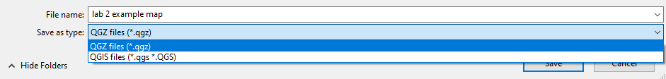

Additionally, export this map as an image. To do so, `Project -> Import/Export -> Export Map to Image...`.

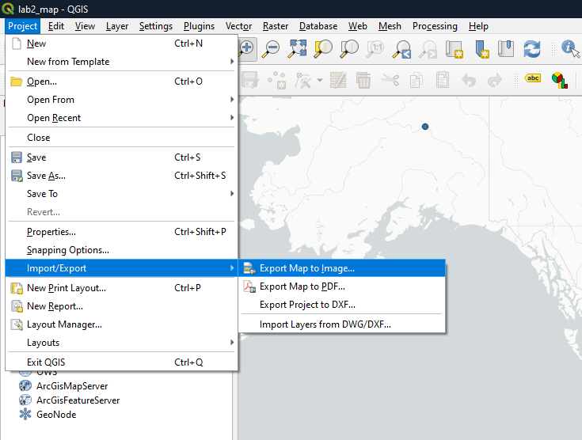

You will insert your qgz file and this exported image to your repository later.

In this section, you have **3 main tasks** to complete:

1.  Download the CSV file with Twitter data to your computer.

2.  Download `QGIS` and plot the data onto a map.

3.  Make any appropriate visual edits to this map. Save it as `qgz` file and export the map as an image.

## 5. Word cloud analysis

A word cloud can visualize the high-frequency terms and map them according to their frequency. It helps to analyze the content of all the collected tweets. There are a few online word cloud generators you can use. In this lab, we use Word Art from https://wordart.com.

After registration, you can create a word cloud by pressing the "Create Now" Button on the front page.


Open `geotweets.csv` in microsoft excel or other alternative spreadsheet software. Copy all the rows under the `text` column, and then paste the copied rows to the input text box on Word Art. You need to press the `import` button on the top left to open this text box. Once complete, please type `Import words`.

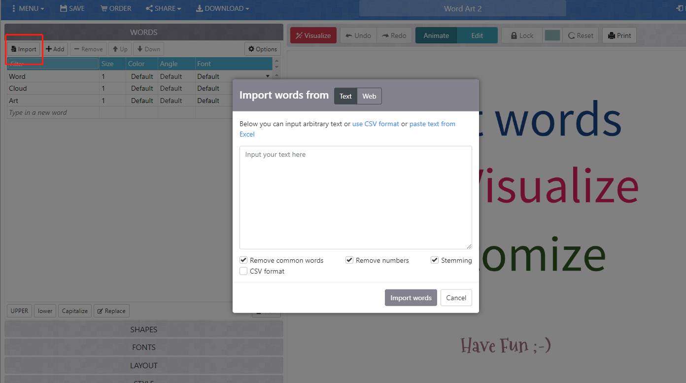


Now you will see a list of words on the left panel, please makes sure to **delete those common terms or meaningless ones**, otherwise your word cloud will be full of meaningless terms. Then, you can configure the rendering process through adjusting the shapes, fonts, layout, and style options. After you determine all the options, please type `visualize` on top of the main viewport. It takes a few second to render the image. After that, you will see the word cloud.

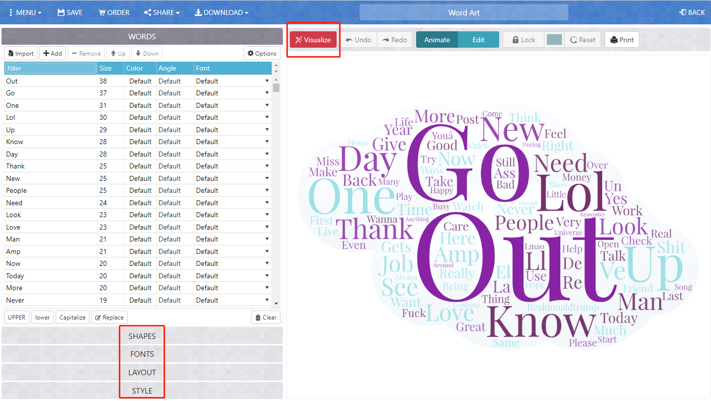

In order to reuse the word cloud, you need to download an image of this word cloud by pressing the `download` button on the main toolbar and then choose the image format, like `Standard PNG`. Then, the word cloud will be saved on your local drive for reuse.

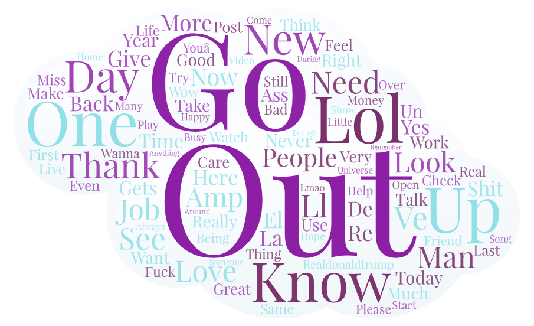

A word cloud will help you understand what twitter users have talked during the collecting time period and within the specific crawling geographical region.
## 6. Deliverable

You are expected to walk through this instruction. Specifically, you need to execute this `geosearch.ipynb` script twice. You can either run it in two different places or execute it in two different time period of day. With the two pieces of spreadsheets, you can make two maps and another two word clouds. Please write a short narrative to introduce your work, and describe the maps and the word clouds. Please analyze why the maps or word clouds are different from each other. This narrative needs to be written on a `readme.md file`.

To submit your deliverable, please create a new GitHub repository, and submit the URL of the GitHub to the **Canvas Dropbox** of this practical exercise. The file structure of this GitHub repository should look similar to below (POINT 5).

```powershell
[your_repository]
    │ [your_crawler].ipynb
    │readme.md
    ├─assets
    │      geotweets-1.csv
    │      geotweets-2.csv
    ├─img
    |      [screenshot_of_map-1].png
    |      [screenshot_of_map-2].png
    |      [screenshot_of_wordcloud-1].png
    |      [screenshot_of_wordcloud-2].png
```

 When uploading your crawler file to your repository, be sure to remove your Twitter developer credentials from the code before uploading.


Here are the grading criteria:

1.  introduce your comparison of two places or two time periods. Why do you want to make this comparison? Make sure this narrative will be stored in a `readme.md`. (POINT 15)

2.  export the two maps to the repository and then insert them to the `readme.md`. Please compare them and briefly discuss why they represent different geospatial patterns on the map. (POINT 15)

3.  export the two word clouds to the repository and then insert them to the `readme.md`. Please compare them and briefly discuss why they represent different context. (POINT 15)

> Note: We observed several students having issues registering for a Twitter developer account. If you have issues, please ignore this section if you were successfully able to register for one. Please try **using your UW email for registration** or asking your classmates especially group members for the API keys privately before giving up!

**Note:** Lab assignments are required to be submitted electronically to Canvas unless stated otherwise. Efforts will be made to have them graded and returned within one week after they are submitted. Lab assignments are expected to be completed by the due date. **_A late penalty of at least ten percentage units will be taken off each day after the due date._** If you have a genuine reason(known medical condition, a pile-up of due assignments on other courses, ROTC, athletics teams, job interview, religious obligations, etc.) for being unable to complete work on time, then some flexibility is possible. However, if in my judgment you could reasonably have let me know beforehand that there would likely be a delay, and then a late penalty will still be imposed if I do not hear from you until after the deadline has passed. For unforeseeable problems, I can be more flexible. If there are ongoing medical, personal, or other issues that are likely to affect your work all semester, then please arrange to see me to discuss the situation. There will be NO make-up exams except for circumstances like those above.

## Acknowledgement

Thanks Jou Ho and Yuke Cao for their assistance in preparing this lab.
