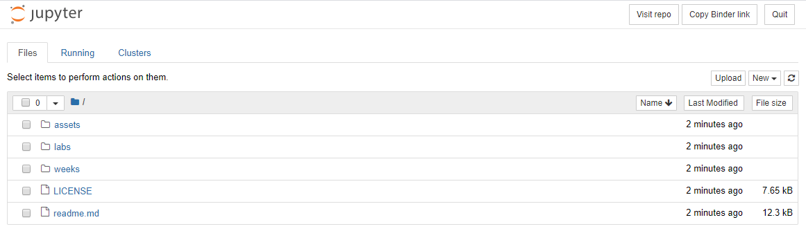
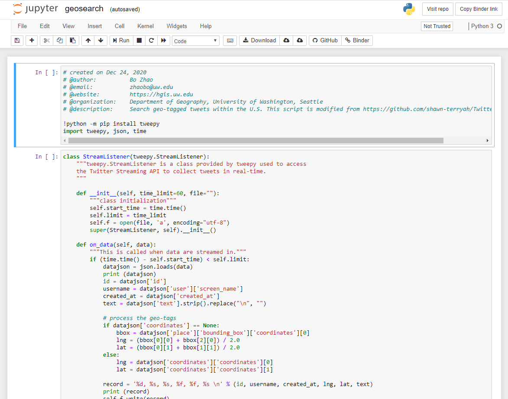
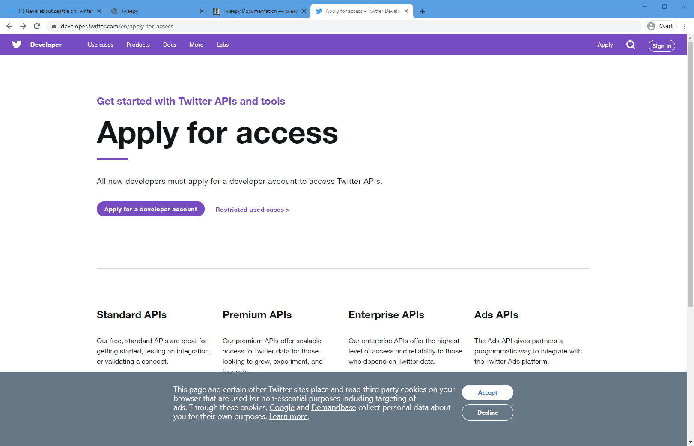

# Lab 2: Geo-tagged tweet collection and visualization

**Instructor:** Bo Zhao, 206.685.3846 or zhaobo@uw.edu

**Due:**  April 23rd, by 5:00pm | **Points Available** = 50

In this practical exercise, we will introduce how to collect Geo-tagged Twitter data using a API-based crawler and visualize them on a map using a mapping tool `QGIS`. A web crawler is a purposely designed bot for online data collection. In most cases, online data can be acquired through a dedicated API maintained by the data provider. Below, we will go over in detail the process of developing an API-based crawler and using QGIS to visualize collected data onto a map. Okay, let us get started!

[](https://mybinder.org/v2/gh/jakobzhao/geog458.git/master)

## 1. Using Jupyter Notebook

In this lab exercise and many of the upcoming lab exercise, we will use python to write our code.

**Python:** is an interpreted, high-level, general-purpose programming language. Its language constructs and object-oriented approach aim to help programmers write clear, logical code for small and large-scale projects. While there are many python IDE (Integrated development environment) for python, we will use `Jupyter Notebook` to avoid any inconvenience upon environment setup.

**Jupyter Notebook:** is an open-source web application that allows you to create and share documents that contain live code, equations, visualizations and narrative text. Uses include: data cleaning and transformation, numerical simulation, statistical modeling, data visualization, machine learning, and much more. Jupyter Notebook files have file extension of `.ipynb`

Instead of running Jupyter Notebook on local machines, we will be using `Binder` to interact with our notebooks on a server in a live environment. In order to launch binder, simply click on [](https://mybinder.org/v2/gh/jakobzhao/geog458.git/master) that is located on top of each lab page. It will take a while to launch the server, and you will be brought to a page that looks like below:



You can access all the files that are under geog458 repository. When you open one of the ipynb file, you will see a page like below.



Here, you can make your own edit to the file and run each blocks of code separately. For further information about the user interface of Jupyter Notebook, refer to the official documentation [here](https://jupyter-notebook.readthedocs.io/en/stable/).

## 2. Harvest geo-tagged tweets using a API-based Crawler

> Note: Most of the codes are already written for you in `geosearch.ipynb` except for some parameters to change. Your important task here is to understand what each pieces of codes are doing, and be able to utilize it later in this assignment.

In this section, we will make a Twitter crawler to collect geo-tagged tweets. This crawler is based on `Tweepy` - a python based library which wraps the Twitter API.  Tweepy provides a series of data crawling strategies - Harvesting geo-tagged tweets is just one of them. If you are interested in composing a more complicated data collection strategy, please refer to its documentation at [https://tweepy.readthedocs.io/en/latest/index.html](https://tweepy.readthedocs.io/en/latest/index.html).

We usually need to install libraries like tweepy using on command prompt (if a windows user) or terminal (if a Mac or Linux user). However, since we are working in Jupyter Notebook, we run the following code as shown in the script below to install a library.

```Python
!python -m pip install tweepy
```

To use the tweepy library, you need to register a Twitter developer account [here](https://developer.twitter.com/en).



Once you finish registering your account, you can apply for a Twitter app. It is located on the top right corner of the page. Click on `Apps`.


Then, you will see a page with list of apps that you've created for getting Twittr API, but for now, the list should be empty. In order to register for Twitter API, click on `Create an app`.

You will be prompted to fill in the app details. You are required to fill in: `App name`, `Application description`, `Website URLs`, and `'Tell us how this app will be used'`. If you are not sure what to put for the website URLs, you may enter your SNS profile URLs, such as your Facebook page, LinkedIn page, etc.


After you fill in all the required field, you may click on `Crate`. The Twitter takes some time to process your information to validate your access to the Twitter API.

Once you are registered, you can finally get your own keys and tokens. Go to the `App Detail` of the app you just created. Click on the tab `Keys and tokens`, and you should be see all the keys and tokens required to use the Twitter API.

Copy and paste the keys and tokens you received into corresponding parameters in the code below:

```Python
consumer_key = "your_consumer_key"
consumer_secret = "your_consumer_secret"
access_token = "your_access_token"
access_token_secret = "your_access_token_secret"
```

This script `geosearch.ipynb` was programmed using a `class` structure instead of a run-down script structure. A `StreamListener` is defined for later use, the main procedure will be executed after the line `if __name__ == "__main__":`. This piece of code was programmed with the reference to [https://github.com/shawn-terryah/Twitter_Geolocation](https://github.com/shawn-terryah/Twitter_Geolocation). So, let us start with the main procedure, and then switch to the stream listener.

```Python
class StreamListener(tweepy.StreamListener):
    """tweepy.StreamListener is a class provided by tweepy used to access
    the Twitter Streaming API to collect tweets in real-time.
    """

    def __init__(self, time_limit=60, file=""):
        """class initialization"""

    def on_data(self, data):
        """This is called when data are streamed in."""


if __name__ == "__main__":
    ....
```

once we acquire the consumer key and access token, we can create a variable to handle the twitter authentication.

```Python
myauth = tweepy.OAuthHandler(consumer_key, consumer_secret)
myauth.set_access_token(access_token, access_token_secret)
```

To retrieve geo-tagged tweets, three bounding boxes are defined. After initializing the stream listener, a stream object is created out of `tweepy.Stream object`. Then, the LOCATION array is passed to the stream filter method. By doing so, the geo-tagged are filtered and collected. Notably, the filter not only acquire geo-tagged tweets, but also other kinds of tweets according to the input filter strategy.  For example, to  filter all tweets containing the word seattle. The track parameter is an array of search terms to stream.

```Python
LOCATIONS = [-124.7771694, 24.520833, -66.947028, 49.384472,  # Contiguous US
               -164.639405, 58.806859, -144.152365, 71.76871,  # Alaska
               -160.161542, 18.776344, -154.641396, 22.878623]  # Hawaii
stream_listener = StreamListener(time_limit=60, file=output_file)
stream = tweepy.Stream(auth=myauth, listener=stream_listener)
stream.filter(locations=LOCATIONS)
```
You can filter tweets through a keyword, like "seattle".

```python
stream.filter(track=['seattle'])
```

To use filter to stream tweets by a specific user. The follow parameter is an array of IDs.

```python
stream.filter(follow=["2211149702"])
```
**Note:** An easy way to find a single ID is to use one conversion website and search for ‘what is my twitter ID’.


The `on_data` function will handle the data processing and output. In general, this function terminated after `self.limit` second. To process each record `data`, the captured `data` is converted to a json variable `datajson`. we will mainly output six variables, in terms of id, username, created_at, lng, lat, and text. Notably, If the geotag is a single point, the lat and lng will be captured directly from the `coordinates`. If the geotag is place, the lat and lng will capture the centroid of the boundingbox. Similarity, a new csv file named `tweets.csv` is created under [the assets folder](assets/).

```Python
def on_data(self, data):
    """This is called when data are streamed in."""
    if (time.time() - self.start_time) < self.limit:
        datajson = json.loads(data)
        print (datajson)
        id = datajson['id']
        username = datajson['user']['screen_name']
        created_at = datajson['created_at']
        text = datajson['text'].strip().replace("\n", "")

        # process the geo-tags
        if datajson['coordinates'] == None:
            bbox = datajson['place']['bounding_box']['coordinates'][0]
            lng = (bbox[0][0] + bbox[2][0]) / 2.0
            lat = (bbox[0][1] + bbox[1][1]) / 2.0
        else:
            lng = datajson['coordinates']['coordinates'][0]
            lat = datajson['coordinates']['coordinates'][1]

        record = '%d, %s, %s, %f, %f, %s \n' % (id, username, created_at, lng, lat, text)
        print (record)
        self.f.write(record)
    else:
        self.f.close()
        print ("finished.")
        return False
```

Now, you should have a general idea of what the script does and how to change the parameters based on your interest. In this section, there are **3 main tasks** here for you to complete:

1. Register your own Twitter developer account to claim API keys and access tokens. Copy and paste them onto corresponding parameter in `geosearch.ipynb` located under this lab.

2. Change the location parameter based on areas you would like to gather twitter data from. It could be anywhere on this earth, but try to choose locations that are large enough to collect sufficient amount of data. (If you are interested in Twitter data that are geo-tagged in the US, you do not need to change this parameter)

3. Change the keyword parameter based on your interest. The keyword here filters twitters that contain the same keyword. It could be any keywords that interest you. (Example: 'Seattle', 'football', 'python', etc.)

## 3. Visualizing geo-tagged data using QGIS

## 4. Deliverable

You are expected to walk through this instruction, execute the two pieces of python scripts, and more importantly, develop your own crawler to collect some data from the web. Ideally, this data will be related to research question you have stated in your [statement of intent](../01_intro/soi.md).

To submit your deliverable, please create a new github repository, and submit the url of the GitHub to the **Canvas Dropbox** of this practical exercise. The file structure of this github repository should look like below.

```powershell
[your_repository]
    │ [your_crawler].py
    │readme.md
    ├─assets
    │      tweets.csv
    │      geotags.csv
    │      [your_dataset].csv
```

Here are the grading criteria:

1\. Execute both `01_twsearch.py` and `02_geosearch.py` with different keywords, and save the results to `tweets.csv` and `geotags.cvs` in the `assets` folder of the newly-created repository. (POINT 5 for each)

2\. Develop a web crawler to harvest data from a website other than Twitter. This python script should save in the root of the repository. (POINT 20)

3\. Export a sample of the results to the `assets` folder of the repository. (POINT 5)

4\. In the `readme.md` file, write an instruction to introduce the crawler and its usages. You can refer to  [https://github.com/shawn-terryah/Twitter_Geolocation](https://github.com/shawn-terryah/Twitter_Geolocation). (POINT 15)


**Note:** Lab assignments are required to be submitted electronically to Canvas unless stated otherwise. Efforts will be made to have them graded and returned within one week after they are submitted.Lab assignments are expected to be completed by the due date. ***A late penalty of at least 10 percentage units will be taken off each day after the due date.*** If you have a genuine reason(known medical condition, a pile-up of due assignments on other courses, ROTC,athletics teams, job interview, religious obligations etc.) for being unable to complete work on time, then some flexibility is possible. However, if in my judgment you could reasonably have let me know beforehand that there would likely be a delay, and then a late penalty will still be imposed if I don't hear from you until after the deadline has passed. For unforeseeable problems,I can be more flexible. If there are ongoing medical, personal, or other issues that are likely to affect your work all semester, then please arrange to see me to discuss the situation. There will be NO make-up exams except for circumstances like those above.
