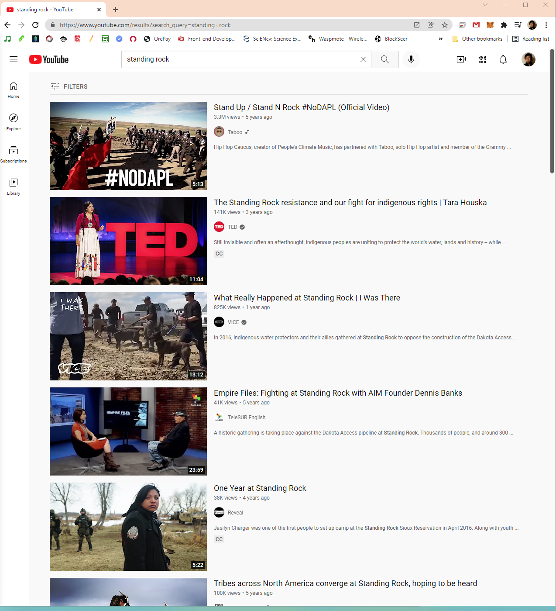
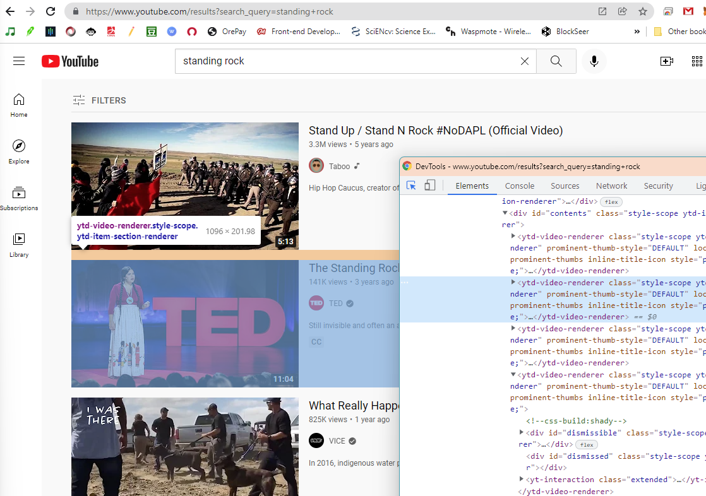
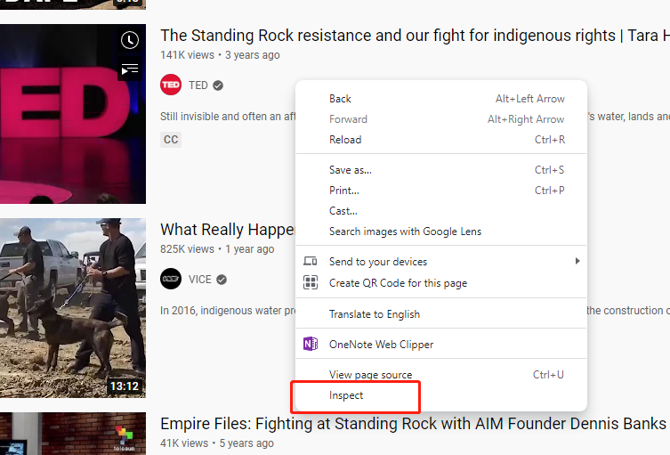

# Lab 2: Web data collection and visualization

**Instructor:** Bo Zhao, 206.685.3846 or zhaobo@uw.edu; **Points Available** = 50

In this practical exercise, we will learn how to create a web crawler and then visualize the collected data. This lab exercise focuses on collecting and visualizing data from youtube. As you go through this lab, think about how you can apply this technique to your final project. Below, we will go over in detail the process of developing an web crawler to visualize data collected from Youtube. Okay, let us get started!

## 1. Setup the execution environment on the cloud

In this lab, we will use Google Colab to compile the script in Python. If you have used python for scientific research before, you must already experience the complexity of configuring the execution environment. So, in order not to simplify the process of environment configuration, we decide to execute the crawlers on Google Colab. Google Colab allows its user to compose and execute arbitrary python code directly through the browser, and is especially well suited to machine learning, data analysis and education. There is an embedded Jupyter notebook that requires no setup and has an excellent free version, which gives free access to Google computing resources such as GPUs and TPUs.

**Python:** is an interpreted, high-level, general-purpose programming language. Its language constructs and object-oriented approach aim to help programmers write clear, logical code for small and large-scale projects. While there are many python IDE (Integrated development environment) for python, we will use `Jupyter Notebook` to avoid any inconvenience upon environment setup.

**Jupyter Notebook:** is an open-source web application that allows you to create and share documents that contain live code, equations, visualizations, and narrative text. Uses include data cleaning and transformation, numerical simulation, statistical modeling, data visualization, machine learning, and much more. Jupyter Notebook files have a file extension of `.ipynb`.


## 2. Develop a Youtube crawler using Selenium

This section will walk you through the process of making a generic web crawler. This crawler manipulates a browser using a python library named "Selenium". This library enables the crawler mimic how a human user visits and/or interacts with web pages. While viewing the web pages, the crawler monitors the data flows, parses the html structure, and extracts the requested data items. Below, we will introduce how to design a crawler to collect information from a group of youtube videos.

Please launch the youtube crawler script by clicking this button [](https://colab.research.google.com/github/jakobzhao/geog458/blob/master/labs/lab02/youtube.ipynb). This button will enable you to open the file [lab02/youtube.ipynb](./youtube.ipynb) on Google Colab.

For any python script, metadata are usually stated at the very beginning.

```python
# created on April 14, 2021
# modified on Jan 2, 2022
# modified on April 20, 2023
# modified on January 5, 2024
# @author:          Bo Zhao
# @email:           zhaobo@uw.edu
# @website:         https://hgis.uw.edu
# @organization:    Department of Geography, University of Washington, Seattle
# @description:     A demo of collecting data from YouTube.
```

The normal operation of Selenium requires the support of a browser in the local computer. Since we move the execution environment to the cloud, it is necessary to ensure the cloud side (Google CoLab in our case) can manipulate the browser. To do so, you plan to run the code block below to install selenium, chromedriver and a few dependencies.

```python
%%shell
sudo apt -y update
sudo apt install -y wget curl unzip
wget http://archive.ubuntu.com/ubuntu/pool/main/libu/libu2f-host/libu2f-udev_1.1.4-1_all.deb
dpkg -i libu2f-udev_1.1.4-1_all.deb
wget https://dl.google.com/linux/direct/google-chrome-stable_current_amd64.deb
dpkg -i google-chrome-stable_current_amd64.deb

pip install selenium chromedriver_autoinstaller
```

Next, the required python libraries for this crawler will be imported. To execute the crawling task, we will use BeautifulSoup, time, datetime, pandas. Since Google Colab has already pre-installed BeautifulSoup and pandas, you do not need to install again.

```Python
from bs4 import BeautifulSoup # Import BeautifulSoup to parse the HTML.
import time, datetime # Import time and datetime to record the time.
import pandas as pd # Import pandas to create a dataframe, and it can save the dataframe as a csv file.
```

Next, we will create a bot. Here, a bot is an instance of Chrome. The bot will be used to visit the web page and collect the data. To create a bot, you need to import the selenium library and its webdriver module. Then, you will create an instance of Chrome. The Chrome instance will be assigned to the variable `bot`.

```Python
from selenium import webdriver
from selenium.webdriver.chrome.options import Options

chrome_options = Options() # Create an instance of Options so you can add arguments to the driver.
chrome_options.add_argument('--headless') # Add an argument 'headless' to run Chrome in headless mode.
chrome_options.add_argument('--no-sandbox') # Add an argument 'no-sandbox' to run Chrome in no-sandbox mode.
chrome_options.add_argument('--disable-dev-shm-usage') # Add an argument 'disable-dev-shm-usage' to run Chrome in disable-dev-shm-usage mode.

bot = webdriver.Chrome(options=chrome_options) # Create an instance of Chrome. Pass the argument 'options' to the constructor of Chrome.

```

We plan to request the youtube crawler to harvest the information of videos relevant to a keyword "Standing Rock". By studying how to search youtube videos using keyword, we find out that the expected videos can be visited by the url `https://www.youtube.com/results?search_query=standing+rock`. So a variable url is created to store the url. And next, we will use the bot to visit this url.

```Python
# The url where the data will be collected from.
url = "https://www.youtube.com/results?search_query=standing+rock"
# Input the targeting url to the bot, and the bot will load data from the url.
bot.get(url)
```



Declare global variables and assign initial values. These variables will be used to store the collected data. The variable `video_urls` is used to store all the video urls. If a video has been crawled, it would not be stored to the data frame. The variable `results` is used to store the retrieved video details.


```Python
# An array to store all the video urls. If a video has been crawled, it would not be stored to the data frame.
video_urls = []
# An array to store the retrieved video details.
results = []
```

In order to harvest the information from all the videos on the visited web page, you need to keep scrolling down the page. To stop, you can scroll a few times or detect whether you reach the bottom of the page or not. For each scroll, please ask your bot take some rest, and then resume to work.

```Python

# variable i indicates the number of times that scrolls down a web page. In practice, you might want to develop different
# interaction approach to load and view the web pages.

for i in range(5):
    ... ...
    ... ...
    ... ...
    # it is very important to enable the bot take some rest, and then resume to work.
    time.sleep(5)
    # Let the bot scrolls down to the bottom of the content element, most of the time the bot needs to scroll down to the bottom of the page.
    # like this statement: bot.execute_script("window.scrollTo(0, document.body.scrollHeight);")
    bot.execute_script('window.scrollTo(0,  document.getElementById("content").scrollHeight);')
```

In each scroll, the crawler will only parse the newly appeared videos. So, based on the testing, we find that each scroll will retrieve no more than 20 videos. To develop the locating strategy, we can use Chrome's Inspector to visually explore the elements of the opened web page and its corresponding source code.

In the inspector, you can find the HTML features of each video. For example, we find that the tag name of a video element is `ytd-video-renderer`, and each video element is also in the class of  `style-scope ytd-item-section-renderer`.



> **Note:** To open an inspector on Chrome, you can right click on the displaying web page. On the pop-up dropdown menu, click `Inspect`, and then the inspector will show up.



To locate a certain attribute of HTML element, you will need to use the syntax of beautiful soup. Beautiful Soup is also very important for destructuring html pages. Beautiful Soup is a Python library for pulling data out of HTML and XML files. It provides idiomatic ways of navigating, searching, and modifying the parse tree. If you are not familiar with Beautiful Soup, please go over the [`Quick Start` section of this documentation](https://www.crummy.com/software/BeautifulSoup/bs4/doc/#quick-start).

```Python
# Create a document object model (DOM) from the raw source of the crawled web page.
# Since you are processing a html page, 'html.parser' is chosen.
soup = BeautifulSoup(bot.page_source, 'html.parser')

# Capture all the video items using find_all or findAll method.
# To view the information of the html elements you want to collect, you need to inspect the raw source using Chrome Inspector.
videos = soup.find_all('ytd-video-renderer', class_="style-scope ytd-item-section-renderer")[-20:] # 20 indicates only process the newly-acquired 20 entries.
```

Then, you will process each video in the video list. I prefer use the "try-except" statement to enable the program run without pausing due to unexpected errors.

```python
for video in videos:

    # I prefer use the "try-except" statement to enable the program run without pausing due to unexpected errors.
    try:
        ... ...
        ... ...
    except:
        pass
```

For each video, we will extract the needed attributes, such as the video url, user url, username, title, number of views, the time when the video was created, short desc of the video, and when the video record was collected by the crawller.

```python
video_url = video.find("a", class_="yt-simple-endpoint style-scope ytd-video-renderer").attrs["href"]
user_url = video.find("a", class_="yt-simple-endpoint style-scope yt-formatted-string").attrs["href"]
username = video.find("a", class_="yt-simple-endpoint style-scope yt-formatted-string").text
title = video.find("yt-formatted-string", class_="style-scope ytd-video-renderer").text
metadata_items = video.find_all("span", class_="inline-metadata-item style-scope ytd-video-meta-block")
view_num = metadata_items[0].text.replace(" views", "")
created_at = metadata_items[1].text.replace(" ago", "")
shortdesc = video.find("yt-formatted-string", class_="metadata-snippet-text style-scope ytd-video-renderer").text
collected_at = datetime.datetime.now()
```

Once the attributes are collected, you will create a row in the dict format. And append this newly acquired row to the results array. Before appending the row, you need to check whether the video has been crawled or not. If the video has been crawled, you will skip this video.


```python
row = {'video_url': video_url,
        'user_url': user_url,
        'username': username,
        'title': title,
        'view_num': view_num,
        'created_at': created_at,
        'shortdesc': shortdesc,
        'collected_at': collected_at}


if video_url in video_urls:
    print("this video has already been added.")
else:
    print(row)
    results.append(row)
```

To the end, you can terminate the bot when the task is completed. And then, you can store the results as a pandas dataframe.


```python
# terminate the bot object.
bot.close()
```

Store the results as a pandas dataframe.

```python
# Store the results as a pandas dataframe
df = pd.DataFrame(results)

# notify the completion of the crawling in the console.
print("the crawling task is finished.")
```

Since the script is executed on Google Colab, we will store the data as a csv spreadsheet directly in Google Drive. 

```python
# Create data on to Google Drive
from google.colab import drive
# Mount your Drive to the Colab VM.
drive.mount('/gdrive')

# the file path where to store the output csv on google drive
output_file = '/gdrive/My Drive/videos.csv'

# Save the dataframe as a csv file
df.to_csv(output_file, index=False)
```

When the csv is created successfully, you can download the csv file to your local computer.

```python
# download the csv to your local computer
from google.colab import files
files.download(output_file)
print("the csv has been downloaded to your local computer. The program has been completed successfully.")
```


## 3. Word cloud analysis

A word cloud can visualize the high-frequency terms and map them according to their frequency. It helps to analyze the content of all the collected data. There are a few online word cloud generators you can use. In this lab, we use Word Art from https://wordart.com. You can use your UW email to register an account. After registration, you can create a word cloud by pressing the "Create Now" Button on the front page.


Open `videos.csv` in microsoft excel or other alternative spreadsheet software. Copy all the rows under the `shortdesc` column, and then paste the copied rows to the input text box on Word Art. You need to press the `import` button on the top left to open this text box. Once complete, please type `Import words`.


Now you will see a list of words on the left panel, please makes sure to **delete those common terms or meaningless ones**, otherwise your word cloud will be full of meaningless terms. Then, you can configure the rendering process through adjusting the shapes, fonts, layout, and style options. After you determine all the options, please type `visualize` on top of the main viewport. It takes a few second to render the image. After that, you will see the word cloud.


In order to reuse the word cloud, you need to download an image of this word cloud by pressing the `download` button on the main toolbar and then choose the image format, like `Standard PNG`. Then, the word cloud will be saved on your local drive for reuse.


A word cloud will help you understand what twitter users have talked during the collecting time period and within the specific crawling geographical region.

## 4. Discussion 

When running this script, please think about a specific social or geographic topic you want to explore. By saying that, you need to think critically and carefully about the search term. Sometimes, you might want to conduct the script several times to collect a statistically significant amount of youtube video clips to better reflect the examined topic. For example, to understand how people talk about UW, you might want to execute the script with a combination of keywords includes "uw", "university of washington", "univ of washington". Only one key term might be insufficient. **You are expected to run the `youtube.ipynb` with in least three different search terms.** You can use the code below to collect data from different search terms but they emphasize the same topic. Once you collect all the data, please make at least a word cloud from all the data collected.

```python
# The url where the data will be collected from.
search_terms = ["uw", "university of washington", "univ of washington"]
for search_term in search_terms:
    url = "https://www.youtube.com/results?search_query=" + search_term.replace(" ", "+")
    # Input the targeting url to the bot, and the bot will load data from the url.
    bot.get(url)
    ... ...
    ... ...
    ... ...
```

Similarly, if you want to compare the data collected from different places and even later map them on the map. you can develop a different web scripting strategy to collect data from different places. For example, you can collect data from Seattle, Tacoma, and Olympia. You can use the code below to collect data from different places. Once you collect all the data, please make at least a word cloud from all the data collected. But you will need to assign latitudes and longitudes to each row of the collected data. See the code below.

```python
# The url where the data will be collected from.
locations = [
    {"name": "Seattle", "lat": 47.6062, "lng": -122.3321},
    {"name": "Tacoma", "lat": 47.2529, "lng": -122.4443},
    {"name": "Olympia", "lat": 47.0379, "lng": -122.9007}
]
for location in locations:
    url = "https://www.youtube.com/results?search_query=" + location["name"].replace(" ", "+")
    # Input the targeting url to the bot, and the bot will load data from the url.
    bot.get(url)
    ... ...
    ... ...
    ... ...
```

## 5. Deliverable

For your deliverable, You are expected to walk through this instruction by running the `youtube.ipynb`script with self-determined group of search terms and/or locations, and then create a narrative about the results, including at least two word clouds. To submit your deliverable, please create a new GitHub repository, and submit the URL of the GitHub to the **Canvas Dropbox** of this lab assignment. The file structure of this GitHub repository should look similar to below (5 PTS).

```powershell
[your_repository]
    │readme.md
    ├─assets
    │      search-result-1.csv
    │      search-result-2.csv
    │      search-result-n.csv // the number n depends on how many locations you have explored.
    ├─img
    |      wordcloud-1.png
    |      wordcloud-2.png
    |      wordcloud-n.png  // the number n depends on how many locations you have explored.
```

Your narrative about the results should be written in markdown format and then saved in the `readme.md`. (5 PTS)

Here are the grading criteria:

1.  Please create a narrative based on your research. In your narrative, please describe 
    1.  the topic as well as the parameters you have used for search (5 PTS)
    2.  why do you want to make this comparison (5 PTS)
    3.  compare the word clouds and discuss the difference or similarity among the word clouds (5 PTS)
    4.  what might be the possible reasons for the patterns you observed (5 PTS)
    5.  how your research could be improved in the future (5 PTS)
    6.  anything you find from the map or data that is different from your expectation before the exercise, or anything that stands out to you (5 PTS)
2.  Export the two or more word clouds to the repository and then insert them to the `readme.md`.  (5 PTS)
3.  The `readme.md` also needs to include a url to download the result spreadsheets (csv file) of the collected data (5 PTS). 


**Note:** Lab assignments are required to be submitted electronically to Canvas unless stated otherwise. Efforts will be made to have them graded and returned within one week after they are submitted. Lab assignments are expected to be completed by the due date. **_A late penalty of at least ten percentage units will be taken off each day after the due date._** If you have a genuine reason(known medical condition, a pile-up of due assignments on other courses, ROTC, athletics teams, job interview, religious obligations, etc.) for being unable to complete work on time, then some flexibility is possible. However, if in my judgment you could reasonably have let me know beforehand that there would likely be a delay, and then a late penalty will still be imposed if I do not hear from you until after the deadline has passed. For unforeseeable problems, I can be more flexible. If there are ongoing medical, personal, or other issues that are likely to affect your work all semester, then please arrange to see me to discuss the situation. There will be NO make-up exams except for circumstances like those above.

## Acknowledgement

Thanks Jou Ho, Yuke Cao, and Steven Bao for their assistance in preparing this lab.
