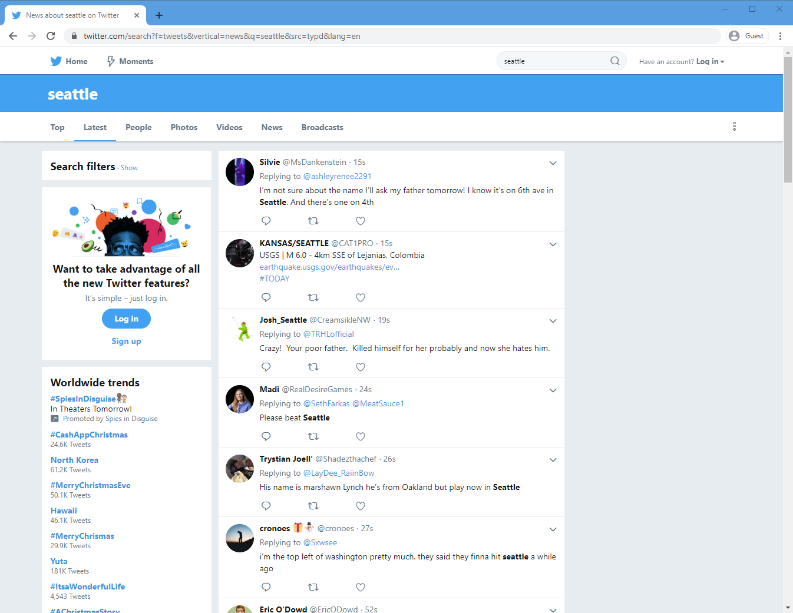
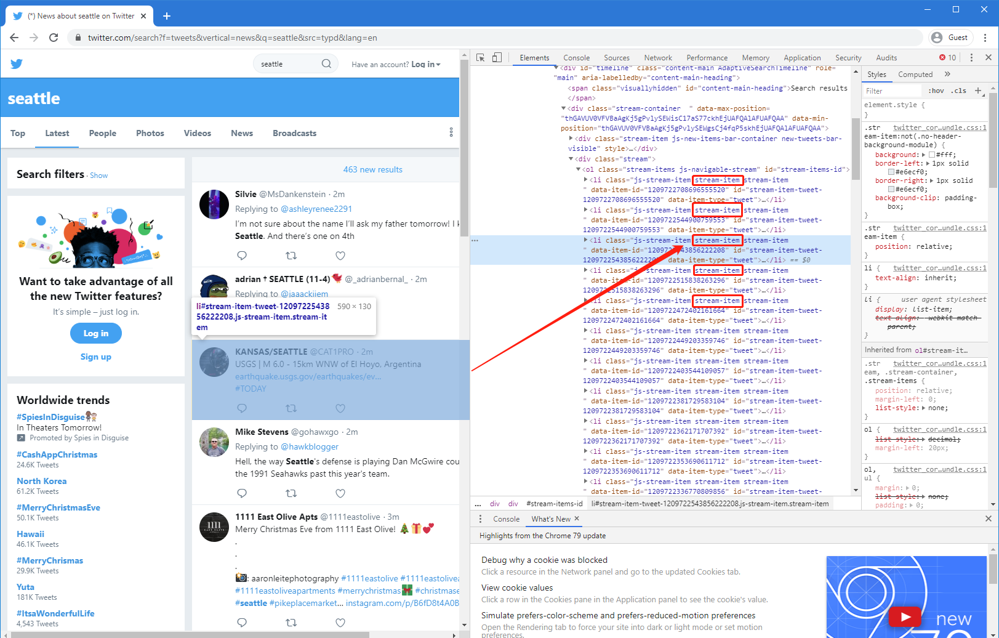

# Lab 2: Geo-tagged tweet collection and visualization

**Instructor:** Bo Zhao, 206.685.3846 or zhaobo@uw.edu

**Due:**  April 23rd, by 5:00pm | **Points Available** = 50

In this practical exercise, we will introduce how to collect Twitter data using a web crawler. A web crawler is a purposely designed bot for online data collection. In most cases, online data can be acquired through a dedicated API maintained by the data provider. If no API available, we can develop a customized crawler using a crawler library (e.g. Selenium, Scrapy, etc.). Below, two crawlers are coded for purpose of harvesting twitter data. The first one is developed with a python library named 'Selenium'; and the other one relies on Twitter API. Okay, let us get started!

[](https://mybinder.org/v2/gh/jakobzhao/geog458.git/master)

## 1. Environment setup

To setup the working environment, please install Anaconda and PyCharm first.

**Python:** is an interpreted, high-level, general-purpose programming language. Its language constructs and object-oriented approach aim to help programmers write clear, logical code for small and large-scale projects. For this practical exercise, please use a version of python greater than 3.0.

Instead of installing Python, please install **Anaconda** - a customized python wrapper for scientific computing (data science, machine learning applications, large-scale data processing, predictive analytics, etc.), that aims to simplify package management and deployment. Package versions are managed by the package management system conda. The Anaconda distribution includes data-science packages suitable for Windows, Linux, and MacOS. Check https://www.anaconda.com/distribution/ to download an Anaconda package. **Please make sure you choose the Python 3.X version.**

**PyCharm:** is an integrated development environment (IDE) for the Python language. It is developed by the Czech company JetBrains. It provides code analysis, a graphical debugger, an integrated unit tester, integration with GitHub, and supports web development as well as Data Science with Anaconda. PyCharm is cross-platform, with Windows, macOS and Linux versions. The Community Edition is released under the Apache License, it is free to use. Check https://www.jetbrains.com/pycharm/ to download and install PyCharm.

This exercise highly depends on your proficiency of using PyCharm. If you are not familiar with it, please walk over the following tutorials:

- [Create and run your first Python project](https://www.jetbrains.com/help/pycharm/creating-and-running-your-first-python-project.html);
- [Debug your first Python application](https://www.jetbrains.com/help/pycharm/debugging-your-first-python-application.html); and
- Skim over this tutorial on [using git on PyCharm](https://www.jetbrains.com/help/pycharm/using-git-integration.html).

## 2. Develop a generic Twitter crawler using Selenium

This section will help you make a generic web crawler. If you are able to develop this generic crawler, the same developing procedure can be applied to crawling data from other websites. This crawler manipulates a browser using a python library named "Selenium". This library enables the crawler mimic how a human user visits and/or interacts with web pages. While viewing the web pages, the crawler monitors the data flows, parses the html structure, and extracts the requested data items. Below, we will introduce how to design a crawler to collect tweets of a specific topic.

Above all, please install two required python libraries, in terms of selenium and BeautifulSoup. Selenium is the library to manipulate web browser, and beautifulSoup is for destructuring html pages. To install, please execute the following script on command prompt (if a windows user) or terminal (if a Mac or Linux user).

```powershell
pip install selenium
pip install beautifulsoup4
```

Once these two libraries are installed, please open Pycharm, and execute the script [`01_twsearch.py`](01_twsearch.py) under the [03_bot folder](./). We will give a step-by-step instruction of this piece of python script.

For any python script, metadata are usually stated at the very beginning.

```python
# created on Dec 24, 2020
# @author:          Bo Zhao
# @email:           zhaobo@uw.edu
# @website:         https://hgis.uw.edu
# @organization:    Department of Geography, University of Washington, Seattle
# @description:     Search tweets of a specific topic using a web crawler
```

Following the metadata, the required python libraries for this crawler will be included. In addition to selenium and beautifulsoup4, time and datetime are imported to manage the executing time , and json enables the script to parse any json data.

```Python
from selenium import webdriver
from bs4 import BeautifulSoup
import time, datetime, json
```

If you input this url `url = "https://twitter.com/search?f=tweets&vertical=news&q=seattle&src=typd&lang=en"` to a chrome browser, a twitter search interface showing tweets filtered by the keyword "Seattle" will show. In fact, you can update the keyword between `q=` and `&` to search any topic you like, for example, a celebrity, a natural disaster, latest news, etc. Obviously, you can rely on the same strategy to identify web pages other than Twitter.





In addition to searching a keyword, you can also compose a more advanced search including location, time period, and hashtag. For example, the url below tries to find out all the tweets within a buffer centering Houston and with a radius of 15 miles, also the collected tweets were created between August 24 to 31, 2017.

```Python
url = "https://twitter.com/search?l=&q=near%3A%22houston%22%20within%3A15mi%20since%3A2017-08-24%20until%3A2017-08-31&src=typd&lang=en"
```

Next, a bot is created with a browser driver. Selenium requires a driver to interface with the chosen browser. Most of the browsers such as Chrome, Edge, Firefox or Safari, provide drivers. Chrome driver will be used in this practical exercise. Check [https://sites.google.com/a/chromium.org/chromedriver/downloads](https://sites.google.com/a/chromium.org/chromedriver/downloads) to download a chrome driver. Also, we have the current version of chromedriver saved in the [assets folder](assets/). the parameter executable_path must point to the path of the driver. Once a chromedriver is set up, you can get the web page using the bot's `get` method.

```Python
bot = webdriver.Chrome(executable_path="assets/chromedriver.exe") # if you are a mac user, please use "assets/chromedriver"
bot.get(url)
```

Declare global variables and assign initial values, such as creating an empty csv file, writing a header to the csv file, and recording the current time, and so on.

```Python
f = open("assets/tweets.csv", "a", encoding="utf-8") # create a csv file to store the collected tweets.
f.write('user_id, user_name, screen_name, status_id, created_at, time_integer, reply_num, retweet_num, favorite_num, content \n') # read the csv header
start = datetime.datetime.now() # record the current time.
time_limit = 60 # this crawler will run 60 minutes
texts = [] # an array to store each content of the collected tweets.
```

Twitter search interface only shows part of the result, but if you keep scrolling down the page, you can read more till the end of page. At this moment, you will see a notice at the bottom of the page `Back to top ↑`. For each scroll, we will rest 5 seconds. Another criteria to stop the crawler is the time limit. If the crawler has executed longer than the predefined limit time, the crawler will stop too.


```Python
while len(bot.find_elements_by_xpath('//div[contains(text(), "Back to top ↑")]')) != 1:
    time.sleep(5)
    bot.execute_script("window.scrollTo(0, document.body.scrollHeight);")
    soup = BeautifulSoup(bot.page_source, 'html5lib')
    tweets = soup.find_all('li', class_="stream-item")[-20:] # only process the newly-acquired tweets.
    if int((datetime.datetime.now() - start).seconds) >= time_limit: # if longer than a minute, then stop scrolling.
        break
    # parsing each tweet of the tweets
```


There are multiple strategies to locate an element using **Selenum's webdriver**. For example:

```python
find_element_by_id
find_element_by_name
find_element_by_xpath
find_element_by_link_text
find_element_by_partial_link_text
find_element_by_tag_name
find_element_by_class_name
find_element_by_css_selector
```

To find multiple elements (these methods will return a list):

```python
find_elements_by_name
find_elements_by_xpath
find_elements_by_link_text
find_elements_by_partial_link_text
find_elements_by_tag_name
find_elements_by_class_name
find_elements_by_css_selector
```

To get details of  using these locating strategies, please refer to [https://selenium-python.readthedocs.io/locating-elements.html](https://selenium-python.readthedocs.io/locating-elements.html).

In addition to selenium, **Beautiful Soup** is also very important for destructuring html pages.Beautiful Soup is a Python library for pulling data out of HTML and XML files. It provides idiomatic ways of navigating, searching, and modifying the parse tree. If you are not fimiliar with Beautiful Soup, please go over the [`Quick Start` section of this documentation](https://www.crummy.com/software/BeautifulSoup/bs4/doc/#quick-start).




To develop the locating strategy, we can use Chrome's Inspector to visually explore the elements of the opened web page and its corresponding source code. As shown in the screenshot below, we find out all the tweet items are wrapped in a `li` element, and with a class named `stream-item`, then we can retrieve all the tweet items by looking for all the `li` elements having a class named `stream-item`.

**Note:** To open an inspector on Chrome, you can right click on the displaying web page. On the pop-up dropdown menu, click `Inspect`, and then the inspector will show up.


For each tweet, we try to extract information about the author, the tweet, and identify whether it is a tweet synchronized from Instagram. Notably, the line feeds are deleted in the text.

```Python
for tweet in tweets:
      try:
          user_json = json.loads(tweet.div.attrs["data-reply-to-users-json"])
          user_id = int(user_json[0]['id_str'])
          user_name = user_json[0]['screen_name']
          screen_name = user_json[0]['name']
          status_id = int(tweet.attrs["data-item-id"])
          text = tweet.find("p").text.strip().replace("\n", "")
          created_at = tweet.find("small", class_="time").a.attrs["title"]
          time_integer = tweet.find("small", class_="time").a.span["data-time-ms"]
          reply_num = tweet.find("div", class_="ProfileTweet-action--reply").find("span", class_="ProfileTweet-actionCountForPresentation").text
          retweet_num = tweet.find("div", class_="ProfileTweet-action--retweet").find("span", class_="ProfileTweet-actionCountForPresentation").text
          favorite_num = tweet.find("div", class_="ProfileTweet-action--favorite").find("span", class_="ProfileTweet-actionCountForPresentation").text
          inst_url = ""
          if "www.instagram.com" in text:
              inst_url = tweet.p.a.attrs["title"]
          ...
          ...
      except:
          pass
```

The line `f.write(record)` inserts a record to the csv file. the `if` statement helps check whether this record has been inserted or not. if not, it will be inserted.


```Python
for tweet in tweets:
      try:
          ...
          text = tweet.find("p").text.strip().replace("\n", "")
          ...
          record = '%d, %s, %s, %d, %s， %s， %s， %s， %s， %s \n' % (user_id, user_name, screen_name, status_id, created_at, time_integer, reply_num, retweet_num, favorite_num, text)
          print(record)
          if (text not in texts):
              f.write(record)
          texts.append(text)
```

This block of code releases both the csv file handler and the bot handler. and print "finish" to notify that the data crawling task is done. If you execute this piece of python script on pyCharm, a file `tweets.csv` will be generated to the `assets` folder. As shown below.

```Python
f.close()
bot.close()
print("finished")
```


## 3. Harvest geo-tagged tweets using a API-based Crawler

In this section, we will make a Twitter crawler to collect geo-tagged tweets. This crawler is based on `Tweepy` - a python based library which wraps the Twitter API.  Tweepy provides a series of data crawling strategies - Harvesting geo-tagged tweets is just one of them. If you are interested in composing a more complicated data collection strategy, please refer to its documentation at [https://tweepy.readthedocs.io/en/latest/index.html](https://tweepy.readthedocs.io/en/latest/index.html).

Above all, you need to install tweepy using on command prompt (if a windows user) or terminal (if a Mac or Linux user), as shown in the script below.

```powershell
pip install tweepy
```

To use the tweepy library, you need to register a Twitter developer account.


Once you register, you can apply for a Twitter app. Having a twitter app, you will receive four important parameters, they are:

```Python
consumer_key = "your_consumer_key"
consumer_secret = "your_consumer_secret"
access_token = "your_access_token"
access_token_secret = "your_access_token_secret"
```

After installing tweepy, please execute the script [`02_geosearch.py`](02_geosearch.py) under the [03_bot folder](./) on PyCharm. This piece of code was programmed with the reference to [https://github.com/shawn-terryah/Twitter_Geolocation](https://github.com/shawn-terryah/Twitter_Geolocation).

Compared with `01_twsearch.py`, this script `02_geosearch.py` was programmed using a `class` structure instead of a run-down script structure. A `StreamListener` is defined for later use, the main procedure will be executed after the line `if __name__ == "__main__":`. So, let us start with the main procedure, and then switch to the stream listener.

```Python
class StreamListener(tweepy.StreamListener):
    """tweepy.StreamListener is a class provided by tweepy used to access
    the Twitter Streaming API to collect tweets in real-time.
    """

    def __init__(self, time_limit=60, file=""):
        """class initialization"""

    def on_data(self, data):
        """This is called when data are streamed in."""


if __name__ == "__main__":
    ....
```

once we acquire the consumer key and access token, we can create a variable to handle the twitter authentication.

```Python
myauth = tweepy.OAuthHandler(consumer_key, consumer_secret)
myauth.set_access_token(access_token, access_token_secret)
```

To retrieve geo-tagged tweets, three bounding boxes are defined. After initializing the stream listener, a stream object is created out of `tweepy.Stream object`. Then, the LOCATION array is passed to the stream filter method. By doing so, the geo-tagged are filtered and collected. Notably, the filter not only acquire geo-tagged tweets, but also other kinds of tweets according to the input filter strategy.  For example, to  filter all tweets containing the word seattle. The track parameter is an array of search terms to stream.

```Python
LOCATIONS = [-124.7771694, 24.520833, -66.947028, 49.384472,  # Contiguous US
               -164.639405, 58.806859, -144.152365, 71.76871,  # Alaska
               -160.161542, 18.776344, -154.641396, 22.878623]  # Hawaii
stream_listener = StreamListener(time_limit=60, file=output_file)
stream = tweepy.Stream(auth=myauth, listener=stream_listener)
stream.filter(locations=LOCATIONS)
```
You can filter tweets through a keyword, like "seattle".

```python
stream.filter(track=['seattle'])
```

To use filter to stream tweets by a specific user. The follow parameter is an array of IDs.

```python
stream.filter(follow=["2211149702"])
```
**Note:** An easy way to find a single ID is to use one conversion website and search for ‘what is my twitter ID’.


The `on_data` function will handle the data processing and output. In general, this function terminated after `self.limit` second. To process each record `data`, the captured `data` is converted to a json variable `datajson`. we will mainly output six variables, in terms of id, username, created_at, lng, lat, and text. Notably, If the geotag is a single point, the lat and lng will be captured directly from the `coordinates`. If the geotag is place, the lat and lng will capture the centroid of the boundingbox. Similarity, a new csv file named `geotags.csv` is created after [the assets folder](assets/).

```Python
def on_data(self, data):
    """This is called when data are streamed in."""
    if (time.time() - self.start_time) < self.limit:
        datajson = json.loads(data)
        print (datajson)
        id = datajson['id']
        username = datajson['user']['screen_name']
        created_at = datajson['created_at']
        text = datajson['text'].strip().replace("\n", "")

        # process the geo-tags
        if datajson['coordinates'] == None:
            bbox = datajson['place']['bounding_box']['coordinates'][0]
            lng = (bbox[0][0] + bbox[2][0]) / 2.0
            lat = (bbox[0][1] + bbox[1][1]) / 2.0
        else:
            lng = datajson['coordinates']['coordinates'][0]
            lat = datajson['coordinates']['coordinates'][1]

        record = '%d, %s, %s, %f, %f, %s \n' % (id, username, created_at, lng, lat, text)
        print (record)
        self.f.write(record)
    else:
        self.f.close()
        print ("finished.")
        return False
```


## 4. Deliverable

You are expected to walk through this instruction, execute the two pieces of python scripts, and more importantly, develop your own crawler to collect some data from the web. Ideally, this data will be related to research question you have stated in your [statement of intent](../01_intro/soi.md).

To submit your deliverable, please create a new github repository, and submit the url of the GitHub to the **Canvas Dropbox** of this practical exercise. The file structure of this github repository should look like below.

```powershell
[your_repository]
    │ [your_crawler].py
    │readme.md
    ├─assets
    │      tweets.csv
    │      geotags.csv
    │      [your_dataset].csv
```

Here are the grading criteria:

1\. Execute both `01_twsearch.py` and `02_geosearch.py` with different keywords, and save the results to `tweets.csv` and `geotags.cvs` in the `assets` folder of the newly-created repository. (POINT 5 for each)

2\. Develop a web crawler to harvest data from a website other than Twitter. This python script should save in the root of the repository. (POINT 20)

3\. Export a sample of the results to the `assets` folder of the repository. (POINT 5)

4\. In the `readme.md` file, write an instruction to introduce the crawler and its usages. You can refer to  [https://github.com/shawn-terryah/Twitter_Geolocation](https://github.com/shawn-terryah/Twitter_Geolocation). (POINT 15)


**Note:** Lab assignments are required to be submitted electronically to Canvas unless stated otherwise. Efforts will be made to have them graded and returned within one week after they are submitted.Lab assignments are expected to be completed by the due date. ***A late penalty of at least 10 percentage units will be taken off each day after the due date.*** If you have a genuine reason(known medical condition, a pile-up of due assignments on other courses, ROTC,athletics teams, job interview, religious obligations etc.) for being unable to complete work on time, then some flexibility is possible. However, if in my judgment you could reasonably have let me know beforehand that there would likely be a delay, and then a late penalty will still be imposed if I don't hear from you until after the deadline has passed. For unforeseeable problems,I can be more flexible. If there are ongoing medical, personal, or other issues that are likely to affect your work all semester, then please arrange to see me to discuss the situation. There will be NO make-up exams except for circumstances like those above.
