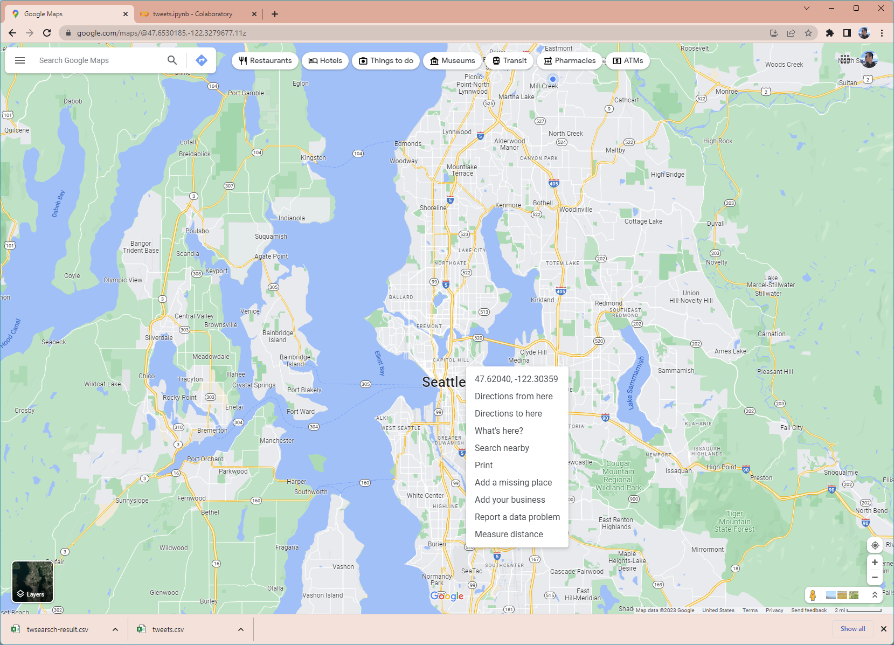
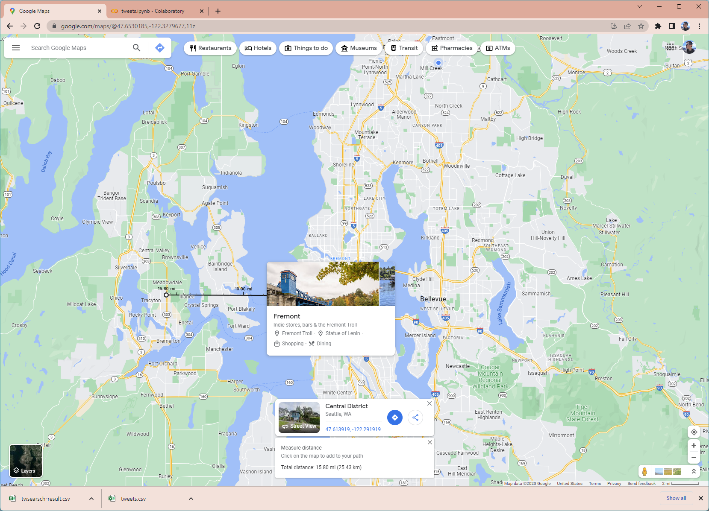

# Lab 2: Geo-tagged tweet collection and visualization

**Instructor:** Bo Zhao, 206.685.3846 or zhaobo@uw.edu; **Points Available** = 50

In this practical exercise, we will introduce how to collect Geo-tagged Twitter data using an API-based crawler and visualize them on a map using a mapping tool `QGIS`. A web crawler is a purposely designed bot for online data collection. In most cases, online data can be acquired through a dedicated API maintained by the data provider. This lab exercise focuses on visualizing the spatial distribution of twitter data, which reflects the public perception of a specific topic. As you go through this lab, think about how you can apply this technique to your final project. Below, we will go over in detail the process of developing an API-based crawler and using QGIS to visualize collected data onto a map. Okay, let us get started!

## 1. Setup the execution environment on the cloud

In this lab, we will use Google Colab to compile the script in Python. If you have used python for scientific research before, you must already experience the complexity of configuring the execution environment. So, in order not to simplify the process of environment configuration, we decide to execute the crawlers on Google Colab. Google Colab allows its user to compose and execute arbitrary python code directly through the browser, and is especially well suited to machine learning, data analysis and education. There is an embedded Jupyter notebook that requires no setup and has an excellent free version, which gives free access to Google computing resources such as GPUs and TPUs.

**Python:** is an interpreted, high-level, general-purpose programming language. Its language constructs and object-oriented approach aim to help programmers write clear, logical code for small and large-scale projects. While there are many python IDE (Integrated development environment) for python, we will use `Jupyter Notebook` to avoid any inconvenience upon environment setup.

**Jupyter Notebook:** is an open-source web application that allows you to create and share documents that contain live code, equations, visualizations, and narrative text. Uses include data cleaning and transformation, numerical simulation, statistical modeling, data visualization, machine learning, and much more. Jupyter Notebook files have a file extension of `.ipynb`.

## 2. Apply for a Twitter developer account

In order to use Twitter API, you need to have a Twitter developer account from this [link](https://developer.twitter.com/en/apply-for-access). Please try **using your UW email for registration**.


In order to register your account, you will be prompted to answer a series of questions. Please answer those that are required to fill in and you can ignore optional questions.

There has been a recent update on the twitter developer account permissions. This requires us to apply for the **Elevated** permissions for our developer account in order to use the filter functions in our python code. To do this, after we have our developer account and log into the developer portal, click on "Products" on the left side, and then "Twitter API v2", then click on the "Elevated" tab on the right, and then "Apply for Elevated".


You will need to provide some information about yourself, as well as why you need the Elevated permission. For the second section "Intended use," your can summarize and rephrase the lab description and also add your plan for the lab deliverable to answer the questions. You can choose "no" for the optional questions. Below is a screenshot of what I submitted for the application. **Please do not directly copy the answers in the screenshot for your own application.** I was instantly approved for the Elevated permission after submitting the application.


Once you finish registering your account, you can apply for a Twitter app. First of all, you will need to click on `Developer Portal` which is located on the top right corner of the page.


Then, you will enter developer portal. On the left bar, you can click on `Projects &  Apps` for checking the list of apps that you've created for getting Twitter API, but for now, the list should be empty. In order to register for Twitter API, click on `+ Create App` which is under the `Standalone Apps`.


You will be prompted to fill in the app details. Here, you are required to fill in: `App name`.


After you fill in all the required fields, you may click on `Create`. Twitter takes some time to process your information to validate your access to the Twitter API. Then you will be able to see your keys and tokens.

Once you are registered, you could check your own keys and tokens again by click on your app-name which is under your app list. Go to the `App Detail` of the app you just created. Click on the tab `Keys and tokens`, and you should be able to see all the keys and tokens required to use the Twitter API.


Copy and paste the keys and tokens you received into corresponding parameters in the code below:

```Python
consumer_key = "your_consumer_key"
consumer_secret = "your_consumer_secret"
access_token = "your_access_token"
access_token_secret = "your_access_token_secret"
```


<details><summary><h2><strike>3. Harvest real-time geo-tagged tweets using a API-based crawler</strike> (This part is removed from the lab due to recent API change)</h2></summary>

~~In this section, we will create a Twitter crawler to collect geotagged tweets. Most of the codes are already written for you in `twstream.ipynb` except for some parameters to change. Your essential task here is to understand what each piece of code is doing and be able to utilize it later in this assignment.~~

~~Please launch the crawler by clicking this button [](https://colab.research.google.com/github/jakobzhao/geog458/blob/master/labs/lab02/twstream.ipynb). This button will enable you to open the file [`labs/lab02/twtream.ipynb`](./twtream.ipynb) on Google Colab. You can also open this ipynb script through the url `https://colab.research.google.com/github/jakobzhao/geog458/blob/master/labs/lab02/twtream.ipynb`.~~

~~As shown, `https://colab.research.google.com/` indicates the google colab root url, the subpath `github/jakobzhao/geog458/blob/master/labs/lab02/twtream.ipynb` indicate the location where the ipynb script `labs/lab02/twtream.ipynb` on github. You can open any `ipynb` script on Google Colab through the similar url structure.~~


### ~~3.1 Metadata and required libraries~~

~~For any python script, metadata are usually stated at the very beginning.~~

```python
# created on Dec 24, 2020
# modified on Jan 2, 2021
# @author:          Bo Zhao
# @email:           zhaobo@uw.edu
# @website:         https://hgis.uw.edu
# @organization:    Department of Geography, University of Washington, Seattle
# @description:     Search geo-tagged tweets within the U.S. This script is modified from https://github.com/shawn-terryah/Twitter_Geolocation
```

~~Next, the required python libraries for this crawler will be imported. To execute the crawling task, we will use pandas, tweepy and google.colab. Since Google Colab has already pre-installed pandas and tweepy, you do not need to install again. `Tweepy` is a python based library which wraps the Twitter API. Tweepy provides a series of data crawling strategies - Harvesting geotagged tweets is just one of them. If you are interested in composing a more complicated data collection strategy, please refer to its documentation at <https://tweepy.readthedocs.io/en/latest/index.html>.~~


```python
import tweepy, json, time
import pandas as pd
from google.colab import files
# Create data on to Google Drive
from google.colab import drive
# Mount your Drive to the Colab VM.
drive.mount('/gdrive')
```

 ~~If you want to use tweepy in your local computer, you need to install tweepy using on command prompt (if a windows user) or terminal (if a Mac or Linux user), as shown in the script below.~~

```powershell
pip install tweepy
```

~~Although we also work on the Jupyter Notebook, we do not need to manually install tweepy because Google Colab has automatically incorporate it into its preloaded libraries. However, if a library has not been preinstalled on google colab, you will need to use the following line to install a library, let us the name of the library is tempLib~~

```powershell
!pip install tempLib
```

### ~~3.2 Code structure~~

~~This script `twtream.ipynb` was programmed using a `class` structure instead of a run-down script structure. A `StreamListener` is defined for later use, the main procedure will be executed after the line `if __name__ == "__main__":`. This piece of code was programmed with reference to <https://github.com/shawn-terryah/Twitter_Geolocation>. So, let us start with the main procedure and then switch to the stream listener.~~

```Python
class StreamListener(tweepy.StreamListener):
    """tweepy.StreamListener is a class provided by tweepy used to access
    the Twitter Streaming API to collect tweets in real-time.
    """

    def __init__(self, time_limit=60, file=""):
        """class initialization"""

    def on_data(self, data):
        """This is called when data are streamed in."""


if __name__ == "__main__":
    ....
```

### ~~3.3 Main procedure~~

~~In the main procedure, once we acquire the consumer key and access token, we can create a variable to handle the twitter authentication.~~

~~Determine where on the google drive you want to store the output csv data. A CSV file is a delimited text file that uses a comma to separate values. Each line of the file is a data record. Each record consists of one or more fields, separated by commas.~~

```python
output_file = '/gdrive/My Drive/twstream-result.csv'
```

~~Copy and paste the keys and tokens you received into corresponding parameters in the code below:~~

```python
consumer_key = "your_consumer_key"
consumer_secret = "your_consumer_secret"
access_token = "your_access_token"
access_token_secret = "your_access_token_secret"
```

~~Initiate a tweepy API object~~

```python
myauth = tweepy.OAuthHandler(consumer_key, consumer_secret)
myauth.set_access_token(access_token, access_token_secret)
```

~~To retrieve geo-tagged tweets, three bounding boxes are defined. After initializing the stream listener, a stream object is created out of `tweepy.Stream object`. Then, the LOCATION array is passed to the stream filter method. By doing so, the geo-tagged are filtered and collected.~~

```python
    # LOCATIONS are the longitude, latitude coordinate corners for a box that restricts the
    # geographic area from which you will stream tweets. The first two define the southwest
    # corner of the box and the second two define the northeast corner of the box.
    LOCATIONS = [-124.7771694, 24.520833, -66.947028, 49.384472,  # Contiguous US
                 -164.639405, 58.806859, -144.152365, 71.76871,  # Alaska
                 -160.161542, 18.776344, -154.641396, 22.878623]  # Hawaii

    stream_listener = StreamListener(time_limit=60, file=output_file)
    stream = tweepy.Stream(auth=myauth, listener=stream_listener)
    stream.filter(locations=LOCATIONS)
```

~~Notably, the filter not only acquires geotagged tweets but also other kinds of tweets according to the input filter strategy.~~

~~tweepy allows you to filter tweets through a keyword. By choosing a keyword related to the timely topic like "coronavirus", you can obtain data that gives you an insight into the public perception of the topic.~~

```python
stream.filter(track=['coronavirus'])
```

~~Additionally, to use filters to stream tweets by a specific user. The following parameter is an array of IDs. For example, the Twitter ID for the white house is `822215673812119553`, and you can collect tweets from this specific account. We will not be changing this parameter in this lab exercise, but consider how you can utilize this function if this is something that you would like to link to your final project.~~

```python
stream.filter(follow=["2211149702"])
```

~~However, these different filtering parameter returns different data structures, and they store different information about the tweets. For this reason, keyword filtering does not return plenty of geotagged tweets. If you are changing the keyword parameter, you should run this crawler for a longer duration. To do so, simply change the `time_limit` parameter. For example, if you want to run this crawler for 5 minutes, set it to 300. **If you are trying to use a less common keyword, the chance is you will not have a sufficient amount of data. In that case, consider running this crawler for even longer, like a few hours.**~~

```python
stream_listener = StreamListener(time_limit=60, file=output_file)
```

### ~~3.4 Stream listener~~

~~The `on_data` function will handle data processing and output. In general, this function terminated after `self.limit` second. To process each record `data`, the captured `data` is converted to a JSON variable `datajson`. We will mainly output six variables, in terms of id, username, created_at, lng, lat, and text. Notably, If the geotag is a single point, the lat and lng will be captured directly from the `coordinates`. If the geotag is a place, the lat and lng will capture the centroid of the bounding box.~~

```python
def on_data(self, data):
    """This is called when data are streamed in."""
    if (time.time() - self.start_time) < self.limit:
        datajson = json.loads(data)
        print(datajson, "\n")
        if 'id' not in datajson.keys():
            time.sleep(10)
        else:
            id = datajson['id']
            username = datajson['user']['screen_name']
            created_at = datajson['created_at']
            text = datajson['text'].strip().replace("\n", "")

            # process the geo-tags
            if datajson['coordinates'] == None:
                try:
                    bbox = datajson['place']['bounding_box']['coordinates'][0]
                    lng = (bbox[0][0] + bbox[2][0]) / 2.0
                    lat = (bbox[0][1] + bbox[1][1]) / 2.0
                except:
                    lat = 0
                    lng = 0
            else:
                lng = datajson['coordinates']['coordinates'][0]
                lat = datajson['coordinates']['coordinates'][1]

            if lat != 0:
                row = {
                    'id': id,
                    'username': username,
                    'created_at': created_at,
                    'lng': lng,
                    'lat': lat,
                    'text': text
                }
                print(row)
                self.result.append(row)
            else:
                pass
    else:
        df = pd.DataFrame(self.result)
        df.to_csv(self.f, index=False)
        # download the csv to your local computer
        files.download(self.f)
        print("the csv has been downloaded to your local computer. The program has been completed successfully.")
        return False
```

~~Now, you should have a general idea of what the script does and how to change the parameters based on your geographical area of interest. In this section, there are **3 main tasks** here for you to complete:~~

1. ~~Register your own Twitter developer account to claim API keys and access tokens. Copy and paste them onto the corresponding parameter in `twstream.ipynb` located under this lab.~~

2. ~~Change the location parameter to filter specific tweets based on your interest. The location could be anywhere on this earth, but try to choose locations that are large enough to collect a sufficient amount of data. (If you are interested in Twitter data that are geo-tagged in the US, you do not need to change this parameter).~~

3. ~~Run each block of code in `twstream.ipynb`. Your collected data will be stored in `twstream-result.csv` on your google drive.~~

> ~~To learn more advanced skills of using the twitter stream api, please refer to [https://docs.tweepy.org/en/stable/streaming.html#using-stream](https://docs.tweepy.org/en/stable/streaming.html#using-stream).~~
</details>


## 4. Search historical tweets using locational information

Twitter's API previously allowed all users to collect historical tweets dating back to the platform's inception. **However, recent changes to Twitter's policy now limit access to historical tweets to elevated users, only allowing them to download data from the past seven days.** Despite this restriction, it is still possible to access historical Twitter data by applying for an academic user account, which is free of charge. This is not a requirement for the lab, but an option for those interested in downloading a longer dataset. As you can see, an academic account will grant you a significant amount of freedom to analyze online sentiments regarding various social issues.

So, in this section, you will learn how to collect recent tweets. Please launch this Twitter crawler script by clicking this button [](https://colab.research.google.com/github/jakobzhao/geog458/blob/master/labs/lab02/twsearch.ipynb). This button will enable you to open the file [labs/lab02/twsearch.ipynb](./twsearch.ipynb) on Google Colab.

### 4.1 Metadata and required libraries

For any python script, metadata are usually stated at the very beginning.

```python
# created on Dec 24, 2020
# modified on April 14, 2021
# modified on Jan 2, 2021
# @author:          Bo Zhao
# @email:           zhaobo@uw.edu
# @website:         https://hgis.uw.edu
# @organization:    Department of Geography, University of Washington, Seattle
# @description:     Search historical tweets using locational information
```

Similar to the previous section, we will import the needed libraries

```python
import tweepy
import pandas as pd
```

Copy and paste the keys and tokens you received into corresponding parameters in the code below:

```Python
consumer_key = "your_consumer_key"
consumer_secret = "your_consumer_secret"
access_token = "your_access_token"
access_token_secret = "your_access_token_secret"
```

Initiate a tweepy API object

```python
auth = tweepy.OAuthHandler(consumer_key, consumer_secret)
auth.set_access_token(access_token, access_token_secret)
api = tweepy.API(auth, wait_on_rate_limit=True)
```

## 4.2 Define the search term and search parameters

Define the search term and the date_since date as search parameter. ~~We plan to collect all the tweets containing "BLM" that were sent in larger Seattle since the movement of Capitol Hill Occupied Protest (CHOP) began. To do that, we define the search variables as below.~~

As the recent modification of twitter policy, an API user can only collect tweets in the past seven days. So, instead of collecting data a few years ago, we plan to collect tweets containing the discussion of "BLM" in the last seven days. We define the search variables as below.

```python
search_words = "BLM"
# make sure there is no space between lat, long and the radius.
location = "47.62039945423961,-122.30359179186148,15.8mi"
# date_since = "2020-6-9" # you can still define a data_since parameter, but it has to be a date within the last seven days.
```

As shown, the search term is `#BLM`, the start date is `June 9, 2020`. It is worth noting that, you can still define a data_since parameter, but it has to be a date within the last seven days. If you are looking for advanced skills for creating search terms, please refer to [https://developer.twitter.com/en/docs/twitter-api/v1/rules-and-filtering/search-operators](https://developer.twitter.com/en/docs/twitter-api/v1/rules-and-filtering/search-operators).

Now, we will need to identify a buffer area. All the tweets falling in the buffer will be captured. To find the location parameter, you can follow the procedure below.

- Open [Google maps](https://www.google.com/maps/@47.6368272,-122.2448836,11z) on your desktop browser, then navigate to the place where you plan to collect tweets from.
  
- Right click on the location, a dropdown popup will appears, Click the latitude and longitude information on the first line of the popup.
  



- Now you have the coordinate in your clipboard, please save it to the script as the center of th buffer area.
  
-  To determine the radius, please right click on location again, then click the `measure distance` at the bottom of the dropdown menu.

-  Now, draw a line to estimate the radius. In my case, the radius is `15.8 miles`, which allows the buffer covers the area where the data will be collected. So, the radius should be `15.8mi`. Notably, the API only supports the unit miles, so if your measure is in feet or other units, please convert it to mile.




## 4.2 Data Harvest

Then, we input the parameters to the tweepy harvesting cursor, and we want to get back at most 1000 tweets for one single query. It is worth noting, that another parameter `lang` is applied, it will make sure all the acquired tweets are in English (`en` indicates English, for example, `kr` indicates korean, `cn` indicates Chinese, `sp` indicates spanish). However, for your own crawling strategy, you can pick a specific language that all the tweets uses.

```python
# Collect tweets
tweets = tweepy.Cursor(api.search, q=search_words, geocode=location, lang="en", since=date_since).items(1000)
```


> Note: in addition to q, geocode, lang, you can also the following parameters:
>
>  - from: - to specify a specific Twitter user profile
>  - since: - to specify the beginning date of the search (it is a date within the past seven days)
>  - until: - to specify the ending date of the search. (it is a date within the past seven days)
> 
> The cursor can also receive other parameters, such as the language and the tweet_mode. If tweet_mode='extended', all the text of the tweet is returned, otherwise only the first 140 characters.

We first create an empty array to store the retrieved data. As how we process each video in the first crawler we designed, we use the similar strategy to process each tweet, and store them in a pandas data frame.

```python
# create an array to store the result
result = []

# Iterate and print tweets
for tweet in tweets:
    row = {
        'username': tweet.author.name,
        'userid': tweet.author.id,
        'profile_location': tweet.author.location,
        'created_at': str(tweet.author.created_at),
        'text': tweet.text,
        'retweet_count': tweet.retweet_count,
        'source': tweet.source,
        'coordinates': tweet.coordinates
    }
    result.append(row)
    print(row)

# Store the results as a pandas dataframe
df = pd.DataFrame(result)

# notify the completion of the crawling in the console.
print("the crawling task is finished.")
```

In the end, we can store the tweets as a csv file to Google drive or download to the local computer.

```python
# Create data on to Google Drive
from google.colab import drive
# Mount your Drive to the Colab VM.
drive.mount('/gdrive')
  
df.to_csv(output_file, index=False)


# download the csv to your local computer
from google.colab import files
files.download(output_file)
print("the csv has been downloaded to your local computer. The program has been completed successfully.")
```

## 5. Word cloud analysis

A word cloud can visualize the high-frequency terms and map them according to their frequency. It helps to analyze the content of all the collected tweets. There are a few online word cloud generators you can use. In this lab, we use Word Art from https://wordart.com.

After registration, you can create a word cloud by pressing the "Create Now" Button on the front page.


Open `twsearch-result.csv` in microsoft excel or other alternative spreadsheet software. Copy all the rows under the `text` column, and then paste the copied rows to the input text box on Word Art. You need to press the `import` button on the top left to open this text box. Once complete, please type `Import words`.


Now you will see a list of words on the left panel, please makes sure to **delete those common terms or meaningless ones**, otherwise your word cloud will be full of meaningless terms. Then, you can configure the rendering process through adjusting the shapes, fonts, layout, and style options. After you determine all the options, please type `visualize` on top of the main viewport. It takes a few second to render the image. After that, you will see the word cloud.


In order to reuse the word cloud, you need to download an image of this word cloud by pressing the `download` button on the main toolbar and then choose the image format, like `Standard PNG`. Then, the word cloud will be saved on your local drive for reuse.


A word cloud will help you understand what twitter users have talked during the collecting time period and within the specific crawling geographical region.

## 6. Deliverable

For your deliverable, You are expected to walk through this instruction by running the `twsearch.ipynb`script with self-determined parameters.

- When running `twsearch.ipynb` script, please think about a specific social or geographic topic you want to explore. By saying that, you need to think critically and carefully about the search term and search parameters. Sometimes, you might want to conduct the script several times to collect a statistically significant amount of tweets to better reflect the examined topic. For example, to understand how people talk about UW, you might want to execute the script with a combination of keywords includes "uw", "university of washington", "univ of washington". Only one key term might be insufficient. **You are expected to run the `twsearch.ipynb` in least three different places with the same set of search parameters (e.g., search terms, date, etc.).** Once you collect all the data, please make at least three word clouds.

To submit your deliverable, please create a new GitHub repository, and submit the URL of the GitHub to the **Canvas Dropbox** of this lab assignment. The file structure of this GitHub repository should look similar to below (5 PTS).

```powershell
[your_repository]
    │readme.md
    ├─assets
    │      twsearch-result-1.csv
    │      twsearch-result-2.csv
    │      twsearch-result-n.csv // the number n depends on how many locations you have explored.
    ├─img
    |      wordcloud-1.png
    |      wordcloud-2.png
    |      wordcloud-n.png  // the number n depends on how many locations you have explored.
```

Your narrative about the results should be written in markdown format and then saved in the `readme.md`. (5 PTS)

Here are the grading criteria:

1.  Please create a narrative based on your research. In your narrative, please describe 
    1.  the topic as well as the parameters you have used for search (5 PTS)
    2.  why do you want to make this comparison (5 PTS)
    3.  compare the word clouds and discuss the difference or similarity among the word clouds (5 PTS)
    4.  what might be the possible reasons for the patterns you observed (5 PTS)
    5.  how your research could be improved in the future (5 PTS)
    6.  anything you find from the map or data that is different from your expectation before the exercise, or anything that stands out to you (5 PTS)
2.  Export the two or more word clouds to the repository and then insert them to the `readme.md`.  (5 PTS)
3.  The `readme.md` also needs to include a url to download the result spreadsheets (csv file) of the collected data (5 PTS). 

> Note: We observed several students having issues registering for a Twitter developer account. If you have issues, please ignore this section if you were successfully able to register for one. Please try **using your UW email for registration** or asking your classmates especially group members for the API keys privately before giving up!

**Note:** Lab assignments are required to be submitted electronically to Canvas unless stated otherwise. Efforts will be made to have them graded and returned within one week after they are submitted. Lab assignments are expected to be completed by the due date. **_A late penalty of at least ten percentage units will be taken off each day after the due date._** If you have a genuine reason(known medical condition, a pile-up of due assignments on other courses, ROTC, athletics teams, job interview, religious obligations, etc.) for being unable to complete work on time, then some flexibility is possible. However, if in my judgment you could reasonably have let me know beforehand that there would likely be a delay, and then a late penalty will still be imposed if I do not hear from you until after the deadline has passed. For unforeseeable problems, I can be more flexible. If there are ongoing medical, personal, or other issues that are likely to affect your work all semester, then please arrange to see me to discuss the situation. There will be NO make-up exams except for circumstances like those above.

## Acknowledgement

Thanks Jou Ho, Yuke Cao, and Steven Bao for their assistance in preparing this lab.
