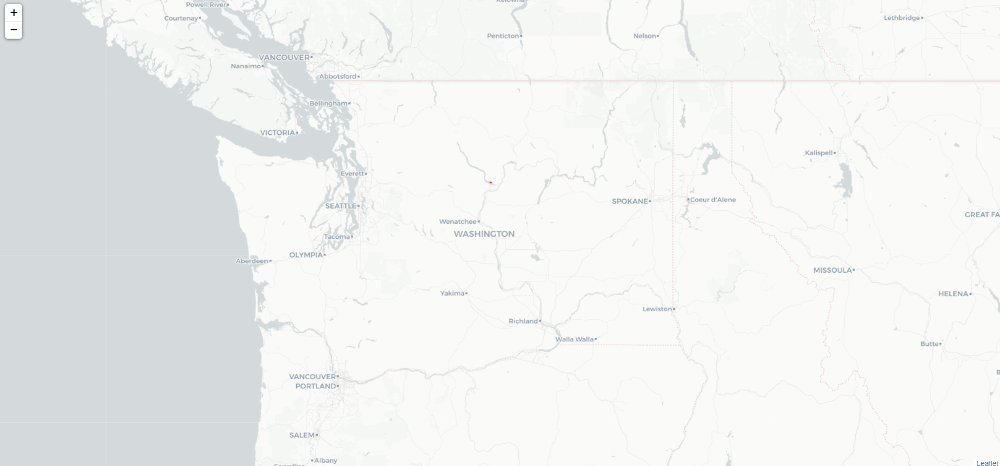
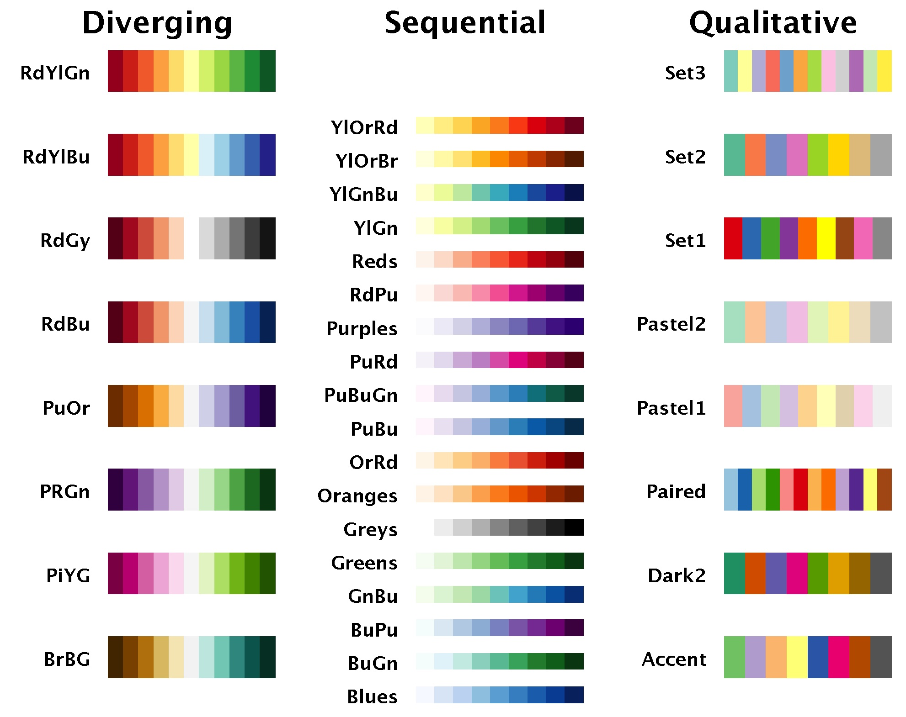
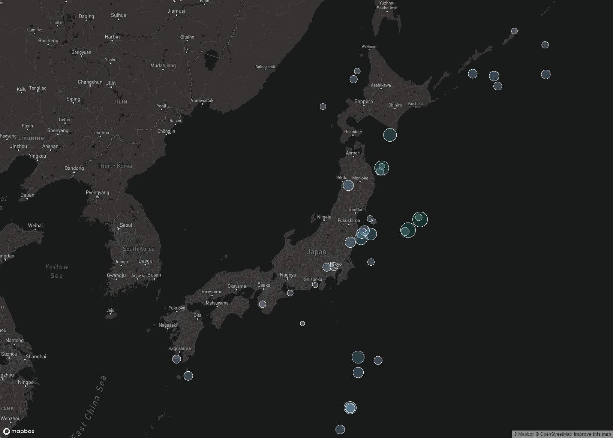

# Lab 3: Web Map Application

**Instructor:** Bo Zhao, 206.685.3846 or zhaobo@uw.edu; **Points Available** = 50

In this lab, we will design a web map application. This application is a proportional symbol map of earthquakes near Japan in 2017. When creating a web map, one crucial work is to symbolize the map elements to provide proper message about the raw data. This increases legibility for users and can give your map an appealing, custom design. An thematic map can includes base maps, thematic layers (i.e., choropleth, proportional symbols, dot density, etc), and interactive features (the components of the map that allow for user interaction). To make this map, we have gathered earthquakes taking place near Japan in September 2017. The data are from USGS earthquake catalog. Below is the web map you will make after walking through this lab handout.


To get started, please synchronize the course material to the working space of your local computer. The material for this lab is located at `[your_working_space]/geog458/labs/lab03`. Next, open the course material in VS Code.

## 1. Display the map and load geospatial data

In your IDE (VS Code, or any other alternatives you are familiar), open `map1.html` to prepare for editing.

In this file, you will see the structure of a basic HTML page.

Inside the `head` tag, we include both the latest version of `mapbox-gl-js.css` and `mapbox-gl-js.js`. After the `mapbox-gl-js.css` we add a `style` tag in order to include our customized CSS styling codes.

Inside the `body` tag, we put a `map` div tag for holding the map object. After that map `div` tag, we include a `script` tag to put the javascript codes.

```html
<!DOCTYPE html>
<html>
<head>
    <meta charset="utf-8">
    <title>Earthquakes in Japan</title>
    <meta name="viewport" content="initial-scale=1,maximum-scale=1,user-scalable=no">
    <link href="https://api.mapbox.com/mapbox-gl-js/v2.8.1/mapbox-gl.css" rel="stylesheet">
    <script src="https://api.mapbox.com/mapbox-gl-js/v2.8.1/mapbox-gl.js"></script>
    <style>
    </style>
</head>

<body>
    <div id="map"></div>
    <script>
    </script>

</body>

</html>
```

**The Script**

Inside the `script` tag,  we create a `map` as a variable to hold the mapboxgl map object. The first parameter `container` will anchor to the map element placeholder in the body element.

In the style parameter, we can also add a basemap style. Mapbox dark style (mapbox://styles/mapbox/dark-v10) is selected.

```js
mapboxgl.accessToken =
    'pk.eyJ1IjoiamFrb2J6aGFvIiwiYSI6ImNpcms2YWsyMzAwMmtmbG5icTFxZ3ZkdncifQ.P9MBej1xacybKcDN_jehvw';
let map = new mapboxgl.Map({
    container: 'map', // container ID
    style: 'mapbox://styles/mapbox/streets-v11', // style URL
    center: [-74.5, 40], // starting position [lng, lat]
    zoom: 4 // starting zoom
});
```

**Make the map full screen**

To expand the map to the full screen, we set no margin and padding of the body element, and the map element will anchor to both the top and bottom. The width of the map will occupy the whole screen.

```css
body {
    margin: 0;
    padding: 0;
}

#map {
    position: absolute;
    top: 0;
    bottom: 0;
    width: 100%;
}
```

If you are using VS code, please turn on the live server, map1 will be shown on your browser. If your VS code follows the default setting, the URL address of map1.html should be `http://127.0.0.1:5500/labs/lab03/map1.html`.



The dark color base map will enable the thematic layer stand out. If you want to change the base map, please refer to [map style collection](https://www.mapbox.com/gallery/).

## 2. Asynchronous geospatial data loading

Next, we want to add the earthquake data set to the map. In the directory `assets`, you will find a geojson file - `earthquakes.geojson`. Enter the following code snippet to add it to the map.

```javascript
map.on('load', () => {
    map.addSource('earthquakes', {
        type: 'geojson',
        data: 'assets/earthquakes.geojson'
    });

    map.addLayer({
        'id': 'earthquakes-layer',
        'type': 'circle',
        'source': 'earthquakes'
    });

});
```

The operator `=>` is a convenient way to define a function. It could also be expanded to

```javascript
map.on('load', function loadingdata() {
    ... ...
    ... ...
});
```
The map object will create a new data source `earthquakes`, and it then imports to the new `earthquakes-layer`. The default style of each earthquake is a black dot. But it will be refreshed into new styles after applying the proportional symbol strategies. You can open `map2.html` to see how the map looks like at this stage.


## 3. Proportional symbol visualization

A proportional symbol map allows the symbol for each geographical feature is proportional to a specific feature value. In this map, the radius of the dot is proportional to the magnitude of the earthquake the dot illustrates. Also, the color of each dot will also become darker when the magnitude increases.

To do so, we need to define the grades of all magnitudes, the corresponding colors and radii, and then use the sequence number of the three arrays to check the corresponding value among the grades, colors and radii. For example, when magnitudes equals to 4, which is grades[1], we can use the same sequence number i, in this case, i = 1, to look for the assigned color, colors[1] equal to 'rgb(208,209,230)' and the radius of the proportional symbol, which is radii[i] equal to 5.

```javascript
const grades = [4, 5, 6], 
      colors = ['rgb(208,209,230)', 'rgb(103,169,207)', 'rgb(1,108,89)'], 
      radii = [5, 15, 20];
```

Then, I will apply these grades, colors and radii to symbolize each dot. When determining the `circle-radius`, a zoom level is required for each of the relationship between value and radius. This feature allows a user to define multiple associations between value and radius on different zoom. In this lab, we only need to keep the relationship between value and the radius constantly. So, please put a default zoom level of the map.

Similarly, we assign corresponding color to each grade. Since other value of the circle would not be changed, so we just assign a consistent value for the stroke and opacity.


```javascript
'paint': {
    // increase the radius of the circle as the zoom level and dbh value increases
    'circle-radius': {
        'property': 'mag',
        'stops': [
            [{
                zoom: 5,
                value: grades[0]
            }, radius[0]],
            [{
                zoom: 5,
                value: grades[1]
            }, radius[1]],
            [{
                zoom: 5,
                value: grades[2]
            }, radius[2]]
        ]
    },
    'circle-color': {
        'property': 'mag',
        'stops': [
            [grades[0], colors[0]],
            [grades[1], colors[1]],
            [grades[2], colors[2]]
        ]
    },
    'circle-stroke-color': 'white',
    'circle-stroke-width': 1,
    'circle-opacity': 0.6
}
```

When determining the colors, you need some predefined color ramp to symbolize geographic features. [ColorBrewer](http://colorbrewer2.org/) is an online tool designed to help people select good color schemes for maps and other graphics. It provides three types of palettes: sequential, diverging, and qualitative.

-   Sequential palettes are suited to ordered data that progress from low to high.
-   Diverging palettes are suited to centered data with extremes in either direction.
-   Qualitative palettes are suited to nominal or categorical data.




After symbolizing the dots, we will make each dot interactive. Once clicking on the dot, the magnitude information will appear.

```javascript
// click on tree to view magnitude in a popup
map.on('click', 'earthquakes-point', (event) => {
    new mapboxgl.Popup()
        .setLngLat(event.features[0].geometry.coordinates)
        .setHTML(`<strong>Magnitude:</strong> ${event.features[0].properties.mag}`)
        .addTo(map);
});
```

Then, please open `map3.html` to see how the map looks like at this stage.


## 4. Add a Legend

Adding a legend requires quite a bit of code. The workflow to create a legend involves creating a place holder in the html, coding a legend object in order to add components, and styling the HTML with CSS. I am going to throw a bit more code at you this time, and we will walk through what it is doing. Enter the following block of code to your `script`.

**Creat a place hoder in the html**

First, we will create a place holder for the legend right after the map element.

```html
<div id="legend"></div>
```

**Coding the legend object**

```js
// create legend object, it will anchor to the div element with the id legend.
const legend = document.getElementById('legend');

//set up legend grades and labels
var labels = ['<strong>Size</strong>'], vbreak;
//iterate through grades and create a scaled circle and label for each
for (var i = 0; i < grades.length; i++) {
    vbreak = grades[i];
    // you need to manually adjust the radius of each dot on the legend 
    // in order to make sure the legend can be properly referred to the dot on the map.
    dot_radius = 2 * radius[i];
    labels.push(
        '<p class="break"><i class="dot" style="background:' + colors[i] + '; width: ' + dot_radius +
        'px; height: ' +
        dot_radius + 'px; "></i> <span class="dot-label" style="top: ' + dot_radius / 2 + 'px;">' + vbreak +
        '</span></p>');

}

const source =
    '<p style="text-align: right; font-size:10pt">Source: <a href="https://earthquake.usgs.gov/earthquakes/">USGS</a></p>';

// combine all the html codes.
legend.innerHTML = labels.join('') + source;


```

**Style with CSS**

If we save and refresh, the items you see will not make much sense. We need to use CSS to give them placement and organization on the page. The following CSS code will style our elements. Enter it between the style tags in the head of your HTML document. Like above, we will then walk through what it does.

```css

/* the layout of the legend panel */
#legend {
    position: absolute;
    bottom: 0;
    right: 0;
    width: 110px;
    background: #fff;
    margin-right: 20px;
    margin-bottom: 40px;
    padding: 10px 20px 10px 10px;
    border-radius: 3px;
    text-align: center;
}

/* each line for a break */
.break {
    position: relative;
    margin: 0px;
    padding: 0px;
}

/* basic style for a dot/circle */
.dot {
    display: inline-block;
    margin-top: 5px;
    border-radius: 50%;
    opacity: 0.6;
}

/* the label for the dot */
.dot-label {
    position: absolute;
    top: 0;
    right: 0;
    font-style: italic;
}

/* the text color of a hyper link */
a {
    color: black
}
```

We set properties for the legend using `#legend` to style the legend element. Next, we set the basic style for each symbol that includes both the symbol `dot` and the label `dot-label`. To make the color consistent, we recolor the text of any hyperlink `a` as black. Save and refresh your map. You should see your styled legend applied to your map.


It is worth noting that, creating a legend for a proportional symbol can be labor-intensive. If you look at the line `dot_radius = 2 * radius[i]`, you may wonder how I determine the dot radius on the legend would be twice as large as the dot radius on the map. Frankly speaking, I manually tested different options by times the radius with different constant value, in the end, I found out a constant number `2` would suffice. I have not found an efficient way to automate the process of determining an appropriate dot radius for the legend.

Based on my experience, an easier way starts from determining which magnitude level breaks you plan to put on the legend. Once the specific breaks have been determined, you can compare the legend dot to the map dot of the same value. For example, I first picked magnitude 6, and then multiple it by 1/3, 1/2, 3, 2. Comparing the legend dot with an dot illustrating an earthquake with Magnitude 6, finally, I found 2 would be the best number to make the two dots in equal size.  


Then, please open `map4.html` to see how the map looks like at this stage.


### 5 Change the fonts

Choosing fonts is an essential part of cartography, and an often overlooked one. Right now, our map uses the default Browser font, usually Times New Roman. To edit fonts, we want to style CSS. In CSS, there are many options for fonts; for more reading, check out the [w3schools font documentation](http://www.w3schools.com/css/css_font.asp).

Traditionally, the font is loaded into your page only if you have it on your computer. This presents a problem though, if someone does not have the font, it will change the page to use secondary or default fonts. In order to ensure that every visitor's computer displays the same, you can link to online font libraries. A standard, useful online font library is Google Fonts. Google fonts can be added to any site, and since you link to the style, you do not have to worry about the user not having the font installed on their computer. Check out the Google Font library and explore their options. Let us link a standard web font called `Open Sans` to our document so we can use it. To link it to our document, enter the following line of code into the head section of your document. It should go right after your stylesheets.

```html
<head>...
<link href="https://fonts.googleapis.com/css2?family=Open+Sans&display=swap" rel="stylesheet">
...</head>
```

Next, to style all text in our document with the `Open Sans` font, modify the `#legend` tag in the CSS (the code between the style tags). Modify the body CSS properties to look like the following, adding a font-family property after margin.

```css
#legend {
    ...
    font-family: 'Open Sans', sans-serif;
    ...
}
```

Save and refresh your map. Or open `map5.html`.  `Open Sans` will now be your preferred font for legend panel!


### 6. supplementary components

To the end, I will add a map title "Earthquakes near Japan (September, 2017)," to the top left of this map. Also, I save the javascript code to the js folder as `main.js`, the css to the css folder as `style.css`. And then link them in the html `index.html` in the header.  Below is the code snippet.

**add a place holder**

```html
<div id="title">
    Earthquakes in Japan
</div>
<div id="subtitle">
    September 2017
</div>
```

**style the titles***

```css

#title {
    position: absolute;
    top: 0;
    left: 0;
    margin-top: 20px;
    margin-left: 20px;
    font-family: 'Open Sans', sans-serif;
    font-size: 25pt;
    color: white
}


#subtitle {
    position: absolute;
    top: 0;
    left: 0;
    margin-top: 70px;
    margin-left: 190px;
    font-family: 'Open Sans', sans-serif;
    font-size: 15pt;
    color: white
}
```

**add external links**

```html
<head>
    ... ...
    <link rel="stylesheet" href="css/style.css"/>
</head>

<body>
    ... ...
    <script src="js/main.js"></script>
</body>
```

Then, please open `index.html` to see how the map looks like at this stage. Congratulatons!

## 6. Deliverable

After you successfully deploy this earthquake map, you are expected to build another thematic map of COVID-19 cases and rates in the United States.

Whenever we are working with data, it’s very important that we understand the nature of the data and the intellectual context within which it operates. In the `assets` directory of this lab, you will see a zipped file named after `us-covid-2020.zip`. After you unzipped it, you will find two set of shapefiles files: us-covid-2020-rates and us-covid-2020-counts. The COVID-19 case/death data you will be using are originally from [The New York Times](https://github.com/nytimes/covid-19-data/blob/43d32dde2f87bd4dafbb7d23f5d9e878124018b8/live/us-counties.csv). The data include all the cases in 2020. The population data used for calculating the case rates are from the [2018 ACS 5 year estimates](https://data.census.gov/cedsci/table?g=0100000US.050000&d=ACS%205-Year%20Estimates%20Data%20Profiles&tid=ACSDP5Y2018.DP05&hidePreview=true). Both data are at the county level. The U.S. county boundary shapefile was downloaded from [the U.S. Census Bureau](https://www.census.gov/geographies/mapping-files/time-series/geo/carto-boundary-file.html). The data have been processed by us in order to suit the purpose of this lab. The case rate is calculated as cases per thousand residents. When you go further into GIS, you will find that, for most of the time, you will need to process the data by yourself before actually mapping it.

For your lab deliverable, you need to create a github repository to host two thematic maps, one is a choropleth map of the covid-19 rates and the other is a proportional symbols map of covid-19 cases. If you have taken the course "Web and Mobile GIS", you must be very familiar with choropleth map making, but if you are not familiar with it, you can walk through this [step-by-step lab tutorial](https://github.com/jakobzhao/geog495/tree/main/labs/lab04) before making the choropleth map. The choropleth map should be compiled in the `map1.html` page, while the proportional symbols map should be in `map2.html`.  You are expected to submit the url of the GitHub repository to the Canvas Dropbox of this course. This url should be in the format of `https://www.github.com/[your_github_username]/[your_repository_name]`. Please make sure the name of your repository is **NOT** `lab03` or similar, use a name that can describe the theme of the map you will make.

We expect the followings for your deliverable:

- the shapefiles have been properly converted to geojson data. We expect the geojson has the right projection, the unused attributes has been deleted, the geometric shapes has been simplified (e.g., using [mapshaper](https://mapshaper.org/)(You will download a geojson type file but with a deceiving suffix '.json'. Don't worry. It will work fine!)). **(4 points)**

- for each map:
  -   use appropriate zoom level, map center, please apply "Albers" projection for this map. **(2 points per map)**
  
  -   an appropriate basemap for each map;  **(1 points per map)**

  -   a fully-functioning thematic layer for each map;  **(4 points for map)**

  -   a legend for each map;  **(4 points for map)**

  -   some interactive elements, like a clickable dot; **(3 points for map)**

  -   supplementary information, like the map title, map description, users, the data sources; **(2 points per map)**

-   write up a project description in the `readme.md` file. This file will introduce the project name, a brief introduction, links to the map, screenshots, the primary functions(especially the function which was not covered in the lectures), libraries in use, data sources, credit, acknowledgment, and other necessary information. **(6 points)**

-   synchronize this project to a GitHub repository. Make sure both maps can be properly visualized using the url `https://[your_github_username].github.io/[your_repository_name]/map1.html` or `map2.html`. (To do that, you may want to check out a previous lecture or lab handouts on how to host a repository on GitHub pages.); **(4 points)**


-   please make sure the internal structure of the files in your project repository is well organized. For example, it may be similar to the file structure below. **(4 points)**

```powershell
[your_repository_name]
    │map1.html
    │map2.html
    │readme.md
    ├─assets
    │      us-covid-2020-counts.geojson
    │      us-covid-2020-rates.geojson
    ├─css
    │      style.css
    ├─img
    │      xxx.jpg
    └─js
            main.js
```
- Finally, submit your repository URL under `Lab 3` on Canvas.


## Acknowledgement

The data has bee processed by Steven Bao, I appreciate Steven's assistance in creating the lab data.
