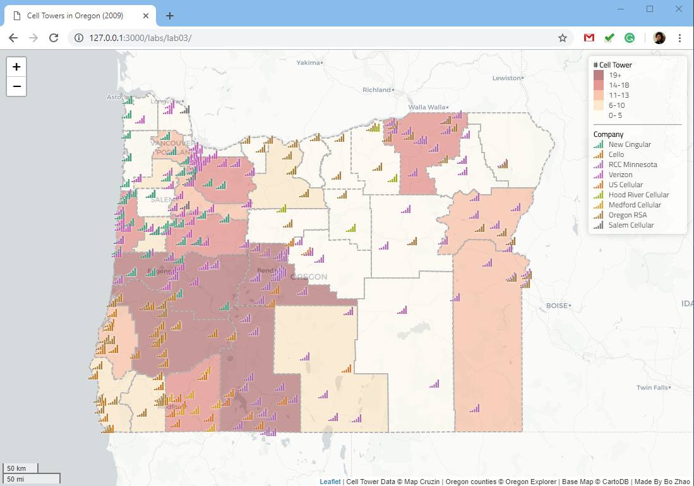
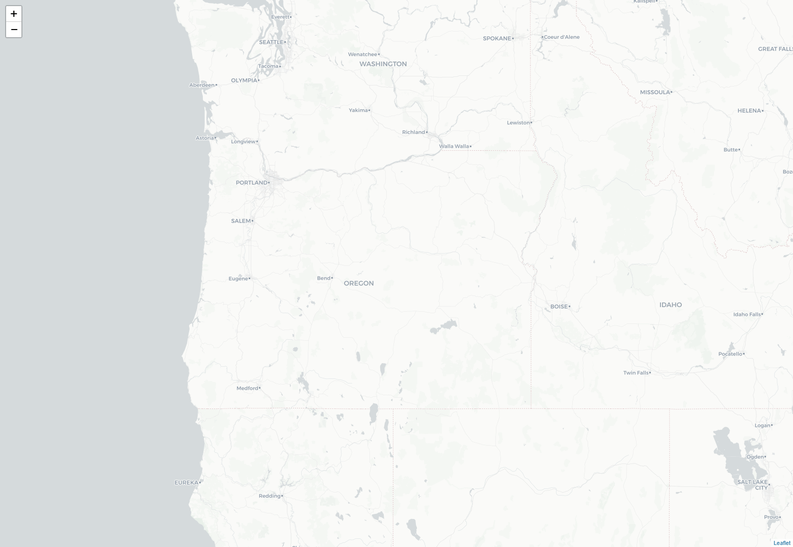
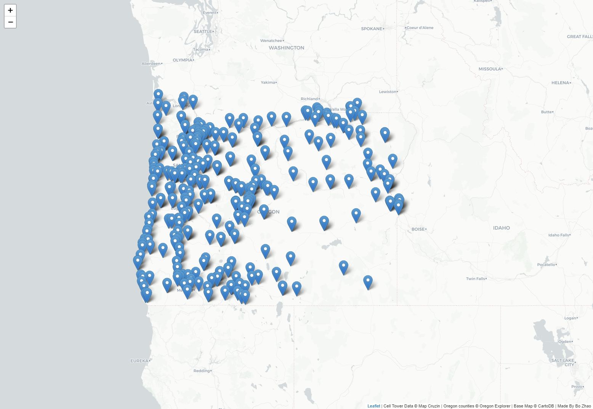
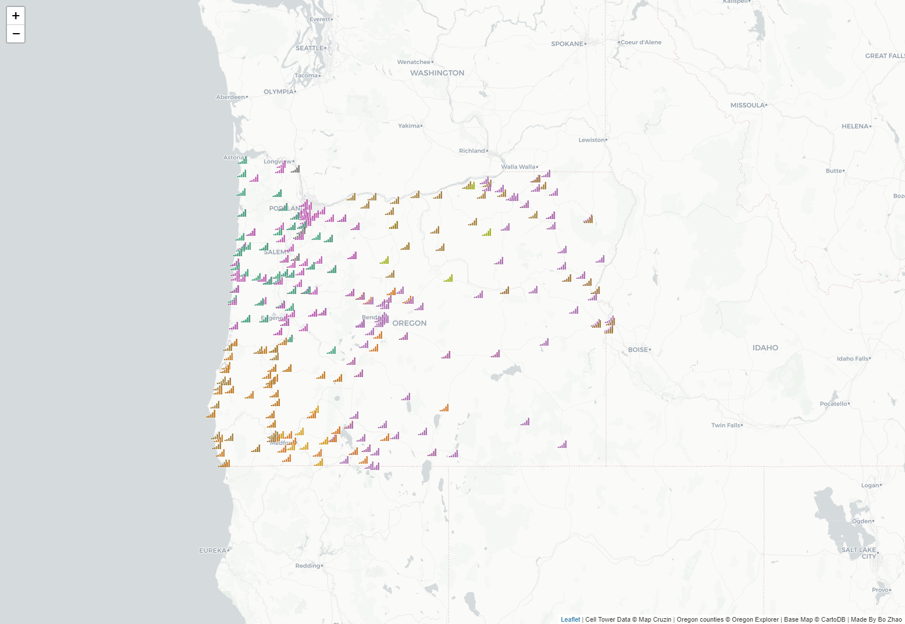
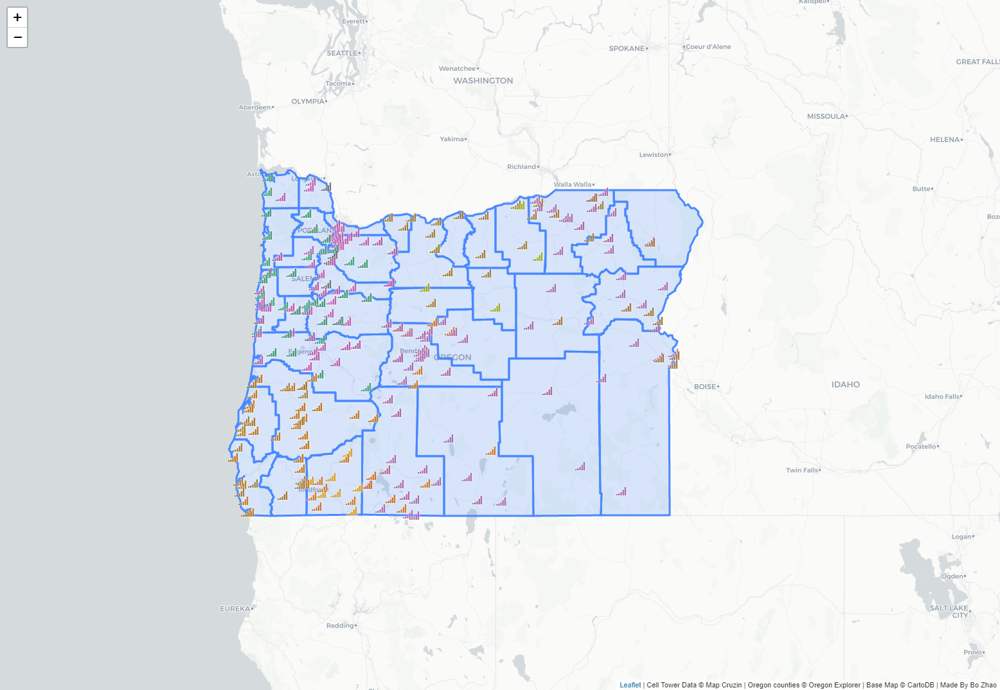
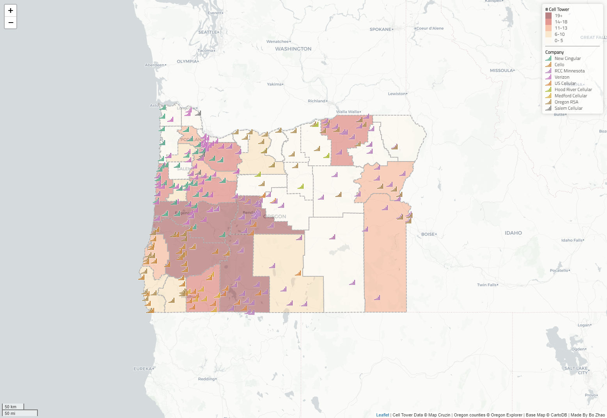

# Lab 3: Web Map Design

**Instructor:** Bo Zhao, 206.685.3846 or zhaobo@uw.edu

**Due:**  Due: May 3rd, by 11:59pm | **Points Available** = 50

In this lab, we will design an interact web map of cell towers in Oregon. When creating a web map, one of the key components is styling your elements to provide proper symbolization for your data. This increases legibility for users and can give your map an appealing, custom design. Elements that can be customized to include thematic layers (i.e., points, lines, and polygons), base maps (as a leaflet `tileLayer`), interactive features (the components of the map that allow for user interaction), and legends and supplemental information (such as credits, etc.). To do that, the county boundaries is from [Oregon Explorer](http://oregonexplorer.info), and the spatial distribution of cell towers is from [Map Cruzin](http://www.mapcruzin.com/google-earth-maps-resources/kml/us-cell.kmz). Below is the web map you will make by walking through this lab handout.



To get started, please synchronize the course material to the working space of your local computer. If you are working in the Digital Earth Lab, please synchronize your course material on the desktop directory.  The material for this lab is located at `[your_working_space]/geog458/labs/lab03`. Next, open the course material in Atom.

## 1. Set up our Map and Add Data

In your IDE (Atom), open `map1.html` to prepare for editing.

In this file, you will see a basic HTML page.

Inside the `head` tag, we include both the latest version of `leaflet.css` and `leaflet.js`. After the `leaflet.css` we add a `style` tag in order to include our customized CSS styling codes.

Inside the `body` tag, we put a `map` div tag for holding the map object. After that map `div` tag, we include a `script` tag to put the javascript codes.

```html
<!DOCTYPE html>
<html>
<head>
    <meta charset="UTF-8">
    <title>Cell Towers in Oregon (2009)</title>
    <link rel="stylesheet" href="https://unpkg.com/leaflet@1.4.0/dist/leaflet.css"/>
    <style>

    </style>
    <script src="https://unpkg.com/leaflet@1.4.0/dist/leaflet.js"></script>
</head>
<body>
<!-- Our web map and content will go here -->
<div id="map"></div>
<script>

</script>
</body>
</html>
```

**Full screen styling**

To expand the map to the full screen, we set the width and height of `html`, `body` and `#map` as `100%`, and no margin, background color as white.

```css
html, body, #map { width: 100%; height: 100%; margin: 0; background: #fff; }
```

**The Script**

Inside the `script` tag,  we create a `mymap` variable to hold the leaflet map object. The first parameter of `L.map` object `'map'` is the `id` of the div to hold the map object.

Next, we add a `tileLayer` to add a base map to the `mymap` variable.

```js
// 1. Create a map object.
var mymap = L.map('map', {
    center: [44.13, -119.93],
    zoom: 7,
    maxZoom: 10,
    minZoom: 3,
    detectRetina: true // detect whether the sceen is high resolution or not.
});

// 2. Add a base map.
L.tileLayer('http://{s}.basemaps.cartocdn.com/light_all/{z}/{x}/{y}.png').addTo(mymap);
```

If you are using Atom, please open up the atom live server, and then navigate to the map1.html. If you follow the default setting of Atom, the url address of map1.html should be `https://localhost:3000/labs/lab03/map1.html`.



The base map (in the format of `tile layer`) is provided by CartoDB. The light color stands out the principal features. If you would like to  In addition to switch to other map providers, please refer to [Leaflet providers](http://leaflet-extras.github.io/leaflet-providers/preview/).


**Add the Cell Towers Data**

Next, we want to add the cell tower data set to the map. Firstly, we need to include another Javascript library [`leaflet.ajax`](https://github.com/calvinmetcalf/leaflet-ajax) in the `head` element. This library will be used to asynchronously read `GeoJson` data.

```html
<script src="https://cdnjs.cloudflare.com/ajax/libs/leaflet-ajax/2.1.0/leaflet.ajax.min.js"></script>
```

In the directory `assets`, you will find a geojson file - `cell_towers.geojson`. Enter the following code snippet to add the cell towers to the map.

```js
// 3. Add cell towers GeoJSON Data
// Null variable that will hold cell tower data
var cellTowers = null;
// Get GeoJSON and put on it on the map when it loads
cellTowers= L.geoJson.ajax("assets/cell_towers.geojson",{
    attribution: 'Cell Tower Data &copy; Map Cruzin | Oregon counties &copy; Oregon Explorer | Base Map &copy; CartoDB | Made By Bo Zhao'
});
// Add the cellTowers to the map.
cellTowers.addTo(mymap);
```

The `cellTowers` object hold the GeoJSON data, and then it adds to the `mymap` object. Save and refresh your map. You should see the points populate. That is a lot of cell towers!

Besides, to append some credit information to the Leaflet link at the right bottom corner, we will assign the `attribute` option the credit information. as shown below.

 ```javascript
attribution: 'Cell Tower Data &copy; Map Cruzin | Oregon counties &copy; Oregon Explorer | Base Map &copy; CartoDB | Made By Bo Zhao'
 ```

Here, we add credit information about the data source and the map author's information. The map aurthor should be your name.

Then, please open `map2.html` to see how the map looks like at this stage.



## 2. Point Marker Visualization

Right now, each cell towers is visualized as the default blue marker. To differentiate the cell tower ownership by color, we will introduce how to apply a custom icon using **Font Awesome** and how to make a color scheme with **Chroma.js**.

### 2.1 Create the color scheme for markers

[**Font Awesome**](http://fontawesome.io/) allows you to add icons by CSS classes. To apply Font Awesome, you will need to include its css link in the `head` tag.

```html
<link rel="stylesheet" href="https://cdnjs.cloudflare.com/ajax/libs/font-awesome/4.7.0/css/font-awesome.css"/>
```

In addition, we will use another library `chroma.js` to colorize the icon, and utilize `$` of `jQuery` to manipulate `html` elements. [Chroma.js](https://gka.github.io/chroma.js/) is a javascript library to manipulate colors. Therefore, we need to include both `chroma.js` and `jQuery` in the `head` tag.

```html
<script src="https://ajax.googleapis.com/ajax/libs/jquery/3.1.0/jquery.min.js"></script>
<script src="https://cdnjs.cloudflare.com/ajax/libs/chroma-js/1.3.4/chroma.min.js"></script>
```

Furthermore, we also need some predefined color ramp to symbolize geographic features. [ColorBrewer](http://colorbrewer2.org/) is an online tool designed to help people select good color schemes for maps and other graphics. It provides three types of palettes: sequential, diverging and qualitative.

- Sequential palettes are suited to ordered data that progress from low to high.
- Diverging palettes are suited to centered data with extremes in either direction.
- Qualitative palettes are suited to nominal or categorical data.


> **Note:** Color palettes from Color Brewer.

We need to create a set of random colors for representing cell tower of different companies. The color should follow the qualitative palettes because this palette can better visual the nominal data. Therefore, we select the `dark2` category (as shown in the figure above). Since there are 9 cell tower types in Oregon, we will create nine different colors. To apply these colors, we dynamically build classes and then embed these classes in `style` elements.  The style classes are from `marker-color-1` to `marker-color-9`. Each class include a color `property`. Below is the code snippet.

```javascript
// 4. build up a set of colors from colorbrewer's dark2 category
var colors = chroma.scale('Set2').mode('lch').colors(9);

// 5. dynamically append style classes to this page. This style classes will be used for colorize the markers.
for (i = 0; i < 9; i++) {
    $('head').append($("<style> .marker-color-" + (i + 1).toString() + " { color: " + colors[i] + "; font-size: 15px; text-shadow: 0 0 3px #ffffff;} </style>"));
}
```

>**Note:**  Refer to the color palettes from color brewer, and try other palettes such as `Set1`, `Dark2` , etc.

### 2.2 Assign a style class to each company

Next, we will assign a style class to each type of cell tower company. The nine wireless companies are `New Cingular`, `Verizon`, `Cello`, `Salem Cellular`, etc.  We number the company name from 0 to 8, and then assign the style class (from `marker-color-1` to `marker-color-9`) to markers. If the value of `feature.property.company` is equal to "New Cingular", we set `marker-color-1` class to it, and so on so forth.

Here we use `If.. Else` statement. To do this, we can put a conditional statement to see whether the value of the `feature.property.company` variable is equal to a specific company name.  If it equals, we determine its id value, and if not, the else statement will run, setting other id value. Below is the code snippet.

```javascript
function (feature, latlng) {
    var id = 0;
    if (feature.properties.company == "New Cingular") { id = 0; }
    else if (feature.properties.company == "Cellco")  { id = 1; }
    else if (feature.properties.company == "RCC Minnesota")  { id = 2; }
    else if (feature.properties.company == "Verizon")  { id = 3; }
    else if (feature.properties.company == "US Cellular")  { id = 4; }
    else if (feature.properties.company == "Hood River Cellular")  { id = 5; }
    else if (feature.properties.company == "Medford Cellular")  { id = 6; }
    else if (feature.properties.company == "Oregon RSA")  { id = 7; }
    else { id = 8;} // "Salem Cellular"
    return L.marker(latlng, {icon: L.divIcon({className: 'fa fa-signal marker-color-' + (id + 1).toString() })});
}
```

### 2.3. Apply an Icon

We apply an icon to each marker. To apply that, you will simply link the class with the marker. Notably, an javascript object or html element can carry multiple class. In our case, a class `fa` informs that the font awesome will be applied, and another class `fa-signal` informs that an icon showing a signal will be added. And other classes `marker-color-1~9` deal with color, font-size, as well as text-shadow.

>**Note:** If you feel a little confused about the style properties of a class, please try to change the property value to some extreme numbers, and then see the differences. For example, you can change the font-size from 15 to 100, and then see what has been changed.

**Use `point to layer` option of `L.geoJson.ajax` to set the icon**

To set icons in different color, we will use the `pointToLayer` option. `pointToLayer` runs a function when the geojson data is loaded. This option enables to process each feature, and return a `L.marker` object.

```js
pointToLayer: function (feature, latlng) {
    var id = 0;
    if (feature.properties.company == "New Cingular") { id = 0; }
    else if (feature.properties.company == "Cellco")  { id = 1; }
    else if (feature.properties.company == "RCC Minnesota")  { id = 2; }
    else if (feature.properties.company == "Verizon")  { id = 3; }
    else if (feature.properties.company == "US Cellular")  { id = 4; }
    else if (feature.properties.company == "Hood River Cellular")  { id = 5; }
    else if (feature.properties.company == "Medford Cellular")  { id = 6; }
    else if (feature.properties.company == "Oregon RSA")  { id = 7; }
    else { id = 8;} // "Salem Cellular"
    return L.marker(latlng, {icon: L.divIcon({className: 'fa fa-signal marker-color-' + (id + 1).toString() })});
    }
```

> **Note:**  Two-equal signs (==)  is a very particular javascript operator. To read more, check out this documentation from `w3schools`.

**Options available for `L.geoJson.ajax` include**:

- `pointToLayer`: Function that will be used for creating layers for GeoJSON points (if not specified, simple markers will be created).
- `style`: Function that will be used to get style options for vector layers created for GeoJSON features.
- `onEachFeature`: Function that will be called on for each created feature layer. Useful for attaching events and popups to features.
- `filter`: Function that will be used to decide whether to show a feature or not.
- `coordsToLatLng`: Function that will be used for converting GeoJSON coordinates to `LatLng` points (if not specified, coordinates will be assumed to be WGS84 — standard [longitude, latitude] values in degrees).

In addition to `pointToLayer`, we will use `onEachFeature` option to set the popup.

```js
// assign a function to the onEachFeature parameter of the cellTowers object.
// Then each (point) feature will bind a popup window.
// The content of the popup window is the value of `feature.properties.company`
onEachFeature: function (feature, layer) {
    layer.bindPopup(feature.properties.company);
},
```
 Please open **map3.html** to see how the map looks like. We have changed icon to cell tower!




## 3. Polygon Visualization

In `assets` directory, you'll see another dataset  `counties.geojson`. This file stores all the counties of Oregon. Each county contains the number of cell towers; this number is pre-calculated in QGIS. To add the data to the map, create another `L.geoJson.ajax` object. Enter the following code at the end of your script, staying within the `script` tag.


```js
// create the county layer
L.geoJson.ajax("assets/counties.geojson").addTo(mymap);
```

Save and refresh your map. Counties of Oregon will be displayed on the map, symbolized in a default blue.




Let's do something about that default blue and thematically style our data to these polygons useful by turning them into a choropleth layer. The `counties.geojson` file contains numbers of cell towers in each county, calculated in QGIS.  To symbolize the counties  by the number of counties, we will use the `style` option that contains styling properties.

### 3.1 Set a sequential color palette

The first step is to set up a function to create color color classes.  One way to hard code the colors is to make the color scheme via QGIS or ArcGIS, selecting some classification rule like Jenk's Natural Breaks, and copy the break numbers as well as color value. Or you can check out a color ramp from [colorbrewer2.org](). In this lab, you will use `chroma.js` to dynamically create an array of colors. Since the number of cell tower in each county is ordered data that progress from low to high, we will use a sequential color palette `OrRd` (meaning from Orange to Red). Then, we develop a `setColor` function that returns the color value using the number of cell tower lying in a county. Add the following code snippet in the `script` tag.

```js
// 6. Set function for color ramp
colors = chroma.scale('OrRd').colors(5); //colors = chroma.scale('OrRd').colors(5);

function setColor(density) {
    var id = 0;
    if (density > 18) { id = 4; }
    else if (density > 13 && density <= 18) { id = 3; }
    else if (density > 10 && density <= 13) { id = 2; }
    else if (density > 5 &&  density <= 10) { id = 1; }
    else  { id = 0; }
    return colors[id];
}
```

### 3.2 Apply the color palette

Next, develop a function that will set the style option of  `L.geoJson.ajax()` object. We name this function `style` and it can accept a GeoJson feature. Having the feature loaded, this function sets the `fillColor` property with `setColor` function as well as an input value - `feature.properties.CT_CNT`.  Then, we add the following code snippet in the `script` element.

```js
// 7. Set style function that sets fill color.md property equal to cell tower density
function style(feature) {
    return {
        fillColor: setColor(feature.properties.CT_CNT),
        fillOpacity: 0.4,
        weight: 2,
        opacity: 1,
        color: '#b4b4b4',
        dashArray: '4'
    };
}
```

While `fillColor` and `fillOpacity` properties are for the fill; `weight`, `opacity`, `color`, and `dashArray` properties are for the border.

### 3.3 Set style option

The final step is to set the style option for the county layer. Below shows the code of adding the county polygons to the map, and also applying the style.

```js
// 8. Add county polygons
L.geoJson.ajax("assets/counties.geojson", {
    style: style
}).addTo(mymap);
```

Save and refresh the html page. Open `map4.html`  to see our styled polygons!


## 4. Map Elements

Now we add a legend to help the audience to read this map. To do that, the main Leaflet object is the `Control` object, or `L.control`. It allows for adding various elements to your map.

### 4.1 Add a Legend

Adding a legend is easy, but requires quite a bit of code. The workflow to create a legend involves creating a Leaflet control, setting the control to populate with HTML that represents the legend components, and styling the HTML with CSS so they appear properly on our screen. I'm going to throw a bit more code at you this time, and we will walk through what it is doing. Enter the following block of code to your `script`.

```js
// 9. Create Leaflet Control Object for Legend
var legend = L.control({position: 'topright'});

// 10. Function that runs when legend is added to map
legend.onAdd = function () {

    // Create Div Element and Populate it with HTML
    var div = L.DomUtil.create('div', 'legend');
    div.innerHTML += '<b># Cell Tower</b><br />';
    div.innerHTML += '<i style="background: ' + colors[4] + '; opacity: 0.5"></i><p>19+</p>';
    div.innerHTML += '<i style="background: ' + colors[3] + '; opacity: 0.5"></i><p>14-18</p>';
    div.innerHTML += '<i style="background: ' + colors[2] + '; opacity: 0.5"></i><p>11-13</p>';
    div.innerHTML += '<i style="background: ' + colors[1] + '; opacity: 0.5"></i><p> 6-10</p>';
    div.innerHTML += '<i style="background: ' + colors[0] + '; opacity: 0.5"></i><p> 0- 5</p>';
    div.innerHTML += '<hr><b>Company<b><br />';
    div.innerHTML += '<i class="fa fa-signal marker-color-1"></i><p> New Cingular</p>';
    div.innerHTML += '<i class="fa fa-signal marker-color-2"></i><p> Cello</p>';
    div.innerHTML += '<i class="fa fa-signal marker-color-3"></i><p> RCC Minnesota</p>';
    div.innerHTML += '<i class="fa fa-signal marker-color-4"></i><p> Verizon</p>';
    div.innerHTML += '<i class="fa fa-signal marker-color-5"></i><p> US Cellular</p>';
    div.innerHTML += '<i class="fa fa-signal marker-color-6"></i><p> Hood River Cellular</p>';
    div.innerHTML += '<i class="fa fa-signal marker-color-7"></i><p> Medford Cellular</p>';
    div.innerHTML += '<i class="fa fa-signal marker-color-8"></i><p> Oregon RSA</p>';
    div.innerHTML += '<i class="fa fa-signal marker-color-9"></i><p> Salem Cellular</p>';
    // Return the Legend div containing the HTML content
    return div;
};

// 11. Add a legend to map
legend.addTo(mymap);
```

Specifically, we created an instance of a  **Leaflet Control object**, calling it legend, and used the position option to tell it to locate in the top right of our map. Next, we used the `onAdd` method of the control to run a function when the legend is added. That function created a new div in the DOM, giving it a class of legend. This allowed the CSS to style everything using the legend element. In the newly created div, we are going to populate it with HTML by using a built-in JavaScript DOM method called innerHTML. Using innerHTML allows us to change the content of the HTML and add to the legend div. Using the plus-equal `+=` instead of equal `=` is the syntax for append. Every time this is used, code following is appended to existing code. In this, we write the HTML we want to use in our legend. Note, the `i` tag represents our legend icons. Within the HTML, fill in the colors and ranges so that they match our data classification. After the HTML is appended, return the div element. Lastly, add the legend to the map.

> **Note:** Instead of using innerHTML, what in jQuery can we use to do the same task?

**Use CSS to Style**

If we save and refresh, the items you see won't make much sense, we need to use CSS to give them placement and organization on the page. The following CSS code will style our elements. Enter it between the style tags in the head of your HTML document. Like above, we'll then walk through what it does.

```css
.legend {
    line-height: 16px;
    width: 140px;
    color: #333333;
    padding: 6px 8px;
    background: white;
    background: rgba(255,255,255,0.5);
    box-shadow: 0 0 15px rgba(0,0,0,0.2);
    border-radius: 5px;
}

.legend i {
    width: 16px;
    height: 16px;
    float: left;
    margin-right: 8px;
    opacity: 0.9;
}

.legend img {
    width: 16px;
    height: 16px;
    margin-right: 3px;
    float: left;
}

.legend p {
    font-size: 12px;
    line-height: 16px;
    margin: 0;
}
```

First, we set properties for the legend using `.legend` to style the legend class. We set a line height, color, font, padding, background, drop shadow, and border corner radius. Next we set our icon (`i`) tag, this should be set to float: left; so that elements will align into columns, then we set properties for the image (`img`) tag, making them the same size and giving them the same float as the icons. Lastly, we style our paragraph tag (`p`), making sure line-height is consistent with the others. Save and refresh your map. You should see your styled legend applied to your map.

### 4.2 Add a Scale Bar

The Leaflet Control object allows you to add a number of elements, including attribution and zoom controls. To add a scale bar, please enter the following line to add a scale bar to your map.

```js
// 12. Add a scale bar to map
L.control.scale({position: 'bottomleft'}).addTo(mymap);
```

Save and refresh the html page. Open `map4.html`  to see the legend and scale bar.

### 4.3 Change the fonts

Choosing fonts is an important part of cartography, and an often overlooked one. Right now, our map uses the default Browser font, usually Times New Roman. To edit fonts, we want to style CSS. In CSS, there are a lot of options for fonts, for more reading, check out the [w3schools font documentation](http://www.w3schools.com/css/css_font.asp).

Traditionally, a font is loaded into your page only if you have it on your computer. This presents a problem though, if someone doesn't have the font, it will change the page to use secondary or default fonts. In order to ensure that every visitors computer display the same, you can link to online font libraries. A common, useful online font library is Google Fonts. Google fonts can be added to any site, and since you link to the style, you don't have to worry about the user not having the font installed on their computer. Check out the Google Font library and explore their options. Let's link a common web font called `Titillium Web` to our document so we can use it. To link it to our document, enter the following line of code into the head section of your document. It should go right after your stylesheets.

```html
<head>...
<link href="https://fonts.googleapis.com/css?family=Titillium+Web" rel="stylesheet">
...</head>
```

Next, to style all text in our document with the `Titillium Web` font, modify the `.legend` tag in the CSS (the code between the style tags). Modify the body CSS properties to look like the following, adding a font-family property after margin.

```html
.legend {
    ...
    font-family: 'Titillium Web', sans-serif;
    ...
}
```

Save and refresh your map. Or open `map5.html`.  `Titillium Web` will now be your preferred font for legend panel!



## 5. Deliverable

After you successfully deploy this cell tower map, you are expected to build another web map of airports in United States. In the `assets` directory of this lab, you will see two geojson files: one is [`airports.geojson`](assets/airports.geojson), another is [`us-states.geojson`](assets/us-states.geojson).

`airports.geojson` contains all the airports in United States. This data is converted from a shapefile, which was downloaded and unzipped from https://catalog.data.gov/dataset/usgs-small-scale-dataset-airports-of-the-united-states-201207-shapefile. For each airport feature, the field `CNTL_TWR` indicates whether the airport has an air traffic control tower or not. If there is a tower, the value of `CNTL_TWR` is 'Y', otherwise 'N'. You may need to find an appropriate icon on `font awesome`. **(7 points)**

`us-states.geojson` is a geojson data file containing all the states boundaries of United States. This data is acquired from from [Mike Bostock](http://bost.ocks.org/mike) of [D3](http://d3js.org/). The `count` field indicates the number of airports within the boundary of the state under investigation. So please make a choropleth map based on the number of airports within each state.  **(7 points)**

- an appropriate basemap;  **(7 points)**
- some interactive elements, like a clickable marker; **(8 points)**
- some map elements, such as legend, scale bar, credit;  **(8 points)**
- write up a project description in the `readme.md` file. This file will introduce the project name, a brief introduction, the major functions(especially the function which was not covered in the lectures), libraries, data sources, credit, acknowledgement, and other necessary information. **(8 points)**

- you will need to synchronize this project to a github repository. And make sure the web map is accessible from a url link, which should be similar to `http://[your_github_username].github.io/[your_repository_name]/index.html`. (To do that, you may want to check out previous lecture or lab handouts on how to host repository on github pages.); **(6 points)**

> **Note:** Please make sure the name of your repository is **NOT** `lab03` or similiar, use a name which can describe the theme of the map you will make. Think about that, which one do you prefer? - showing your future employer or Ph.D. admission committee a lot of course work on github or a list of professional projects.

- please make sure the internal structure of the files in your project repository is well organized. For example, it may be similar to the file structure below. **(5 points)**

```powershell
[your_repository_name]
    │index.html
    │readme.md
    ├─assets
    │      airports.geojson
    │      us-states.geojson
    ├─css
    │      main.css
    ├─img
    │      xxx.jpg
    └─js
            main.js
```


#### Optional tasks:

- Try to add on a feature of leaflet which we have not discussed in class. The new features  can be found on [the plugin page](https://leafletjs.com/plugins.html) of leafet. **(5 points)**


## Reference

[1] Map Symbolization http://duspviz.mit.edu/web-map-workshop/map-symbolization/

[2] Data source: http://www.mapcruzin.com/google-earth-maps-resources/google-earth-cell-towers.htm

[3] Boundary: http://oregonexplorer.info/ExternalContent/SpatialDataForDownload/RCE_counties.zip

[4] Add topojson instead of geojson http://blog.webkid.io/maps-with-leaflet-and-topojson/
