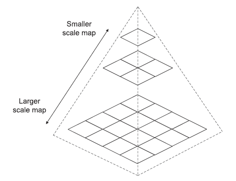
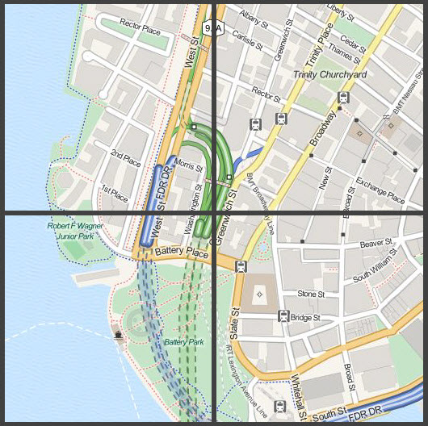
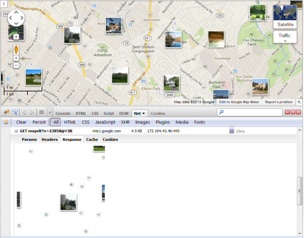
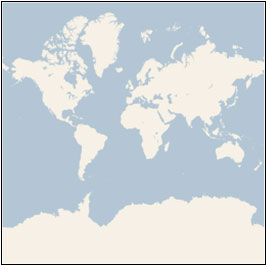
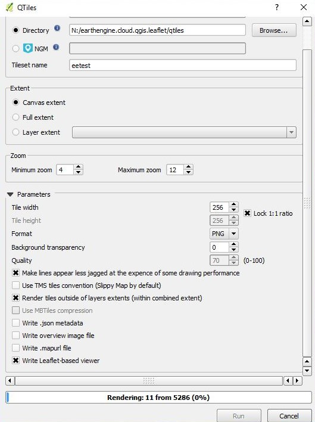

# Lab 4: Generating Map Tiles

**Instructor:** Bo Zhao, 206.685.3846 or zhaobo@uw.edu

**Due:**  May 10th, by 11:59pm | **Points Available** = 50

The earliest web maps were typically drawn on the fly by the server, no matter how many layers were available or requested. As you may have noticed, **the symbol sets and labeling choices for this type of map are relatively limited and complex to work with**. In fact, for many years, web cartographers had to build a map with minimal layer set and simple symbols to avoid hampering performance. In many cases, a cartographer was not even involved; instead, the web map was made by a server administrator tweaking SLD files that defined the layer order, symbol sizes, and so forth. This was the case with both open specification web services (like WMS) and proprietary web services (like Esri ArcIMS).

In the mid-2000s, after Google Maps, Microsoft Virtual Earth (now Bing Maps), and other popular mapping applications hit the web, **people started to realize that maybe they didn't need the ability to tinker with the properties of every single layer**. These providers had started fusing their vector layers together in a single rasterized image that was divided into 256 x 256 pixel images, or tiles. These tiles were pregenerated and stored on disk for rapid distribution to clients. This was done out of necessity to support hundreds or thousands of simultaneous users, a burden too great for drawing the maps on the fly.

The figure below shows how a tiled map consists of a "pyramid" of images covering the extent of the map across various scales. Tiled maps typically come with a level, row, and column numbering scheme that can be shared across caches to make sure that tile boundaries match up if you are overlaying two tile sets.



> Tiled web maps take the form of a pyramid where the map is drawn at a progressive series of scale levels, with the smallest (zoomed out) scales using fewer tiles.

Cartographers loved the tiled maps, because now they could invest all the tools of their trade into making an aesthetically pleasing web map without worrying about performance. Once you had created the tiles, you just had a set of images sitting on disk, and the server could retrieve a beautiful image just as fast as it could retrieve an ugly one. And because the tiled map images could be distributed so quickly by a web server, Google and others were able to employ **asynchronous JavaScript and XML (AJAX)** programming techniques to retrieve the tiles with no page blink as people panned.

> AJAX stands for Asynchronous JavaScript and XML. In a nutshell, it is the use of the `XMLHttpRequest` object to communicate with server-side scripts. It can send as well as receive information in a variety of formats, including JSON, XML, HTML, and even text files. AJAX’s most appealing characteristic, however, is its "asynchronous" nature, which means it can do all of this without having to refresh the page. This lets you update portions of a page based upon user events.
>
> The two major features of AJAX allow you to do the following:
>
> -   Make requests to the server without reloading the page
> -   Receive and work with data from the server

Within a year or two of Google Maps' release, commercial GIS software began offering the ability to build map tiles. For many, ArcGIS Server was desirable because the map could be authored using the mature map authoring tools in ArcMap; however, cost was a concern for some. [Arc2Earth](https://www.arc2earth.com/) was another commercial alternative. The free and open source [Mapnik](http://mapnik.org/) library could also build tiles, but it wasn't until recent years that projects like [TileMill](https://tilemill-project.github.io/tilemill/) wrapped a user-friendly GUI around Mapnik.



> Credit: Tiles from OpenStreetMap data, rendered by MapQuest

Tiled maps were the only model that could reasonably work for serving complex web maps to thousands of simultaneous users. However, they eliminated the ability for users to change layer order or symbols. People started working around this by serving out their general-purpose basemap layers as tiles and then overlaying a separate layer with thematic information. The general-purpose basemap tiles could be re-used in many applications. The thematic layers could also be tiled if the data did not change too quickly or cover too broad an area at large scales. For example, if you examine Google Maps with a developer tool, you will see that the basemap and the thematic layers (such as Panoramio photographs) are both retrieved as tiles.



> The thematic layer of Panoramio photos is brought into Google Maps as predrawn tiles. This is evident when viewing the layer in Firebug.

## 2. Bing Tile System

The tile system of Microsoft Bing map is one of the earliest map tile system. To illustrate how the tile system work, I will focus on the Bing Tile system in this section. Bing Maps provides a world map that users can directly manipulate to pan and zoom. To make this interaction as fast and responsive as possible, Bing chose to pre-render the map at many different levels of detail, and to cut each map into tiles for quick retrieval and display. This section describes the projection, coordinate systems, and addressing scheme of the map tiles, which collectively are called the Bing Maps Tile System.

### 2.1 Map Projection

To make the map seamless, and to ensure that aerial images from different sources line up properly, we have to use a single projection for the entire world. We chose to use the **Mercator projection**, which looks like this:



Although the Mercator projection significantly distorts scale and area (particularly near the poles), it has two important properties that outweigh the scale distortion:

1.  It’s a **conformal** projection, which means that it preserves the shape of relatively small objects. **This is especially important when showing aerial imagery**, because we want to avoid distorting the shape of buildings. Square buildings should appear square, not rectangular.
2.  It’s a **cylindrical** projection, which means that **north and south** are always straight up and down, and west and east are always straight left and right.

Since the Mercator projection goes to infinity at the poles, it doesn’t actually show the entire world. Using a square aspect ratio for the map, the maximum latitude shown is approximately 85.05 degrees.

To simplify the calculations, we use the spherical form of this projection, not the ellipsoidal form. Since the projection is used only for map display, and not for displaying numeric coordinates, we don’t need the extra precision of an ellipsoidal projection. The spherical projection causes approximately 0.33% scale distortion in the Y direction, which is not visually noticeable.

### 2.2 Ground resolution and map scale

In addition to the projection, the ground resolution or map scale must be specified in order to render a map. At the lowest level of detail `Level 1`, the map is 512 x 512 pixels. At each successive level of detail, the map width and height grow by a factor of 2: Level 2 is 1024 x 1024 pixels, Level 3 is 2048 x 2048 pixels, Level 4 is 4096 x 4096 pixels, and so on. In general, the width and height of the map (in pixels) can be calculated as:

$$
map width = map height = 256 \* 2^\\mathit{level} pixels
$$

The **ground resolution** indicates the distance on the ground that’s represented by a single pixel in the map. For example, at a ground resolution of 10 meters/pixel, each pixel represents a ground distance of 10 meters. The ground resolution varies depending on the level of detail and the latitude at which it’s measured. Using an earth radius of 6,378,137 meters, the ground resolution (in meters per pixel) can be calculated as:

$$
ground resolution = cos(latitude _ pi/180) _ earth circumference / map width \\
= (cos(latitude _ pi/180) _ 2 _ pi _ 6378137 meters) / (256 \* 2^\\mathit{level} pixels)
$$

The **map scale** indicates the ratio between map distance and ground distance, when measured in the same units. For instance, at a map scale of 1 : 100,000, each inch on the map represents a ground distance of 100,000 inches. Like the ground resolution, the map scale varies with the level of detail and the latitude of measurement. It can be calculated from the ground resolution as follows, given the screen resolution in dots per inch, **typically 96 dpi**:

$$
map scale = 1 : ground resolution _ screen dpi / 0.0254 meters/inch  = 1 : (cos(latitude _ pi/180) _ 2 _ pi _ 6378137 _ screen dpi) / (256 _ 2^\\mathit{level} _ 0.0254)
$$

> **Retina Display:**  Retina Display is a brand name used by Apple for its series of IPS panel displays that have a higher pixel density than traditional displays. Apple has applied to register the term "Retina" as a trademark in regard to computers and mobile devices. When introducing the iPhone 4, Steve Jobs said the number of pixels needed for a Retina Display is **326PPI** .
>
> **The `detectRetina` Option for LeafLet TileLayer:** If `true` and user is on a retina display, it will request four tiles of half the specified size and a bigger zoom level in place of one to utilize the high resolution. For example,

```js
L.tileLayer('nyc/{z}/{x}/{y}.png', {
  attribution: 'Generated by QTiles',
  detectRetina: true
}).addTo(map);
```

This table shows each of these values at each level of detail, **as measured at the Equator**. (Note that the ground resolution and map scale also vary with the latitude, as shown in the equations above, but not shown in the table below.)

| **Level of Detail** | **Map Width and Height (pixels)** | **Ground Resolution (meters / pixel)** | **Map Scale(at 96 dpi)** |
| ------------------: | --------------------------------: | -------------------------------------: | :----------------------- |
|                   1 |                               512 |                            78,271.5170 | 1 : 295,829,355.45       |
|                   2 |                             1,024 |                            39,135.7585 | 1 : 147,914,677.73       |
|                   3 |                             2,048 |                            19,567.8792 | 1 : 73,957,338.86        |
|                   4 |                             4,096 |                             9,783.9396 | 1 : 36,978,669.43        |
|                   5 |                             8,192 |                             4,891.9698 | 1 : 18,489,334.72        |
|                   6 |                            16,384 |                             2,445.9849 | 1 : 9,244,667.36         |
|                   7 |                            32,768 |                             1,222.9925 | 1 : 4,622,333.68         |
|                   8 |                            65,536 |                               611.4962 | 1 : 2,311,166.84         |
|                   9 |                           131,072 |                               305.7481 | 1 : 1,155,583.42         |
|                  10 |                           262,144 |                               152.8741 | 1 : 577,791.71           |
|                  11 |                           524,288 |                                76.4370 | 1 : 288,895.85           |
|                  12 |                         1,048,576 |                                38.2185 | 1 : 144,447.93           |
|                  13 |                         2,097,152 |                                19.1093 | 1 : 72,223.96            |
|                  14 |                         4,194,304 |                                 9.5546 | 1 : 36,111.98            |
|                  15 |                         8,388,608 |                                 4.7773 | 1 : 18,055.99            |
|                  16 |                        16,777,216 |                                 2.3887 | 1 : 9,028.00             |
|                  17 |                        33,554,432 |                                 1.1943 | 1 : 4,514.00             |
|                  18 |                        67,108,864 |                                 0.5972 | 1 : 2,257.00             |
|                  19 |                       134,217,728 |                                 0.2986 | 1 : 1,128.50             |
|                  20 |                       268,435,456 |                                 0.1493 | 1 : 564.25               |
|                  21 |                       536,870,912 |                                 0.0746 | 1 : 282.12               |
|                  22 |                     1,073,741,824 |                                 0.0373 | 1 : 141.06               |
|                  23 |                     2,147,483,648 |                                 0.0187 | 1 : 70.53                |

### 2.3 Pixel Coordinates

Having chosen the projection and scale to use at each level of detail, we can convert geographic coordinates into pixel coordinates. Since the map width and height is different at each level, so are the pixel coordinates. The pixel at the upper-left corner of the map always has pixel coordinates (0, 0). The pixel at the lower-right corner of the map has pixel coordinates $$(width-1, height-1)$$, or referring to the equations in the previous section,
$$(256 _ 2^{level}–1, 256 _ 2^{level}–1)$$.

For example, at level 3, the pixel coordinates range from (0, 0) to (2047, 2047), like this:


Given latitude and longitude in degrees, and the level of detail, the pixel XY coordinates can be calculated as follows:

$$
sinLatitude = sin(latitude _ pi/180)
$$
$$
pixelX = ((longitude + 180) / 360) _ 256 _ 2^{level}
$$
$$
pixelY = (0.5 – log((1 + sinLatitude) / (1 – sinLatitude)) / (4 _ pi)) _ 256 _ 2\\mathit{level}
$$

The latitude and longitude are assumed to be on the WGS 84 datum. Even though Bing Maps uses a spherical projection, it’s important to convert all geographic coordinates into a common datum, and WGS 84 was chosen to be that datum. The longitude is assumed to range from -180 to +180 degrees, and **the latitude must be clipped to range from -85.05112878 to 85.05112878. This avoids a singularity at the poles, and it causes the projected map to be square**.

### 2.4 Tile Coordinates and Quadkeys

To optimize the performance of map retrieval and display, the rendered map is cut into tiles of 256 x 256 pixels each. As the number of pixels differs at each level of detail, so does the number of tiles:

$$
map width = map height = 2^{level} tiles
$$

Each tile is given XY coordinates ranging from $$(0, 0)$$ in the upper left to $$(2^{level}–1, 2^{level}–1)$$ in the lower right. For example, at level 3 the tile coordinates range from $$(0, 0)$$ to $$(7, 7)$$ as follows:


Given a pair of pixel XY coordinates, you can easily determine the tile XY coordinates of the tile containing that pixel:

$$
tileX = floor(pixelX / 256)
$$

$$
tileY = floor(pixelY / 256)
$$

To optimize the indexing and storage of tiles, the two-dimensional tile XY coordinates are combined into one-dimensional strings called quadtree keys, or “quadkeys” for short. Each quadkey uniquely identifies a single tile at a particular level of detail, and it can be used as an key in common database B-tree indexes. To convert tile coordinates into a quadkey, the bits of the Y and X coordinates are interleaved, and the result is interpreted as a base-4 number (with leading zeros maintained) and converted into a string. For instance, given tile XY coordinates of (3, 5) at level 3, the quadkey is determined as follows:

$$
tileX = 3 = 011^2
$$

$$
tileY = 5 = 101^2
$$

$$
quadkey = 100111^2 = 2134 = “213”
$$

Quadkeys have several interesting properties. First, the length of a quadkey (the number of digits) equals the level of detail of the corresponding tile. Second, the quadkey of any tile starts with the quadkey of its parent tile (the containing tile at the previous level). As shown in the example below, tile 2 is the parent of tiles 20 through 23, and tile 13 is the parent of tiles 130 through 133:


Finally, quadkeys provide a one-dimensional index key that usually preserves the proximity of tiles in XY space. In other words, two tiles that have nearby XY coordinates usually have quadkeys that are relatively close together. This is important for optimizing database performance, because neighboring tiles are usually requested in groups, and it’s desirable to keep those tiles on the same disk blocks, in order to minimize the number of disk reads.

## 5 QGIS

QTiles is a plugin for QGIS 3. QGIS is an open source platform and is freely available. QGIS can be down loaded **[here](https://qgis.org/en/site/forusers/download.html#)**.

### 5.1 Install Plugins

#### 5.1.1 QTiles Plugin

Make sure the QTiles plugin is enabled. Click the plugins drop down menu. QTiles should be listed at the bottom. If not then click the 'Manage and install Plugins...' and add QTiles.

#### 5.1.2 QuickMapServices Plugin

Make sure the QuickMapServices plugin is installed. Check this by clicking on the Web drop down menu If you are installing QuickMapServices Plugin, you will install, and then click on the Web tab, navigate to QuickMapServies and select Settings and then the tab for More Services. Then click **'Get Contibuted Pack'**. Click 'OK' for the pop-up window and then click 'Save.' Open a Reference Map (e.g., Bing).

### 5.2 Tile Server

We now want to add our bucket from Google Cloud to the Tile Server. To do this open the browser panel in QGIS. Scroll Down to the **'Tile Server'**, right click, and click **'New Connection'**. A pop-up window should appear.

In order to enter the tile layer we will navigate back to our bucket in Google cloud. Open the bucket. We need to open the index.html file, which is the last item in the bucket. Click index.html.

A new tab opens with a map and the tiles generated from GEE. Click on the settings in the upper right (3 vertical dots). Click **'More tools'**. Then click **'Developer tools'**.

We need to open the source code. To do this make sure the source tab is selected and open the index.html so we can look at the code.

Add your tiles by right clicking the tile server, in the example here we would right click the **'eetest'**, and select add layer to add it to our map.

### 5.3 View Tiles

Add a base map and zoom on the base map to you tile location. The **'zoom to layer'** function will not work on the tiles. Make sure you turn the base map off once you have located your tiles.

### 5.4 Canvas Extent

Zoom into your tiles so that they fill most of the canvas space, see image below. The canvas is the extent we will use to generate QTiles.

### 5.5 Tile Server to QTiles

Now we need to take out tiles from Google Cloud and generate QTiles.

The raster you are working with needs to occupies the extent of the canvas (area of visualization in Qgis). Zoom in or out as needed.

Click the Plugins drop down, hover over QTiles to open the menu and select QTiles. The QTiles screen pops up.  Name the directory where you want to save your QTiles and provide a name for the Tileset. Select Canvas Extent and Zoom levels. In the Parameters make the **'Background transparency'** clear by changing the value to zero and make sure to select **'Write Leaflet-based viewer'**. Click Run.



> Note: the runtime is dependent on the size and number of zoom levels.

The file directory will contain your QTiles and an HTML document that can be integrated with leaflet.

Additional help with QTiles can be found **[here](http://felix.rohrba.ch/en/2017/easily-add-tilemap-layers-qgis/)**.

### 5.6 Navigate to QTiles folder

Navigate to the output file after QTiles finishes running. In this folder will be your sub folders of tiles arranged by zoom level and an html document, in this example it is called eetest.html.

Open the html and look at the source code. Copy the L.tilelayer variable that corresponds to your tile.

This can be inserted into a new index.html with base map code to visualize.

## 6 Leaflet

Starting with a basic leaflet html add in your tile layer that you copied in the above step. Make sure it is added to your map variable.

For web mapping and geovisualization applications, the QTiles folder generated above in QGIS should become your assets folder on github. In the code you will need to adjust absolute pathnames to relative path names.

```javascript
var mymap = L.map('map', {
    center: [0.03, 38.0],
    zoom: 7,
    maxZoom: 10,
    minZoom: 6,
    detectRetina: true // detect whether the sceen is high resolution or not.
});

// 2. Add a base map.
L.tileLayer('http://{s}.basemaps.cartocdn.com/light_all/{z}/{x}/{y}.png').addTo(mymap);


var mytile =L.tileLayer('assets/tiles/{z}/{x}/{y}.png', {
    maxZoom: 9,
    tms: false,
    attribution: 'Generated by QTiles'
}).addTo(mymap);
```


Here is what the final output looks like **[here](http://jakobzhao.github.io/geog458/labs/lab04/index.html)**

## 7 Deliverable

you will need to generate a tile set for an geographic area you are interested in. After the map tiles are generated, you will need to create a leaflet map and add up the layer of tiles to the map. And then upload everything to a github repository. In the readme.md file of this repository, please briefly introduce this tiles, the georaphic area, and the zoom levels you select.

> **Note:**  Since github repository only allows you upload a limited amount of data, so please make sure not to generate too many tiles by limiting the boundingbox or the scale range.

The structure of this repository should look like:

```powershell
[your_repository_name]
    │readme.md
    │index.html
    ├─assets
    │      [tile set name]
    │         XXX
    │         XXX
```

## Extended Readings

-   Vector Tiles: <http://docs.geoserver.org/latest/en/user/extensions/vectortiles/tutorial.html>
-   3D Tiles: <https://github.com/AnalyticalGraphicsInc/3d-tile>

## References:

1.  <https://www.e-education.psu.edu/geog585/node/706>
2.  <https://docs.microsoft.com/en-us/bingmaps/articles/bing-maps-tile-system>
