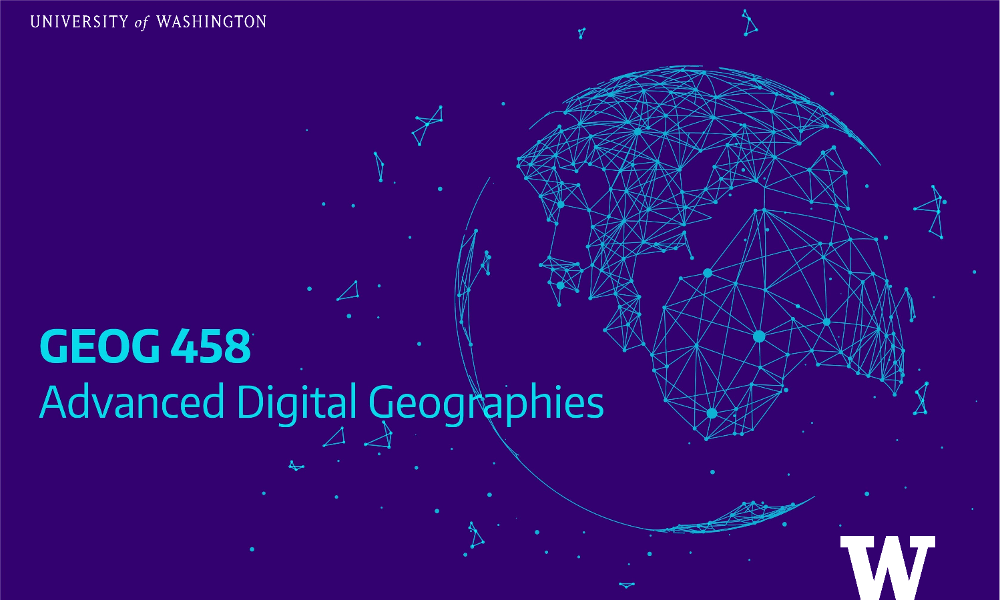

# GEOGRAPHY 458: Advanced Digital Geographies

**Incoming Events:**
- **Final Essay Due**: Friday, March 12th by 11:59pm PST, [The requirement](https://github.com/jakobzhao/geog458/blob/master/project/essay.md)
- **Final Project Presentation**: Tuesday, March 16th, 4:30 to 7:30 PM PST. `Please fill the sign-up form and check the zoom meeting link.`
- **Final Project Due**: Friday, March 19th by 11:59pm PST, [The requirement](https://github.com/jakobzhao/geog458/blob/master/project/project.md)

> Making an appointment with the instructor at [here](https://calendar.google.com/calendar/u/0/selfsched?sstoken=UUZvU2gxXzVlZnZpfGRlZmF1bHR8NzM4ODA5MzUyNjAxZDU2Y2ViNTZiMzk2ZmM0N2VmNzI).

**Meetings:**

-   **Lectures:** Tuesdays and Thursdays 11:30 AM to 12:50 PM PST on [Zoom](https://washington.zoom.us/meeting/register/tJcuf-ippzIrHNA1U1xoZDe7CR9ktaTTaAwU)
-   **Labs/Reading Discussions:** Wednesdays and Fridays 10:30 AM to 12:20 PM PST on [Zoom](https://washington.zoom.us/meeting/register/tJYrdumgqDsiHNXZDEg_YelFbX8_67eMyPlK)

**Personnel:**

-   **Bo Zhao**, Instructor, zhaobo@uw.edu | Office Hour: Thursdays 1:10 to 3:10 PM PST on [Slack](https://geog458-winter-2021.slack.com) and [Zoom](https://calendar.google.com/calendar/u/0/selfsched?sstoken=UUZvU2gxXzVlZnZpfGRlZmF1bHR8NzM4ODA5MzUyNjAxZDU2Y2ViNTZiMzk2ZmM0N2VmNzI) or by appointment

-   **Tyler McCrea**, Teaching Assistant, tmccrea@uw.edu |  Office Hour: Fridays 12:30 to 1:30 PM PST on [Zoom](https://washington.zoom.us/j/4874322240 (Links to an external site.) ) or by appointment

> _This web page is the syllabus - There is no printed version, please refer here instead. Make sure refer to this page as often as possible. Also, Feel free to ask the instructor for clarifications whenever needed._

As digital technologies have radically transformed human life, this course tries to engage students in this digitally mediated and data-intensive geographic world, and also train them the timely technical skills which are demanding in emerging job markets. This course will provide a unique opportunity to explore emerging digital methods, to build a holistic solution to real-world problems, and to critically analyze their social implications. Rather than focusing exclusively on one or two specific topics, this course covers a full range of theoretical perspectives and practical exercises. The course begins with teaching students on geospatial project management using GitHub, and then a series of geospatial data operations and analyses are covered in detail, such as online data (e.g., geotagged tweets) acquisition, geocoding, and geospatial analyses. With these preparations, this course switches to online geovisualization. After a brief introduction to web programming basics (e.g., JavaScript, Html, and CSS), students will learn how to visualize and narrate geographic phenomena in an online environment. A few state-of-the-art approaches and applications in digital geographies will be practiced, such as collecting aerial imagery and point clouds using an unmanned aerial vehicle (UAV, commonly known as drone) or LiDAR, as well as storing real-time data from an environmental sensor. Throughout this quarter, students will not only learn and practice geospatial techniques which are important to many emerging jobs, but also hone their critical intellectual visions on the social implications of the applied techniques.

This course is very “hands-on” and interactive! Most of our time will be spent in a hybrid lecture/lab where students will be working together. Although there will be some individual written reflections and analyses, no formal final exam will be set up. The final project enables students to figure out a holistic solution to a real-world problem. With the completion of this course, each student can share the course work at a self-made website which can be publicly viewed by classmates, open-source community as well as future industrial recruiters. Along the way, the readings will include both applied and theoretical selections. Students will learn not only how people have been programming and visualizing, but also about how critical social theorists have identified assumptions, ideologies, and rigidities in existing practices that can help students to make effective, inclusive and empathetic decisions in today’s data-intensive geographic world.

## :flags: Learning Objectives

-   To identify when and how the methods, sociology, and objects of geographical inquiry can be transformed through computational and networked approaches.

-   To learn to find, evaluate, use, extend, and combine various methods and tools of digital geography as needed for a given task. Examples of such tools have included: GitHub, QGIS, Python, JavaScript, and Mapbox.

-   To practice and reflect theoretically upon emerging born-digital, multi-modal, narrative, and interactive approaches to cartography and scholarly communication.

-   To reflect on the iterative and social dimensions to one’s own learning process.

-   To think critically about the technologies used in digital scholarship, including the material, social, and political implications of digital tech development, maintenance and utilization.

-   To discern, through investigation, the relationship between space, technology, and society through critical engagement with practical and theoretical digital geographies methods.

## :calendar: Weekly Schedule

#### Preparation: [**Gear up the working environment**](assets/gearup.md) :computer:  :beer:

#### Weekly Expectations:

-   You should try to attend both lecture and lab sections each week.
-   You should complete all weekly readings before the Friday Lab sections, and submit weekly think pieces by Thursday @ 5 pm PST (further instructions below)

### Week 1: Intro to digital geographies

<!-- Jan 4 to 8 -->

This week’s lecture and lab will prepare you for the course, and provide a theoretical and technical foundation to build from. We’ll work through the syllabus together, and answer any questions you all may have. Each student is expected to read the Ash et al (2018) paper. After completing Lab 1, you will be able to clone/synchronize the course material, set up a personal website, and gain practical experience using github to manage your digital geographies projects.

-   **Lecture Notes:** [Syllabus](readme.md), [Intro to the Web](weeks/week01/intro-web)
-   **Readings:** a) [Digital turn, digital geographies?](https://drive.google.com/open?id=14HybNKsIik6oqefSpd-wAsKBF5lScwT_), b) [Critical Atlas of the Internet](https://louisedrulhe.fr/internet-atlas/), c) [Mastering Markdown](https://guides.github.com/features/mastering-markdown/), and d) [extended readings](weeks/week01/readings.md).
-   **Think Piece 1:** [Think Piece Canvas Link](https://canvas.uw.edu/courses/1434645/discussion_topics/6000366) `Due: Jan 7th, by 5:00pm`
-   **Lab 1:** [Project management using GitHub](labs/lab01) `Due: Jan 16th, by 11:59pm`

### Week 2: Programing fundamentals

<!-- Jan 11 to 15 -->

This week we’ll focus on providing you all with the fundamental skill set for web programming.  We will begin with an overview of the system architecture required for a digital geographies project,  then guide you through some of the essential front-end fundamentals. Including, internet basics, html, javascript, and css. This week requires a lot of self-learning,  and includes fairly lengthy readings and practical exercises. Please be prepared.

-   **Lecture Notes:** [System architecture](weeks/week02/architecture), [intro-to-html, css](weeks/week02/html-css) and [javascript](weeks/week02/javascript), and [Jquery](weeks/week02/jquery).
-   **Readings:** a) [W3School Tutorials on Html, javascript, css and jquery](weeks/week02/tech-readings.md), b) [Introducing Code/Space](https://drive.google.com/file/d/1T7ChuOnaKrgjTVhAeV_Niei2pqCWiiqK/view?usp=sharing), c) [Cloud Ethics: Algorithms and the Attributes of Ourselves and Others](https://drive.google.com/file/d/1C3925q917K7cD8-NEbw_Yik_X0oCeSfd/view?usp=sharing), and d) [extended readings](weeks/week02/readings.md).
-   **Think Piece 2:** [Think Piece Canvas Link](https://canvas.uw.edu/courses/1434645/discussion_topics/6000368) `Due: Jan 14th, by 5:00pm`

### Week 3 : Geospatial data

<!-- Jan 18 to 22 -->

This week’s focus is on processing geospatial data for your digital geographies projects. We will begin by introducing the structure of the geojson format, and then look at techniques for collecting, converting and visualizing geojson objects/features in a web or desktop environment such as QGIS. After completing Lab 2, students will have learned how to collect geo-tagged tweets using specific keywords/topics (e.g., etc.), and methods for visualizing the spatial distribution of the locations for those tweets.

-   **Lecture Notes:** [Geospatial data for digital geographies](weeks/week03/readme.md)
-   **Readings:** a) [Can social media clear the air? A case study of the air pollution problem in Chinese cities](https://drive.google.com/open?id=1C0MTPaPnVALVemeYEfiDChUKRZfcMjz3), b) [Putting Data back into Context](https://datajournalism.com/read/longreads/putting-data-back-into-context), c) [More than you ever wanted to know about GeoJSON](weeks/week03/assets/geojson.pdf), and d) [extended readings](weeks/week03/readings.md).
-   **Think Piece 3:** [Think Piece Canvas Link](https://canvas.uw.edu/courses/1434645/discussion_topics/6000371) `Due: Jan 21st, by 5:00pm`
-   **Lab 2:** [Geo-tagged tweet collection and visualization](labs/lab02) `Due: Jan 29th, by 11:59pm`

### Week 4 : Web mapping

<!-- Jan 25 to 29 -->

This week you will be making your first web map of the quarter using the popular web mapping library - [Leaflet](https://leafletjs.com/) The lecture section this week we’ll work together familiarizing everyone with the basics of web mapping, and then provide a detailed introduction to the Lab 3 exercise.

-   **Lecture Notes:** [Leaflet Basics](weeks/week04/leaflet) and [Map Events](weeks/week04/mapevent).
-   **Readings:** a) [Digital Mapping and Segregation](https://www.forbes.com/sites/drsarahbond/2017/10/20/how-is-digital-mapping-changing-the-way-we-visualize-racism-and-segregation/#4df35c7d33fa), b) [Hacker Cartography](https://drive.google.com/file/d/1H76GJFXwS5dOPZYyxfyuud0DGQzYGNIr/view?usp=sharing), and c) [extended readings](weeks/week04/readings.md).
-   **Think Piece 4:** [Think Piece Canvas Link](https://canvas.uw.edu/courses/1434645/discussion_topics/6000373) `Due: Jan 28th, by 5:00pm`
-   **Lab 3:** [Web map application](labs/lab03) `Due:Feb 12th, by 11:59pm`,  Example: [Oregon Water Atlas](http://oregonwater.info/atlas.html)
-   [An intergrative web mapping template](https://jakobzhao.github.io/geog458/weeks/week04/starter/index.html)

### Week 5 : Map design

<!-- Feb 1 to 5 -->

-   **Lecture Notes:** [BaseMap design using Mapbox Studio](https://docs.mapbox.com/studio-manual/overview/) and [Mockup for web mapping project](weeks/week05/mockup/readme.md)
-   **Readings:** a) [The Guide to Map Design](weeks/week05/mapbox-design.pdf), b) [Intro to Critical Cartography](https://drive.google.com/file/d/1IEz_9J4vH6foIrV36wDoIovOYNomZBWj/view?usp=sharing), c) [Mapbox Studio How-to Videos](weeks/week05/readme.md), and d) [extended readings](weeks/week05/readings.md).
-   **Think Piece 5:** [Think Piece Canvas Link](https://canvas.uw.edu/courses/1434645/discussion_topics/6000375) `Due: Fed 4th, by 5:00pm`
-   **Lab 4:** [Map Design and Tile Generation](labs/lab04) `Due: Feb 19th, by 11:59pm`
-   **Online Mid-term:** `Feb 2nd 11:30 AM - 12:50 PM` [_Study Guide_](assets/midterm_studyguide.md)

### Week 6 : Smart dashboards

<!-- Feb 8 to 12 -->

-   **Lecture Notes:** [Create a smart dashboard](weeks/week06/), Examples: [COVID-19 Dashboard](https://hgis.uw.edu/virus)
-   **Readings:** a) [The praxis and politics of building urban dashboards](https://drive.google.com/file/d/1l3V1drqXMxn9rib7nTuDtxJC5YcWL0pY/view?usp=sharing), b) [History of the Urban Dashboard](https://placesjournal.org/article/mission-control-a-history-of-the-urban-dashboard/), c) [3 Ways Data Dashboards Can Mislead You](https://hbr.org/2017/01/3-ways-data-dashboards-can-mislead-you#comment-section), d) [Dynamic Charts](https://c3js.org/examples.html), and e) [extended readings](weeks/week06/readings.md).
-   **Think Piece 6:** [Think Piece Canvas Link](https://canvas.uw.edu/courses/1434645/discussion_topics/6000376) `Due: Feb 11th, by 5:00pm`

### Week 7 : Geo-Narratives

<!-- Feb 15 to 19 -->

This week we will explore the concept of geo-narrative, the use of storytelling in mapping practice, by looking at existing geo-narrative mapping projects and engaging in a group discussion and map critique.

-   **Lecture Notes:** a) [A Geo-Narrative Template](weeks/week07/), b) [Planning and outlining your story map](https://www.esri.com/arcgis-blog/products/arcgis-storymaps/sharing-collaboration/planning-and-outlining-your-story-map-how-to-set-yourself-up-for-success/). Exaples: a) [Oregon Atlas](http://oregonwater.info/atlas.html), b) [Stand with #Standing Rock](https://jakobzhao.github.io/standwithstandingrock/)
-   **Readings:** a) [Affective Geovisualisations](https://drive.google.com/file/d/1aqMFkewNT9s9nrAecAVYiaBAbtCrf7xj/view?usp=sharing), b) [Anti-Eviction Mapping Project Handbook](https://static1.squarespace.com/static/52b7d7a6e4b0b3e376ac8ea2/t/5bc76571b208fc10defc815a/1539794295823/AEMP+Handbook.pdf), c)[extended readings](weeks/week07/readings.md).
-   **Think Piece 7:** [Think Piece Canvas Link](https://canvas.uw.edu/courses/1434645/discussion_topics/6000379) `Due: Feb 18th, by 5:00pm`

### Week 8 : Emerging topics

<!--(Feb 22 to 26) -->

This week will focus on two emerging topics related to digital geographies, including cloud point visualization and real-time environment data collection, and explore their promise and pitfalls.

-   **Lecture Notes:** [Point cloud (Lidar Data) visualization](https://jakobzhao.github.io/sfm/index.html), [sample data](https://github.com/ucdavis/metashape) and [Real-time environmental data visualization](weeks/week08/rpi-iot).
-   **Readings:** a) [Real-time GIS](https://drive.google.com/file/d/1COD2OYBxEJThG5Lfx7-nzV0EGtGedndT/view?usp=sharing), b) [Anatomy of an AI System](https://anatomyof.ai/), c) [Abolishing Racist Police Algorithms](https://www.technologyreview.com/2020/06/05/1002709/the-activist-dismantling-racist-police-algorithms/), and d) [extended readings](weeks/week08/readings.md).
-   **Think Piece 8:** [Think Piece Canvas Link](https://canvas.uw.edu/courses/1434645/discussion_topics/6000381) `Due: Feb 25th, by 5:00pm`

### Week 9 & 10 : Project studios

<!-- Mar 1 to 12 -->

During these two weeks, each group will focusing on their final projects and essay. The instructor and teaching assistant are available during the normal lecture period, lab sections and office hours if help is needed. Below are some resources for you to develop your final project.

[Request an individual meeting with the Instructor via Zoom](https://calendar.google.com/calendar/u/0/selfsched?sstoken=UUZvU2gxXzVlZnZpfGRlZmF1bHR8NzM4ODA5MzUyNjAxZDU2Y2ViNTZiMzk2ZmM0N2VmNzI)

- **Final Project Milestones:**
  - Draft a project proposal
    - a) Content inventory
    - b) Project Type (web mapping, dashboard, geo-narrative, etc.)
    - c) Creat a GitHub repo for project management
    - d) Save the item a) and b) to the `readme.md`
  - `Optional` Project mockup:
    - a) [Web mapping](https://www.figma.com/file/USVi3eiJjhaUoHEcl3ryiR/Damron-Seattle-mockup)
    - b) [Smart Dashboard](https://www.figma.com/file/Dm30UzxUlOlw6XrjMaPh1c/Covid-Workers-Dash?node-id=0%3A1)
    - c) [GeoNarrative](https://www.figma.com/file/gxADc3Bjrrr1GtubAD6paz/CoPe-Geonarrative-1-Mockup)
  - Initialize the project using a template
    - a) [web mapping template](weeks/week04/starter)
    - b) [smart dashboard](weeks/week06/)
    - c) [geonarrative](weeks/week07)
    - d) feel free to create/use your own template.
  - Geospatial data gathering
    - a) data to the `assets` folder
    - b) save data inventory to the `readme.md`.
    - resources: [Washington State Data](https://wagda.lib.washington.edu/data/geography/wa_state/), [UW Geospatial data Archives](https://guides.lib.uw.edu/research/gis)
  - Map designs
    - a) Basemaps:
      - [cartodb free tiles](https://github.com/CartoDB/basemap-styles)
      - [leaflet-provider preview](https://leaflet-extras.github.io/leaflet-providers/preview/)
      - customized tiles by MapBox studio
    - b) Thematic layers: Design them through Q or Arc, and then coding them using the Leaflet library.
    - c) Save the map layer list to the `readme.md`
  - Miscellanenous items
    - a) multimedia: [Unsplash `image only`](https://unsplash.com/), [Pixabay](https://pixabay.com/), and [Pexels](https://www.pexels.com/)
    - b) icons: [Font Awesome](https://fontawesome.com/v4.7.0/icons/), [Bootstrap icons](https://icons.getbootstrap.com/)
    - c) web fonts: [Google Fonts](https://fonts.google.com/)
    - d) `optional` Favicon: [Favicon Generator](https://realfavicongenerator.net/)
    - e) Save the multimedia inventory to the `readme.md`
  - Coding and debugging
  - Presentation and peer-review:
    - Presentations in the lecture meetings in the finals week
    - Each student needs to review at least five final projects
  - Fine-tuning and submission

### Finals Week : Final project presentations

<!-- Mar 15 to 19 -->

During the last two meeting sessions, each group will present their final projects. More information about final project will be shared after the mid-term.

## :bell: Course Requirement

**Student Tech Support:**

The Student Tech Loan Program is expanding as quickly as possible. We announced this to undergrads as soon as it hit the airwaves, in hopes some of them who need hardware can reserve for spring quarter. They expect new/additional machines to arrive in April. STLP Website: <https://stlp.uw.edu/> (check the [Spring Announcement](https://drive.google.com/file/d/1qlbUBPdQFJt_jXS2fAOtORwNrBVtZqCb/view)).

**GitHub:** This course material will be hosted on GitHub instead of UW Canvas. On this dedicated GitHub repository, you can find most of the course material, participate in group discussions by submitting GitHub issues, and create new GitHub repositories to turn in the lab deliverables. By the end of this quarter, you will be more proficient in operating a cloud-based coding environment and able to host your work online as a way to gain public and peer attentions.

**Labs:** You need to finish all four labs by the due date. In order to help you work on each lab, we will walk through most of the labs in class.

**Think Pieces:** for week 1 to 8, there will be weekly reading assignments. To evaluate your reflection upon each week's reading material, we set up a discussion board for each week. You need to submit think pieces to **3** out of the 8 weeks' discussion topics. Your think pieces should be completed by Thursday @ 5 pm PST for the weeks you are submitting a piece. Your think pieces should be at least 350 words and engage substantially with the reading materials, and connections to the lab assignements and lectures. Guiding questions or prompts will be included in each week's discussion section on canvas to help frame your thinking. Submit your think pieces on Canvas in the applicable week's discussion section (https://canvas.uw.edu/courses/1434645/discussion_topics).

**Participation in in-class discussion:** Complete all assigned readings and get familiar with the lab instructions before class meetings, and actively participate in critical discussions of those readings. You should have completed all of the weekly readings before our Friday lab sections as these sections will be devoted to critical discussion and engagement with the required readings.

**Individual Final Project:** Considering the difficulty of working as a team when you cannot meet each other in person, I have decided to change the final collaborative project as individual base, and cancel lab 5. So, at the end of this quarter, you only need to submit this final project. check out  [the detailed requirement for final project](project/project.md)

**Essay:** Each student will complete an essay that engages with the readings and the course themes, along with additional readings that you bring into conversation with the assigned course readings. You are aiming for ~~10 pages (double-spaced)~~ **no less than 1500 words** coalescing around ideas and readings from this quarter. Essay is due no later than the end of **Week 10**. Check out [the detailed requirement for essay](project/essay.md).

## :two_men_holding_hands: Targeted Audience

This course targets students who have a background in fundamental geographic information science or equivalent computational or programming skills. This course is designed for students who are willing to learn defined GIS skills that will be important to many emerging jobs in location-based services, autonomous driving, web mapping, geographic data collection (using drone or LiDAR) and analyses. This course is also suitable for students who are interested in learning and critically reflecting upon cutting-edge geospatial techniques.

## :heavy_check_mark: Grading

| Grading items   | %   |
| --------------- | --- |
| Participation   | 5%  |
| Think Pieces    | 15% |
| Lab Assignments | 30% |
| Mid-term        | 25% |
| Final project   | 15% |
| Essay           | 10% |

> The item `participation` includes your participation in the class (e.g., self-introduction, answer questions in class, etc.) and/or your response on GitHub issues (ask questions via GitHub issue, and help your classmates using the GitHub issues function). As well as participation in the weekly lab/discussion sections.

## :love_letter: Accommodations

We welcome the opportunity to work with any students with disabilities in this class to ensure equal access to the course. If you have a letter from Disability Resources for Students (DRS) outlining your academic accommodations, please present the letter to me (or email us, to confirm, if the letter is electronic) as soon as possible so that we can discuss the accommodations you may need for this class. Any discussions between student and professor need to occur as early as possible in order for adequate arrangements to be made. If you do not yet have a letter from DRS, but would like to request academic accommodations due to a disability, please contact DRS [here (Links to an external site.)](https://depts.washington.edu/uwdrs/), or in-person at 011 Mary Gates Hall, or at 206-543-8924 (Voice & Relay), <mailto:uwdrs@uw.edu>.

 Washington state law requires that UW develop a policy for accommodation of student absences or significant hardship due to reasons of faith or conscience, or for organized religious activities. The UW’s policy, including more information about how to request an accommodation, is available at [Religious Accommodations Policy](https://registrar.washington.edu/staffandfaculty/religious-accommodations-policy/). Accommodations must be requested within the first two weeks of this course using the [Religious Accommodations Request form](https://https:/registrar.washington.edu/students/religious-accommodations-request/).

## :book: Copyright

 This course advocates for the open culture. The course materials are open source for both students and open source community to access.

 Notably, **students are not allow to videotape or audio-tape (record) this class in any form, and sharing recordings outside of class without the written consent of each student in the class is not permitted by [FERPA](https://registrar.washington.edu/students/ferpa/).** However, I will try to record most of the classes via Zoom and share them via Canvas. Even so, I still encourage each of you attend the lectures instead of watching the recorded videos afterwards. Your in-class participation is a key factor to yield the best learning outcome.

 The instructor determines if their class can and cannot be recorded. This decision should be clearly communicated by the instructor at the beginning and throughout the quarter. In Zoom, the recording feature can be controlled by the instructor, as the meeting host.

## :bouquet: Acknowledgement

 The development of this course has been financially supported by UW's data science minior committee. This course is largely based upon material designed with Tyler McCrea, and also I sincerely appreciate Jou Ho, Fengyu Xu for their assistances in developing this course.
