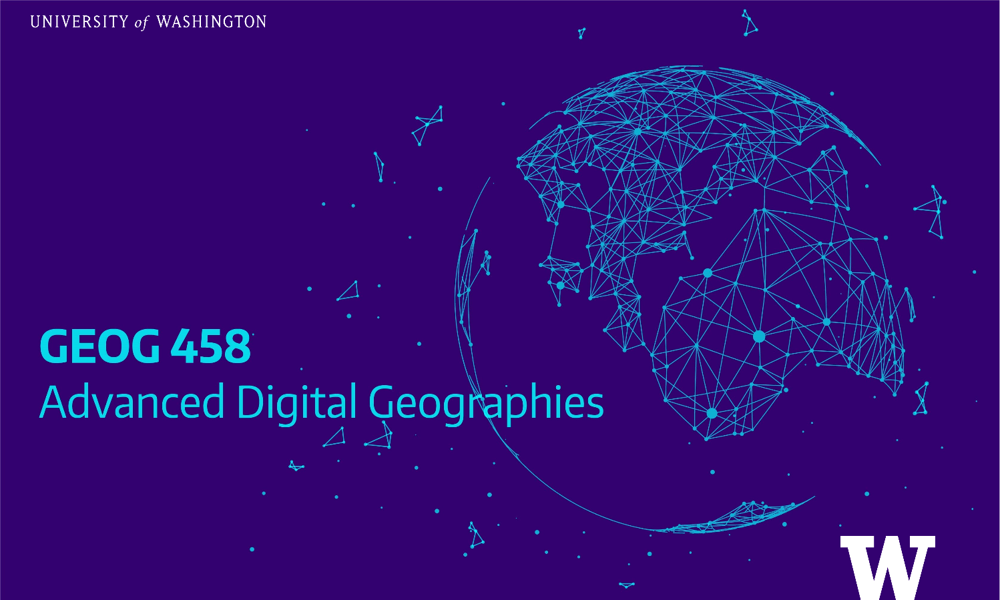
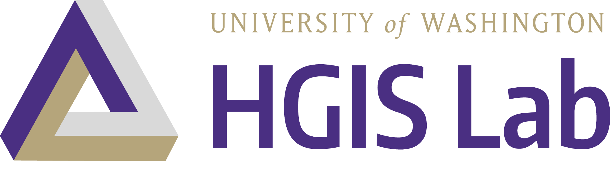

# GEOGRAPHY 458: Advanced Digital Geographies

**Hyperlinks:** [**`Weekly Schedules`**](#calendar-weekly-schedule) &nbsp;&nbsp;&nbsp;&nbsp; [**`Course requirement`**](#bell-course-requirement) &nbsp;&nbsp;&nbsp;&nbsp; [**`Final Project Guideline`**](project/readme.md) &nbsp;&nbsp;&nbsp;&nbsp; [**`# of In-Class Questions`**](https://docs.google.com/spreadsheets/d/1J-4tYBIqb2ag-5oiQ_pnH28JamI8KlWqThPM2kir328/edit?usp=sharing)

**Meetings:**

- **Lectures:** Tuesdays and Thursdays 4:30 PM to 5:50 PM PST at SMI 205
- **Labs:** Wednesdays at SMI 401, AA: 12:30 PM to 1:20 PM, AB: 1:30 PM to 2:20 PM, AC: 2:30 PM to 3:20 PM, AD: 3:30 PM to 4:20 PM

**Personnel:**

- **Bo Zhao**, Instructor, zhaobo@uw.edu | Office Hour: Thursdays 2:30 to 4:20 PM by appointment. Make an appointment [here](https://calendar.app.google/XQZxdQyNwYfip75f9).

- **Liz Peng**, Teaching Assistant, lp36@uw.edu |  Office Hour: Tuesdays 2:30 to 4:30 in SMI 430. It is recommended to send me an email or canvas message briefly describing your question(s) before your visit, as this will help me provide better answers. If the listed time does not work for you, please also feel free to send me an email/canvas message to schedule for another time.

- **Alex Kirchmeier**, Teaching Assistant, alexak24@uw.edu | Office Hour: Thursdays 12:00 to 2:00 in SMI 428.

> _This web page is the syllabus - There is no printed version, please refer here instead. Make sure refer to this page as often as possible. Also, Feel free to ask the instructor for clarifications whenever needed._

## :trumpet: Announcement

<!-- - ***MM/YY/2024:*** -->

 This course is designed to equip students with the technical skills that are in high demand in emerging job markets, while also providing a unique opportunity to explore the latest emerging digital methods and technologies. By building holistic solutions to real-world problems and critically analyzing their social implications, students will be well-prepared to tackle the challenges of the digital age. Through a full range of theoretical perspectives and practical exercises, students will learn everything from geospatial project management using GitHub to online geovisualization. Along the way, they will delve into a series of geospatial data operations and analyses, such as acquiring online data (e.g., youtube data), geocoding, and performing geospatial analyses. With a brief introduction to web programming basics (e.g., JavaScript, HTML, and CSS), students will even learn how to visualize and narrate geographic phenomena online.

But that's not all! This course will also introduce students to a range of state-of-the-art approaches and applications in digital geographies, such as participatory GIS, smart dashboard and geo-narrative. As we approach the end of the quarter, we'll delve into newly emerged issues in digital geographies, such as the problematic use of artificial intelligence and the role of blockchain in geospatial contexts. By the end of this course, students will not only have mastered a range of technical skills that are important to many emerging jobs, but also honed their critical intellectual visions on the social implications of these applied techniques.

This course is designed to be highly interactive and hands-on. Most of the course time will be spent in a hybrid lecture/lab setting, where students will have the opportunity to work together and apply their knowledge in a practical setting. While there will be some individual written reflections and analyses, there will not be a formal final exam. Instead, students will be tasked with completing a final project that allows them to develop a holistic solution to a real-world problem. Upon completion of the course, each student will have the opportunity to share their course work on a self-made website, which will be publicly accessible to classmates, the open-source community, and potential industrial recruiters. In addition to practical skills, students will also be exposed to a range of applied and theoretical readings. These readings will cover both the technical aspects of programming and visualization, as well as critical social theory, providing students with a well-rounded understanding of the field and helping them to make informed, effective, and inclusive decisions in today's data-intensive geographic world. By the end of the course, students will have gained a wealth of knowledge and practical experience that will set them up for success in their future endeavors.

## :flags: Learning Objectives

- To understand how computational and networked approaches can transform the methods, sociology, and objects of geographical inquiry.

- To learn how to find, evaluate, use, extend, and combine various methods and tools of digital geography as needed for a given task. These tools may include GitHub, QGIS, Python, JavaScript, and Mapbox.

- To gain practical experience with and reflect theoretically on emerging born-digital, multi-modal, narrative, and interactive approaches to cartography and scholarly communication.

- To consider the iterative and social dimensions of the learning process.

- To develop critical thinking skills regarding the technologies used in digital scholarship, including the material, social, and political implications of their development, maintenance, and utilization.

- To investigate the relationship between space, technology, and society through the critical engagement with practical and theoretical digital geographies methods.

## :calendar: Weekly Schedule

### Week 1: Intro to digital geographies

<!-- Jan 5 to Jan 10 -->

Welcome to the beginning of an exciting journey into digital geographies! This week's lecture and lab are designed to set you up for success in the course and provide a solid foundation of theoretical and technical knowledge. Together, we'll work through the syllabus and make sure that you have all the information you need to succeed. To get started, each student is expected to read the Ash et al (2018) paper. After completing Lab 1, you'll be able to clone/synchronize the course material, set up a personal website, and get some hands-on experience using github to manage your digital geographies projects.

<b>Readings, Labs, and Weekly Think Pieces</b>

-   **Lectures:**  [Syllabus](readme.md), [Intro to the Web](weeks/week01/intro-web), and [Mastering Markdown](https://guides.github.com/features/mastering-markdown/)
-   **Readings:** a) [Digital turn, digital geographies?](https://drive.google.com/open?id=14HybNKsIik6oqefSpd-wAsKBF5lScwT_), b) [Humanistic GIS: Towards a research agenda](https://www.tandfonline.com/doi/pdf/10.1080/24694452.2021.2004875),  and c) [extended readings](weeks/week01/readings.md).
-   **Think Piece 1:** [Think Piece Canvas Link](https://canvas.uw.edu/courses/1862477/discussion_topics/10211927) `Due: Jan 12th, by 11:59pm`
-   **Lab 1:** [Project management using GitHub](labs/lab01) `Due: Jan 14th, by 11:59pm`

### Week 2: Coding fundamentals

<!-- Jan 12 to Jan 16 -->

This week is all about mastering the fundamental skills of web programming! We'll start by giving you an overview of the system architecture you'll need to have in place for a successful digital geographies project. From there, we'll guide you through some of the essential front-end fundamentals, including internet basics, HTML, JavaScript, and CSS. By the time you complete Lab 2, you'll have learned how to collect geo-tagged tweets using specific keywords and topics, as well as methods for visualizing the spatial distribution of the locations for those tweets. This is a crucial skill for any digital geographer, and we can't wait to see what you're capable of. So let's get to work! This week will require a lot of self-learning, so be prepared for some fairly lengthy readings and practical exercises. But trust us – all of this hard work will pay off in the end, leaving you with a strong foundation in web programming that you can build upon throughout the course. So let's roll up our sleeves and get to work – we can't wait to see what you're capable of!

<b>Readings, Labs, and Weekly Think Pieces</b>

-   **Lectures:** [System architecture](weeks/week02/architecture), [intro-to-html, css](weeks/week02/html-css) and [javascript](weeks/week02/javascript). [More tutorial on web development fundamentals](weeks/week02/tech-readings.md)
-   **Readings:**  a) [Introducing Code/Space](https://drive.google.com/file/d/11bL1grUFMD1Cw_bhuAZ2FHLDjM7kzW2Z/view?usp=sharing), b) [A White Paper on Locational Information and the Public Interest](https://drive.google.com/file/d/13JHgDfdID6Yynk5jfKimgtB6h7ygGFsO/view?usp=sharing), and c) [extended readings](weeks/week02/readings.md).
-   **Think Piece 2:** [Think Piece Canvas Link](https://canvas.uw.edu/courses/1862477/discussion_topics/10211928) `Due: Jan 19th, by 11:59pm`
-   **Lab 2:** [Web data collection and visualization](labs/lab02) `Due: Jan 21, by 11:59pm` If you want to integrate a word cloud to your final project please refer to [this tutorial](troubleshoots/wordcloud/readme.md)

### Week 3: Geospatial data and mapping

<!-- Jan 19 to Jan 23 -->

This week, it's all about mastering the art of processing geospatial data for your digital geographies projects! We'll start by introducing you to the structure of the geojson format, and then delve into techniques for collecting, converting, and visualizing geojson objects and features in a web or desktop environment like QGIS. Also, please get ready to take your web mapping skills to the next level! Also, in the lab section, we will introduce how to create your first web map of the quarter using the popular library [MapBox](https://www.mapbox.com/mapbox-gljs).

<b>Readings, Labs, and Weekly Think Pieces</b>

-   **Presentations**: Tuesday: Standing Rock paper [Group01], Putting Data in the Context paper [Group06]; Thursday:  [Native Land Digital](https://native-land.ca/) [Group11], [LandMark](https://www.landmarkmap.org/) [Group16]
-   **Lectures:** [Geospatial data for digital geographies](weeks/week03/readme.md), [More than you ever wanted to know about GeoJSON](weeks/week03/assets/geojson.pdf), and [Making Thematic Maps on the Internet using MapBox](weeks/week04/readme.md)
-   **Readings:** a) [Stand with #StandingRock: Envisioning an Epistemological Shift in Understanding Geospatial Big Data in the “Post-truth” Era](https://drive.google.com/file/d/1nYGPMOCbDgSlKa9sW0ZChKXIIteIrVQA/view?usp=sharing), b) [Putting Data back into Context](https://datajournalism.com/read/longreads/putting-data-back-into-context), c) [extended readings](weeks/week03/readings.md).
-   **Think Piece 3:** [Think Piece Canvas Link](https://canvas.uw.edu/courses/1862477/discussion_topics/10211929) `Due: Jan 26th, by 11:59pm`
-   **Lab 3:** [Web map application](labs/lab03) `Due: Jan 28, by 11:59pm`

### Week 4: Mapping

<!-- Jan 26 to Jan 30 -->

In the lecture section, we'll work together to make sure everyone is familiar with the basics of web mapping, and then provide a detailed introduction to the Lab 4 exercise. This is your chance to showcase your skills and bring your digital geographies projects to life with interactive, visually stunning maps. So let's get to work and see what you're capable of – we can't wait to see your creations!

<b>Readings, Labs, and Weekly Think Pieces</b>

-   **Presentations**: Tuesday: Hacker Cartography Paper [Group07], [OneMillionTweetMap](https://onemilliontweetmap.com/) [Group12]; Thursday: Digital Mapping and Segregation paper [Group17], [Mapping Inequality](https://dsl.richmond.edu/panorama/redlining/) [Group03]
-   **Lectures:** [BaseMap design using Mapbox Studio](https://docs.mapbox.com/studio-manual/overview/), [Mockup for web mapping project](weeks/week04/mockup/readme.md), and [MapBox Studio How-to Videos](weeks/week05/readme.md).
-   **Readings:** a) [Digital Mapping and Segregation](https://www.forbes.com/sites/drsarahbond/2017/10/20/how-is-digital-mapping-changing-the-way-we-visualize-racism-and-segregation/#4df35c7d33fa), b) [Hacker Cartography](https://drive.google.com/file/d/1Gb486GWG34i4ZE_FfiMMtO87R-RQs15e/view?usp=sharing), and c) [extended readings](weeks/week04/readings.md).
-   **Think Piece 4:** [Think Piece Canvas Link](https://canvas.uw.edu/courses/1862477/discussion_topics/10211930) `Due: Feb 2nd, by 11:59pm`
-   **Lab 4:** [Map Design and Tile Generation](labs/lab04) `Due: Feb 4th, by 11:59pm`

### Week 5: Participatory GIS

<!-- Feb 2 to Feb 6  -->
This week, we shift our focus to the concept of Participatory GIS, a pivotal area that intertwines the technological aspects of geographic information systems with the human elements of participation and community engagement. Participatory GIS emphasizes the involvement and perspectives of local communities, empowering individuals to contribute to the mapping and analysis of their own environments. It’s a unique blend of technology and sociology, where maps become tools for social change and community development.

<b>Readings, Labs, and Weekly Think Pieces</b>

-   **Presentations**: Tuesday: A People's GIS? [Group13], [Humanitarian OpenStreetMap Team Project](https://www.hotosm.org/en/projects/) [Group18]; Thursday: When Web 2.0 meets PPGIS paper [Group02], [Queering The Map](https://www.queeringthemap.com) [Group08]
-   **Lectures:** introduces how to make a [Participatory mapping project](https://github.com/jakobzhao/participatory-mapping). You will need to register a Heroku account and deploy your web mapping application to Heroku.
-   **Readings:** a) [Participatory GIS - a people's GIS?](https://drive.google.com/file/d/1e31D5WlDuSwfGPrNJFoFKQKLpfe3_dWW/view?usp=sharing) b) [When Web 2.0 meets PPGIS](https://drive.google.com/file/d/1ZP5sC_s3ncdWCqadPIwq60hK6rtRF1-_/view?usp=sharing), and c) [extended readings](weeks/week05/readings.md).
-   **Think Piece 5:** [Think Piece Canvas Link](https://canvas.uw.edu/courses/1862477/discussion_topics/10211931) `Due: Feb 9th, by 11:59pm`
-   **Lab 5:** [Participatory Online Map Application](labs/lab05) `Due: Feb 19th, by 11:59pm`

-   **[Final Project Checkpoint](project/readme.md):** [Draft project proposal, data sources, and other multimedia](https://canvas.uw.edu/courses/1862477/discussion_topics/10211938) `Due: Feb. 9th 11:59pm`

### Week 6: Geo-Narratives and visualization

<!-- Feb 9 to Feb 13-->

This week, we’re diving into geo-narrative—the use of storytelling in mapping practice—while treating smart dashboards as one important form of geo-narrative rather than a separate technique. In this framing, dashboards are not just collections of visuals; they are narrative systems that combine maps, charts, text, and interaction to guide attention, build context, and help audiences interpret patterns, relationships, and change over time. We’ll explore geo-narrative by looking at some of the most innovative narrative mapping projects out there, and we’ll strengthen our own design thinking through group discussion, critique, and iteration.

<b>Readings, Labs, and Weekly Think Pieces</b>

-   **Presentations**: Tuesday: Cartographic Design as Visual Storytelling paper [Group04], [Geo-Narrative Template](weeks/week07/) [Group09] Thursday:  The praxis and politics of building urban dashboards paper [Group14], [Restaurant Complaints in NYC](https://labs.mapbox.com/bites/00304/) [Group19]

-   **Lectures:** a) [A Geo-Narrative Template](weeks/week07/). Examples: a) [Oregon Atlas](http://oregonwater.info/atlas.html), b) [Stand with #Standing Rock](https://jakobzhao.github.io/standwithstandingrock/), and c) introduce how to [create a smart dashboard](weeks/week06/readme.md). The instructor wil walk through a smart dashboard illustrating earthquakes in Japan in September 2017 together during the lectures (Check out this dashboard at [here](https://jakobzhao.github.io/geog458/weeks/week06/index.html)). This dashboard is primarily built with a map component and a dynamic chart. This map component is made by MapBox, while the chart was built upon [C3.js](https://c3js.org/examples.html).
-   **Readings:** a) [The praxis and politics of building urban dashboards](https://drive.google.com/file/d/1l3V1drqXMxn9rib7nTuDtxJC5YcWL0pY/view?usp=sharing) , b) [Cartographic Design as Visual Storytelling: Synthesis and Review of Map-Based Narratives, Genres, and Tropes](https://drive.google.com/drive/folders/1JoXMil3jC6jAS9gE3K8zeP0NSHyHJkE7), c)[extended readings](weeks/week07/readings.md).
-   **Think Piece 6:** [Think Piece Canvas Link](https://canvas.uw.edu/courses/1862477/discussion_topics/10211932) `Due: Feb 16th by 11:59pm`
-  **Lab 6:** [Smart Dashboard Application](labs/lab06) or **Lab 7:** [Map-based Storytelling Application](labs/lab07) `Due: Feb 19th, by 11:59pm`
-   **[Final Project Checkpoint](project/readme.md):** [Design project prototype & data preparation](https://canvas.uw.edu/courses/1862477/discussion_topics/10211937) `Due: Feb. 16th, by 11:59pm`

### Week 7: Geospatial Artificial Intelligence

<!-- Feb 16 to Feb 20 -->

This week, we’re diving into geo-narrative—the use of storytelling in mapping practice—while treating smart dashboards as one important form of geo-narrative rather than a separate technique. In this framing, dashboards are not just collections of visuals; they are narrative systems that combine maps, charts, text, and interaction to guide attention, build context, and help audiences interpret patterns, relationships, and change over time. We’ll explore geo-narrative by looking at some of the most innovative narrative mapping projects out there, and we’ll strengthen our own design thinking through group discussion, critique, and iteration.

<b>Readings, Labs, and Weekly Think Pieces</b>

-   **Presentations**: Tuesday: GeoAI for Science and the Science of GeoAI  [Group05],  Posthuman Cartography [Group10] Thursday: Language models represent space and time [Group15], GeoAI Collapse [Group20]
-   **Readings:** a) [GeoAI for Science and the Science of GeoAI](weeks/week09/readings/li-2024.pdf) , b) [Posthuman Cartography](weeks/week09/readings/lin-2025.pdf), c) [Language models represent space and time](weeks/week09/readings/Gurnee-2024.pdf) and d) [GeoAI Collapse](weeks/week09/readings/zhao-2026.pdf).
-   **Think Piece 7:** [Think Piece Canvas Link](https://canvas.uw.edu/courses/1862477/discussion_topics/10211933) `Due: Feb 23, by 11:59pm`
-  **Lab 8:** [LLM assisted spatial analysis and mapping](labs/lab08) `Due: Feb 19th, by 11:59pm`
-   **[Final Project Checkpoint](project/readme.md):** [Proposal revision and pilot study](https://canvas.uw.edu/courses/1862477/discussion_topics/10211936) `Due: Feb. 23rd, by 11:59pm`

### Week 8: Emerging topics

<!-- Feb 23 to Feb 27 -->

This week, we're exploring emerging topics in digital geographies! We'll be focusing on two cutting-edge topics – deepfake Geography and crypto place  – and examining their potential as well as the challenges and pitfalls they present. This is your chance to get a glimpse of the future of digital geographies and think about how these technologies will shape the way we understand and interact with the world around us.

<b>Readings, Labs, and Weekly Think Pieces</b>

-   **Lectures:** The lecture focuses on the following papers.
-   **Readings:** a) [Deepfake Geography](https://www.researchgate.net/profile/Chunxue-Xu/publication/351131604_Deep_fake_geography_When_geospatial_data_encounter_Artificial_Intelligence/links/608a48f5a6fdccaebdf4f065/Deep-fake-geography-When-geospatial-data-encounter-Artificial-Intelligence.pdf), b) [Blockchain and crypto place](https://www.sciencedirect.com/science/article/pii/S0016718520302219), and c) [extended readings](weeks/week08/readings.md).
-   **Think Piece 8:** [Think Piece Canvas Link](https://canvas.uw.edu/courses/1862477/discussion_topics/10211934) `Due: Mar 2nd, by 11:59pm`
-   **[Final Project Checkpoint](project/readme.md):** [Project development and identified issues](https://canvas.uw.edu/courses/1862477/discussion_topics/10211935) `Due: Mar. 2nd, by 11:59pm`

### Week 9-10: Project preparation and presentation

<!-- Mar 2 to Mar 13 --> 

**It is important that each group meets with their TA at least once during the lab session in Week 9. Therefore, it is crucial that all students participate in the lab sessions during this week.** Additionally, the instructor will be available for virtual meetings during normal lecture and office hours in Weeks 9 for troubleshooting and to offer assistance with the final projects. These meetings can be  scheduled through the designated office hours. If neither of these time slots is convenient, please contact the instructor to arrange a meeting at a mutually available time.

During this week, each group will focus on their final projects, with the instructor and TAs available to provide support during normal lecture periods, lab sessions, and office hours. Don't hesitate to reach out if you need any help along the way. The final project presentation will be held on **Mar 11th** during the lab sessions.

## :bell: Course Requirement

**E-mail:** is the easiest way of reaching me. I will respond to all e-mails during office hours, and will periodically return e-mail at other times. Please note that the answer to many commonly e-mailed questions can be found in the syllabus or on the course website. Please also note that in order to respond your e-mail you MUST include the following information in every e-mail:

    -  A Salutation (Both Dr. Zhao and Professor Zhao are acceptable)
    -  Your Full Name
    -  What class you are in
    -  Subject line summarizing your e-mail (i.e. “Question regarding Map Design” for example)

`For all the questions related to quizzes and labs, please contact the TA.`

**GitHub:** The course material will be hosted on GitHub instead of UW Canvas. On this dedicated GitHub repository, you can find most of the course material, participate in group discussions by submitting GitHub issues, and create new GitHub repositories to turn in the lab deliverables. By the end of this quarter, you will be more proficient in operating a cloud-based coding environment and able to host your work online as a way to gain public and peer attentions.

**Labs:** Over this quarter, we offer 8 lab assignments, but you do not need to complete them all. You must complete Labs 1, 2, 3, 4, and then complete one of Labs 5, 6, or 7, Lab 8 is optional—for a total of 5 labs. **Remember, your final project should be built upon either Lab 5, 6, 7, or a project idea that has been approved by the instructor.**

**Think Pieces:** for week 1 to 8, there will be weekly reading assignments. To evaluate your reflection upon each week's reading material, we set up a discussion board for each week. You need to submit at least think pieces to **4** out of the 8 weeks' discussion topics. We will review them all, but only the four with hightest scores will be counted towards your final grade. Your think pieces should be at least 800 words and engage substantially with the reading materials, and connections to the lab assignments and lectures. **The focus of your discussion should be the main readings**, as the extended readings are for your further interests. Guiding questions or prompts will be included in each week's discussion section on canvas to help frame your thinking. Submit your think pieces on Canvas in the applicable week's discussion section.

**Participation:** Complete all assigned readings and get familiar with the lab instructions before class meetings, and actively participate in critical discussions of those readings. You should have completed all of the weekly readings before the Tuesday lectures as we will discuss and engage with the required readings. What's more, **Through out the quarter, each group is expected to ask at least 5 questions in total during the Q&A sessions after your classmates presentation. This will count toward your class participation grade.**

**In-class presentation:** **Also, each group will lead the presentation about an assigned topic at least once throughout this quarter. We will start the group presentation in Week 3.** Each group will present an previously assign paper or a digital geography related project in no more than 20 minutes. If you prepare slides for the presentation, please send it to the instructor before class via email to the instructor. When preparing an in-class presentation for a digital project, like an interactive map, make sure to cover the main topic and key functions of the project. Also, connect the reading material and your think-piece with the project, for example providing a critical assessment of the use of geospatial data. Additionally, make sure to go into depth about the technical aspects of the project, such as the system architecture and the code. Check out [the detailed requirement for in-class presentation](presentation/readme.md).

**Final Project:** will be conducted by a group of 4 to 5 students who are from the same Lab session. It needs to be submitted by `March 16th 11:59pm`. Check out [the detailed requirement for final project](project/readme.md).

## :heavy_check_mark: Grading

| Grading items          | %   | %                                                                                                                                            |
| ---------------------- | --- | -------------------------------------------------------------------------------------------------------------------------------------------- |
| Participation          | 5%  | actively engage in class activities, each group is expected to ask >= 5 questions during the Q&A sessions after your classmates presentation |
| In-class Presentation  | 10% | each group presents once throughout the quarter                                                                                              |
| Think Pieces           | 20% | complete 4 of the 8 think piece assignments                                                                                                  |
| Lab Assignments        | 30% | complete Labs 1, 2, 3, 4, and complete one of Labs 5, 6, or 7. Lab 8 is optional                                                             |
| Final Project Progress | 15% | submit progress assignments                                                                                                                  |
| Final project          | 20% | complete final project                                                                                                                       |

## :notebook_with_decorative_cover: Equity & Inclusivity

Our very highest priorities include creating a brave and supportive class environment where each of us contributes, we can ask big questions, we give and receive critiques in a supportive way, we notice and engage the ways that we are differently situated within past and present relationship of power, privilege and oppression. I invite you to think hard about how race, gender identity, religion, age, citizenship status, first language, ability, sexuality, class, and other axes are at work in our interactions, and what this might mean in terms of when to speak up, when to step back, how to listen, and much more. Each of you is a welcome and invaluable part of our collective whole.

## :love_letter: Disability Accommodations

We welcome the opportunity to work with any students with disabilities in this class to ensure equal access to the course. If you have a letter from Disability Resources for Students (DRS) outlining your academic accommodations, please present the letter to me (or email us, to confirm, if the letter is electronic) as soon as possible so that we can discuss the accommodations you may need for this class. Any discussions between student and professor need to occur as early as possible in order for adequate arrangements to be made. If you do not yet have a letter from DRS, but would like to request academic accommodations due to a disability, please contact DRS [here (Links to an external site.)](https://depts.washington.edu/uwdrs/), or in-person at 011 Mary Gates Hall, or at 206-543-8924 (Voice & Relay), <mailto:uwdrs@uw.edu>.

## :church: Religious Accommodations

Washington state law requires that UW develop a policy for accommodation of student absences or significant hardship due to reasons of faith or conscience, or for organized religious activities. The UW’s policy, including more information about how to request an accommodation, is available at [Religious Accommodations Policy](https://registrar.washington.edu/staffandfaculty/religious-accommodations-policy/). Accommodations must be requested within the first two weeks of this course using the [Religious Accommodations Request form](https://https:/registrar.washington.edu/students/religious-accommodations-request/).

## :memo: Student Care & Safety

It is important that you take care of yourselves inside and outside of class as you work through stress and other obstacles. There are many different support services on campus that can help, such as the Counseling Center, Hall Health, and the IMA. UW’s Student Care program can help you connect to these and other resources. Learn more an contact them directly: http://depts.washington.edu/livewell/student-care/, livewell@uw.edu, or 206.543.6085. If you are concerned about yourself or a friend who is struggling SafeCampus is a helpful resource. Please add 206.685.7233 to your phones

## :book: Copyright

  This course advocates for the open culture. The course materials are open source for both students and open source community to access. The development of this course has been sponsored by UW's Data Science Minior committee. This course is largely based upon material designed with Tyler McCrea, and also I sincerely appreciate Jou Ho, Fengyu Xu, Xiaoqi “Steven” Bao for their assistance in developing this course.
