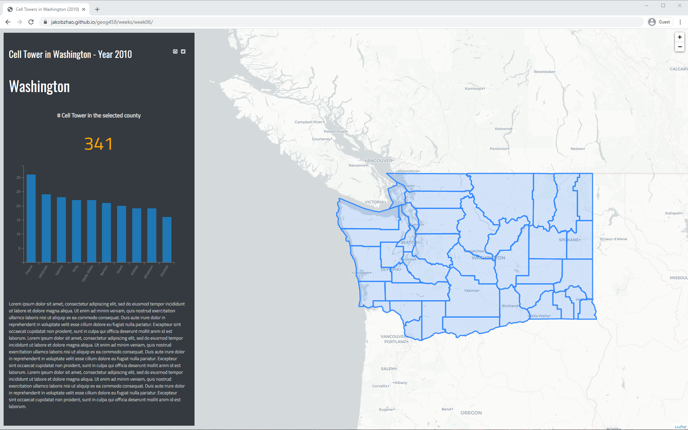

## Creating A Smart Dashboard

**Learning Objectives**

- the fundamental concepts relavent to smart dashboard;
- the promise mechnism for data loading;
- design an application for multiple devices; and
- coordinated visualization.

In this lecture, we will introuduce how to make a smart dashboard using javascript. A smart dashboard is frequently used to provide a coordinated view of multiple visual compoanents (e.g., maps, charts, texts, tables, diagrams) to holistically present the a (geographical) event. For example, one of the most popular use of smart dashboard is to visualize the trend of COVID-19 (refer to https://hgis.uw.edu/virus). Since map is an essential component for most smart dashboard applications, it has been considered as a very imporant type of digital geographies project.

In order to show how to create a smart dashboard, we wil walk through a smart dashboard together. This dashboard illustrates the descriptive statistics of cell towers in each county Washington State in the year of 2010. You can review the final look of this dashboard at [here](https://jakobzhao.github.io/geog458/weeks/week06/index.html).


As shown, it is composed of two panels - a side bar panel and a main window. The main window shows a map of counties in Washington state, while the side bar illustrates the project tile, social media bottons, the examined county, the number of cellt towers in that examined county, a bar chart illustrating the top 10 counties containing the most cell towers, and a footer. As smart dashboard, the map, text, and the chart are coordinated. By saying so, whenever triggering an event of one visual component (e.g. map or chart), other components on the dashboard can react correspondingly.

## 1. Preparation

### 1.1 Create a new github repo
As most of the labs and lecture assignments, we need to create an empty github repo, and then clone the repo to your local computer using the command utilty `git clone [repo-https-url]`. By doing so, you can code on a IDE such as atom on your local computer. You can find all the relevant files under the **week06** folder of the course repo. In the folder, we have downloaded the necessary libraries and stylesheets, and when you create your repo structure, please always follow the structure tree below.

```powershell
[your_repository_name]
    │index.html
    │readme.md
    │
    ├─assets
    │      wacountydata.geojson
    │
    ├─css
    │      main.css
    │
    ├─img
    │      xxx.jpg
    │
    ├─js
    │        main.js
```

In the meantime, please relocate the c3.min.css, leaflet.css to your css folder, while the c3.min.js, d3.js, jquery.min.js and leaflet.js to your js folder. In thi tutorial, c3.js will be sued to make coordinated view chats.

> C3 is a D3-based reusable chart library that enables deeper integration of charts into web applications. Follow the link for more information: http://c3js.org.

### 1.2 Create an empty html page

next, we will create an empty html document to contain the content and javascript script, the customized the stylesheet will be in the main.css under the css folder.

```html
<!doctype html>
<html lang="en">
<head>
</head>
<body>
  <!-- sidebar -->
  <div id="info">
  </div>
  <!-- mainwindow -->
  <div id="map"></div>
  <script>
    // the javascript script will be inserted here.
  </script>
</body>
</html>
```
 Within the body element, there are two placeholders, the info element for the sidebar panel, the map for the map object in the main window.

To ensure the map can occupy the full screen, we add the following lines in the main.css.

```css
html, body, #map {
  width: 100vw;
  height: 100vh;
  margin: 0;
  font-family: 'Titillium Web', serif;
}
```
Moreover, we put the sidebar to the left of the screen. Also, the sidebar is hidden when the smart dashboard is shown on a device with a smaller screens such as cellphne or tablet.

```css
#info {
  z-index: 1000;
  position: absolute;
  width: 500px;
  top: 1%;
  bottom: 1%;
  left: .5%;
  padding: 40px 15px 900px 15px;
  background: #343a40;
  color: white;

}

@media only screen and (max-width: 1026px) {
  #info, {
    visibility: hidden !important;
  }
}
```
> The `!important` property in CSS means that all subsequent rules on an element are to be ignored, and the rule denoted by  `!important` is to be applied. This rule overrides all previous styling rules ​-- the `!important` property increases its priority.

## 2. the side bar panel

On the side side panel, we will add multiple elements, such as the title, two social media icon buttons, placename element, the p element containing the # of cell towers, a bar chart and footer.

```html
<!-- sidebar -->
<div id="info">

  <div id="title">
    Cell Tower in Washington - Year 2010
    <span><a href="https://twitter.com/UW" target="_blank"><i class="fa fa-twitter-square"></i></a></span>
    <span><a href="https://github.com/jakobzhao/geog458" target="_blank"><i class="fa fa-github-square"></i></a></span>
  </div>
  <p id="placename">Washington</p>
  <div id="count" class="card">
    <h5 id="desc"> # Cell Tower in the selected county</h5>
    <p id="county-count">341</p>
  </div>
  <div id="county-chart"></div>
  <div id="footer"></div>
</div>
```
To make sure the side bar aligning to the left side of screen, we will add the following css lines to the main.css.

```css

#info a {
  color: lightgray;
}

#info a:hover {
  color: white;
  opacity: 0.3;
}

#info h4 i {
  font-size: 1.25e;
  padding-right: 10px
}


#title {
  font-size: 25px;
  font-family: 'Oswald', sans-serif;
}

/* social media icons */
#title span {
  font-size: 14px;
  float: right;
  margin-right: 10px;
}

#placename {
  font-size: 40px;
  font-family: 'Oswald', sans-serif;
}

/* card decks */
#desc {
  text-align: center;
  color: lightgray;
  font-size: medium;
  font-weight: bold;
}

#county-count {
  margin:0;
  text-align: center;
  color: orange;
  font-size: 50px;
}

#county-chart {
  top: 20px;
}

#footer {
  margin-top: 50px;
  margin-right: 10px;
  font-size: 13px;
  line-height: 150%;
  color: lightgray;
}

```

## 3. The coordinated map

### 3.1 Create an leaflet map

An map object and a Cartodb basemap will be created in the script element.

```js
// 1.Create a map object and set the initial view point
var mymap = L.map('map', {
  center: [47.33, -121.93],
  zoom: 8,
  maxZoom: 10,
  minZoom: 3,
  zoomControl: false,
  detectRetina: true
});

// 2. move the zoom control to the top right corner.
new L.Control.Zoom({
  position: 'topright'
}).addTo(mymap);


// 3. Add a base map.
L.tileLayer('http://{s}.basemaps.cartocdn.com/light_all/{z}/{x}/{y}.png').addTo(mymap);

```

### 3.2 Loading the GeoJSON data

Promise mechnism will be adopted to ensure the data is asynchronously loaded before its use.

```js
// 4. Declare three global variables for the wa counties thematic layer, bar chart, and the organized wa data.
var countiesLayer = null,
  bchart = null,
  counties = {};

// 5. load all datasets through promise mechnism and store them in an array
Promise.all([d3.json("assets/wacountydata.geojson")]).then(function(datasets) {

  // 6. Map relevant operations

  // 6.1 create a couties layer
  countiesLayer = L.geoJSON(datasets[0], {
    // onEachFeature: onEachFeature
  }).addTo(mymap);

});
```

 In addition to using D3, we can also use Jquery to load the json data. I personally like both. D3 can also support loading csv dataset.

 ```JS
 // 5. load all datasets through promise mechnism and store them in an array
 Promise.all([$.getJSON("assets/wacountydata.geojson")]).then(function(datasets) {
   ....
 });
 ```

### 3.3 Map events

Define a map event to enable the update of the county number and the # of corresponding cell towers.

```js
// 6.2 add three events to the the layer “countiesLayer”.
function onEachFeature(feature, layer) {
  layer.on({
    mouseover: highlightFeature,
    click: clickFeature,
    mouseout: resetHighlight
  });
}

// 6.3 this function works when the mouse hovers over on a map feature.
function highlightFeature(e) {
  // e indicates the current event
  var feature = e.target; //the target capture the object which the event associates with
  feature.setStyle({
    weight: 2,
    opacity: 0.8,
    color: '#e3e3e3',
    fillColor: '#00ffd9',
    fillOpacity: 0.1
  });
}

// 6.4 this function executes when the mouse clicks on a map feature.
function clickFeature(e) {
  L.DomEvent.stopPropagation(e);
  $("#placename").text(e.target.feature.properties.NAME + " County");
  $("#county-count").text(e.target.feature.properties.CTNUM);
}

// 6.5 reset the hightlighted feature when the mouse is out of its region.
function resetHighlight(e) {
  countiesLayer.resetStyle(e.target);
}

```

when click on any place except the washington, the name will be reset to “Washigton”, and the number will be reset to the total # of cell towers in WA.

```js
// 6.6 bind the onMapClick function to the mymap object.
mymap.on('click', onMapClick);
// when click on any place on the map expect the counties layer, the text on the sidebar will be reset to the total number of WA.
function onMapClick(e) {
  $("#placename").text("Washington");
  $("#county-count").text("341");
}
```

## 4. The coordinated bar chart

#### 4.1 Data preprocess
The chart will illustrate the top ten counties containg the most cell towers. The leaflet map can load GeoJson data, but the c3.js requests two seperated arrays of data, one containing the county number, the other containing the # of cell towers. In addition, the first variable of each array must be the array name. Therefore, the first task is to preprocess the data to the required format.

```js

      // 7.1 generate the declared dictionary object "counties".
      // add the county name as key and the number of cell tower as values in a dictionary declared before
      datasets[0].features.forEach(function(d) {
        counties[d.properties.NAME] = d.properties.CTNUM;
      })

      // 7.2 this function take a dictionary, return a dictionary that sorted by the number of cell towers.
      function sortJsObject(obj) {
        items = Object.keys(obj).map(function(key) {
          return [key, obj[key]];
        });
        items.sort(function(first, second) {
          return second[1] - first[1];
        });
        sorted_obj = {}
        $.each(items, function(k, v) {
          use_key = v[0]
          use_value = v[1]
          sorted_obj[use_key] = use_value
        })
        return (sorted_obj)
      }
      // 7.3 execute the sortJsObject function
      counties_sorted = sortJsObject(counties);

      // 7.4 slicing the arrays
      // only keep the top 10 values, and push “county” to the first of the array.
      x = Object.keys(counties_sorted).slice(0, 10);
      x.reverse();
      x.push("county");
      x.reverse();

      // only keep the top 10 values, and push “#” to the first of the array.
      y = Object.values(counties_sorted).slice(0, 10);
      y.reverse();
      y.push("#");
      y.reverse();
```
### 4.2 Generate the chart

It is straighfoward to generate a bar chart using c3.js. C3.js is a javscript library built on D3.js and purposefully designed for making charts. 

```js
// 7.5 generate the chart
bchart = c3.generate({
  size: {
    height: 350,
    width: 460
  },
  data: {
    x: 'county',
    columns: [x, y], //input the x - sorted county number, y - the corresponding # of cell towers.
    type: 'bar', //a bar chart
    onclick: function(d) { }
  },
  axis: {
    x: { //county
      type: 'category',
      tick: {
        rotate: -60,
        multiline: false
      }
    },
    y: { //count
      tick: {
        values: [5, 10, 15, 20, 25, 30]
      },
    }
  },
  legend: {
    show: false
  },
  bindto: "#county-chart" //bind the chart to the place holder element "county-chart".
});
});
```
When any bar on the chart is clicked, the correspoding county will be centerized and enlarged. The county name and the # of cell towers will be updated.


```js
// update the map and sidebar once the bar is clicked.
 var countyName = x[d.x + 1];

 //display the onclick feature's name to the tag with id 'placename' and 'county-count'on dashboard
 $("#placename").text(countyName + " County");
 $("#county-count").text(counties[countyName]);

 datasets[0].features.forEach(function(t) {
   if (t.properties.NAME == countyName) {
     countybound = L.geoJSON(t);
     mymap.fitBounds(countybound.getBounds());
     maymap.setZoom(12);
   }
 });
```
Since the default setting for c3.js works on a white background, some small hacks of the bar chart style sheets are necessary.

```css

/* bar chart */
text {
  fill: gray
}

.tick line {
  stroke: gray;
}

.c3-axis path {
  stroke: gray;
}

.name, .value {
  background-color: black;
  color: black
}
```

## 5. Summary

This lecture has shown the fundamental concepts and techiniques about smart dashboard using a basic example. To make a smart dashboard for a geogrpahical event or phenomenon, it is necessary to code multiple visual strategies in a holistic and coordinated manner. Moreover, we briefly talk about how to suppor the idea of responsive design -- how to visualize a web design on multiple devices. Another primary techiniqu we have practiced is to load geojson data through a Promise mechnism supported D3 or Jquery methods. If you are interested in more applications, please refer to the examples below.

- [the water caculator](https://jakobzhao.github.io/twca/)
- [the covid-19 dashbaord](https://hgis.uw.edu/virus)
- [the dashbard illustrating the covid-19 risk](https://hgis.uw.edu/covid19-workers)
