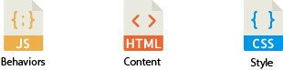
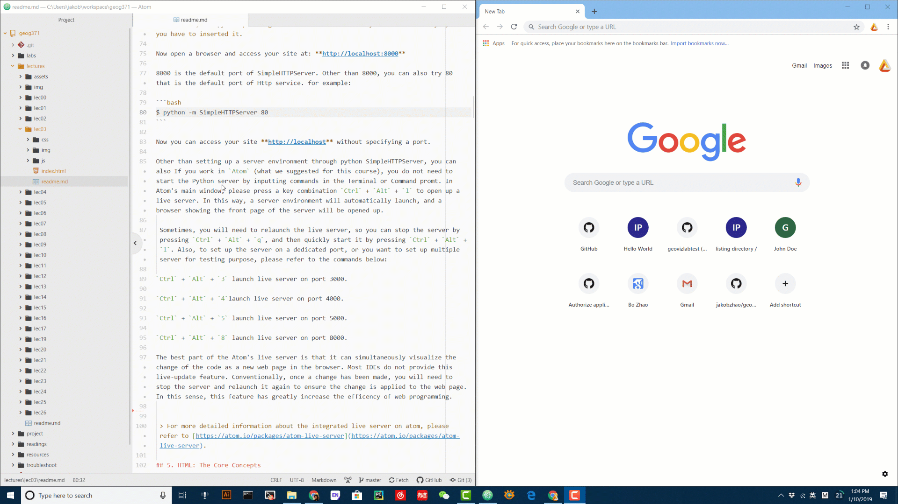
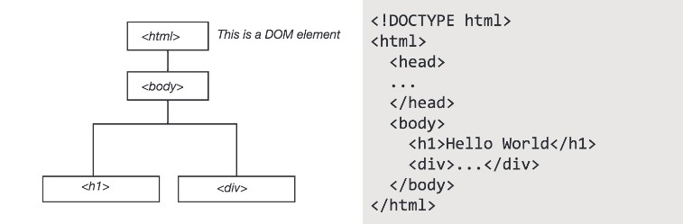
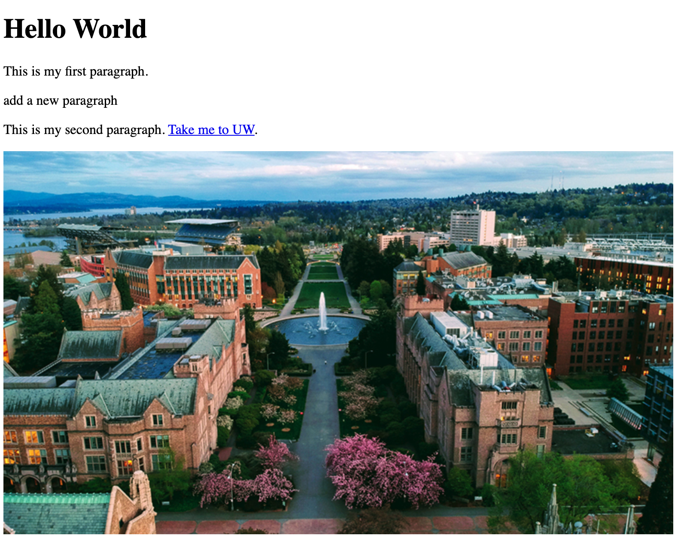
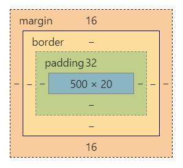

# Web Programming Basics I: HTML and CSS


**Learning Objectives**

- Understand how to organize files on a server.
- Get to know the web development environment (IDE);
- Set up a testing/debugging web server; and
- Walk through the basics of HTML and CSS;

Today, let us switch gear to some heavy lifting of Web Programming. This lecture focuses on some of the fundamentals and concepts behind a web page, starting from web hosting, IDE (Integrated Development Environment), and then moving through the basic building blocks of HTML and styling with CSS. JavaScript will be introduced later.

## 1. Introduction

A web page is a document suitable for display and distribution over the internet. At the most basic level, a web page is a text document containing code (often HyperText Markup Language, shortened to `HTML`), that is located at a node on the internet. This node is called a 'server', as it serves the file to the world wide web, allowing your computer, the 'client', to access it.

When you open a web browser, such as `Chrome`, `Firefox`, `Edge` or `Internet Explorer`, and input a URL, something like www.uw.edu into the address bar, the web browser navigates to the node you have specified and requests this document, which it reads, interprets, and displays on your screen depending on the interpretation of the document. This means a couple of things:

    - You need to have a location (url) on the internet you can place your documents.
    - You have to create and place the right kinds of documents in this location.

## 2. Organize your Directory

The next important topic to discuss up front is the file structure. There are often a lot of files located on a server. When you navigate to a website, how does the browser know which file to initially read?

Standard protocol is that a file named **index** is what will be provided by default when a browser finds your site. This index file must be in the base level of your web folder, and is what users will see when they navigate to your web site. All code for today will be contained in a file we will create and save in our webspace as `index.html`

> **Note:** the HTML file extension, indicating the file is written in HTML). The file structure found in my directory looks like the following.

```powershell
 Geog458
   weeks
     week02
      html-css
        │  index.html
        ├─css
        ├─img
        └─js
```

You can also have supplemental files, such as images, style files, scripts, and other items in your root directory alongside the `index.html` standing alone or in subdirectories. You can see in the above-listed file structure, I have `img` for holding images, `css` for holding style files, `js` for scripts, and usually another folder named `assets` or `data` for holding miscellaneous items.

***How is everything related?***



To host a web application, you need to move the codes and the supplemental files to the server. For most of the lecture and lab demos, you can launch a web server on your computer by python SimpleHTTPServer or a server integrated in `Atom`, also you can host your web map through github page.

> **Note:** If you have your own dedicated server, you may need to dragged and saved the files in a specific folder (e.g., a folder named "www") which will be the hosting place of the server. If the server is a remote computer or in the cloud (e.g., the google cloud platform), you can use an `FTP` ot `SSH` connected to your hosting space, or drag and drop into your www folder.

## 3. Use an IDE

While you can get away with using a basic text editor to create HTML files, there are Integrated Development Environment (IDE) designed to make your life easier by color coding code snips and autocompleting lines. Download and install one of the following text editing software if you don’t already have one. In this lecture, you will mainly use `Atom` to edit HTML, CSS, and Javascript files. We also have `Atom` installed in the Digital Earth Lab, and you can install an open source version of `Atom` on your own machine, no matter you are a Mac or Windows users. Here is a list of other IDEs:

- `VS Code`

- `Webstorm` - (Windows, Mac, or Linux) One of cross-platform IDEs primarily for web, JavaScript and TypeScript development. Many of JetBrain's other IDEs include the feature set of WebStorm via plugins.
- `Sublime Text` – (Windows, Mac, or Linux) One of the most popular and well-loved text editors around. Free to download and use, but will occasionally show a pop-up window if you don’t purchase it. This is what I’ll be using during the workshop
- `Brackets` – (Windows, Mac, or Linux) A newer, free open source code editor.
- `Notepad++` – A solid and reliable text editor for Windows. Free.
- `TextWrangler` – A free text editor for Mac only.
- `DreamWeaver` – Adobe’s software for making basic websites. This is not free generally, but many students already have it installed. This software can sometimes make simple tasks far more complicated than necessary. Not recommended, but if you already have it and you don’t want two install anything else, I will grudgingly acknowledge that it will work just fine for the workshop.

## 4. Start up a Web Server

For testing and debugging purpose, we need our computer to act like a WebServer, allowing it to access files online. There are many tools for doing this, and one is built right into python. If you use a Mac or Linux, please open `Terminal`, if on Windows, open command prompt. In the main working interface, use the command `cd` to **change directory** to the folder in which your website files are located. Once there, type the following to start a simple Python server.

you can also If you work in `Atom` (what we suggested for this course), you do not need to start the Python server by inputting commands in the Terminal or Command promt. In Atom's main window, please press a key combination `Ctrl` + `Alt` + `l` to open up a live server. In this way, a server environment will automatically launch, and a browser showing the front page of the server will be opened up.

 Sometimes, you will need to relaunch the live server, so you can stop the server by pressing `Ctrl` + `Alt` + `q`, and then quickly start it by pressing `Ctrl` + `Alt` + `l`. Also, to set up the server on a dedicated port, or you want to set up multiple server for testing purpose, please refer to the commands below:

 - `Ctrl` + `Alt` + `3` launch live server on port 3000;

 - `Ctrl` + `Alt` + `4`launch live server on port 4000;

 - `Ctrl` + `Alt` + `5` launch live server on port 5000; and

 - `Ctrl` + `Alt` + `8` launch live server on port 8000.

The best part of the Atom's live server is that it can simultaneously visualize the change of the code as a new web page in the browser. Most IDEs do not provide this live-update feature. Conventionally, once a change has been made, you will need to stop the server and relaunch it again to ensure the change is applied to the web page. In this sense, this feature has greatly increase the efficency of web programming. See the demo below:




 > For more detailed information about the integrated live server on atom, please refer to [https://atom.io/packages/atom-live-server](https://atom.io/packages/atom-live-server).

## 5. HTML: The Core Concepts

In the next steps, we will create a blank document, fill it with HTML code, save it as index.html, and view our results in a browser.

In your IDE, open and create a new blank document. Signify that the document will be written in HTML by adding the following line at the top of your file.

```html
<!DOCTYPE html>
```

This is called a **tag**. HTML tags are keywords surrounded by angle brackets. This tag states for the browser that the rest of your file will be written in HTML. The rest of our document will follow a very simple rule, no matter how complex the code.

When you write a tag (aka `start tag`), you will need a second tag that declares the end of that part of the document (aka `end tag`). Content goes between the start and end tags. A start tag looks like and an end tag has a slash in front of it . Conceptually, you will write the following.

```xml
<tagname>Content...</tagname>
```

Tags without content are called **void elements**.

```xml
<tagname />
```

Comments look like the following. They are used to write human-readable notes in your code, but are ignored by the browser.

```xml
<!-- ... -->
```

For our page, since it is in HTML, we have to put everything in an tag. Do this with an `html start tag`. Copy and paste the following into your document, and we will walk through this.

```html
<!DOCTYPE html>
<html lang="en">
    <head>
        <meta charset="utf-8">
        <title>Hello World</title>
    </head>
    <body>
    <!-- This is a comment -->
        <h1>Hello World</h1>
        <div id="main">
        ...
        </div>
    </body>
</html>
```

### The DOM: Document Object Model

The [Document Object Model](https://www.w3.org/DOM/) represents the hierarchy of elements in our page. This is modeled using something commonly called the **DOM Tree**, and it consists of our HTML elements.

*The DOM Tree*



### Common Tags

**Head** and **Body** elements are large containers.

```xml
<!-- HEAD element containing meta information, style, and links -->
<head>
	...
</head>
<!-- BODY element containing all document content elements -->
<body>
	...
</body>
```

**Links, Images** and **Paragraphs**

```xml
<!-- LINKS. A is used to define a hyperlink -->
<a href="http://www.somewebsite.aaa">...</a>

<!-- IMAGE tag to define a link to an image in your document -->


<!-- PARAGRAPH tag for large blocks of body text -->
<p>...</p>
<!-- SPAN is for groups of inline elements -->
<span>...</span>
```

**Lists**
```xml
<!-- UL defines an unordered list -->
<ul>
    <li>...</li> <!-- line in list -->
</ul>
<!-- OL defines an ordered list -->
<ol>
    <li>...</li> <!-- line in list -->
</ol>
```

### DIV Tags

Perhaps the most common tag, the `div` tag defines a division or section of an HTML page. One page can contain many `div` elements, and one `div` element can contain many nested elements. The div tag is an element of HTML that allows you to group content into containers (or divisions) you can organize and style on your web page, and divs play nicely with CSS (Cascading Style Sheets). CSS is a style sheet language used for describing the look and formatting of an HTML page. We will introduce it in the next step.

```xml
<div id="main">
	<!-- Content goes here -->
	...
</div>
```

### Tag Attributes, Classes, and IDs

Tags are specified and defined using attributes, classes, and IDs. These attributes, classes, and IDs allow you to identify specific elements, modify individual elements and groups of elements, and set the characteristics of the elements.

- `Attributes` define properties of the elements. Elements can have multiple attributes. For example, if the element is a link, where does the link take you.

- `Classes` identify a group of elements that operate similarly or work in the same fashion. For example, a button.

- `IDs` identify unique features and allow for and operations to be performed on that unique feature. In each document, each ID should be unique.

`For Example:`

```xml
<a href="http://www.github.com" class="button" id="unique">...</a>
```

*or*

```xml
<div style="background-color:#0000FF" class="header" id="main">...</div>
```

### Modify your Document

Let's get into the document a bit.

**Add Text**

Our HTML document is looking bare, we need to add content. We can start by modifying the heading that welcomes visitors to our site and add a couple paragraph elements.

Modify the HTML code on the page to include the following. Add some paragraph `p` elements within the `div` element of your page.

```xml
<h1 id="headtext">Body Heading</h1>
<p id="foo">This is my first paragraph.</p>
<p id="bar">This is my second paragraph.</p>
```

The h1 tag signifies a heading, this is a bolded style of text that vary in size ranging from h1 to h6. The p tag signifies a paragraph that can contain large blocks of text.

**Add a Link**

Adding a link to your site is simple. To add a link, we use the a tag. The a tag defines a hyperlink that can be used to link from one page to another. HTML tags can have attributes. Attributes define and provide additional information about an element. To create a hyperlink, we use the href attribute of the a tag. The following line contains a link to oregon state university's home page, and illustrates how you would set up a link. You can place links separate from your paragraphs, or place them within. Write the following line of code at the end your second paragraph, just before the p end tag.

```html
<a href="http://www.uw.edu">Take me to UW.</a>
```

You have many options for links. For example, if you want a link to open in a new page, you can use **target="_blank"** as a property of the A tag.

> *Can you add a link that takes you to Google Maps?*

### Add an Image

Adding an image is just as easy as adding a hyperlink, although a bit different. An image is not stored on your webpage, but it sits on your server, just like your other files. When you display an image in an html file, you are linking to the image. The HTML tells the browser to locate and display it. Therefore, we will follow a multiple step process.

- Locate the folder named `img` that you copied to your web directory. You will find one image here named **osu.jpg**. In this folder, you'll store all subsequent images you want to use in your page.
- Use the `img` tag to link to that image in your `index.html`

Now we can add the image to our index.html. The following line of code uses the img tag, and then links to our image. We will use the `src` attribute to name the source of the image. The image is coming from our own server, we don't need to go externally to get it, so we can put the name of the folder and image as our image address.

Copy and paste this following line in between the `body` tags in your `index.html`, after your last paragraph.

> *Can you add another image, perhaps one showing Wilkinson Hall?*

If you want to add an image from another page, you can simply include the URL at which the image is located. The following links to an image on Wikimedia.

```xml

```

### Our Code

At present, your document will look something like the following.

```xml
<!DOCTYPE html>
<html lang="en">
	<head>
    	<meta charset="utf-8">
    	<title>Hello World</title>
	</head>
	<body>
		<!-- This is a comment -->
		<h1>Hello World</h1>
		<div id="main">
			<p id="foo">This is my first paragraph.</p>
			<p id="bar">This is my second paragraph. <a href="http://www.oregonstate.edu">Take me to OSU</a>.</p>
			
		</div>
	</body>
</html>
```

Our page, with this code, contains a bit more content now.



> *What does our DOM Tree look like at this point?*

## 6. CSS: The Core Concepts

### Cascading Style Sheets

Cascading Style Sheets (CSS) is a styling language used for describing the look and formatting of an HTML page. It uses the DOM and styles "cascade" from higher elements in the DOM tree to elements further down.

CSS is a very useful styling system, and allows you to style items on your page according to a number of methods based on the element it falls within (i.e., `div`, `body`, `p`, etc.), the id of the element, or the class of the element.

### Why Cascading?

The term 'cascades' in the effect that if you style an element, any nested elements will get the same styling unless you specify otherwise. For example, if you set the font for your body element, a p (paragraph) will also be set to the same font, unless you specify specifically in the CSS that you want that `p` to have another font. This is a useful method in that it minimizes the code you need to write and forces you to be careful with your page structure.

### Link a CSS File to your site

CSS can be added to style your website in one of a few ways. You can apply CSS to individual elements, embed it within your HTML document, or create a separate CSS file and link it to your HTML document. In your file, add the following link in `head` section of your document.

```html
<link href="css/main.css" rel="stylesheet" />
```

>  **Note:** `rel` is short for relation.

Save your document, and refresh your page. Everything should center. This is because we applied CSS code to our document by linking to our style file.

In the materials for this lecture, locate the file 'main.css'. This is our stylesheet. We can name it anything really, as long as it has the CSS file type. Open this in your text editor to view the contents. It is a very simple bit of CSS that tells everything in the `body` element to center in the page.

```css
body {
	text-align: center;
}
```

All content in the `body` tag are now in the center of the page.

### Basic Syntax

Basic CSS syntax looks like the following.

```css
[selector] {
	[property]: [value];
}
```

`Selectors` are page elements, and can be tags, ids, titles, classes, etc. For example, if we want to style everything that falls in the `body` tag, we use the `body` selector as above.

Selectors can be specified

**By element:**

```css
p {
	font-size: 12;
}
```

**By class:**

```css
.main {
	font-size: 12;
}
```

**By ID:**

```css
#main {
	font-size: 12;
}
```

- A selector with no pre-characters signifies a tagged element in our HTML.
- A # before a selector indicates that the selector is an id.
- A . before a selector indicates that the selector is a class.

A W3School CSS Selector test can be found at [here](https://www.w3schools.com/cssref/trysel.asp).

### Inheritance and Order of Operations

CSS follows the DOM model, with styles applied to elements higher in the DOM applied to those that are descendents. If selectors are defined in multiple locations in your CSS, which one gets precedence?


There are two general rules.

- **CSS defined last in your document will supersede CSS set on a selector earlier in your document.**
- **The more specific selector will override the less specific selector. For example, a style set on the body selector will be overridden by a style set on an element within the body, such as one by ID.**

> **Note:** The `!important` rule is a way to make your CSS cascade but also have the rules you feel are most crucial always be applied. A rule that has the !important property will always be applied no matter where that rule appears in the CSS document.


### Properties and Values

There are hundreds of properties you can set using CSS. Some of these include font, color, location on page, opacity, size, etc. An extensive list can be found in CSS reference documents. Two prominent references are by W3Schools and Mozilla, check them out for further reading.

[Mozilla CSS Reference](https://developer.mozilla.org/en-US/docs/Web/CSS/Reference)
[W3Schools CSS Reference](http://www.w3schools.com/cssref)


**Style Font and Type Size**

To change the font for all of our document, we change it on the highest level we can by signifying we want to style everything within the html tag. This can be accomplished by adding the following selector and properties to the stylesheet.

```css
html {
  font-family: Georgia, Times, serif;
  font-size: 24px;
  line-height: 32px;
}
```

Font family prioritizes a list of font names for the selected element. Line height specifies the minimal height of line boxes within the element.

**Change Background Color**

Adjust the color of an element using background color.

```css
p {
  background-color: #dddddd;
}
```

Colors can specified using hex, RGB, or a set of [preset supported color names](http://www.w3schools.com/colors/colors_names.asp).

**Pseudo-Classes and Changing Link Color**

Change link colors using the following.

```css
a {
  color: orange;
}
```

In CSS, elements have what are called [Pseudo-Classes](https://developer.mozilla.org/en-US/docs/Web/CSS/Pseudo-classes). Pseudo-classes are keywords added to selectors that specifies a special state of the element to be selected. For example, one pseudo-class is hover, and it signifies what happens you hover over an element. This can be used to change the color a link turns when you hover over it.

```css
a:hover {
  color: orange;
}
```

**Chaining**

To find selectors that are nested within other selectors, you can use the concept of `chaining`. Chaining is how we identify multiple ids, classes, and selectors.

```css
a circle {
  color: orange;
}
```

[Read more about it here.](https://css-tricks.com/multiple-class-id-selectors/)

**The Box Model: Size and Positioning**

Every element in your document is represented by a box. These boxes allow you to set properties such as margins around items.



- `Padding` - The content is surrounded by the padding area, exists between the content and the border.

- `Border` - Every box has a border that exists on the outer edge of the padding area.

- `Margin` - Margin defines the distance between the element and neighboring elements. Margin never has color.

- `Dimensions` - Controls the height and width of the elements.

You can also adjust the margins, padding, and border individually on each side of the element. An example element, along with its styling, is below. Add this to your CSS stylesheet and save to see how it changes our basic webpage.

```css
p {
    background-color: #dddddd;
    padding: 20px;
    width: 320px;
    height: 40px;
    margin-right: 10px;
}
```

**Positioning**

Positioning your element

- `Relative` - Position according to normal document flow, then shift using positioning properties such as *top* or *left*.
- `Absolute` - Take out of normal flow, and manually position against the containing element.
- `Fixed` - Take out of normal flow and manually position against the browser window.

Another available property is called is `float`. Float can be used to wrap text around images.

CSS is the way you style your page, learn more by referring to the references, or playing around in a sandbox such as [CSS Desk](http://www.cssdesk.com/).

## Reference:

[1] Foster M (2015) Intro to Websites, retrieved from January 1, 2017 from http://duspviz.mit.edu/web-map-workshop/code-your-first-website/

[2] W3Schools (201X) HTML5 Tutorial, retreived December 28, 2016 from http://www.w3schools.com/html/

[3] W3Schools (201X) CSS Tutorial, retreived December 28, 2016 from http://www.w3schools.com/css/
