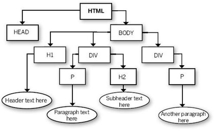
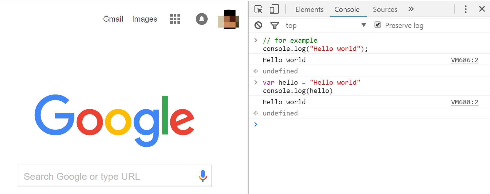
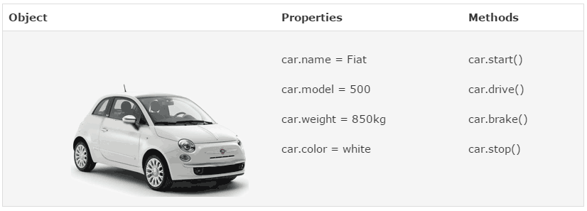
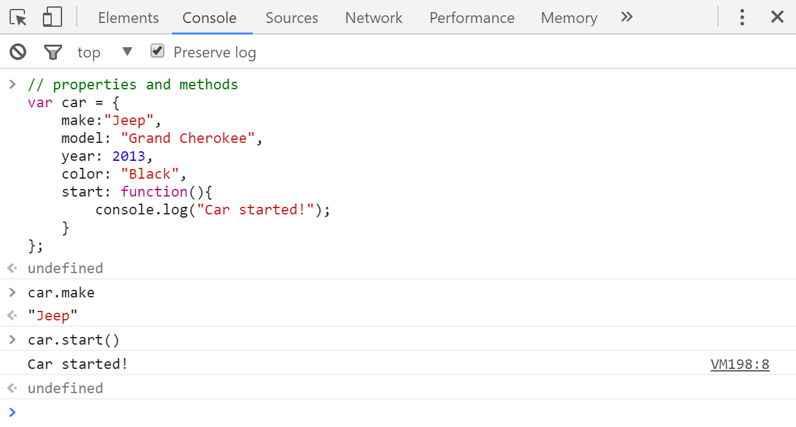

# Web Programming Basics II: Javascript

## 1. Preparation

Html, css, and JavaScript are the fundamental programming knowledge set for developing web mapping applications. After introducing HTML and CSS, This exercise helps you get to know the basics of JavaScript, including data types, objects, functions, and events. In addition, along this course, we will get in touch with several well-known JavaScript libraries, including `JQuery`, `Leaflet`, `Cesium`, and `Bootstrap`.

JavaScript is a web programming language that manipulates and controls the behavior of web pages by interacting with the various elements on the page and loading data. Many web site templates, such as `Bootstrap`, are in JavaScript, and it is the programming language that most of the major mapping and data visualization libraries, including `Leaflet` and `Cesium` that we are using in this course, are implemented in.

One major concept in web development is **server-side versus client-side**. The server is the location on the web that serves your website to the rest of the world, the client is the computer that is accessing that website, requesting information from the server. JavaScript can be both, but is primarily a client-side language, working on your client computer. In the manner we are using it, JavaScript is a scripting language that will operate in two fundamental ways. The first is executing scripts and tasks when the web page is loaded (i.e. load a dataset on page open), and the second is executing scripts and tasks after the web page visitor tells it to (i.e. clicking a button) or another task is completed (i.e. a menu is closed). When the script executes, it can manipulate the content of the page, change how it is being viewed through the browser, give information to a server, or tell the browser to go back to the server and get new information. Often, however, the instructions given by the script can be followed without additional communication with the server.

> Probably the most popular **server-side** JavaScript implementation is [NodeJS](https://nodejs.org/en/). NodeJS is a runtime that runs on the server to provide fast and dynamic applications, and pushes select output to the client. It can be used for both production and development, and allows you to install Leaflet, Cesium and other libraries on your server. We have plenty else to focus on today, however, so this can come later.

JavaScript, in a manner similar to CSS, interacts with HTML elements using the **DOM**.



When you are working with javascript, some of your main goals will be to:

- Create Elements
- Load and Bind Data
- Modify Element Properties
- Write Functions
- Listen for User Interaction

### 1.1 Link a JavaScript document to your web site/page

JavaScript can be added to your website by either typing in script between two script tags, or by linking a JavaScript file to your site. Please synchronize all the course material, the file structure for this lab is structured as below:
```powershell
geog458
    weeks
        week02
          javascript
            │  index.html
            │  readme.md
            └─js
               └──main.js
            └─img
```
Please activate a web server environment under the lab02 directory by **SimpleHTTPServer** or **Atom**.  Then visit `index.html` on Google Chrome. For example, if you activate a web server environment by SimpleHTTPServer with default setting, you may need to visit http://localhost:8000/index.html.

At the bottom of the body section, you will see the following code. This will read all code found in the `main.js` file that is in the js folder.

```html
<script src="js/main.js"></script>
```

In the body of your HTML document, above the script, you will see a button using the following. When clicked, this button will run the function named helloworld in our main.js JavaScript file, and change the content of the paragraph elements with id="foo".

```html
<button type="button" onclick="helloworld()"> Click Me!</button>
```

So where is helloworld function? It is in the main.js document. The structure of it is as follows. It looks through the document to find an element named foo, then changes the HTML within that element to 'Hello Web Mapping!'.

```js
function helloworld() {
    document.getElementById('foo').innerHTML = 'Hello, Web Mapping!';
}
```

### 1.2 JavaScript Consoles

Regarding this exercise, you may use [jsFiddler](https://jsfiddle.net/) - an online sandbox for testing all the JavaScript
code snippets.

>  **Snippet** is a programming term for a small region of re-usable source **code**, machine **code**, or text.Ordinarily, these are formally defined operative units to incorporate intolarger programming modules. **Snippet** management is a feature of some texteditors, program source **code** editors, IDEs, and related software.

Or in this lab, we recommend to test Javascript codes with In-browser console, such as Firefox firebug,  google in-browser console, etc. Open up your browser (Google Chrome), navigate to a page (e.g., www.google.com), and open the browser JavaScript console and dosome basic coding to show some of the principles.

Chrome’s integrated JavaScript console allows you to inputand explore JavaScript. Use **CTRL+SHIFT+J** (Windows) / **CMD+OPTION+J** (Mac) to open the console.

In your JavaScript code, if you ever want to log something to the console, use:

```js
// for example
console.log("Hello world");
```
or
```js
var hello = "Hello world"
console.log(hello)
```

Try the above code in the in-browser console, you will see:



## 2. A Walkthrough of JavaScript fundamentals

### 2.1 Objects

Objects are the core of JavaScript and almost everything you work with in JavaScript is an object. Objects are elements of JavaScript that have properties and values. To illustrate this, I will reference a nice example from W3schools, in real life, a car is an object. This car has properties like weight and color that are set to certain values, and it has methods, like start and stop.



You will commonly be accessing objects within objects. Typical syntax might look like the following.

**[object1].[object2].[method]**


```js
// example when working with Leaflet
// L.wmsLayer().addTo(map);

// properties and methods
var car = {
    make:"Jeep",
    model: "Grand Cherokee",
    year: 2013,
    color: "Black",
    start: function(){
        console.log("Car started!");
    }
};
```

Object properties, and objects themselves, can be stored and accessed for later use using variables.

Try typing **car.start()**. You should get confirmation that your car started. This is a function stored as a property. What is a function? We'll get to that soon, let's talk more about our variables.



> a screenshot of running the code on Google in-browser console


>  Our page elements from our HTML webpage document can be referenced through JavaScript. Using JavaScript, we can change the properties of these elements and tell them to do things, like change color, or model. Imagine in our car example, to create a Jeep and tell it to be black, we can create a car div with `id="myJeep"`, then make it red by setting the color method `myJeep.color = "black"`.

### 2.2 Variables

Variables are containers that hold data values, simple or complex, that can be referred to later in your code, much like algebra. For example, in order to fully instantiate the `Leaflet` map object, we have to use our script to create an object that will hold the Leaflet map object. The map object creates a map, but to put in our page, we need to create another object that will contain the map that is created. To do this, we use a variable.

The following are examples of variables. Run these lines in your JavaScript console one by one, hitting enter after each. **Note the semicolon**. All individual lines in JavaScript must end with a semicolon.

```js
var x = 5;
var y = 6;
var z = x + y;
```

In your JavaScript console, to see a current value of a variable, type it and hit enter, it will return the current value.

```js
z;
// will return
11
```

### 2.3 Data Types

These variable values fall into two different data types, primitive and reference. Data in JavaScript are objects that represent values or other objects. Primitive data types must be of a specific type, where Reference data types can be thought of as a references to other objects in your document.

#### 2.3.1 Primitive Data Types

- Boolean: `true` or `false`;
- Number: Any integer or floating-point value;
- String: Text characters that are delimited by quotes;
- Null: Variable set to have the value of `null`; and
- Undefined: Variable declared, but set to have no value.

Examples of JavaScript data, and what can be stored as a variable and referred to later are shown below. Variables can contain many different data types, including strings, numbers, and even entire objects, arrays, and functions. To familiarize yourself with data in JavaScript, try some of the following in your browser JavaScript console.

**String**

Strings are text characters. They can be concatenated by using `+`.

```js
var name = "Michael";
var selection = "a";
console.log(name);
console.log(selection);
console.log(name + selection); // string concatenation
```

**Number**

Number types can hold integers and decimals.

```javascript
var count = 25;
var cost = 1.51;

count + cost
```

**Boolean**

Boolean values are either true or false. They are good for evaluation and flow control. Boolean values are the result of comparison operators.

```js
var found = true;
var lost = false;

9 >= 10 // returns false
11 > 10 // returns true
```

Boolean values can be applied to logical operators.

- && - AND operator. True only if both values are true.
- || - OR operator. True if one or both values are true.
- ! - NOT operator. True if statement is false.

**Null**

NULL objects can be created if you need an object, but you dont have anything to put in it yet you can populate it at a later point

```js
var object = null;
```

**Undefined**

Undefined creates the variable so it exists in the DOM, but does not give it any definition. You can populate it at a later point.

```js
var flag = undefined;
var ref;
```

#### 2.3.2 Reference Data Types

**Array**

```javascript
var array = []; //empty array
var array1 = [ 1, 3, 5 ]; //populated array
```

You can access array elements much like in Python. Note the first position is 0.

```javascript
array1;
[1, 3, 5]
array1[0];
[1]
array1[1];
3
```

**Object Literal**

Object Literal data type is a comma separated list of name value pairs.

```javascript
var course = {
    name: "Advanced Digital Geographies",
    year: 2020,
    univ: "University of Washington"
};

console.log(course.name);
```

**Function**

You can place functions within variables.

```js
var myFunction = function() {
    // function code goes here
};
```

When you call the variable myFunction, it will run the function you have stored in that variable.

### 2.4 Functions

Functions are pieces of code that can run when called upon. To use a function, it must be defined using the function declaration.

When defining a function, you also define the parameters that are required for the function. These parameters are placeholders for accepting variable values created outside of the function. For example, let's look at a basic function.

```js
// function declaration with parameters
function multiply_this(a,b) {
    return a*b;
}

// call the function, providing arguments for the parameters
var x = 4;
var y = 5;

multiply_this(x,y); // run function with x and y as our arguments
20 // returned value
```

**Return Values**

Functions often compute values that are then used in the DOM to either change the document add or remove content, modify a variable change a property value or visibility, or provide a value that is then used in another function. The computed values provided by the function are called return values. The return keyword is used in a function code block to tell the code to give a value back to the caller. Using the return keyword saves the return value for other use. Functions stop executing when the JavaScript reaches a return value. You can change variables without return values, but to receive values that can be used later, you use return.

**Parameters versus Arguments**

In the function definition above, we listed parameters that are taken by the function. Parameters are placeholders for objects that will be passed to the function when called. Arguments are the real values of the objects received as parameters for the function when it is invoked.

If a parameter is defined in JavaScript, it must be passed an argument when invoked. ***However, it is possible to provide default values if an argument is not received.***

There are a couple of ways you can declare and write functions.

**Function Declarations**

Functions are declared using the function keyword, then saved for when they are called. Syntax looks as follows.

```js
// function declaration with two parameters
function multiply_this(a,b) {
    return a*b;
}

// call the function, providing arguments for the parameters
var x = 4;
var y = 5;

// invocation
multiply_this(x,y)
20 // return value
```

**Function Expression**

Functions can be held in variables. These functions are anonymous functions, and are not required to have a name.

```js
// function expression
// this is an anonymous function (an unnamed function)
// functions stored in variables do not need a name, but rather are called using the variable name
var multiply_that = function(a,b){
    return a*b;
}

// call the function, providing arguments for the parameters
var x = 4;
var y = 5;

mutiply_that(x,y) // run function
20 // return value
```

Anonymous functions, or function expressions, are used a lot in web applications. When you see a function without a name or declaration, that is what is going on.

**Functions as Objects**

Functions are objects, and can have both properties and methods. They can be stored as variables and referred to later. Functions can be stored within other objects as methods of that object, and then referred to later. For example:

```js
var newCar = {
    make: "Jeep",
    model: "Grand Cherokee",
    color: "Blue",
    start: function(){
        console.log("Car started!"); // can hold block of code to run!
    }
}

// view the data values
console.log(newCar);
console.log(newCar.make);

// or start the car
newCar.start();
```

**Function Hoisting**

In JavaScript, a variable can be declared after it has been used. In other words; a variable can be used before it has been declared. I use an example from w3schools.  The following two code snippets will return the same result.

**declare before use**

```js
//code snippet 1
notice = "web mapping"; // Assign a string to notice
console.log(notice)
var notice; // Declare x
```

**declare after use**

```js
//code snippet 2
var notice; // Declare notice
notice = "web mapping"; // Assign a string to notice
console.log(notice)
```


Hoisting is JavaScript's default behavior of moving declarations to the top. If a function is declared, it can be called before the declaration. This is the default behavior of JavaScript, and it moves functions to the top of the scope. It is called hoisting. Function expressions are not hoisted, however.

### 2.5 Variable Scope

Scope refers to the set of objects you have access to at any point in your script.

How long do variables last when you declare them? There are two main types of variables, global variables and local variables. Variables declared within a function are Local to that function. Values held within a local variable will not be usable after the function ends. Variables declared outside a function are Global, and can be used anywhere on the webpage.

**Global Variable**

```js
var carName = " Jeep";
// code here can use carName
function functionName() {
    // code here can use carName
}
```

**Local Variable**

```js
// code that sits here can not use carName
function functionName() {
    var carName = "Jeep";
    // code here can use carName
}
```

Assigning a value to a variable that is not declared automatically makes that variable global. In general, you want to limit the number of global variables to be only those that are required.

### 2.6 More on Methods

Methods are the options and actions that can be performed on objects. Using the car as an object analogy, the methods might be start, drive, brake, and stop. These are actions the car can perform. In other words, write a function that defines how to start the car. In JavaScript, to start the car, access the start method by using car.start(). Likewise, write one for brake. Access the brake method by using car.brake().

```javascript
// example when working with Leaflet
// L.wmsLayer().addTo(map);

// properties and methods
var car = {
    make:"Jeep",
    model: "Grand Cherokee ",
    year: 2013,
    color: "Black",
    start: function(){
        console.log("Car started!");
    }
};

car.start()  //the car conduct a method
// Car started! Return value.
```
### 2.7 Properties and Values

Properties are the values associated with a JavaScript object. Let's use the car example again, for the object car, say it has the properties of make, model, weight, and color. Each of these can be set to a value.

```javascript
var car = {
    make:"Jeep",
    model: "Grand Cherokee",
    year: 2013,
    color: "Black"
};
```

This creates an object called car, then sets the properties of car to be a Black 2013 Jeep Grand Cherokee. To access this property, we would type the object name and property objectName.property, for example, car.make = "Jeep".

If we wanted to change the color, we would access it through this method. For example, overwrite the color property currently set to "Black" by changing it to "Blue" by using the following.

```javascript
> car.color;
"Black"
> car.color = "Blue";
>
> car.color;
"Blue"
```

### 2.8 Flow Control

Statements in your document will run top to bottom, but you can control this using conditionals and loops.

- Conditionals are `if...else` statements.
- Loops are `while` or `for` statements.

**Conditionals**

Run pieces of code if an expression produces a boolean value. Your code can 'diverge' and run different paths.

Conditionals run if true, skip if false.

```js
> var number = 100;
>
> if(number == 100){
    console.log("True")
    } else {
    console.log("False")
    };
True  // returned value
>
> if(number == 99){
    console.log("True")
    } else {
    console.log("False")
    };
False  // returned value
```

If statements can be used to check if elements on in your page, or if properties are set to certain values. For example, you can toggle layers on and off in a web map by using an `if statement` to see if the layers is visible. If visible is true, hide the layer, and vice versa.

Conditionals are powerful! You can use multiple else statements to explore multiple options.

```javascript
var number = 100;

if(number == 100){
    console.log("Number is 100");
} else if (number < 100){
    console.log("Number is less than 100.");
} else {
    console.log("Number is greater than 100.");
};
```

**Loops**

Loops go through a piece of code a set number of times.

For Loop: A basic for loop will use the following syntax. Note the first argument is an index for the the start value, the second is a conditional for the index stating where the loop will stop when the value is false, and the last is the increment of the loop. Note the syntax, i++ will increase i by 1 every single time the loop circles. The code in the middle is what will run.

```javascript
for(var i=0; i<1000; i++){
    // code here will run 1000 times, then move on to the next
}
```

You can also use for loops to loop through arrays and datasets.

```javascript
// iterate through a dataset, logging values to the console
for(var i in data){
    // run this on each value in data
}
```

While Loop: Similar to the for loop, the while loop

```javascript
var counter = 0;
while(counter < 1000){
    // code here will run
    counter += 1 // adds 1 to counter each time, will stop at 1000
}
```

***Loops that don't end are called infinite loops, and they will crash your program!***

### 2.9 JSON: JavaScript Object Notation

Data can be stored in something called JSON, which is a JavaScript element. A JSON is structured as follows:

```javascript
// set employee directory dataset
var directory = {"employees":[
    {"firstName":"John", "lastName":"Doe"},
    {"firstName":"Anna", "lastName":"Smith"},
    {"firstName":"Peter", "lastName":"Jones"}
]}

console.log(directory.employees)
console.log(directory.employees[1]);
console.log(directory.employees[1].firstName);
```

A GeoJSON is a Geographic JSON element, and contains geometry!

```javascript
var dataset = {
  "type": "Feature",
  "geometry": {
    "type": "Point",
    "coordinates": [125.6, 10.1]
  },
  "properties": {
    "name": "Dinagat Islands"
  }
}

console.log(dataset);
console.log(dataset.type);
console.log(dataset.geometry.coordinates);
console.log(dataset.properties);
```

Iterate a JSON - Putting this Together

Given that you can access data elements in arrays, you can see then how parsing and accessing various elements of your JSON is easy. Can you iterate through the directory array?

Try the following block of code in your console:

```javascript
// employee directory dataset
var directory = {"employees":[
    {"firstName":"John", "lastName":"Doe"},
    {"firstName":"Anna", "lastName":"Smith"},
    {"firstName":"Peter", "lastName":"Jones"}
]}

// create array of employee names
var data = directory.employees;
console.log(data);

// iterate through the array, logging values to the console
for(var i in data){
    fName = data[i].firstName;
    lName = data[i].lastName;
    // do something with each value of the array
    console.log(fName);
    console.log(lName);
}
```

### 2.10 Accessing Elements of your Page

Accessing elements of your page in JavaScript is easy because JavaScript can read the DOM, then adjust properties such as style, content, images, links, and alot more. One method you can use to get into the document is call the document object. Type this into your console and see that you can view the entire page.

```
document;
```

Try document.body to see elements within the document body.

Access elements by ID, class, or and make changes to properties

You can access elements by DOM selectors. Use the [W3 HTML DOM Elements](http://www.w3schools.com/js/js_htmldom_elements.asp) reference to learn more about searching through the page.

```javascript
// Access element by element ID
document.getElementById("foo");

// Access element by class name
document.getElementByClassName("class-name");
```


### 2.11 Event Listeners

Often, when working with JavaScript, you are interacting with a page. Using JavaScript, you can make element perform functions when something happens to them. This is called an event. Event listeners can be added to elements and will run functions when an event, such as a click, hover, or other user interaction occurs on that element. Example syntax, enabling a change on an element named foo by creating an event listener in JavaScript is as follows.

```javascript
// listen for a click on 'foo'
// when click occurs, run function called displayDate
document.getElementById("foo").addEventListener("click", displayDate);

// displayDate function
function displayDate() {
    document.getElementById("foo").innerHTML = Date();
}
```

### 2.12 Working with Libraries

Unless you want to become a JavaScript master, most often, you will be working with a library that is already written. A library is a collection of pre-written JavaScript with allows for easier development of JavaScript based applications. Libraries are packages of code that when loaded into your document allow access to the objects of that code. In this class, we are primarily going to be using three JavaScript libraries: `jQuery`, `Leaflet`, and `Cesium`.

What are these used for?

- jQuery is great for adding user interaction and making calls to other websites, for example, you can easily use it to load data. [Visit the jQuery homepage](http://jquery.com/). In this course, we will use JQuery quite often in manipulating document elements and requesting data from remote servers.

Adding jQuery to your webpage is done by including the following line of code at the bottom of your body section. Please put this in your page.

```js
<script src="https://code.jquery.com/jquery-3.3.1.min.js"></script>
```

- Leaflet is an easy to use mapping library that makes web maps for displaying geospatial data.
- Cesium is a javascript library to make virtual global.


## 3. Ungraded questions

To evaluate your skills in Javascript, please try to answer the questions below. We will publish the answer to each question later.

**Question 1.** Inside which HTML element do we put the JavaScript?

> A. ```<javascript>```
>
> B. ```<js>```
>
> C. ```<script>```
>
> D. ```<scripting>```


**Question 2.** What is the correct JavaScript syntax to change the content of the HTML element below? (5 points)

```<p id="demo">This is a demonstration.</p>```

> A. #demo.innerHTML = "Hello World!";
>
> B. document.getElementByName("p").innerHTML = "Hello World!";
>
> C. document.getElement("p").innerHTML = "Hello World!";
>
> D. document.getElementById("demo").innerHTML = "Hello World!";

**Question 3.** What is the correct syntax for referring to an external script called "xxx.js"? (5 points)

> A. ```<script href="xxx.js">```
>
> B. ```<script src="xxx.js">```
>
> C. ```<script name="xxx.js">```

**Question 4.** How do you create a function in JavaScript? (5 points)

> A. function = myFunction()
>
> B. function myFunction()
>
> C. function:myFunction()

**Question 5.** How to write an IF statement for executing some code if "i" is NOT equal to 5? (5 points)

> A. if i =! 5 then
>
> B. if (i != 5)
>
> C. if (i <> 5)
>
> D.if i <> 5

**Question 6.** How does a FOR loop start? (5 points)

> A. for i = 1 to 5
>
> B. for (i = 0; i <= 5)
>
> C. for (i <= 5; i++)
>
> D. for (i = 0; i <= 5; i++)

**Question 7.** What is the correct way to write a JavaScript array? (5 points)

> A. var colors = ["red", "green", "blue"]
>
> B. var colors = "red", "green", "blue"
>
> C. var colors = (1:"red", 2:"green", 3:"blue")
>
> D. var colors = 1 = ("red"), 2 = ("green"), 3 = ("blue")

**Question 8.** Which event occurs when the user clicks on an HTML element? (5 points)

> A. onmouseclick
>
> B. onmouseover
>
> C. onclick
>
> D. onchange

**Question 9.** How do you declare a JavaScript variable? (5 points)

> A. v carName;
>
> B. var carName;
>
> C. js carName;
>
> D. object carName;

**Question 10.** Which value does the statement `1 == 2` return?

> A. true;
>
> B. 1;
>
> C. false;
>
> D. 2;


**Question 11.** Please briefly describe how to launch the atom live server to port 5000 on localhost (127.0.0.1).

**Question 12.** Please list two ways to activate the inspector of Google Chrome.

**Question 13.** Assume a repository of course material has already been cloned to your local computer. In the class, you have annotated some markdown files in the local repository as a convenient way to take notes. Do you think it is an appropriate way to do that? Please describe the reasons why. If it is not an appropriate, please list your suggestion.

You can find the answer to those questions [here](https://github.com/jakobzhao/geog458/blob/master/weeks/week02/javascript/answer.md).

## Reference

[1] Foster M. (2015) JavaScript: An Introduction, retrieved January 1, 2017 from http://duspviz.mit.edu/web-map-workshop/javascript-an-introduction/
