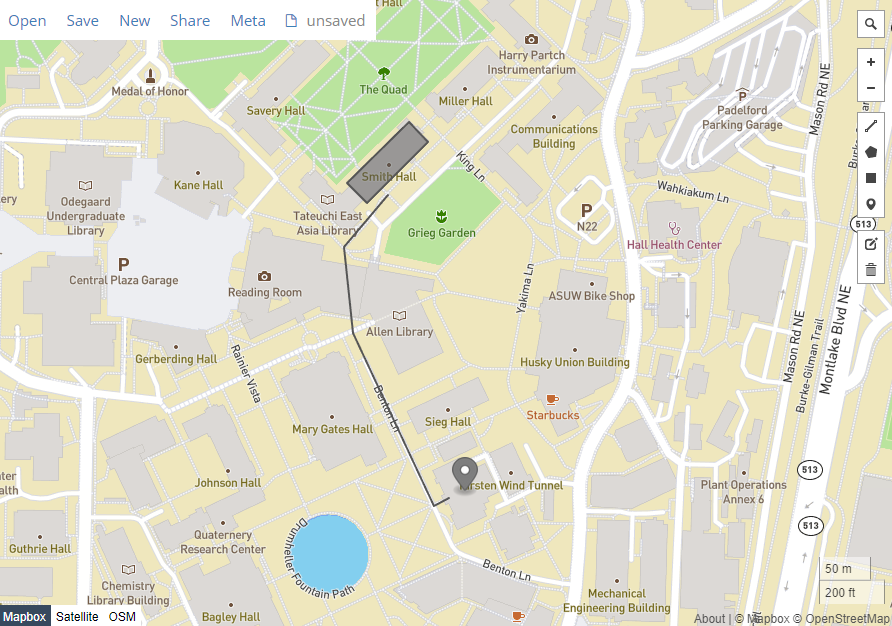
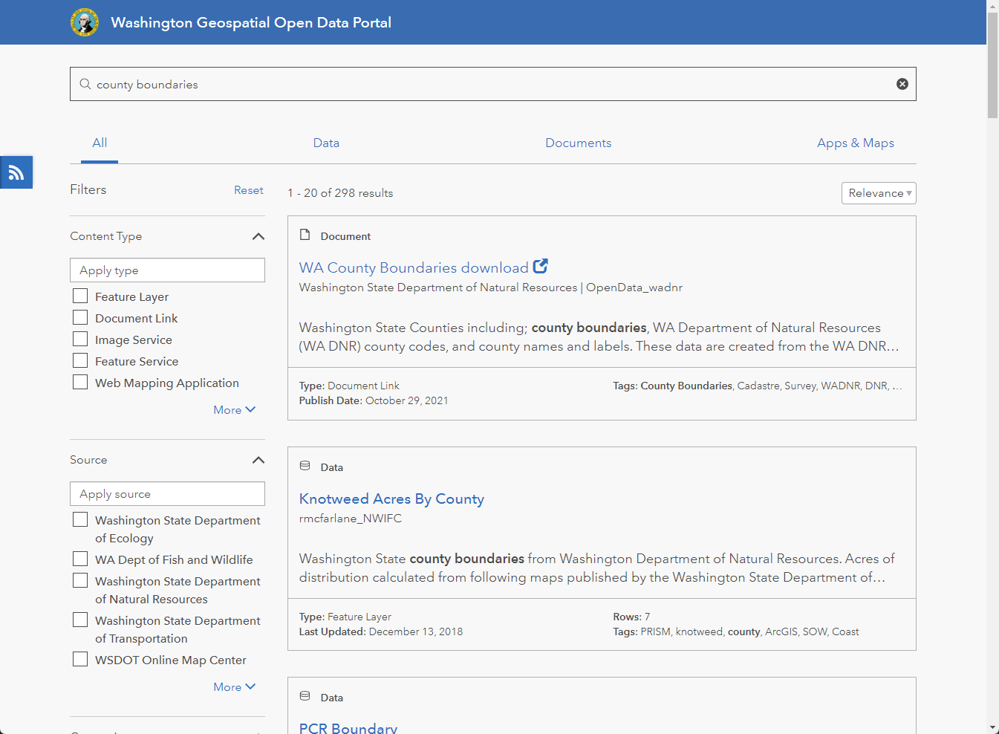
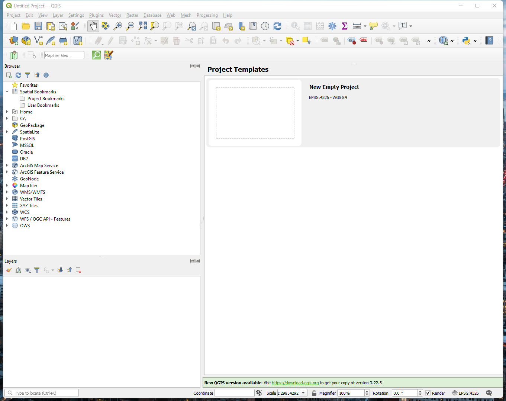
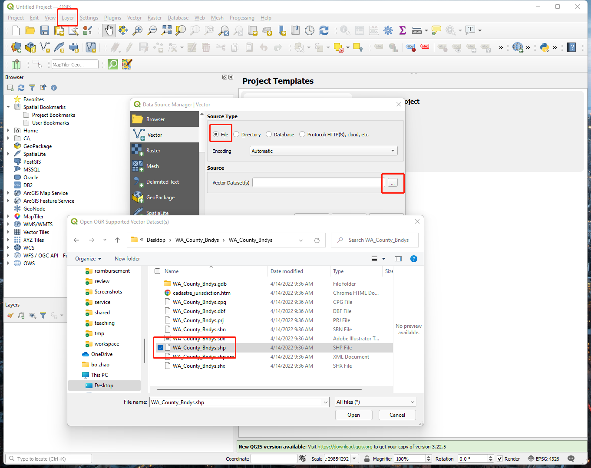
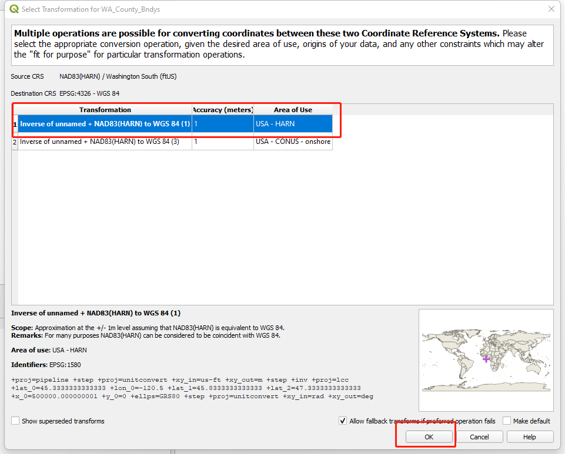
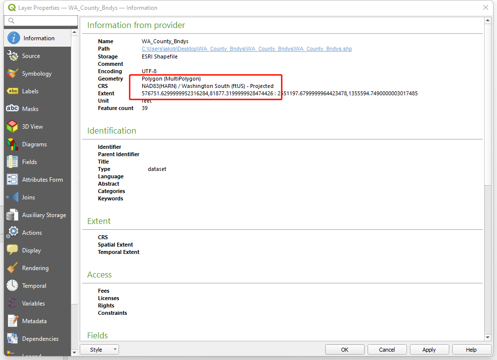
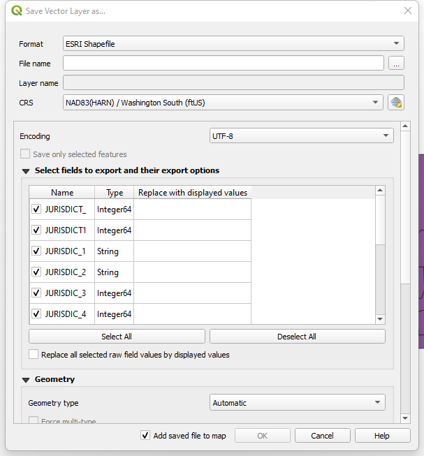
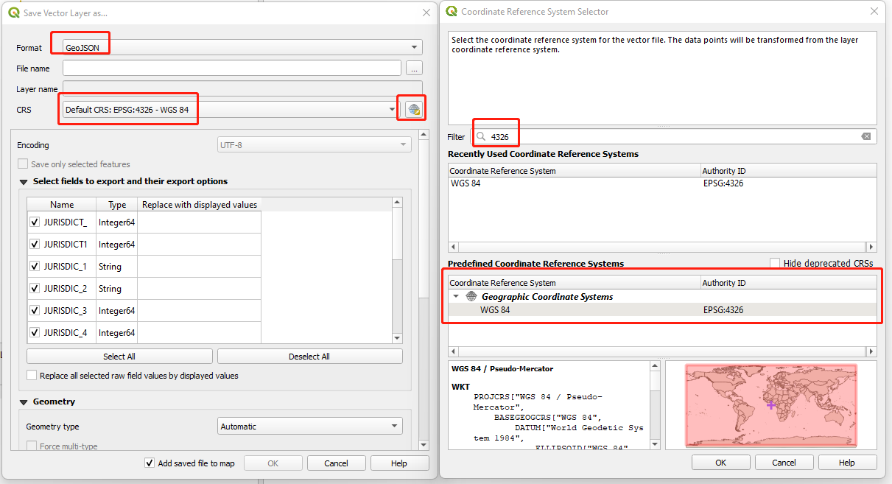
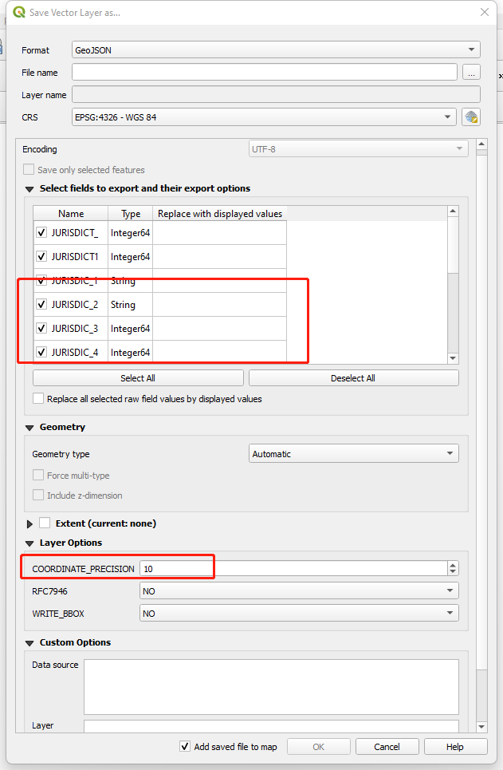
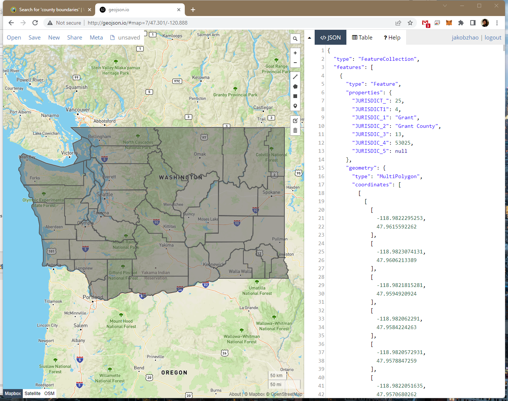

# Geospatial Data for Digital Geographies

**Learning Objectives**

-   Review the data tier in a web mapping architecture;
-   Understand the differences between the file server and the database server;
-   Get to know the major geospatial data formats for web mapping, shapefile, kml, geojson, and topojson;
-   Able to read, edit, display, convert GeoJson files.

## 1. The data tier of your web mapping architecture

In the previous lecture, you learned that system architecture for web mapping includes a data tier. This could be as simple as several shapefiles in a folder on the server, or it could be as complicated as several enterprise-grade servers housing an ecosystem of standalone files and relational databases. Indeed, in our system architecture diagram, I have represented the data tier as containing a file server and/or a database server.

### 1.1 Data tier in system architecture of web mapping

The **data tier** contains your datasets that will be included in the web map. Almost certainly, it will house the data for your thematic web map layers. It may also hold the data for your base maps if you decide to create your own basemap and tilesets. Other times, you will pull in base maps, and quite possibly some thematic layers, from other peoples' servers, relieving yourself of the burden of maintaining the data. For example, some of the accessible thematic base layers are from `Mapbox`, `Google maps`, `Bing maps`, and `OpenStreetMaps`.

Some organizations are uneasy with the idea of taking the same database that they use for day-to-day editing and putting it on the web. There is justification for this uneasiness, for both security and performance reasons. If you are allowing web map users to modify items in the database, you want to avoid the possibility of your data being deleted, corrupted, or sabotaged. Also, you do not want web users' activities to tax the database so intensely that performance becomes slow for your own internal GIS users, and vice versa.

For these reasons, organizations will often create a copy or replica of their database and designate it solely for web use. If features in the web map are not designed to be edited by end-users, this copy of the database is read-only. If, on the other hand, web users will be making edits to the database, it is periodically synchronized with the internal "production" database using automated scripts or web services. A quality assurance (QA) step can be inserted before synchronization if you would prefer for a GIS analyst to examine the web edits before committing them to the production database.

### 1.2 Files vs. Databases

When designing your data tier, you will need to decide whether to store your data in a series of simple files (such as shapefiles, KML, geojson) or in a database that incorporates spatial data support (such as PostGIS or SpatiaLite). A file-based data approach is simpler and easier to set up than a database if your datasets are not changing frequently and are of manageable size. File-based datasets can also be easier to transfer and share between users and machines.

Databases are more appropriate when you have many data to store, the data is being edited frequently by different parties, you need to allow different tiers of security privileges, or you are maintaining relational tables to link datasets. Databases can also offer powerful native options for running SQL queries and calculating spatial relationships (such as intersections).

If you have a long-running GIS project housed in a database and you just now decided to expose it on the web, you will need to decide whether to keep the data in the database or extract copies of the data into file-based datasets.

## 2. Common open formats for spatial data

This section describes in greater detail some of the spatial data formats that have open specifications or are created by open-source software. Note that these refer to files or databases that can stand alone on your hardware. We will cover open formats of web services streamed in from other computers in future lectures.

### 2.1 Open data formats and proprietary formats

In this course, we will use **open data formats; in other words, formats that are openly documented and have no legal restrictions or royalty requirements on their creation and use by any software package**. You are likely familiar with many of these, such as shapefiles, KML files, JPEGs, and so forth. In contrast, **proprietary data formats are created by a particular software vendor and are either undocumented or cannot legally be created from scratch or extended by any other developer**. The Esri file geodatabase is an example of a popular proprietary format. Although Esri has released an API for creating file geodatabases, the underlying format cannot be extended or reverse engineered.

Some of the most widely-used open data formats were designed by proprietary software vendors who made the deliberate decision to release them as open formats. Two examples are the Esri shapefile and the Adobe PDF. Although opening a data format introduces the risk that open source alternatives will compete with the vendor's functionality, it increases the interoperability of the vendor's software, and, if uptake is widespread, augments the vendor's clout and credibility within the software community.

### 2.2 Spatially-enabled databases

When your datasets get large or complex, it makes sense to move them into a database. This often makes it easier to run advanced queries, set up relationships between datasets, and manage edits to the data. It can also improve performance, boost security, and introduce tools for performing spatial operations.

Below are described two popular approaches for putting spatial data into open source databases. Examples of proprietary equivalents include Microsoft SQL Server, Oracle Spatial, and the Esri ArcSDE middleware (packaged as an option with ArcGIS for Server) that can connect to various flavors of databases, including open-source ones.

**PostGIS**

PostGIS is an extension that allows spatial data management and processing within PostgreSQL (often pronounced "Postgress" or "Postgress SQL"). PostgreSQL is perhaps the most fully-featured open-source relational database management system (RDBMS). If a traditional RDBMS with relational tables is your bread and butter, then PostgreSQL and PostGIS are a natural fit if you are moving to open source. The installation is relatively straightforward: in the latest PostgreSQL setup programs for Windows, you check a box after installation, indicating that you want to add PostGIS. An importer wizard allows you to load your shapefiles into PostGIS to get started. The rest of the administration can be done from the pgAdmin GUI program that is used to administer PostgreSQL.

Most open source GIS programs give you an interface for connecting to your PostGIS data. For example, **in QGIS, you might have noticed the button `Add PostGIS Layers`. The elephant in the icon is a symbol related to PostgreSQL. GeoServer also supports layers from PostGIS**.

**SpatiaLite**

SpatiaLite is an extension supporting spatial data in the SQLite database. As its name indicates, SQLite is a lightweight database engine that gives you a way to store and use data in a database paradigm without installing any RDBMS software on the client machine. This makes SQLite databases easy to copy around and allows them to run on many kinds of devices. If you are familiar with Esri products, a SpatiaLite database might be thought of as similar to a file geodatabase.

SpatiaLite is not as mature as PostGIS, but it is growing in popularity, and you will see a button in QGIS called `Add SpatiaLite Layer`. SpatiaLite is a more self-contained and flexible choice than shapefiles, KML, etc., for this type of task.

**MongoDB**

MongoDB is a free and open-source cross-platform document-oriented database program. Classified as a NoSQL database program, MongoDB uses JSON-like documents with schemas. MongoDB’s geospatial indexing allows you to efficiently execute spatial queries on a collection that contains geospatial shapes and points. This tutorial will briefly introduce the concepts of geospatial indexes, and then demonstrate their use with $geoWithin, $geoIntersects, and $geoNear.

### 2.3 File-based data

File-based data includes shapefiles, KML files, GeoJSON, and many other types of text-based files. Each of the vector formats has some mechanism of storing the geometry (i.e., vertex coordinates) and attributes of each feature. Some of the formats, such as KML, may also store styling information.

Below are some of the file-based data formats you're most likely to encounter.

**Shapefiles**

The ESRI shapefile is one of the most common formats for exchanging vector data. It consists of several files with the same root name, but with different suffixes. At a minimum, you must include the .shp, .shx, and .dbf files. Other files may be included in addition to these three when other spatial index or projection information is included with the file.

Mandatory files

| LAYER.shp | Feature geometries     |
| --------- | ---------------------- |
| LAYER.shx | Feature geometry index |
| LAYER.dbf | Feature attributes     |

Other common files

| LAYER.prj               | Projection format  |
| ----------------------- | ------------------ |
| LAYER.sbn and LAYER.sbx | Spatial index      |
| LAYER.dbf               | Feature attributes |

Because a shapefile requires multiple files, it is often expected that you zip them all together in a single file when downloading, uploading, and emailing them. See the [Wikipedia](https://en.wikipedia.org/wiki/Shapefile) for more details about this format.

**KML**

KML gained widespread use as the simple spatial data format used to place geographic data on top of Google Earth. It is also supported in Google Maps and various non-Google products.

KML stands for Keyhole Markup Language and was developed by Keyhole, Inc., before the company's acquisition by Google. KML became an Open Geospatial Consortium (OGC) standard data format in 2008, having been voluntarily submitted by Google.

KML is a form of XML, wherein data is maintained in a series of structured tags. KML is unique and versatile in that it can contain styling information, and it can hold either vector or raster formats ("overlays", in KML-speak). The rasters themselves are not written in the KML but are included with it in a zipped file called a KMZ. Large vector datasets are also commonly compressed into KMZs.

The key XML tag behind KML is the **placemark**. This defines a geographic feature, sometimes with symbol features, and extra information.

```xml
<?xml version="1.0" encoding="UTF-8"?>
<kml xmlns="http://www.opengis.net/kml/2.2">
    <Document>
        <Placemark>
            <name>Gug 220</name>
            <Point>
                <coordinates>-122.30633854866029,47.654266229849185</coordinates>
            </Point>
        </Placemark>
        <Placemark>
            <name>Smith Hall</name>
            <Polygon>
                <outerBoundaryIs>
                    <LinearRing>
                        <coordinates>-122.30760186910629,47.65648847666158 -122.30738997459412,47.65634936317266
                            -122.30673551559447,47.65679199571452 -122.3069393634796,47.6569365279768
                            -122.30760186910629,47.65648847666158</coordinates>
                    </LinearRing>
                </outerBoundaryIs>
            </Polygon>
        </Placemark>
        <Placemark>
            <name>Route 1</name>
            <LineString>
                <coordinates>-122.30716466903687,47.6564089832847 -122.30764210224152,47.65602596804535
                    -122.30754017829894,47.655408079048485 -122.30667114257812,47.6541578251464
                    -122.30651557445526,47.6542156410159</coordinates>
            </LineString>
        </Placemark>
    </Document>
</kml>
```

Open this kml in <http://geojson.io>, you will see how these placemarks look like:




**GeoJSON**

JavaScript Object Notation (JSON) is a structured means of arranging data in a hierarchical series of key-value pairs that a program can read. JSON is less verbose than XML and ultimately results in less of a "payload," or data size, being transferred across the wire in web applications.

Following this pattern, GeoJSON is a form of JSON developed for representing vector features. The [GeoJSON Specification](http://geojson.org/geojson-spec.html) gives some basic examples of how different entities such as points, lines, and polygons are structured.

you can use `.json` or `.geojson` as the extension of a GeoJson file, but you might as well choose to save GeoJSON features into a `.js` (JavaScript) file that can be referenced by your web map. Other times, you may encounter web services that return GeoJSON.

GeoJSON is a widely-used data format for displaying vectors in web maps. It is based on JavaScript object notation, a minimalist and straightforward format for expressing data structures using syntax from JavaScript. In GeoJSON, a vector feature and its attributes are represented as a JavaScript object, allowing for easy parsing of the geometry and fields.

GeoJSON is less bulky than XML-based structures such as KML; however, GeoJSON does not always contain styling information as KML does. GeoJSON's simplicity and loading speed have made it famous, perhaps even trendy, among developers in the open-source world.

Here's what a piece of GeoJSON looks like. GeoJSON vectors are commonly bundled into a unit called a `FeatureCollection`. The `FeatureCollection` below holds the same data as the above kml does. The bulk of the GeoJSON below contains the vertices that define the state outline, but you should also notice an attribute/property - `name`:

```json
{
    "type": "FeatureCollection",
    "features": [{
            "type": "Feature",
            "properties": {
                "name": "Gug 220"
            },
            "geometry": {
                "type": "Point",
                "coordinates": [
                    -122.30633854866029,
                    47.654266229849185
                ]
            }
        },
        {
            "type": "Feature",
            "properties": {
                "name": "Smith Hall"
            },
            "geometry": {
                "type": "Polygon",
                "coordinates": [
                    [
                        [
                            -122.30760186910629,
                            47.65648847666158
                        ],
                        [
                            -122.30738997459412,
                            47.65634936317266
                        ],
                        [
                            -122.30673551559447,
                            47.65679199571452
                        ],
                        [
                            -122.3069393634796,
                            47.6569365279768
                        ],
                        [
                            -122.30760186910629,
                            47.65648847666158
                        ]
                    ]
                ]
            }
        },
        {
            "type": "Feature",
            "properties": {
                "name": "Route 1"
            },
            "geometry": {
                "type": "LineString",
                "coordinates": [
                    [
                        -122.30716466903687,
                        47.6564089832847
                    ],
                    [
                        -122.30764210224152,
                        47.65602596804535
                    ],
                    [
                        -122.30754017829894,
                        47.655408079048485
                    ],
                    [
                        -122.30667114257812,
                        47.6541578251464
                    ],
                    [
                        -122.30651557445526,
                        47.6542156410159
                    ]
                ]
            }
        }
    ]
}
```

In the GeoJSON above, notice the use of several JavaScript objects embedded within one another. At the lowest level, you have a Polygon object. The Polygon object is contained within a Feature object. The feature is part of a `FeatureCollection` object. The GeoJSON specification gives precise details about how these objects are to be structured. It's essential to be familiar with these structures, although you rarely have to read or write them directly. You typically use convenience classes or converter programs that have been developed to simplify the experience of working with GeoJSON.

**TopoJSON**

TopoJSON is an extension of GeoJSON that encodes topology. Rather than representing geometries discretely, **geometries in TopoJSON files are stitched together from shared line segments called arcs**. Arcs are sequences of points, while line strings and polygons are defined as sequences of arcs. Each arc is defined only once but can be referenced several times by different shapes, **thus reducing redundancy and decreasing the file size**. Besides, TopoJSON facilitates applications that use topology, such as topology-preserving shape simplification, automatic map coloring, and cartograms.

A reference implementation of the [TopoJSON specification](https://github.com/topojson/topojson-specification) is available as a command-line tool to encode TopoJSON from GeoJSON (or ESRI Shapefiles) and a client-side JavaScript library to decode TopoJSON back to GeoJSON again. TopoJSON is also supported by the popular OGR tool as of version 1.11 and PostGIS as of version 2.1.0.

```json
{
    "type": "Topology",
    "objects": {
        "collection": {
            "type": "GeometryCollection",
            "geometries": [{
                "type": "Point",
                "properties": {
                    "name": "Gug 220"
                },
                "coordinates": [9999, 390]
            }, {
                "type": "Polygon",
                "properties": {
                    "name": "Smith Hall"
                },
                "arcs": [
                    [1]
                ]
            }, {
                "type": "LineString",
                "properties": {
                    "name": "Route 1"
                },
                "arcs": [0]
            }]
        }
    },
    "arcs": [
        [
            [3662, 8101],
            [-3662, -1379],
            [782, -2223],
            [6666, -4499],
            [1193, 208]
        ],
        [
            [309, 8387],
            [1625, -501],
            [5020, 1593],
            [-1564, 520],
            [-5081, -1612]
        ]
    ],
    "transform": {
        "scale": [1.303683949618544e-7, 2.7789807284704524e-7],
        "translate": [-122.30764210224152, 47.6541578251464]
    },
    "bbox": [-122.30764210224152, 47.6541578251464, -122.30633854866029, 47.6569365279768]
}
```

**Other text files**

Many GIS programs can read vector data out of other types of text files such as .gpx (popular format for GPS tracks) and various types of .csv (comma-separated value files often used with Microsoft Excel) that include longitude (X) and latitude (Y) columns. You can engineer your web map to parse and read these files, or you may want to use your scripting skills to get the data into another standard format before deploying it in your web map. This is where Python skills and helper libraries can be handy.

**Raster formats: GeoTIFF raster image**

Most raster formats are openly documented and do not require royalties or attribution. These include JPEG, PNG, TIFF, BMP, and others. The GIF format previously used a patented compression format, but those patents have expired. Raster data is currently made available in the GeoTIFF format with Deflate compression. See the [GeoTIFF Specification](https://trac.osgeo.org/geotiff/) for more details about this format.

**Map tiles**

Usually, the base maps are stored as tile layers, designed for fast and simple access by web maps. Tile layers are also useful when you need to expose a map or layer on the web for the visualization of relatively static data. Tile layers come in different formats based on the original source data. Tile layers can be stored as prerendered raster tiles or as vector tiles. Both raster and vector tiles are designed to provide high-performance and high-scalability delivery of map data for visualization purposes.

## 3. Geospatial data conversion: Shapefile to GeoJson

This section shows you how to convert a shapefile to a geojson data step by step. Though there are multiple online or desktop-based tools, we could implement the conversion. Here, we would recommend using QGIS, mainly because it is intuitive to understand the conversion process and easy to use. Once you are familiar with QGIS, I believe you will be more confident in switching to other geospatial data conversion tools (e.g., ogr2ogr).

1. Above all, we need to get some geospatial data. So, we download the shapefile of Washington Counties (2015) from the data repository at [Washington Geospatial Open Data](https://geo.wa.gov/). After searching "county boundaries", I can find the url link for downloading this data at https://fortress.wa.gov/dnr/adminsa/gisdata/datadownload/WA_County_Bndys.zip. A copy of this data set has been downloaded to this repository at [assets/WA_County_Bndys.zip](assets/WA_County_Bndys.zip).

2. Unzip the file. You will see a group of files associated to the shapefile named after "WA_County_Bndys".



We are going to transform this group of files into a single, compact format called GeoJSON (<http://geojson.org/>). 

3. Open QGIS.



4. A shapefile is a vector file format. We will add our shapefile to our project through clicking the layer tab on the main toolbar and then 'Add Vector Layer'. Everything in the Source type dialogue can be left as is. Use the browser to navigate to the location of your shapefile. Click open to load the shapefile into QGIS.



5. The pop-up window asks you to select a coordinate system transformation approach. Since there are multiple ways to converting your coordinate reference system, you ned to pick the one which mostly fits your work. In most cases, you can just choose the default option to minimize the uncertainty and measure errors. Once you selected the transformation approach, please press the "OK" button on the bottom right. 



6. In a new QGIS project, the great first question is, what map projection is our shapefile in? Double click on the shapefile in the Table of Contents to pull up the Properties Dialogue Box. In the General tab, under the 'Coordinate reference system', you will see a value `NAD 83 / Washington South` representing our map projection.



For our purposes, we will convert our shapefile into a GeoJson and a geographic projection for web mapping. Currently, it uses the NAD 83 / Washington South project. EPSG is a coded value that is used to identify specific projections, which in this case, is 4269. We want to convert this to 4326, WGS84, a more suitable web mapping projection.

7. Close the Layer Properties page, right click on the layer `WA_County_Bndys`, and then "Export" --> "Save Feature As"



8. In the Save As dialogue, switch the format to GeoJson. Then click the small globe-ish icon to the right of the CRS drop down option. Enter '4326' in the Filter box and select EPSG: 4326. Click OK.



> **Note:** to reduce the size of geospatial data, you can change the coordinate precision. To do that, in the `Layer Options` Section, Please change the precision value to a smaller number. In our case, we use 10 instead of 15. Also, you can deselect those properties you do not want to show in the geojson data.

 

9. Browse to your location and save the file. There is a copy of the geojson data in this repository at [assets/wa_counties.geojson](assets/wa_counties.geojson).


9. The file will be automatically added to the current project view.


1.  Now you can open the geojson file in a text editor (e.g., VS code) to view the JSON structure.


11. And also, you can validate the data on <http://www.geojson.io>.



Now we have a single geojson file opposed to a complicated shapefile structure and a geojson file in a more appropriate for web-based geovisualization.

> Now, Congratulations! you have generate an appropriate geospatial data for web uses! In most cases, a geojson should be smaller than 4 megabytes considering the speed of transferring the data from the server to the client, otherwise, the web map user would take too long to download the data. If your data is still large than 4 megabytes after the optimization strategies we have introduced above, please consider converting the data from geojson to topojson (using [mapshaper](http://www.mapshaper.org/)), or even CSV.

## References:

[1] GeoJson/TopoJson Converter:

-   <http://geojson.io/>
-   <http://shancarter.github.io/distillery/>
-   <http://mapstarter.com/>
-   <http://www.mapshaper.org/>
-   <http://shpescape.com/mix/>

[2] Spatial data on a diet: tips for file size reducation using TopoJSON:
<http://zevross.com/blog/2014/04/22/spatial-data-on-a-diet-tips-for-file-size-reduction-using-topojson/>

[3] <https://gist.github.com/YKCzoli/b7f5ff0e0f641faba0f47fa5d16c4d8d>
