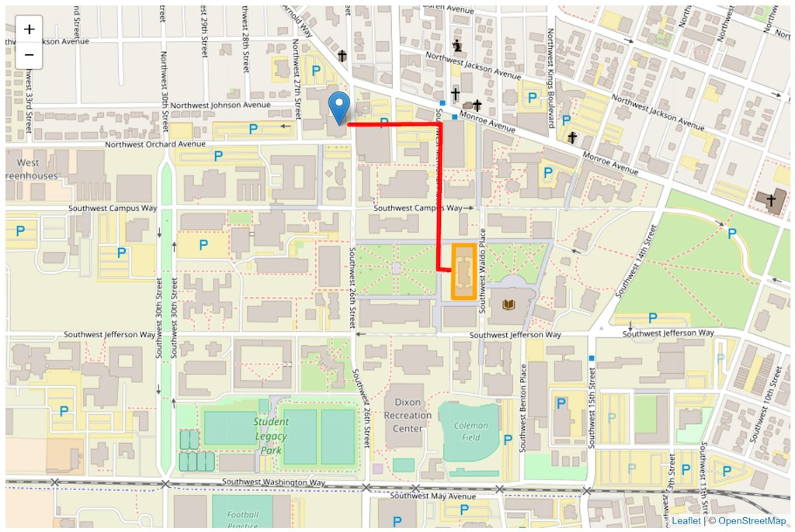
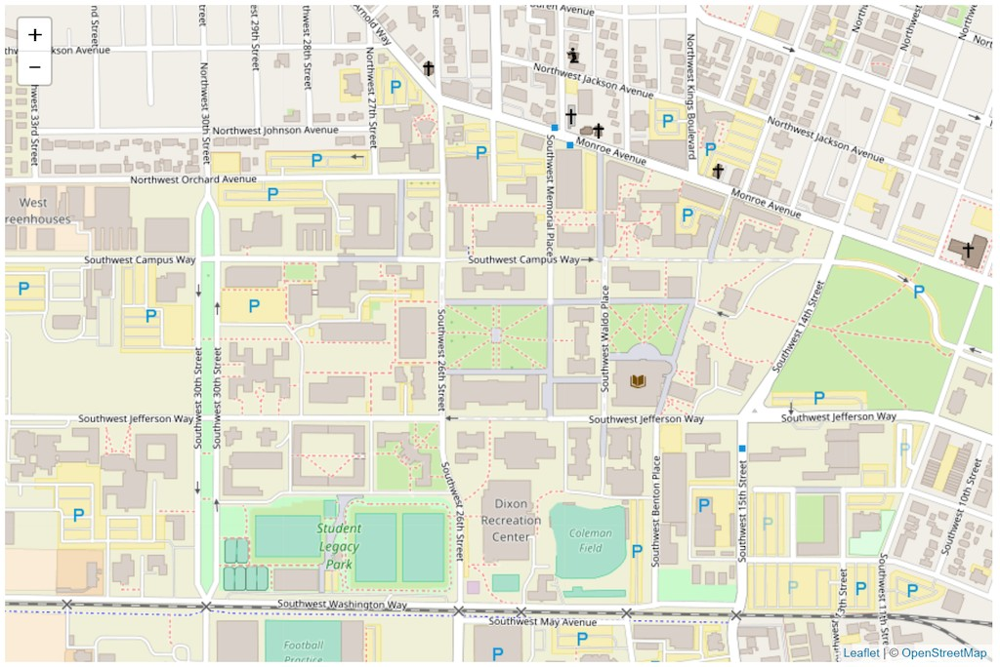
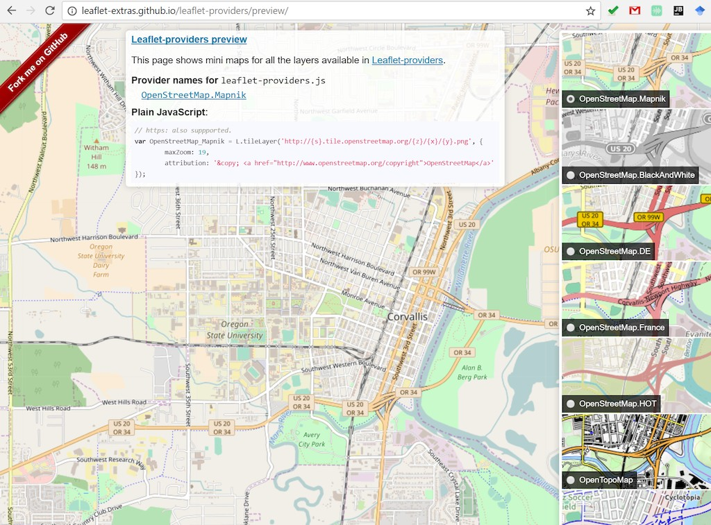
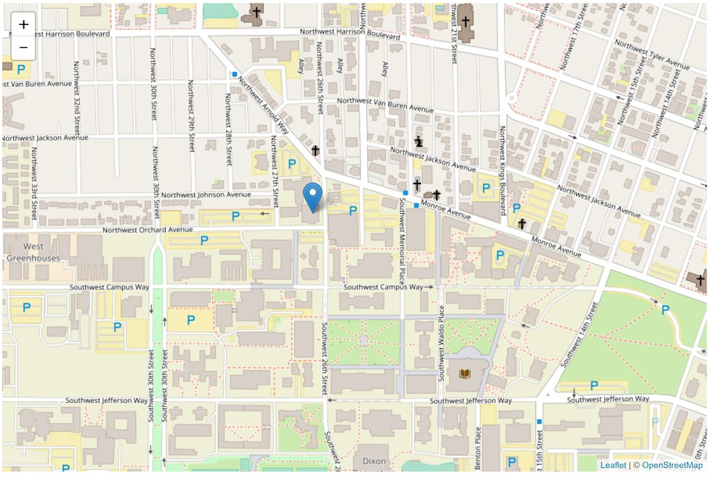
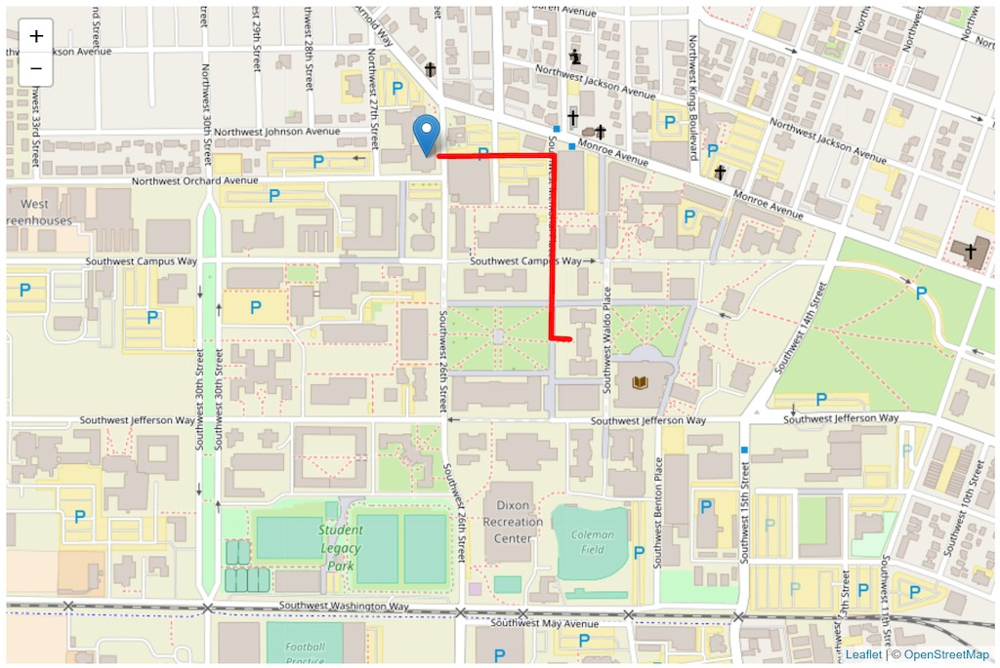

# Map Client I: Basics and Geographic Features


**Learning Objectives**

-   Get to know the most popular web map client library/framework - Leaflet;
-   Use Leaflet to create a map, geographic feature;
-   Link external javascript libs to a web map application; and
-   Add geospatial data to a leaflet based map.

In this lecture, we move forward to make a web map from scratch! To do that, this lecture starts with introducing Leaflet - a Javascript library used to create interactive, web-based, mobile-friendly maps. With Leaflet, you can create a simple map in as little as three lines of code, or you can build complex, dynamic, and complex maps that contain hundreds of lines. This lecture assumes you have worked through the previous lectures and lab exercises and have a working knowledge of HTML, CSS, and JavaScript. Here is the look of the web map we will build.



## 1. Introduction

Leaflet is an open-source JavaScript library for interactive web maps. It's lightweight, simple, and flexible, and is probably the most popular open-source mapping library at the moment. Leaflet is developed by Vladimir Agafonkin (currently of MapBox) and other contributors.

What Leaflet does web maps with tiled base layers, panning and zooming, and feature layers that you supply? It handles various basic tasks like converting data to map layers and mouse interactions, and it's easy to extend with plugins. It will also work well across most types of devices.

What Leaflet does not do: Provide any data for you! Leaflet is a framework for showing and interacting with map data, but it's up to you to provide that data, including a basemap. Leaflet is also not GIS, although it can be combined with tools like **ArcGIS**, **MapBox**, or **CartoDB** for GIS-like capabilities.

-   _If you need total freedom of form, interaction, transitions, and map projections, consider working with something like D3._
-   _If you need a 3D virtual globe, cesium is alternative._

The latest stable Leaflet release is hosted on a CDN — to start using it straight away, place this in the head of your HTML code:

```html
<link rel="stylesheet" href="https://unpkg.com/leaflet@1.4.0/dist/leaflet.css" />
<script src="https://unpkg.com/leaflet@1.4.0/dist/leaflet.js"></script>
```

## 2. Project Preparation

The first step is to create a project working directory which holds all the files. To do that, we will create a project repository on GitHub, and then sync the empty repository to your **working space** on local computer. If you have any questions on how to conduct the above-mentioned operations, please refer to lab 1.

## 3. Create a Webpage and Simple Map

### 3.1 Setup a web page for our map

Open up your Atom, and then we set up an empty **index.html** template for our web page that will contain our web map and web map elements. The components will be the same as always, note the head, title, and body.

Enter the following code into your blank HTML page.

```html
<!DOCTYPE html>
<html>
<head>
    <title>Leaflet Map</title>
</head>
<body>
    <!-- Our web map and content will go here -->
</body>
</html>
```

From here, we will do the following four things to add a map to our page:

-   Reference the Leaflet CSS and JavaScript files.
-   Add a `div` element to our page that will hold the map.
-   Create a map object in Javascript that will interact with the map `div` element
-   Add the tiled OpenStreetMap basemap to our map object using tileLayer

### 3.2 Reference the leaflet CSS and JavaScript files

We need to load Leaflet into our web page before we can start using the library. There are two options for doing this, we can download the library files from the Leaflet download site, or we can use the hosted version. We are not planning on changing the JavaScript or the CSS, so it is easiest to use the hosted libraries. Reference these in your HTML by adding the following lines of code.

Within the head section, after the title, copy and paste the following. This adds the Leaflet CSS file to our web page and includes Leaflet styles.

```html
<!-- External Stylesheets -->
<link rel="stylesheet" href="https://unpkg.com/leaflet@1.4.0/dist/leaflet.css" />
```

Link to the JavaScript library at the bottom of the body section of our site, putting it at the bottom allows our page to load faster. Copy and paste the following. This adds the Leaflet JS file to our web page and is the Leaflet Javascript library.

```html
<!-- Add the Leaflet JavaScript library -->
<script src="https://unpkg.com/leaflet@1.4.0/dist/leaflet.js"></script>
```

We can now begin working with the Leaflet library.

### 3.3  Add a map `div`

Add a div to the body that will hold the map. This is just like any other div element we might use. We will set the style right in the div using the style attribute and not the CSS file. Otherwise, all map divs we create will have the same styling.

```html
<div id="map" style="width: 900px; height: 600px"></div>
```

### 3.4 Use Javascript to create the map object

Now we can start coding the map using JavaScript. The Leaflet library is referenced by using `L`, followed by the class. The first step is to create the map object using the map class. Set the variable map to be our Leaflet map object. More reading on L.map can be found in the extensive Leaflet documentation. Set the center of the map to be at the Memorial Union Quad  `(44.56576, -123.27888)` and zoom level to `14`. Enter the following in our document at the end of the body section.

```html
<script>
    // Create variable to hold map element, give initial settings to map
    var map = L.map('map',{ center: [44.56576, -123.27888], zoom: 16});
</script>
```

> **Note:**
>
> -   the `script` tags, this is where we will will put all of our JavaScript for the map.
> -   Where did I get my Lat/Lng values? **A quick tip is that you can find it on [Google Maps](http://maps.google.com)**, right clicking on a location on the map, and selecting 'What's here?'. This will provide latitude and longitude values for that location you can then copy.

### 3.5 Add a tiled basemap with tileLayer class

The last step in getting a basic map running is to add a layer. We are going to use what is called a tile layer, which is a fundamental technology behind many web maps. There are many tile layers you can add to your maps. The one we are going to use today is from OpenStreetMap. To add a tile layer to the map, we use the L.tileLayer class. Place the following code within your script tags.

```html
// Add OpenStreetMap tile layer to map element
L.tileLayer('http://{s}.tile.osm.org/{z}/{x}/{y}.png', {
    attribution: '&copy; <a href="http://www.openstreetmap.org/copyright">OpenStreetMap</a>'
}).addTo(map);
```

> Note the attribution. Here we can provide a reference for the source of the base map and any other attribution for map elements we want to provide. It will appear in the lower right corner of our map by default, but you can change this. Read more about attribution here.

**Base Map**

Save your HTML document and open your web browser to your localhost server (<http://localhost:8000>). You will see the map we just created! Or you can open this map through the internal web server of Webstorm. After you synchronize your data with Github, you can even see your web map on the Github page website.




**Other base map sources**

There are a number of resources that have tile layers you can use with Leaflet JS. An excellent resource for examining and previewing tile layers is called Leaflet Provider. Scan [through available tile layers and preview them](http://leaflet-extras.github.io/leaflet-providers/preview/), and try replacing the L.tileLayer with one of the other tile layers in your code.



> **Loading a WMS** You can also add Web Map Services to your Leaflet maps using [L.tileLayer.wms](http://leafletjs.com/reference.html#tilelayer-wms). Web Map Service is a major topic of this course. We will learn how to create web map services in the following classes of this term.

## 4. Add Individual data to web map

To introduce adding data, we will learn how to add markers, polylines, and polygons to our map. There are multiple methods for adding data, including methods in which you can use large datasets. Before getting ahead of ourselves, though, this section will show how you can simple points, polylines, and polygons to your map.

### 4.1 Adding Points (aka Markers)

To add a point to your map, we use the `L.marker` class. To add a point, we specify a latitude and longitude, then add the marker to our map. Enter the following line of code in the script block in the body section of the document, following the tile layer.

```js
// Create point feature for Wilkinson Hall
var myDataPoint = L.marker([44.56822, -123.28034]).addTo(map);
```



### 4.2 Adding Polylines

To add a polyline (a line that can have multiple segments) to your map, we use the `L.polyline` class. Just like with the marker, we use latitude and longitude to add the line vertices. An important difference, however, is that we need to add color and weight if we don't add weight, you won't be able to see the line. You can set style options in brackets after the array of line vertices.

>  **NOTE:** the polyline is formed by an array, and draws in that order. Enter the following into our script.

```js
// Create line feature for the Route from Wilkinson Hall to Strand Ag Hall, style and add to map
var myDataLine = L.polyline([[44.5656915, -123.2775289], [44.5656992, -123.2778923], [44.5662266, -123.2778722], [44.5682559, -123.2778293], [44.5682445, -123.2800823]],
    {color: 'red', weight: 5}).addTo(map);
```



### 4.3 Adding Polygons

Adding polygons is very similar; we use the L.polygon class. Specify a latitude and longitude for each node, then add to our map. Set the style just the same. Enter the following in our script.

```js
// Create area feature for Strand Ag Hall, style and add to map
var myArea = L.polygon([[44.5651985, -123.2769978],[44.566131, -123.2769978], [44.5661339, -123.2775027], [44.5651985, -123.2775182], [44.5651985, -123.2769978],],
    {color: 'orange', weight: 5}).addTo(map);
```

Save your document and refresh your browser.


### 4.4 Other Simple Vector Data Types

There are a number of other simple data types and groups you can add, read more about them in the Leaflet documentation. These include:

-   [Path](http://leafletjs.com/reference.html#path)
-   [MultiPolyline](http://leafletjs.com/reference.html#multipolyline)
-   [MultiPolygon](http://leafletjs.com/reference.html#multipolygon)
-   [Rectangle](http://leafletjs.com/reference.html#rectangle)
-   [Circle](http://leafletjs.com/reference.html#circle)
-   [CircleMarker](http://leafletjs.com/reference.html#circlemarker)

### 4.5 Feature Groups and GeoJSON

Leaflet also supports adding groups of features using a class called [L.featureGroup](http://leafletjs.com/reference.html#featuregroup). If we wanted, we could have restructured our code to the point, line, and polygon above by placing them all in a feature group.

Additionally, Leaflet is designed to work natively with GeoJson. We will look at how to get GeoJson to a Leaflet Map later.

> **Note:** once you write up your codes

## References:

[1] <http://duspviz.mit.edu/web-map-workshop/leaflet-js/>
