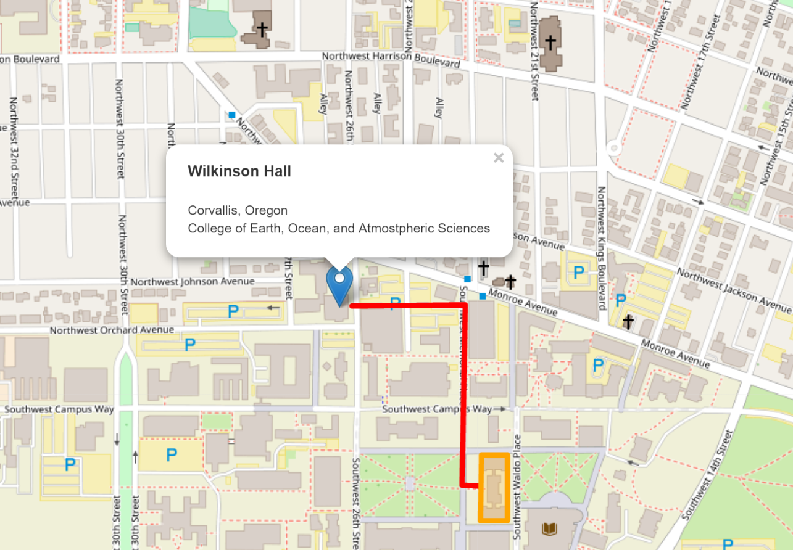
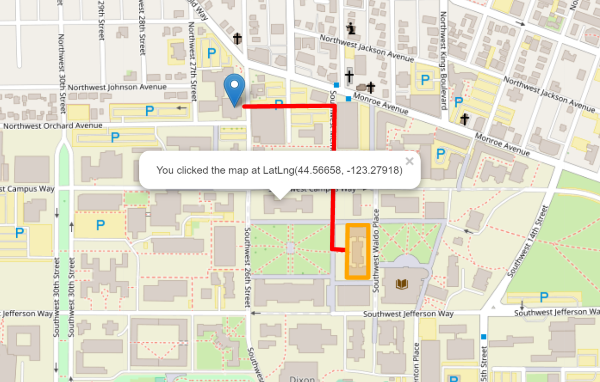
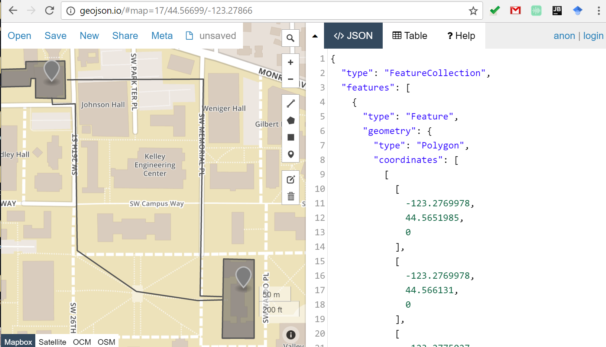
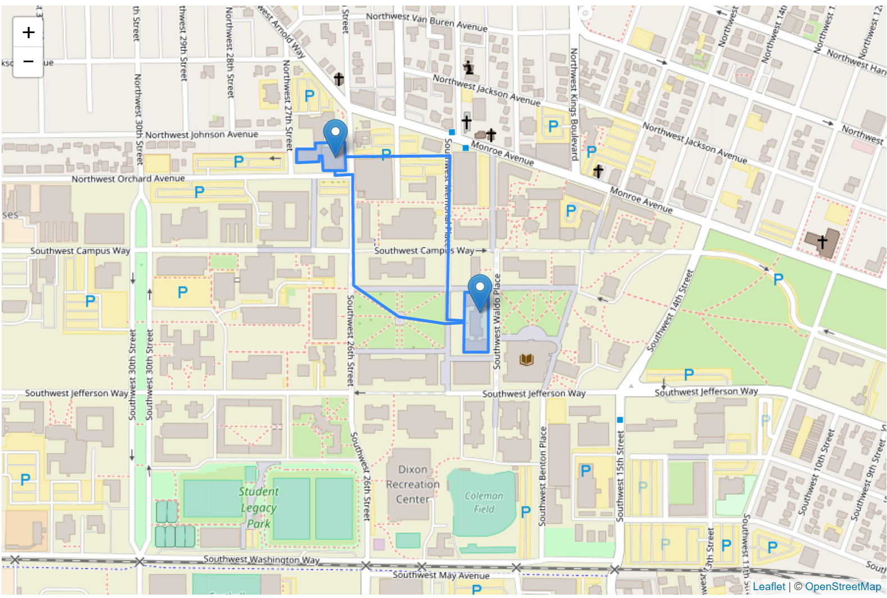
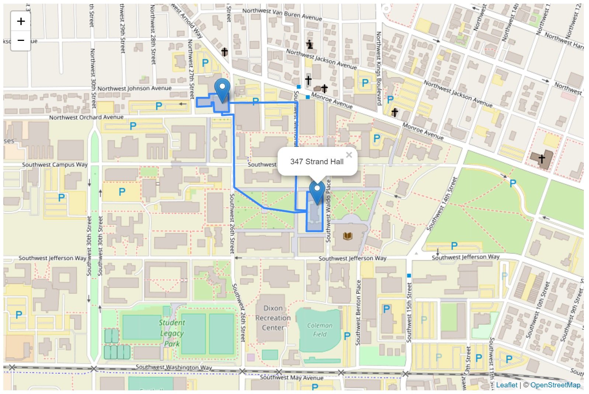

# Map Client II: Map Events and Mashup

> Winter 2019 | Geography  | Web Mapping
>
> **Instructor:** Bo Zhao | **Location:** WLKN 210 | **Time:** MWF 0800 - 0850

**Learning Objectives**

- Add interactive elements;
- Understand the basics of map events; and
- Use JQuery to add GeoJSON to a Map.

## 1. Add Interactivity with Pop ups

Leaflet makes it easy to add pop ups to your place markers (points). Pop ups are a simple way to add interactivity to your map. When a viewer clicks on the pop up, information will be displayed. Pop ups are included by binding them to the marker or feature that you wish to apply a pop up on. When the visitor clicks on this feature, the bound pop up will appear.

### 1.1 Add a pop up to our marker layer

There is a marker sitting on our map at Wilkinson Hall. Let's add a popup that tells us this is Wilkinson Hall. The simplest way to add a pop up is to use the bindPopup method of `L.marker`. Enter the following code snippet in your script block in your HTML document, and we will step through what is happening.

```js
// Bind popup to Data Point object
myDataPoint.bindPopup("This is Wilkinson Hall.");
```

Save and refresh your map. Click on the marker. You will see a pop up stating "This is Wikonson Hall." appear. bindPopup is 'method' of our marker object class, just like `addTo('map')` we used above. Methods are actions that can be performed on objects, and marker is an object. Also note, within the quotations where we wrote "This is Wilkinson Hall.", we can write HTML as content. Change the code to the following, and see what happens.

```js
// Bind popup to data point object
myDataPoint.bindPopup("<h3>Wilkinson Hall</h3><p>Corvallis, Oregon<br>College of Earth, Ocean, and Atmostpheric Sciences</p>");
```



This means, within our popup, we can add links, images, lists, and many other HTML elements. This can also include pictures. Also, we can even include videos, tweets, and etc.

> **Question:** How can we add a YouTube clip to the pop-up info windows?

### 1.2 Add pop ups to our other data features

Just like with the marker object, we can add pop ups to our other features using the bindPopup method. Use the variable that we set the feature to (e.g., `var = myDataPoint; var = myDataLine; and var = myArea;`) as the object, then use `bindPopup`. Enter the following block of code in your script tags, after the other code.

```js
// Bind popup to line object
myDataLine.bindPopup("The route from Wilkinson Hall to Strand Ag Hall.");
// Bind popup to area object
myArea.bindPopup("Strand Ag Hall");
```

Save and refresh. Click on the data features to see the pop ups in action.

## 2. Map Events

What the map does when a user interacts with it and its various components is called an Event. A pop up is a very basic built-in event, but there are many other events that Leaflet can handle. The main one we will focus on here is what happens when a visitor clicks on the map, or what happens when there is a "Mouse Event". When a visitor clicks on the map, you can return a handful of different properties. One of them is latitude and longitude, making it easy to add simple functionality that will return latitude and longitude of the location where the mouse was clicked.

### 2.1 Find Latitude and Longitude of a Mouse Click

To complete that task, we need to do a couple of things.

1. Add an empty pop up object to our map.
2. Write a function that creates a pop up.
3. Tell the map that when it is clicked, run this function.

The following snippet of code does just that. Read through it and see how it addresses each step. Enter this into document in between the script tags.

```js
// Create an Empty Popup
var popup = L.popup();

// Write function to set Properties of the Popup
function onMapClick(e) {
    popup
        .setLatLng(e.latlng)
        .setContent("You clicked the map at " + e.latlng.toString())
        .openOn(map);
}

// Listen for a click event on the Map element
map.on('click', onMapClick);
```

Let's break this down a bit. First we created our empty pop up object using `L.popup()`. The next part is a JavaScript function. A JavaScript function is a block of code designed to perform a particular task and is executed when calls it.



### 2.2 More information on Javascript functions.

In this case, the function changes the properties of the pop up, or in our case, sets them, because the pop up object is empty. It **(a)** sets the lat and lng of the pop up to the location of the mouse click, **(b)** sets the content of the popup to say what that location is (has to convert it to a string to do so), and then **(c)** opens the popup on the map. Finally, the last piece, is an event on the map object that says on click, run the function onMapClick. Complex, yet surprisingly simple all at once.

Save and refresh. Click on the data features to see the pop ups in action.

More on events is found in the [Leaflet documentation](http://leafletjs.com/reference.html), under each object, look at the events and properties that are available for you to utilize and manipulate.

## 3. Use leaflet-ajax plugin to add a GeoJSON

Learning the fundamentals of adding small datasets to our map along with some basic interactivity is important, but often times you will be adding larger datasets to our maps, sometimes containing hundreds of features. Leaflet is designed to work natively with a data format called GeoJSON. GeoJSON is JavaScript object that contains geographic data. This might not make sense right now, and that is fine, we will discuss JavaScript in depth in the next session. But for now, lets look at one way to load a GeoJSON into our map.

**The GeoJSON**

In the downloaded materials, there is a data folder `assets` that contains a file called **"geog.geojson"**. This is a dataset of several geographic features containing the lecture, lab, and office hour location of the course Geography 371, and the route linking the lecture and lab location to the office hour location.  Open up the GeoJSON in webstorm or other IDEs to see what a GeoJSON looks like. Also, you open this geojson file by a web application at http://www.geojson.io.  As shown below.



### 3.1 Use leaflet.ajax JavaScript Library

The first thing is add a super useful JavaScript library called `jQuery` to our page. leaflet.ajax makes it easy to manipulate a web page by finding elements on the page, setting their styles and properties, handling interaction events, and more. It has a nice helper method, called `getJson()`, we will to use to load our GeoJSON file onto our map.

Enter the following line of code at the bottom of the body section to add the jQuery library to our page after the lines that add the Leaflet JavaScript library.

```html
<head>
    ...
     <!-- External Stylesheets -->
     <link rel="stylesheet" href="https://unpkg.com/leaflet@1.2.0/dist/leaflet.css"/>
     <!-- Add the Leaflet JavaScript library -->
     <script src="https://unpkg.com/leaflet@1.2.0/dist/leaflet.js"></script>
     <script src="https://cdnjs.cloudflare.com/ajax/libs/leaflet-ajax/2.1.0/leaflet.ajax.min.js"></script>
</head>
<body>
    ...
     <!-- HTML Page Elements are here -->
     <script> ... </script>
</body>
```

### 3.2 Add the GeoJSON


To add the GeoJSON to the map, use `L.geoJson.ajax()` function. Simple enough right?

Add the following code to your `script`, between the script tags.

```js
// load GeoJSON from an external file
L.geoJson.ajax("assets/geog.geojson").addTo(map);
```

Simple enough right? Click save and refresh your page to see the GeoJSON added to the map.



### 3.3 Add Popups to Show the feature name

We can see the points, but they might not be very useful without adding popups. We can add popups in a very similar manner as above, except since we are using a full dataset, it doesn't make much sense to add them one by one. The `L.geoJson` object has a option called `onEachFeature` that runs a function on each feature when it is added to the map. We can use this to run a function that adds a popup to each feature when it is added to the map. The syntax, which goes in brackets after we specify the data we are adding, looks like the following. Enter this into your `L.geoJson` functions.

```js
// load GeoJSON from an external file
L.geoJson.ajax("assets/geog.geojson", {
    onEachFeature: function(feature, layer) {
        layer.bindPopup(feature.properties.name);
    }
}).addTo(map);
```

Once entered, save and refresh your page. Click on one of the popups, you will see the name of the feature appear.



### 3.4 Add other data formats

There are also a couple of very useful plugins, one called [Leaflet Omnivore](https://github.com/mapbox/leaflet-omnivore), that can read in other data formats, and [Leaflet Shapefile](https://github.com/calvinmetcalf/leaflet.shapefile), that will add a shapefile to your map. We will cover these at a later date, when we look at plugins and the additional capabilities they add to Leaflet.

## 4. Concluding remarks

To wrap up, lets leave it here for this lesson. We covered the majority of fundamentals for creating, adding data, and displaying a Leaflet map. Continue to explore [the documentation on the Leaflet site](http://leafletjs.com/reference.html) to see what you can do with the various elements of the map we worked on in this session.
