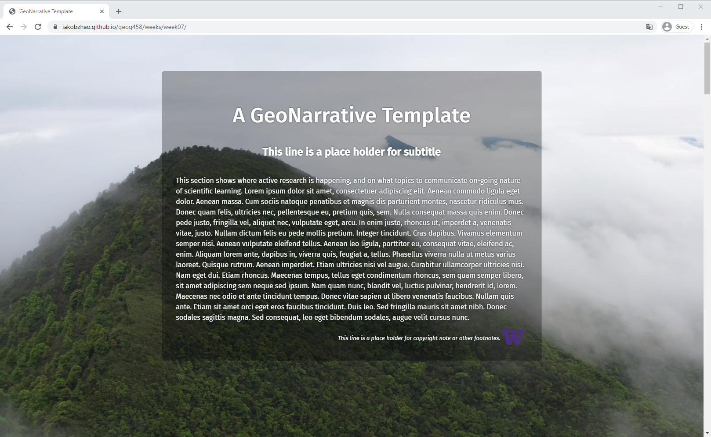
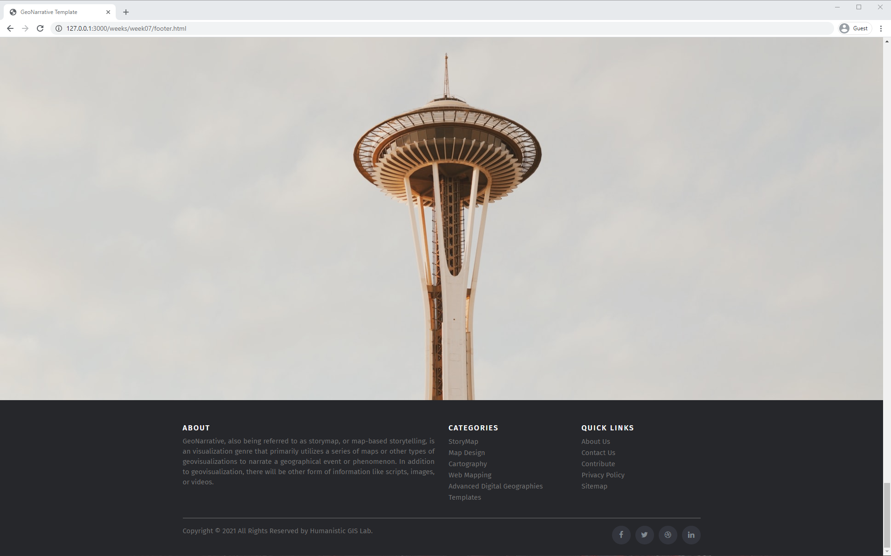

## Creating an Online GeoNarrative

**Learning Objectives**

- the fundamental concepts relavent to online GeoNarrative;
- Make a Cover Page with a fullscreen image or video;
- Make a customized footer using Bootstrap;
- Apply a story using GeoNarrative; and
- Understand the data-attribute.

In this lecture, you will learn how to create a online Geo-Narrative. A GeoNarrative application, also being referred to as storymap, or map-based storytelling, is an visualization genre that primarily utilizes a series of maps or other types of geovisualizations to narrate a geographical event or phenomenon. In addition to geovisualization, there will be other form of information like scripts, images, or videos. This lecture mainly provides an online GeoNarrative template which can help you to make your own geo-narrative applications. To review the geo-narrative template, please visit [this link](https://jakobzhao.github.io/geog458/weeks/week07).



An online GeoNarrative is organically integrated by several scenes. Each scene consists of a web map and a script. You can manipulate the map by zooming, panning, and even adding more thematic layers. This library embodies the concept responsive web design, meaning the GeoNarrative can be shown on either desktop or mobile devices.

## 1. Prerequisite

To make the geo-narrative library robust and lightweight, we select as fewer prerequisite libraries as possible, and prioritize the use of open source or free libraries.

### 1.1 Required Libraries

- jQuery: is a JavaScript library that greatly simplifies JavaScript programming.

- [Scrollama](https://github.com/russellgoldenberg/scrollama): is a modern & lightweight JavaScript library for scrolly telling using IntersectionObserver in favor of scroll events.

- Leaflet: provides a popular map framework. You can also use MapBox, ESRI javascript API, Cesium, other map/virtual globe frameworks.

- `optional`[Font Awesome 4.7](https://fontawesome.com/v4.7.0/icons/): offers a very large set of icons for multiple usages.

- `optional`Google Fonts: provides customized web fonts which you can externally link from Google servers.

- `optional` Bootstrap 4: provides additional web components, such as navigation bar, footer, etc.

- `optional` Chroma: makes color ramps for automatically generating map color schema.

### 1.2 Image and Video Resources:

[Unsplash](https://unsplash.com/), [Pexels](https://www.pexels.com/), and [Pixabay](https://pixabay.com/).

### 1.3 Data and basemaps

## 2. Instructions

Below, we will walk through the major parts relevant to generating a GeoNarrative.

### 2.1 GeoNarrative Structure

A GeoNarrative application is organized as a sequence of scenes, and the scenes are associated with maps. Each map is mashed up by layers, and the layers can be any types of layers that leaflet.js or other geovisualization libraries support. Below shows the tree structure of this story map library.

```powershell
A GeoNarrative
│
├───Scene 1: Setup
│      │──── Script 1 (e.g., text, video, image, audio, etc.)
│      │──── Map 1
│             │
│             │──── Layer 1
│             │──── Layer 2
│             │──── Layer N
├───Scene 2: Confrontation
│... ... ... ... ... ... ...
│... ... ... ... ... ... ...
│... ... ... ... ... ... ...
├───Scene N: Resolution
│      │──── Content 5
│      │──── Map 5
│             │
│             │──── Layer 1
│             │──── Layer 2
│             │──── Layer N
```

### 2.2 Setup and Libraries

First of all, create an empty repo to manage the GeoNarrative project, and then generate the main folders like `js`, `css`, `assets`, `img` to manage relevant documents.


Moreover, create an empty html document `index.html` to start the coding. In the index.html document, please initialize the fundamental page structure as below.

```html
<!DOCTYPE html>
<html lang="en">
<head>
    <meta charset="UTF-8">
    <title>Hello World!</title>
</head>
<body>

</body>
</html>

```

Then, in the head element, please include all the required stylesheets and javascript. Please make sure to add stylesheets ahead of those javascript libraries.

```html
  <link rel="stylesheet" href="https://cdnjs.cloudflare.com/ajax/libs/font-awesome/4.7.0/css/font-awesome.css" />
  <link rel="stylesheet" href="https://fonts.googleapis.com/css2?family=Fira+Sans:ital,wght@0,400;0,500;1,400;1,500&display=swap" />
  <link rel="stylesheet" href="https://cdnjs.cloudflare.com/ajax/libs/leaflet/1.7.1/leaflet.min.css" />
  <link rel="stylesheet" href="css/main.css" />

  <script src="https://cdnjs.cloudflare.com/ajax/libs/jquery/3.5.1/jquery.min.js"></script>
  <script src="https://cdnjs.cloudflare.com/ajax/libs/scrollama/2.2.1/scrollama.min.js"></script>
  <script src="https://cdnjs.cloudflare.com/ajax/libs/leaflet/1.7.1/leaflet.min.js"></script>

```


As we introduced above, a GeoNarrative is made up by several scenes. In the html document, each scene is held by an `article` element, and all the scenes are under a `section` element. Also, a storyboard is defined and held by a `div` element. This storyboard element anchors to the browser view window and functions as the container for the map object as well as other main graphic objects.

Ahead of all the scenes, another `section` can be defined to hold a cover page or landing page, and to the end, a footer can be held by one more `section` can be used to hold the footer. Therefore, a basic geo-narrative html placeholder is:

```html
<section id="cover">
</section>

<section id="geonarrative">
  <div id="storyboard">
    <div id="map"></div>
  </div>

  <article class="scene" data-scene="0">
  </article>
  <article class="scene" data-scene="1">
  </article>
  <article class="scene" data-scene="2">
  </article>
  ... ... ... ...
  ... ... ... ...
  ... ... ... ...
  <article class="scene" data-scene="n">
  </article>
</section>

<section id="footer">
</section>

```

Associated with the main html document, the stylesheets are stored in the file `css/main.css`.

Above all, make the map occupies the full screen.

```css
html,
body,
#map {
  width: 100%;
  height: 100%;
  margin: 0;
  font-family: 'Fira Sans', sans-serif;
}
```

Also, the storyboard needs to stick to the main window of the browser.

```css
#storyboard {
  position: -webkit-sticky;
  position: sticky;
}
```

The following code block makes the footer extends to the left, right and bottom edge of the GeoNarrative.

```css
#footer {
  width: 100%;
  height: 30vh;
  color: white;
  background: #fff;
  background-color: rgba(0, 0, 0, 0.3);
}
```

> Notably, the cover and footer element are optional. It depends on whether the GeoNarrative needs such a component or not.


### 2.3 Cover Page

#### 2.3.1 Content on the page

the cover page will introduce the GeoNarrative to the online visitors. Usually, it will contain

- a title
- a subtitle
- a short description or a synopsis of the GeoNarrative,
- authors and their affiliations
- social media components that enable visitors to share it with others on Facebook, twitter and etc, or
- footnotes.

For example, in the template, the structure of the cover page is like:

```html
<section id="cover">
  <div id="intro">
    <h1>A GeoNarrative Template</h1>
    <h5>This line is a place holder for subtitle</h5>
    <p>This section shows where active research is happening, and on what topics to communicate on-going nature of scientific learning. Lorem ipsum dolor sit amet, consectetuer adipiscing elit. Aenean commodo ligula Donec sodales sagittis magna. Sed consequat, leo eget bibendum sodales, augue velit cursus nunc.</p>

    <div class="footnote">
      <span> This line is a place holder for copyright note or other footnotes.</span>
      <a target="_blank" href="https://www.uw.edu"> </a>
    </div>
  </div>
</section>

```

First, make the cover page occupise the full screen.

```css
#cover {
  width: 100%;
  height: 100%;
  background: #fff;
  background-color: rgba(0, 0, 0, 0.3);
}
```

Specific style items relevant to the cover page content are defined.

```css

#intro {
  position: relative;
  top: 32%;
  left: 50%;
  transform: translateX(-50%) translateY(-32%);
  width: 50%;
  color: #fff;
  padding: 2rem;
  border-radius: 5px;
  background-color: rgba(0, 0, 0, 0.3);
  text-shadow: 0 0 3px rgba(0, 0, 0, .95);
}

#intro .footnote {
  text-align: right;
}

#intro .footnote a {
  margin-right: 0.5rem;
  vertical-align: top;
}

#intro .footnote span {
  position: relative;
  bottom: -0.5rem;
  color: #fff;
  text-shadow: 0 0 3px rgba(0, 0, 0, .95);
  font-style: italic;
  font-size: small;
}

```

#### 2.3.2 Background

For modern cover pages, the above-listed items are usually shown on a background of video or images. Certainly, you can generate a multimedia with your own smartphone or camera. As an alternative, you can also find some free resources online from [Unsplash](https://unsplash.com/), [Pexels](https://www.pexels.com/), and [Pixabay](https://pixabay.com/).


It is necessary for any online project to be cautious to the size of data being transferred from the server to their clients. On a normal internet environment, I recommend a) a png or jpg image in a size around 1920*1080 or b) an mp4 video in a HD resolution (1280*720) for no more than 10 seconds. As my own preference, I put the image to the `img` folder whereas the video to the `assets` folder.

**If the background is a video**, please add a video element to the child of the cover page element. the video is included as the value for the `src` property of the `source` element. Often, we need to make the video autoplay, mute its sound and play in a loop. So, such properties are defined in the `video` element as shown below.

```html
<section id="cover">
  <video class="fullscreen canvas-center" playsinline="" autoplay="" muted="" loop="">
    <source src="assets/intro.mp4" type="video/mp4">
  </video>
  <div id="intro">
      ... ... ... ...
      ... ... ... ...
      ... ... ... ...
  </div>
</section>

```

Associated with the `video` element, a few style items like Fullscreen and canvas-center are defined too.

```css
.canvas-center {
  top: 50%;
  left: 50%;
  transform: translate(-50%, -50%);
}

.fullscreen {
  position: fixed;
  min-height: 100%;
  min-width: 100%;
}
```

**If the background is an image,** you simply need to add two style properties (backgruond and background-size) to the cover page element as below. In the background, please link to the path of the background image. To see how the fullscreen background image works, please refer to this [link](http://jakobzhao.github.io/geog458/weeks/week07/image.html).

```css
  background: url('img/background.jpg') no-repeat center center;  background-size: cover;
```

### 2.4 Scene

For the content of a scene element, you need to put it in its corresponding html format within the `article` tag. The content could be pure text, image, iconic illustrator, and so on. Usually, most content will be shown in a scrollable script panel. This panel can be placed to different regions of the view window of a browser. Below is the basic structure of a scene.

```html
<article class="scene" data-scene="0">
  ... ... ... ...
</article>
```

Each scene is labeled with a `scene` class and assigned with an index that is stored in a data attribute "data-scene."

Below is the style items for class `scene`.

```css

.scene {
  position: relative;
  max-width: 40rem;
  /* margin: 0 auto 0 auto; */
  margin: 0 auto 0 4rem;
  padding: 0;
  color: #fff;
  background-color: rgba(0, 0, 0, 0.1);
}

.scene:first-child {
  margin-top: -30%;
}

.scene:last-child {
  padding-bottom: 0;
  margin-bottom: 0;
}

.scene p {
  padding-left: 1rem;
  padding-right: 1rem;
  color: black;
  text-shadow: 0 0 6px white;
}
```

since each scene is indexed, you can capture a specific scene by its data-scene attribute using css-selector, for example, if we want to select the scene with data-scene equals 3, the selector should be `[data-scene="3"]`. Therefore, you can update the style items of each scene. Below are a few customized scene styles.

```css
[data-scene="4"] div {
  font-size: xxx-large;
}

[data-scene="5"] img {
  display: block;
  margin: 2rem auto 0 auto;
  width: 90%;
  border: 5px solid white;
}

[data-scene="6"] {
  background: url("../img/background.jpg") no-repeat center center;
  -webkit-background-size: cover;
  -moz-background-size: cover;
  -o-background-size: cover;
  background-size: cover;
  margin: 0 auto 0 auto !important;
  height: 100vh !important;
}
```

> TIPS: For each scene, you can change the margin-left and/or margin-right to update location of the script panel relative to the view window of the browser, like to the left of the screen, or the middle, the right or even covering the whole screen.

### 2.5 Behaviors

the javascript behavior can be stored in a separate javascript file in the js subfolder or embedded in a `script` tag to the very end of the `body` tag.


Below is a general sequential procedure of a GeoNarrative.

```js
// 1. Select those elments that wil be frequent used.
var storyboard = $("#storyboard");
var scene = $(".scene");

// 2. Declare the maps, thematic layers and the base maps/layers.
var map, polygonLayer, pointLayer, lightBasemap, satelliteBasemap;

// 3. Initialize the geonarrative structure using scrollama
var scriptPanel = scrollama();

// 4. Define Generic window resize listener event
function handleResize() { }

// 5. The function performs when a scene enters the storyboard
function handleSceneEnter(response) { }

// 6. The function performs when a scene exits the storyboard
function handleSceneExit(response) { }

// 7. the function performs when this html document is ready.
$(document).ready(function() {
  // 8. Intialize the layout.
  // 9. Use a promise mechnism to asynchrously load the required geojson datasets.
  Promise.all([ $.getJSON("..."), $.getJSON("...")
  ]).then(function(datasets) {

    // 10. After the data are successfully loaded, the then funciton will execute in order to
    //    a) preprocess the data as map layers
    polygonLayer = L.geoJSON(datasets[0]);  pointLayer = L.geoJSON(datasets[1]);

    //    b) initialize the script panel
    scriptPanel.setup()
      .onStepEnter(handleSceneEnter)
      .onStepExit(handleSceneExit);
  });

  //    c) initialize the map and layers.
  map = L.map('map', {});
  lightBasemap = L.tileLayer('http://{s}.basemaps.cartocdn.com/light_all/{z}/{x}/{y}.png');
  map.addLayer(lightBasemap);

});
```

When developing a GeoNarrative, you may need to load multiple geojson datasets or even same csv data, please make sure use the promise mechanism rather than the geojson.ajax solution. The former option would make the program properly executes after the data are completely loaded. In a nutshell, if you are a beginner in web development, I highly recommend that you can follow the same programming procedure sequence as listed above.

When the script panel is scrolled, the scene will appear or disappear on a screen, and  the **Step Enter** and **Step Exit** events of scrollama will be activated. To handle these two events, two functions named `handleSceneEnter` and `handleSceneExit` defined, respectively. A variable will pass to these two functions when being triggered. This variable, in the format of a javascript object, contains items like the scrolling direction, displaying scene element, and index. Since it is capable to capture the index of the displaying scene, we can also trigger relevant map behaviors, such as relocating the map, changing base map/layer, adding or removing the thematic layers, and etc. As the example below.

```js
function handleSceneEnter(response) {
  var index = response.index;

  if (index === 0) {
    map.setView(new L.LatLng(47.33, -121.93), 8);
    map.addLayer(polygonLayer);
  } else if (index === 1) {
    map.setView(new L.LatLng(47.33, -121.93), 8);
    map.addLayer(pointLayer);
  } else if (index === 2) {
    //Relocate toSeattle
    map.setView(new L.LatLng(47.6131229, -122.4121036), 12);
  } else if (index === 3) {
    //Relocate toPortland
    map.setView(new L.LatLng(45.5428119, -122.7243662), 12);
    map.addLayer(satelliteBasemap);
  } else if (index === 6) {
    map.setView(new L.LatLng(47.6131229, -122.4121036), 12);
    $("#cover").css("visibility", "hidden");
  }
}

// 6. The function performs when a scene exits the storyboard
function handleSceneExit(response) {
  var index = response.index;

  if (index === 0) {
    map.removeLayer(polygonLayer);
  } else if (index === 1) {
    map.removeLayer(pointLayer);
  } else if (index === 3) {
    //exit to Portland
    map.removeLayer(satelliteBasemap);
  } else if (index === 6) {
    $("#cover").css("visibility", "visible");
  }
}

```

> TIPS: If a GeoNarrative is composed of Scene A, B and C. The Scene A comes first, and then B and C goes the last. When Scene B enters the screen in the normal order (B follows A entering the screen), both the Scene Exit event of Scene A and the Scene Enter event of Scene B will be triggered. When Scene B enters in the reversed order, both the Scene Exit event of Scene C and the Scene Enter event of Scene B will be triggered. So, to ensure the GeoNarrative can scroll both normally and reversely (this is what happens in the real-world scenario), you will need to define both the enter and exit handlers carefully, once the functions are coded, please debug it by scrolling the GeoNarrative in both ways. Otherwise, the behavior could be triggered in the wrong events. Based on my personal experience, I encourage you to follow the convention below.

- set the map view when a scene enters the screen, do not set map view when a scene exits.
- add map layers when a scene enters the screen, while this scene exits, remove the previously added layers.

### 2.6 Footer

If you are interested in adding a footer to the GeoNarrative like [this](https://jakobzhao.github.io/geog458/weeks/week07/footer.html) (see the codes in the [footer.html](footer.html)), you will need to include bootstrap framework to your header element. Then, you can apply different types of footer templates which are supported by Bootstrap.



Here is the code you need to include to the header:

```html
<link rel="stylesheet" c href="https://cdnjs.cloudflare.com/ajax/libs/twitter-bootstrap/4.6.0/css/bootstrap.min.css" />
<script src="https://cdnjs.cloudflare.com/ajax/libs/twitter-bootstrap/4.6.0/js/bootstrap.bundle.min.js"></script>
```

Here are some resources for free footer templates.

- https://www.mockplus.com/blog/post/bootstrap-4-footer-template
- https://freefrontend.com/bootstrap-footers/
- https://colorlib.com/wp/bootstrap-footer/

If you want to code your own footer, please refer to this [link](https://mdbootstrap.com/docs/standard/navigation/footer/).
